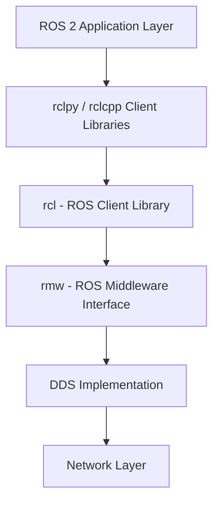
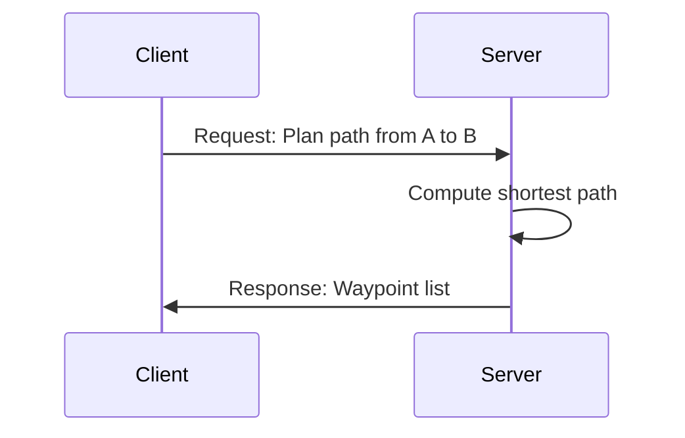
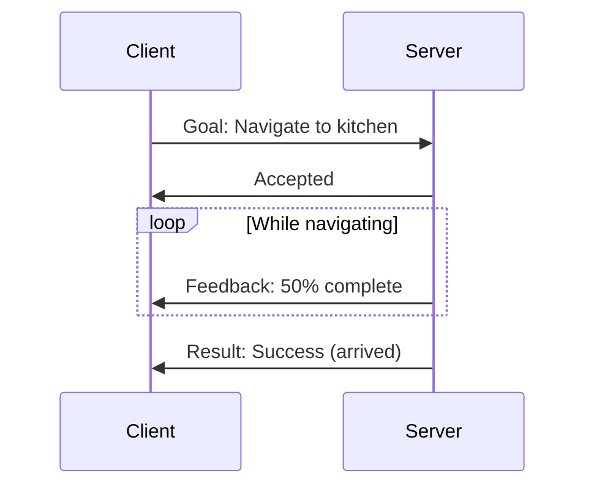
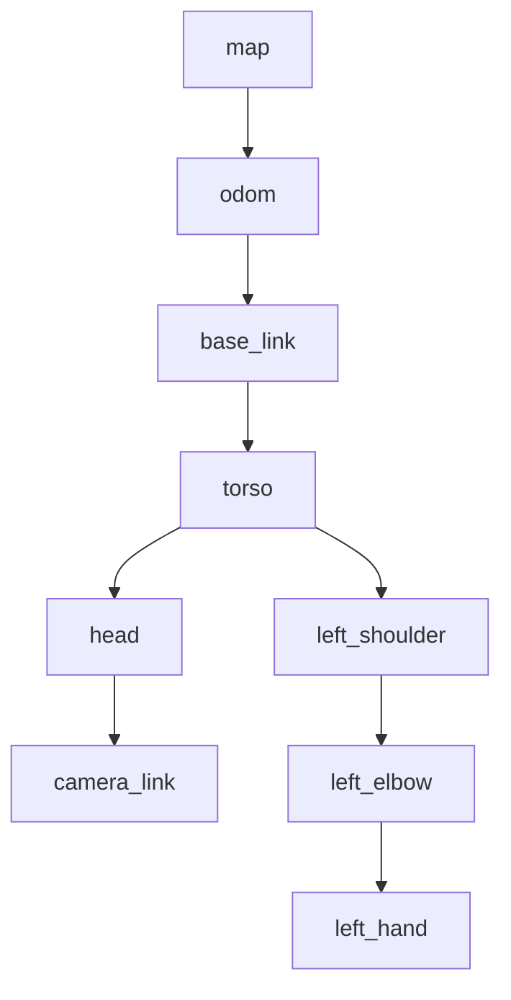
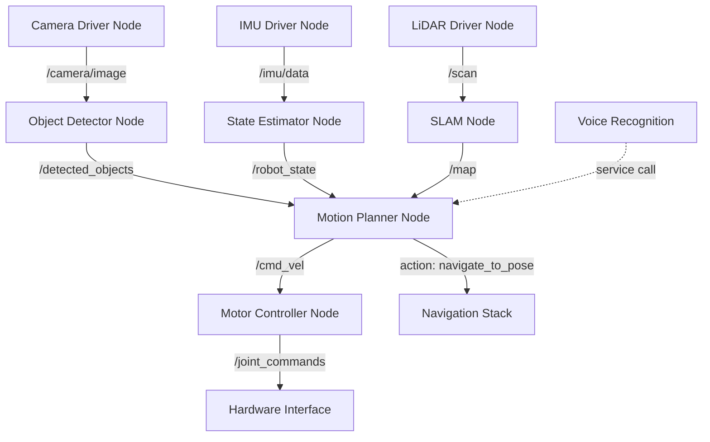

# ROS 2 Architecture

## The Big Picture

ROS 2's architecture is built on a few core principles:

1. **Distributed computing** - Components run as independent processes (nodes)
2. **Loose coupling** - Nodes communicate without knowing about each other's implementation
3. **Layered abstraction** - High-level APIs built on top of DDS middleware
4. **Language agnostic** - Python and C++ nodes can seamlessly interoperate

Let's explore each layer of the stack from bottom to top.

## Layer 1: DDS Middleware

At the foundation, ROS 2 uses **DDS (Data Distribution Service)** - an industry-standard protocol for real-time, distributed systems. Unlike ROS 1's custom TCPROS protocol, DDS provides:

- **Automatic discovery** - Nodes find each other without a central master
- **Quality of Service (QoS)** - Configurable reliability, latency, and durability
- **Security** - Authentication and encryption support
- **Scalability** - Efficient multicast for large networks



ROS 2 supports multiple DDS vendors (Fast-DDS, Cyclone DDS, Connext) through the **RMW (ROS MiddleWare)** abstraction layer. You can switch DDS implementations by setting an environment variable - the ROS 2 API remains unchanged.

:::info Why DDS?
DDS is battle-tested in aerospace, defense, and medical systems. Using an industry standard means ROS 2 benefits from decades of optimization and can integrate with non-ROS systems using DDS.
:::

## Layer 2: Nodes - The Building Blocks

A **node** is an independent executable that performs a specific task. In a humanoid robot, you might have:

- Camera driver nodes (one per camera)
- Object detection node
- SLAM (localization & mapping) node
- Path planning node
- Motor controller nodes (one per joint or group)
- Voice recognition node

### Node Lifecycle

Nodes follow a defined lifecycle with states like:

```
Unconfigured → Inactive → Active → Finalized
```

This allows controlled startup/shutdown and error recovery. For example, you can configure all nodes before activating them simultaneously.

### Creating a Simple Node (Python)

```python
import rclpy
from rclpy.node import Node

class MinimalNode(Node):
    def __init__(self):
        super().__init__('minimal_node')
        self.get_logger().info('Node started!')

def main():
    rclpy.init()
    node = MinimalNode()
    rclpy.spin(node)  # Keep node running
    node.destroy_node()
    rclpy.shutdown()
```

The `rclpy.spin()` call enters an event loop, processing callbacks for subscriptions, timers, and services.

## Layer 3: Communication Patterns

ROS 2 provides three primary communication patterns, each suited for different use cases:

### 1. Topics (Publish-Subscribe)

**Use case**: Continuous data streams (sensor readings, state updates)

Topics implement a many-to-many publish-subscribe pattern:
- **Publishers** send messages to a named topic
- **Subscribers** receive all messages on that topic
- Publishers and subscribers are **anonymous** - they don't know about each other

```mermaid
graph LR
    P1[Camera Driver] -->|publishes| T[/camera/image_raw]
    P2[IMU Driver] -->|publishes| T2[/imu/data]
    T -->|subscribes| S1[Object Detector]
    T -->|subscribes| S2[Visual SLAM]
    T2 -->|subscribes| S3[State Estimator]
```

**Example: Publishing sensor data**

```python
from sensor_msgs.msg import Image

class CameraPublisher(Node):
    def __init__(self):
        super().__init__('camera_publisher')
        self.publisher = self.create_publisher(Image, '/camera/image_raw', 10)
        self.timer = self.create_timer(0.033, self.publish_frame)  # 30 Hz

    def publish_frame(self):
        msg = Image()
        # ... fill message with image data ...
        self.publisher.publish(msg)
```

**Example: Subscribing to sensor data**

```python
class ImageSubscriber(Node):
    def __init__(self):
        super().__init__('image_subscriber')
        self.subscription = self.create_subscription(
            Image,
            '/camera/image_raw',
            self.image_callback,
            10
        )

    def image_callback(self, msg):
        self.get_logger().info(f'Received image: {msg.width}x{msg.height}')
```

**Quality of Service (QoS)**: The `10` parameter is the queue size. More advanced QoS policies control:
- **Reliability**: Best-effort vs. reliable delivery
- **Durability**: Keep last message for late-joining subscribers
- **History**: How many messages to keep
- **Deadline**: Maximum expected time between messages

### 2. Services (Request-Response)

**Use case**: Occasional operations needing immediate results (calculations, queries)

Services implement a **client-server** pattern:
- Client sends a request and **blocks** until receiving a response
- Server processes the request and returns a result
- One-to-one communication



**Example: Path planning service**

```python
from nav_msgs.srv import GetPlan

class PathPlannerService(Node):
    def __init__(self):
        super().__init__('path_planner')
        self.srv = self.create_service(
            GetPlan,
            '/plan_path',
            self.plan_callback
        )

    def plan_callback(self, request, response):
        # Compute path from request.start to request.goal
        response.plan.poses = self.compute_path(request.start, request.goal)
        return response
```

**Client usage**:

```python
from nav_msgs.srv import GetPlan

class PathPlannerClient(Node):
    def __init__(self):
        super().__init__('planner_client')
        self.client = self.create_client(GetPlan, '/plan_path')

    def request_path(self, start, goal):
        request = GetPlan.Request()
        request.start = start
        request.goal = goal

        future = self.client.call_async(request)
        rclpy.spin_until_future_complete(self, future)
        return future.result()
```

:::warning Blocking Behavior
Service calls **block** the calling thread. For long-running operations, use **actions** instead.
:::

### 3. Actions (Long-Running Tasks)

**Use case**: Tasks taking multiple seconds with progress feedback (navigation, manipulation)

Actions extend services with:
- **Feedback**: Periodic progress updates
- **Cancellation**: Ability to abort mid-execution
- **Asynchronous**: Non-blocking goal submission



**Example: Navigation action**

```python
from nav2_msgs.action import NavigateToPose
from rclpy.action import ActionServer

class NavigationActionServer(Node):
    def __init__(self):
        super().__init__('nav_action_server')
        self._action_server = ActionServer(
            self,
            NavigateToPose,
            'navigate_to_pose',
            self.execute_callback
        )

    def execute_callback(self, goal_handle):
        feedback_msg = NavigateToPose.Feedback()

        for i in range(100):
            if goal_handle.is_cancel_requested:
                goal_handle.canceled()
                return NavigateToPose.Result()

            # Compute navigation step
            feedback_msg.distance_remaining = 10.0 - (i * 0.1)
            goal_handle.publish_feedback(feedback_msg)
            time.sleep(0.1)

        goal_handle.succeed()
        result = NavigateToPose.Result()
        result.success = True
        return result
```

## Layer 4: Parameters

Parameters allow **runtime configuration** of nodes without recompilation:

```python
class ConfigurableNode(Node):
    def __init__(self):
        super().__init__('configurable_node')

        # Declare parameters with defaults
        self.declare_parameter('max_speed', 1.0)
        self.declare_parameter('robot_name', 'humanoid_01')

        # Read parameter values
        max_speed = self.get_parameter('max_speed').value
        robot_name = self.get_parameter('robot_name').value
```

Parameters can be set via:
- **Command line**: `ros2 run pkg node --ros-args -p max_speed:=2.0`
- **YAML files**: Loaded at launch time
- **Runtime**: `ros2 param set /node_name max_speed 2.0`

## Layer 5: Transforms (TF2)

The **TF2 (Transform) system** tracks coordinate frame relationships. In a humanoid robot, you have dozens of frames:

- `base_link` (robot center)
- `left_foot`, `right_foot`
- `torso`, `head`
- `left_hand`, `right_hand`
- `camera_link`
- `map` (world frame)
- `odom` (odometry frame)

TF2 maintains a **tree** of coordinate transformations and can answer queries like:

> "What is the position of the object (detected in camera coordinates) relative to the robot's left hand?"

```python
from tf2_ros import TransformListener, Buffer

class TFExample(Node):
    def __init__(self):
        super().__init__('tf_example')
        self.tf_buffer = Buffer()
        self.tf_listener = TransformListener(self.tf_buffer, self)

    def get_transform(self):
        try:
            # Get transform from camera to hand
            transform = self.tf_buffer.lookup_transform(
                'left_hand',      # target frame
                'camera_link',    # source frame
                rclpy.time.Time() # latest available
            )
            return transform
        except Exception as e:
            self.get_logger().error(f'TF lookup failed: {e}')
```



TF automatically handles the chain of transformations. If you query `map` → `left_hand`, it computes the composition of all intermediate transforms.

## Message Types

ROS 2 uses **strongly typed messages** defined in `.msg` files:

**Example: Custom message**

```
# HumanoidState.msg
string robot_id
float64 battery_percentage
geometry_msgs/Pose pose
sensor_msgs/JointState joint_states
```

Common message packages:
- **std_msgs**: Primitives (Int32, String, Bool)
- **geometry_msgs**: Poses, twists, transforms
- **sensor_msgs**: Camera, LiDAR, IMU data
- **nav_msgs**: Maps, paths, odometry

## Computational Graph

At runtime, you can visualize the **computational graph** showing all nodes and their connections:

```bash
ros2 run rqt_graph rqt_graph
```

This shows:
- Circles = Nodes
- Arrows = Topic connections
- Which nodes publish/subscribe to each topic

## Putting It All Together: Humanoid Example

Here's how these concepts work together in a humanoid robot:



**Data flow**:
1. Sensors publish raw data to topics
2. Processing nodes subscribe and publish processed data
3. High-level planners use services for queries
4. Long-running tasks use actions
5. All coordinate transforms tracked by TF2

## Key Architectural Decisions

ROS 2's architecture makes specific trade-offs:

**Strengths**:
- ✅ Modular and reusable components
- ✅ Language-agnostic (Python ↔ C++ interop)
- ✅ Distributed by default (multi-robot ready)
- ✅ Real-time capable with proper configuration

**Limitations**:
- ❌ Overhead from message serialization/deserialization
- ❌ Learning curve for distributed systems concepts
- ❌ Not designed for hard real-time (use RTOS for safety-critical loops)

## Next Steps

Now that you understand ROS 2's architecture, let's get hands-on! Continue to [Tooling](/docs/module-01-ros2/tooling) to learn the command-line tools, URDF robot descriptions, and visualization with RViz.

---

**Key Takeaway**: ROS 2's architecture uses **nodes** communicating via **topics** (streaming data), **services** (request-response), and **actions** (long-running tasks), all built on the **DDS** middleware for reliability and scalability.
