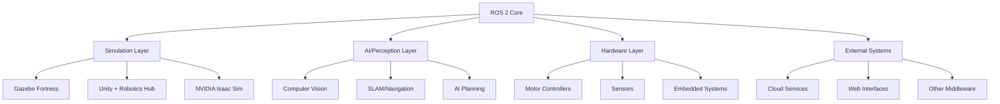

# ROS 2 Integration

ROS 2 doesn't exist in isolation - it's the **integration layer** that connects simulation, AI, hardware, and external systems into a cohesive robotic platform. This chapter shows how ROS 2 bridges to the technologies you'll use in Modules 2-4.

## Integration Architecture



## 1. Simulation Integration (Module 2 Preview)

Simulation allows you to test robots safely before deploying to hardware. ROS 2 integrates with multiple simulators.

### Gazebo Integration

**Gazebo** is the standard ROS 2 simulator with realistic physics.

**Key packages**:
- `gazebo_ros_pkgs`: Core ROS 2 ↔ Gazebo bridge
- `gazebo_ros2_control`: Hardware interface emulation
- `gazebo_plugins`: Sensor and actuator plugins

**Example: Spawning a robot in Gazebo**

```python
from launch import LaunchDescription
from launch.actions import IncludeLaunchDescription
from launch_ros.actions import Node
from ament_index_python.packages import get_package_share_directory

def generate_launch_description():
    # Start Gazebo with an empty world
    gazebo = IncludeLaunchDescription(
        get_package_share_directory('gazebo_ros') + '/launch/gazebo.launch.py'
    )

    # Spawn robot from URDF
    spawn_robot = Node(
        package='gazebo_ros',
        executable='spawn_entity.py',
        arguments=[
            '-entity', 'humanoid_robot',
            '-topic', '/robot_description',
            '-x', '0', '-y', '0', '-z', '1.0'
        ]
    )

    return LaunchDescription([gazebo, spawn_robot])
```

**Gazebo publishes/subscribes**:
- **Topics**: `/clock`, `/joint_states`, sensor data (`/camera/image`, `/scan`)
- **Services**: `/spawn_entity`, `/delete_entity`, `/reset_world`

**Use case**: Test navigation algorithms in simulated environments before risking expensive hardware.

### Unity Integration

**Unity** provides photorealistic rendering and is easier for non-roboticists.

**Unity Robotics Hub** provides:
- `ROS-TCP-Connector`: Bidirectional ROS 2 ↔ Unity communication
- `URDF Importer`: Load robot models directly
- `Simulation tools`: Randomization for ML training

**ROS 2 side setup**:

```bash
# Install ROS TCP endpoint
sudo apt install ros-humble-ros-tcp-endpoint

# Launch endpoint
ros2 run ros_tcp_endpoint default_server_endpoint --ros-args -p ROS_IP:=127.0.0.1
```

**Unity C# script example**:

```csharp
using Unity.Robotics.ROSTCPConnector;
using RosMessageTypes.Sensor;

public class CameraPublisher : MonoBehaviour {
    ROSConnection ros;

    void Start() {
        ros = ROSConnection.GetOrCreateInstance();
        ros.RegisterPublisher<ImageMsg>("/camera/image_raw");
    }

    void Update() {
        ImageMsg msg = GenerateImageMessage();
        ros.Publish("/camera/image_raw", msg);
    }
}
```

**Advantages over Gazebo**:
- ✅ Better graphics for vision algorithm testing
- ✅ Easier scene creation with Unity editor
- ✅ Built-in ML training tools (Unity ML-Agents)

**Disadvantages**:
- ❌ Less accurate physics than Gazebo
- ❌ Proprietary software (free for small projects)

### NVIDIA Isaac Sim Integration

**Isaac Sim** (covered in Module 3) combines simulation with AI training.

**ROS 2 bridge**:
- Native ROS 2 node inside Isaac Sim
- Publishes sensor data (cameras, LiDAR) directly
- Subscribes to control commands

**Example: Isaac Sim launch**:

```python
# Isaac Sim automatically creates ROS 2 nodes
# Just enable the ROS 2 bridge extension in Omniverse

from omni.isaac.kit import SimulationApp
simulation_app = SimulationApp({"renderer": "RayTracedLighting"})

import omni.isaac.core.utils.nucleus as nucleus
from omni.isaac.core.robots import Robot

# Load robot from USD (Universal Scene Description)
robot = Robot("/World/Robot")
robot.initialize()

simulation_app.update()
```

Isaac Sim topics appear in ROS 2:
```bash
$ ros2 topic list
/camera/rgb
/camera/depth
/joint_states
/cmd_vel
```

## 2. AI & Perception Integration (Module 3 Preview)

ROS 2 integrates with AI frameworks for perception, planning, and learning.

### Computer Vision Integration

**Popular frameworks**:
- **OpenCV**: Image processing
- **PyTorch/TensorFlow**: Deep learning
- **YOLO, Detectron2**: Object detection

**Example: Object detection node**

```python
import rclpy
from rclpy.node import Node
from sensor_msgs.msg import Image
from vision_msgs.msg import Detection2DArray
from cv_bridge import CvBridge
import cv2
import torch

class ObjectDetector(Node):
    def __init__(self):
        super().__init__('object_detector')

        # Load YOLO model
        self.model = torch.hub.load('ultralytics/yolov5', 'yolov5s')

        # CV Bridge for ROS ↔ OpenCV conversion
        self.bridge = CvBridge()

        # Subscribe to camera
        self.sub = self.create_subscription(
            Image, '/camera/image_raw', self.image_callback, 10
        )

        # Publish detections
        self.pub = self.create_publisher(
            Detection2DArray, '/detections', 10
        )

    def image_callback(self, msg):
        # Convert ROS Image → OpenCV
        cv_image = self.bridge.imgmsg_to_cv2(msg, "bgr8")

        # Run detection
        results = self.model(cv_image)

        # Publish detections as ROS message
        detection_msg = self.results_to_ros(results)
        self.pub.publish(detection_msg)
```

**CvBridge** is the key tool for image conversion:
- `imgmsg_to_cv2()`: ROS Image → NumPy array
- `cv2_to_imgmsg()`: NumPy array → ROS Image

### Navigation Stack Integration

**Nav2** is the ROS 2 navigation framework:

```bash
sudo apt install ros-humble-navigation2
```

**Nav2 provides**:
- **Localization**: AMCL (Adaptive Monte Carlo Localization)
- **Path planning**: Global and local planners
- **Obstacle avoidance**: Costmap-based collision detection
- **Recovery behaviors**: Backup, spin, wait actions

**Integration points**:
- **Input**: Map (`/map`), sensor scans (`/scan`), odometry (`/odom`)
- **Output**: Velocity commands (`/cmd_vel`)
- **Interface**: Action server (`/navigate_to_pose`)

**Example: Send navigation goal**

```python
from nav2_msgs.action import NavigateToPose
from rclpy.action import ActionClient

class Navigator(Node):
    def __init__(self):
        super().__init__('navigator')
        self.action_client = ActionClient(self, NavigateToPose, 'navigate_to_pose')

    def send_goal(self, x, y):
        goal_msg = NavigateToPose.Goal()
        goal_msg.pose.header.frame_id = 'map'
        goal_msg.pose.pose.position.x = x
        goal_msg.pose.pose.position.y = y

        self.action_client.wait_for_server()
        return self.action_client.send_goal_async(goal_msg)
```

## 3. Hardware Integration

ROS 2 provides **hardware abstraction** through `ros2_control`.

### ROS 2 Control Framework


**Components**:
1. **Controllers**: High-level logic (joint trajectory, diff drive)
2. **Hardware Interface**: Abstraction (read sensors, write commands)
3. **Hardware drivers**: Vendor-specific communication

**Example: Hardware interface for motors**

```cpp
#include "hardware_interface/system_interface.hpp"

class HumanoidHardwareInterface : public hardware_interface::SystemInterface {
public:
    std::vector<hardware_interface::StateInterface> export_state_interfaces() override {
        std::vector<hardware_interface::StateInterface> state_interfaces;

        for (const auto& joint : joints_) {
            state_interfaces.emplace_back(
                joint.name, "position", &joint.position
            );
            state_interfaces.emplace_back(
                joint.name, "velocity", &joint.velocity
            );
        }
        return state_interfaces;
    }

    hardware_interface::return_type read() override {
        // Read actual joint positions from motors
        for (auto& joint : joints_) {
            joint.position = motor_driver_.get_position(joint.id);
            joint.velocity = motor_driver_.get_velocity(joint.id);
        }
        return hardware_interface::return_type::OK;
    }

    hardware_interface::return_type write() override {
        // Send commands to motors
        for (const auto& joint : joints_) {
            motor_driver_.set_command(joint.id, joint.command);
        }
        return hardware_interface::return_type::OK;
    }
};
```

### Common Hardware Interfaces

**Serial communication** (Arduino, embedded systems):

```python
import serial
from std_msgs.msg import String

class SerialBridge(Node):
    def __init__(self):
        super().__init__('serial_bridge')
        self.serial_port = serial.Serial('/dev/ttyUSB0', 115200)

        self.sub = self.create_subscription(
            String, '/serial_tx', self.tx_callback, 10
        )
        self.pub = self.create_publisher(String, '/serial_rx', 10)

        self.timer = self.create_timer(0.01, self.read_serial)

    def tx_callback(self, msg):
        self.serial_port.write(msg.data.encode())

    def read_serial(self):
        if self.serial_port.in_waiting:
            data = self.serial_port.readline().decode()
            msg = String()
            msg.data = data
            self.pub.publish(msg)
```

**CAN bus** (common in automotive/industrial robots):

```python
import can
from std_msgs.msg import UInt8MultiArray

class CANBridge(Node):
    def __init__(self):
        super().__init__('can_bridge')
        self.bus = can.interface.Bus(channel='can0', bustype='socketcan')

        self.timer = self.create_timer(0.01, self.read_can)
        self.pub = self.create_publisher(UInt8MultiArray, '/can_rx', 10)

    def read_can(self):
        msg_can = self.bus.recv(timeout=0.0)
        if msg_can:
            ros_msg = UInt8MultiArray()
            ros_msg.data = list(msg_can.data)
            self.pub.publish(ros_msg)
```

## 4. Cloud & Web Integration

### ROS Bridge (WebSockets)

**rosbridge_suite** provides WebSocket connections for web UIs:

```bash
sudo apt install ros-humble-rosbridge-suite
ros2 launch rosbridge_server rosbridge_websocket_launch.xml
```

**JavaScript client example**:

```javascript
const ros = new ROSLIB.Ros({ url: 'ws://localhost:9090' });

// Subscribe to a topic
const listener = new ROSLIB.Topic({
  ros: ros,
  name: '/camera/image_raw',
  messageType: 'sensor_msgs/Image'
});

listener.subscribe((message) => {
  console.log('Received image:', message.width, 'x', message.height);
});

// Publish to a topic
const cmdVel = new ROSLIB.Topic({
  ros: ros,
  name: '/cmd_vel',
  messageType: 'geometry_msgs/Twist'
});

const twist = new ROSLIB.Message({
  linear: { x: 0.5, y: 0, z: 0 },
  angular: { x: 0, y: 0, z: 0.2 }
});

cmdVel.publish(twist);
```

**Use cases**:
- Web-based robot control dashboards
- Remote monitoring and telemetry
- Cross-platform mobile apps (React Native, Flutter)

### MQTT Bridge

For IoT integration:

```python
import paho.mqtt.client as mqtt
from std_msgs.msg import String

class MQTTBridge(Node):
    def __init__(self):
        super().__init__('mqtt_bridge')

        self.mqtt_client = mqtt.Client()
        self.mqtt_client.connect("mqtt.example.com", 1883)

        # ROS → MQTT
        self.sub = self.create_subscription(
            String, '/robot_status', self.ros_to_mqtt, 10
        )

        # MQTT → ROS
        self.pub = self.create_publisher(String, '/mqtt_commands', 10)
        self.mqtt_client.on_message = self.mqtt_to_ros
        self.mqtt_client.subscribe("robot/commands")

    def ros_to_mqtt(self, msg):
        self.mqtt_client.publish("robot/status", msg.data)

    def mqtt_to_ros(self, client, userdata, mqtt_msg):
        ros_msg = String()
        ros_msg.data = mqtt_msg.payload.decode()
        self.pub.publish(ros_msg)
```

## 5. Multi-Robot Systems

ROS 2's DDS foundation makes multi-robot systems straightforward.

### Namespacing

Each robot runs in its own namespace:

```bash
# Robot 1
ros2 run my_package controller --ros-args -r __ns:=/robot1

# Robot 2
ros2 run my_package controller --ros-args -r __ns:=/robot2
```

**Topics become**:
- `/robot1/camera/image_raw`
- `/robot2/camera/image_raw`

### Domain IDs

For network isolation:

```bash
# Robot 1 (domain 1)
export ROS_DOMAIN_ID=1
ros2 run my_package node1

# Robot 2 (domain 2)
export ROS_DOMAIN_ID=2
ros2 run my_package node1
```

Nodes in different domains **cannot** communicate (network isolation).

### Fleet Management

For coordinating multiple robots:

```python
class FleetManager(Node):
    def __init__(self):
        super().__init__('fleet_manager')

        # Subscribe to status from all robots
        self.create_subscription(
            RobotStatus, '/+/status', self.robot_status_callback, 10
        )

        # Assign tasks
        self.task_clients = {
            'robot1': ActionClient(self, NavigateToPose, '/robot1/navigate'),
            'robot2': ActionClient(self, NavigateToPose, '/robot2/navigate'),
        }

    def assign_task(self, robot_id, goal):
        client = self.task_clients[robot_id]
        client.send_goal_async(goal)
```

## 6. Cross-Middleware Bridges

### ROS 1 ↔ ROS 2 Bridge

For legacy systems:

```bash
sudo apt install ros-humble-ros1-bridge

# Terminal 1: ROS 1
source /opt/ros/noetic/setup.bash
roscore

# Terminal 2: Bridge
source /opt/ros/noetic/setup.bash
source /opt/ros/humble/setup.bash
ros2 run ros1_bridge dynamic_bridge
```

Now ROS 1 and ROS 2 nodes can communicate.

### DDS ↔ Other Protocols

- **Zenoh bridge**: Connect ROS 2 to other DDS domains
- **gRPC bridge**: For microservices architectures
- **REST API bridge**: HTTP endpoints for ROS topics/services

## Integration Best Practices

### 1. Use Standard Interfaces

Stick to standard message types when possible:
- `sensor_msgs`: For sensor data
- `geometry_msgs`: For poses, velocities
- `std_msgs`: For primitives

Custom messages only when necessary.

### 2. Namespace Everything

```python
class MyNode(Node):
    def __init__(self):
        super().__init__('my_node')

        # Good: namespaced
        self.pub = self.create_publisher(Image, '~/camera/image', 10)

        # Bad: global namespace
        self.pub = self.create_publisher(Image, '/camera/image', 10)
```

The `~` expands to `/node_name/...`, preventing conflicts.

### 3. Handle Latency

When bridging to external systems:

```python
class LatencyAwareNode(Node):
    def __init__(self):
        super().__init__('latency_aware')
        self.last_msg_time = self.get_clock().now()

        self.create_subscription(Image, '/camera/image', self.callback, 10)

    def callback(self, msg):
        now = self.get_clock().now()
        latency = (now - msg.header.stamp).nanoseconds / 1e9

        if latency > 0.1:  # 100ms threshold
            self.get_logger().warn(f'High latency: {latency:.3f}s')
```

### 4. Version Compatibility

When integrating external tools, document versions:

```yaml
# requirements.txt or package.xml
ROS 2: Humble Hawksbill
Gazebo: Fortress (11.x)
Unity: 2022.3 LTS
PyTorch: 2.0+
OpenCV: 4.5+
```

## Next Steps

You now understand how ROS 2 integrates with the broader robotics ecosystem! Continue to the [Summary](/docs/module-01-ros2/summary) to review key concepts and understand ROS 2's limitations.

In the following modules, you'll dive deep into these integrations:
- **Module 2**: Simulation with Gazebo and Unity
- **Module 3**: AI perception with NVIDIA Isaac
- **Module 4**: Vision-Language-Action end-to-end systems

---

**Key Takeaway**: ROS 2 is the **integration glue** that connects simulation, AI, hardware, and cloud services. Understanding these integration patterns is essential for building complete autonomous systems.
