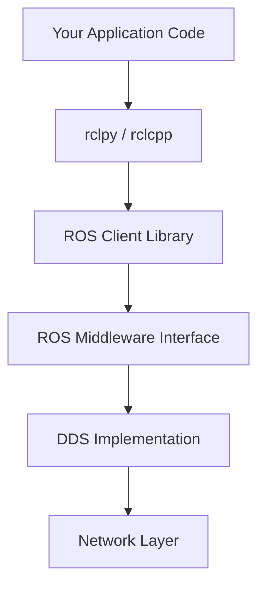
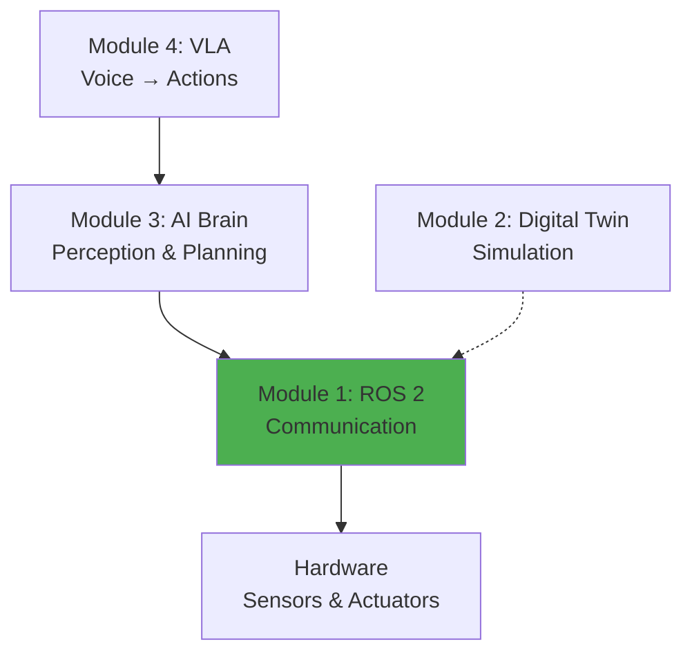

# Module 1 Summary: ROS 2

Congratulations! You've completed Module 1 and now understand ROS 2 as the **nervous system** of autonomous robots. Let's consolidate what you've learned.

## Key Concepts Recap

### 1. What is ROS 2?

ROS 2 is a **middleware framework** that provides:
- Communication infrastructure (topics, services, actions)
- Hardware abstraction and device drivers
- Standard tools (RViz, rqt, colcon)
- Package ecosystem (navigation, perception, control)

**Not** an operating system - it runs **on top of** Linux/Windows/macOS.

### 2. Core Architecture



**Key layers**:
- **DDS**: Industry-standard middleware (automatic discovery, QoS, security)
- **Nodes**: Independent processes performing specific tasks
- **Communication**: Topics (pub-sub), Services (req-res), Actions (long-running tasks)
- **TF2**: Coordinate frame transformations
- **Parameters**: Runtime configuration

### 3. Communication Patterns

| Pattern | Use Case | Example | Blocking? |
|---------|----------|---------|-----------|
| **Topics** | Continuous data streams | Camera images, sensor readings | No |
| **Services** | Occasional queries | "What's the battery level?" | Yes |
| **Actions** | Long-running tasks with feedback | Navigation, manipulation | No (async) |

**Rule of thumb**:
- High-frequency data → Topics
- Quick queries → Services
- Multi-second operations → Actions

### 4. Essential Tools

**Command-line**:
```bash
ros2 node list          # Running nodes
ros2 topic echo /topic  # Monitor messages
ros2 service call /srv  # Invoke service
ros2 param set /node    # Runtime config
ros2 bag record         # Record data
```

**Development**:
- **URDF/Xacro**: Robot description
- **RViz**: 3D visualization
- **colcon**: Build system
- **Launch files**: Multi-node orchestration

**Debugging**:
- `rqt_graph`: Computational graph
- `rqt_console`: Log messages
- `ros2 doctor`: System diagnostics

### 5. Integration Patterns

ROS 2 connects to:
- **Simulation**: Gazebo, Unity, Isaac Sim
- **AI frameworks**: PyTorch, TensorFlow, OpenCV
- **Hardware**: ros2_control, serial, CAN bus
- **Web/Cloud**: WebSockets, MQTT, REST APIs
- **Multi-robot**: Namespaces, domain IDs

## What ROS 2 Does Well

### ✅ Strengths

1. **Modularity**
   - Reusable components (nodes as building blocks)
   - Mix languages (Python ↔ C++ interop)
   - Swap implementations without code changes

2. **Distributed Systems**
   - Multi-robot coordination out of the box
   - Network transparency (local vs. remote nodes)
   - Scalable to hundreds of nodes

3. **Real-Time Capable**
   - DDS QoS policies for reliability
   - Deterministic communication when configured properly
   - Used in industrial applications

4. **Ecosystem**
   - Thousands of packages (perception, navigation, manipulation)
   - Active community and commercial support
   - Standardized interfaces (REP guidelines)

5. **Integration**
   - Works with any simulator (Gazebo, Unity, Isaac)
   - Language-agnostic (Python, C++, Rust, etc.)
   - Standard middleware (DDS) enables cross-industry compatibility

## What ROS 2 Doesn't Do Well

### ❌ Limitations & Gotchas

1. **Not Hard Real-Time**
   - Suitable for **soft real-time** (100Hz control loops)
   - For **hard real-time** (1kHz+ with µs jitter), use RTOS + micro-ROS
   - Safety-critical systems need additional layers

2. **Message Overhead**
   - Serialization/deserialization adds latency (~1-10ms depending on message size)
   - Not ideal for ultra-low-latency applications
   - Shared memory available but limited use cases

3. **Learning Curve**
   - Distributed systems concepts (DDS, QoS, discovery)
   - Build system complexity (colcon, package.xml, CMake/setuptools)
   - Debugging distributed systems is harder

4. **Version Fragmentation**
   - Different ROS 2 versions (Foxy, Galactic, Humble, Iron)
   - Package compatibility issues between versions
   - Stick to LTS releases (Humble until 2027)

5. **Not a Complete Solution**
   - ROS 2 is **infrastructure**, not algorithms
   - You still need to implement:
     - Path planning logic
     - Object detection models
     - Manipulation strategies
   - Many packages exist, but may need customization

## Common Misconceptions

:::danger Myth vs. Reality

**Myth**: "ROS 2 is only for research robots"
- **Reality**: Used in production by Amazon, BMW, Boston Dynamics, NASA

**Myth**: "ROS 2 is too slow for real robots"
- **Reality**: Powers real-time industrial systems when configured properly

**Myth**: "I need to learn C++ to use ROS 2"
- **Reality**: Python works great for most applications; C++ for performance-critical nodes

**Myth**: "ROS 2 does everything automatically"
- **Reality**: ROS 2 provides tools, you still design the system architecture
:::

## When to Use ROS 2

### ✅ Good Fit

- **Mobile robots**: Ground vehicles, drones, humanoids
- **Manipulation**: Robot arms, grippers
- **Multi-robot systems**: Fleet management, swarms
- **Research platforms**: Rapid prototyping, algorithm testing
- **Industrial automation**: With proper real-time configuration

### ❌ Poor Fit

- **Embedded microcontrollers**: Use micro-ROS instead
- **Ultra-low-latency** (sub-millisecond): Use RTOS or bare-metal
- **Simple single-function devices**: Overkill for trivial tasks
- **Safety-critical without certification**: Medical devices, aircraft (need DO-178C, IEC 62304)

## Checklist: Do You Understand ROS 2?

Test your knowledge:

- [ ] Can you explain the difference between topics, services, and actions?
- [ ] Can you create a node that publishes and subscribes to topics?
- [ ] Do you understand how TF2 tracks coordinate frames?
- [ ] Can you use `ros2` CLI to debug running systems?
- [ ] Can you write a basic URDF robot description?
- [ ] Can you visualize a robot in RViz?
- [ ] Do you know how to use colcon to build packages?
- [ ] Can you launch multiple nodes with a launch file?
- [ ] Do you understand how ROS 2 integrates with simulation?
- [ ] Do you know ROS 2's limitations for your use case?

If you answered "no" to any of these, review the relevant chapter before proceeding.

## Looking Ahead: The Humanoid Stack

ROS 2 is just the **foundation**. Here's how the pieces fit together for a humanoid robot:



**Module 1 (ROS 2)** - Communication backbone ✅ **Complete!**

**Module 2 (Digital Twin)**:
- Gazebo for physics simulation
- Unity for photorealistic environments
- Test safely before hardware deployment

**Module 3 (AI Brain)**:
- NVIDIA Isaac for perception
- Visual SLAM for localization
- Navigation and path planning
- Object recognition and tracking

**Module 4 (Vision-Language-Action)**:
- Voice commands to robot actions
- LLM-based task planning
- End-to-end learned policies
- Complete humanoid capstone project

## Best Practices for Production

If you're building real robots (not just learning):

1. **Use LTS versions**: Humble (2027 EOL) for stability
2. **Docker containers**: Reproducible environments
3. **CI/CD**: Automated testing with colcon test
4. **Logging**: Structured logging for debugging
5. **Monitoring**: Track node health, topic rates, latency
6. **Version control**: Git for all code, URDF, config
7. **Documentation**: Comment launch files, document topics/services
8. **Testing**: Unit tests for nodes, integration tests for systems

## Resources for Deeper Learning

**Official documentation**:
- [ROS 2 Documentation](https://docs.ros.org/en/humble/)
- [ROS 2 Design](https://design.ros2.org/)

**Books**:
- *Programming Robots with ROS 2* (upcoming)
- *ROS Robotics Projects* (ROS 1, but concepts transfer)

**Courses**:
- [The Construct ROS 2 Courses](https://www.theconstructsim.com/)
- [ROS 2 Tutorials](https://docs.ros.org/en/humble/Tutorials.html)

**Community**:
- [ROS Discourse](https://discourse.ros.org/)
- [ROS Answers](https://answers.ros.org/)
- [r/ROS subreddit](https://reddit.com/r/ros)

## Final Thoughts

ROS 2 is **not magic** - it's a well-engineered communication framework that solves real distributed systems problems. Understanding its architecture, strengths, and limitations will make you a better robotics engineer.

The real power comes from **combining** ROS 2 with:
- Realistic simulation (Module 2)
- AI perception and planning (Module 3)
- End-to-end learned behaviors (Module 4)

You've built a solid foundation. Let's build on it!

## Next Module

Ready to test your ROS 2 skills in simulation? Continue to [Module 2: Digital Twin](/docs/module-02-digital-twin/overview) to learn Gazebo and Unity for safe robot development.

---

**Key Takeaway**: ROS 2 is a **production-ready middleware** that provides communication infrastructure, tools, and ecosystem for building autonomous robots. Master it, but understand it's one piece of the full stack.
