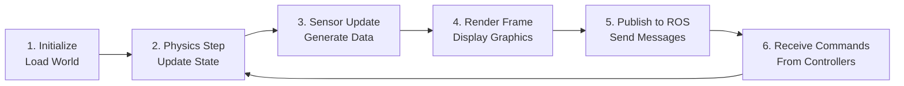
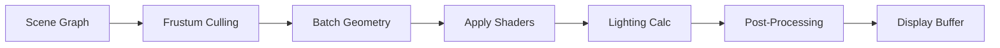
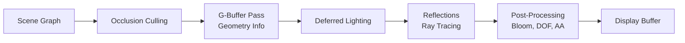
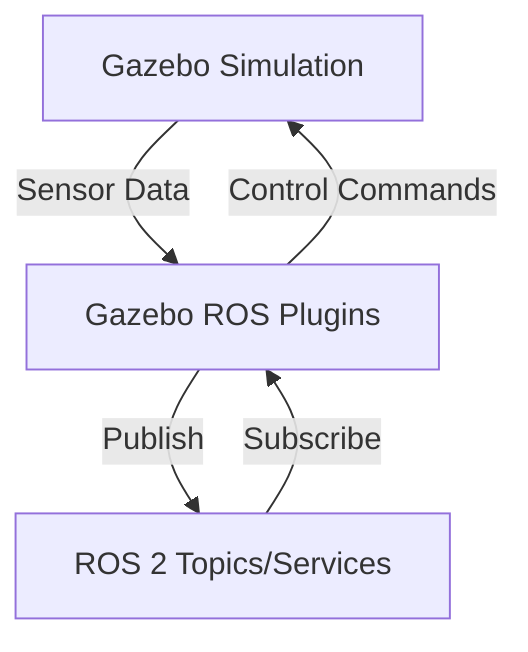
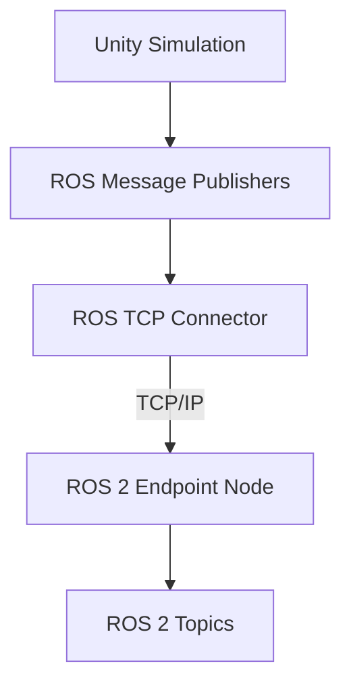

# Simulator Architecture

Understanding how simulators work helps you configure them correctly, debug issues, and optimize performance. Let's explore the architecture of both Gazebo and Unity.

## The Simulation Loop

All simulators follow a similar execution pattern:



**Typical rates**:
- Physics updates: 1000 Hz (1ms timestep)
- Sensor updates: 10-100 Hz (depends on sensor type)
- Rendering: 30-60 FPS
- ROS publishing: Sensor-dependent

The key is **asynchronous execution** - physics runs at high frequency while rendering runs slower to maintain real-time performance.

## Layer 1: Physics Engines

Physics engines compute forces, torques, collisions, and motion.

### Common Physics Engines

| Engine | Used By | Strengths | Weaknesses |
|--------|---------|-----------|------------|
| **ODE** | Gazebo (default) | Fast, stable | Less accurate contacts |
| **Bullet** | Gazebo, PyBullet | Good contact solver | Can be unstable |
| **DART** | Gazebo | Accurate contacts | Slower |
| **PhysX** | Unity, NVIDIA Isaac | GPU acceleration | Proprietary (NVIDIA) |
| **MuJoCo** | Research RL | Fast, differentiable | Limited features |

### Physics Simulation Fundamentals

**1. Rigid Body Dynamics**

Each robot link is modeled as a rigid body with:
- **Mass** (kg)
- **Inertia tensor** (kg·m²) - resistance to rotation
- **Center of mass** - balance point

```xml
<!-- URDF inertial properties -->
<inertial>
  <mass value="10.0"/>
  <inertia ixx="0.4" ixy="0.0" ixz="0.0"
           iyy="0.4" iyz="0.0" izz="0.2"/>
  <origin xyz="0 0 0.1" rpy="0 0 0"/>
</inertial>
```

**2. Contact Forces**

When objects collide:
1. Detect collision (bounding boxes → precise mesh check)
2. Compute penetration depth
3. Calculate contact normal and friction
4. Apply constraint forces to prevent penetration

**Friction models**:
- **Coulomb friction**: F_friction ≤ μ × F_normal
- **Static vs kinetic**: Different coefficients for stationary vs. sliding

```xml
<!-- Gazebo friction parameters -->
<surface>
  <friction>
    <ode>
      <mu>1.0</mu>      <!-- Friction coefficient -->
      <mu2>1.0</mu2>    <!-- Friction in perpendicular direction -->
    </ode>
  </friction>
</surface>
```

**3. Joint Constraints**

Joints restrict motion between links:

```cpp
// Revolute joint allows rotation around one axis
// Physics engine enforces:
position = clamp(position, lower_limit, upper_limit)
velocity = clamp(velocity, -max_velocity, max_velocity)

// Apply motor torque
torque = PID(target_position, current_position)
torque = clamp(torque, -max_effort, max_effort)
```

**4. Integration Methods**

How physics state updates over time:

```python
# Euler integration (simple but unstable)
velocity += acceleration * dt
position += velocity * dt

# Runge-Kutta 4 (more accurate, slower)
# Used by most modern physics engines
k1 = f(t, state)
k2 = f(t + dt/2, state + k1*dt/2)
k3 = f(t + dt/2, state + k2*dt/2)
k4 = f(t + dt, state + k3*dt)
state_new = state + (k1 + 2*k2 + 2*k3 + k4) * dt / 6
```

### Gazebo Physics Configuration

**SDF world file**:

```xml
<world name="default">
  <physics type="ode">
    <max_step_size>0.001</max_step_size>  <!-- 1ms timestep -->
    <real_time_factor>1.0</real_time_factor>
    <real_time_update_rate>1000</real_time_update_rate>

    <ode>
      <solver>
        <type>quick</type>  <!-- or 'world' for more accuracy -->
        <iters>50</iters>   <!-- Constraint solver iterations -->
      </solver>
      <constraints>
        <cfm>0.0</cfm>      <!-- Constraint force mixing -->
        <erp>0.2</erp>      <!-- Error reduction parameter -->
      </constraints>
    </ode>
  </physics>

  <gravity>0 0 -9.81</gravity>
</world>
```

**Trade-offs**:
- Smaller `max_step_size` → more accurate, slower
- More `iters` → more stable contacts, slower
- Higher `erp` → stiffer constraints, less bouncy

### Unity Physics Configuration

**Unity uses PhysX with these settings**:

```csharp
// Project Settings → Physics
Physics.defaultSolverIterations = 6;      // Position accuracy
Physics.defaultSolverVelocityIterations = 1;  // Velocity accuracy
Physics.gravity = new Vector3(0, -9.81f, 0);
Physics.defaultContactOffset = 0.01f;     // Collision padding
```

**ArticulationBody** (for robots):

```csharp
ArticulationBody robot = GetComponent<ArticulationBody>();
robot.solverIterations = 10;           // Higher = more stable
robot.solverVelocityIterations = 10;
robot.immovable = false;               // Can be moved by forces
```

## Layer 2: Rendering Pipeline

Rendering generates visual output for cameras and displays.

### Gazebo Rendering (Ogre)

Gazebo uses **Ogre3D**, a lightweight rendering engine:



**Features**:
- Basic Phong/Blinn lighting
- Shadow mapping
- Simple post-processing (bloom, HDR)

**Camera sensor** (publishes ROS images):

```xml
<sensor name="camera" type="camera">
  <update_rate>30</update_rate>
  <camera>
    <horizontal_fov>1.047</horizontal_fov>  <!-- 60 degrees -->
    <image>
      <width>640</width>
      <height>480</height>
      <format>R8G8B8</format>
    </image>
    <clip>
      <near>0.1</near>
      <far>100</far>
    </clip>
  </camera>
  <plugin name="camera_controller" filename="libgazebo_ros_camera.so"/>
</sensor>
```

### Unity Rendering (HDRP)

Unity's **High Definition Render Pipeline** (HDRP) is photorealistic:



**Features**:
- Physically-based materials (PBR)
- Real-time ray tracing (RTX)
- Advanced post-processing (depth of field, motion blur)
- Volumetric lighting and fog

**Unity camera setup**:

```csharp
using UnityEngine.Perception.Randomization.Scenarios;

public class CameraSetup : MonoBehaviour {
    void Start() {
        Camera cam = GetComponent<Camera>();

        // HDRP settings
        cam.allowHDR = true;
        cam.allowMSAA = false;  // Use TAA instead

        // Perception Camera (for ML training)
        var perceptionCamera = cam.gameObject.AddComponent<PerceptionCamera>();
        perceptionCamera.showVisualizations = false;
    }
}
```

## Layer 3: Sensor Simulation

Realistic sensor models are critical for sim-to-real transfer.

### Camera Sensors

**Ideal (unrealistic) camera**:
```python
# Perfect pinhole projection
pixel_x = focal_length * (world_x / world_z) + cx
pixel_y = focal_length * (world_y / world_z) + cy
```

**Realistic camera** adds:
1. **Lens distortion** (barrel, pincushion)
2. **Chromatic aberration** (color fringing)
3. **Motion blur** (if camera moves)
4. **Noise** (sensor noise, ISO grain)
5. **Exposure** (over/underexposed regions)

**Gazebo camera noise**:

```xml
<sensor name="camera" type="camera">
  <camera>
    <noise>
      <type>gaussian</type>
      <mean>0.0</mean>
      <stddev>0.007</stddev>  <!-- Sensor noise -->
    </noise>
    <distortion>
      <k1>-0.1</k1>  <!-- Radial distortion -->
      <k2>0.05</k2>
      <p1>0.01</p1>  <!-- Tangential distortion -->
    </distortion>
  </camera>
</sensor>
```

### LiDAR Sensors

**Ray-casting approach**:

```python
for angle in range(min_angle, max_angle, angle_increment):
    # Cast ray from sensor origin
    ray_origin = sensor_pose
    ray_direction = rotate(Vector(1, 0, 0), angle)

    # Find intersection with world geometry
    hit_point = ray_cast(ray_origin, ray_direction, max_range)

    if hit_point:
        distance = (hit_point - ray_origin).length()
        # Add noise
        distance += gaussian_noise(mean=0, std=0.01)
    else:
        distance = max_range

    scan.ranges[angle_index] = distance
```

**Gazebo LiDAR**:

```xml
<sensor name="lidar" type="ray">
  <update_rate>10</update_rate>
  <ray>
    <scan>
      <horizontal>
        <samples>360</samples>
        <min_angle>-3.14159</min_angle>
        <max_angle>3.14159</max_angle>
      </horizontal>
    </scan>
    <range>
      <min>0.1</min>
      <max>30.0</max>
      <resolution>0.01</resolution>
    </range>
    <noise>
      <type>gaussian</type>
      <mean>0.0</mean>
      <stddev>0.01</stddev>
    </noise>
  </ray>
</sensor>
```

### IMU Sensors

**Components**:
- **Accelerometer**: Measures linear acceleration (m/s²)
- **Gyroscope**: Measures angular velocity (rad/s)
- **Magnetometer**: Measures magnetic field (optional)

**IMU output**:

```python
# True acceleration (in body frame)
true_accel = robot_acceleration - gravity_in_body_frame

# Add sensor noise and bias
measured_accel = true_accel + bias + gaussian_noise(0, sigma)

# Angular velocity
measured_gyro = robot_angular_velocity + gyro_bias + noise
```

**Gazebo IMU**:

```xml
<sensor name="imu" type="imu">
  <update_rate>100</update_rate>
  <imu>
    <angular_velocity>
      <x><noise type="gaussian"><stddev>0.009</stddev></noise></x>
      <y><noise type="gaussian"><stddev>0.009</stddev></noise></y>
      <z><noise type="gaussian"><stddev>0.009</stddev></noise></z>
    </angular_velocity>
    <linear_acceleration>
      <x><noise type="gaussian"><stddev>0.017</stddev></noise></x>
      <y><noise type="gaussian"><stddev>0.017</stddev></noise></y>
      <z><noise type="gaussian"><stddev>0.017</stddev></noise></z>
    </linear_acceleration>
  </imu>
</sensor>
```

## Layer 4: ROS Integration

How simulation data reaches ROS 2.

### Gazebo → ROS 2 Bridge

**gazebo_ros_pkgs architecture**:



**Example plugin** (camera):

```cpp
// gazebo_ros_camera.cpp (simplified)
#include <gazebo_ros/node.hpp>
#include <sensor_msgs/msg/image.hpp>

class GazeboRosCamera : public gazebo::SensorPlugin {
  void Load(gazebo::sensors::SensorPtr sensor) {
    camera_ = std::dynamic_pointer_cast<gazebo::sensors::CameraSensor>(sensor);

    // Create ROS 2 node
    ros_node_ = gazebo_ros::Node::Get();

    // Create publisher
    image_pub_ = ros_node_->create_publisher<sensor_msgs::msg::Image>(
      "camera/image_raw", 10);

    // Subscribe to camera updates
    camera_->ConnectNewImageFrame(
      std::bind(&GazeboRosCamera::OnNewFrame, this));
  }

  void OnNewFrame() {
    // Convert Gazebo image → ROS message
    auto msg = sensor_msgs::msg::Image();
    msg.header.stamp = ros_node_->now();
    msg.height = camera_->ImageHeight();
    msg.width = camera_->ImageWidth();
    msg.encoding = "rgb8";
    msg.data = camera_->ImageData();

    image_pub_->publish(msg);
  }
};
```

### Unity → ROS 2 Bridge

**Unity Robotics Hub architecture**:



**Unity C# publisher**:

```csharp
using Unity.Robotics.ROSTCPConnector;
using RosMessageTypes.Sensor;

public class CameraPublisher : MonoBehaviour {
    ROSConnection ros;

    void Start() {
        ros = ROSConnection.GetOrCreateInstance();
        ros.RegisterPublisher<ImageMsg>("camera/image_raw");
    }

    void FixedUpdate() {
        // Capture camera texture
        Texture2D tex = CaptureCamera();

        // Convert to ROS message
        ImageMsg msg = new ImageMsg {
            header = new HeaderMsg { stamp = GetROSTime() },
            height = (uint)tex.height,
            width = (uint)tex.width,
            encoding = "rgb8",
            data = tex.GetRawTextureData()
        };

        ros.Publish("camera/image_raw", msg);
    }
}
```

## Layer 5: Time Management

Critical for reproducible simulations.

### Simulation Time vs. Wall Time

```python
# Wall time (real world)
wall_time = time.time()  # Monotonically increasing

# Simulation time (can be paused, fast-forwarded)
sim_time = gazebo.get_sim_time()

# Real-time factor = sim_time / wall_time
# RTF = 1.0: Real-time
# RTF = 2.0: 2x faster than real-time
# RTF = 0.5: Slow motion (2x slower)
```

**Gazebo time control**:

```xml
<world name="default">
  <physics>
    <real_time_factor>1.0</real_time_factor>
    <!-- Pause simulation -->
    <pause>false</pause>
  </physics>
</world>
```

**ROS 2 time synchronization**:

```python
# Gazebo publishes /clock topic
# ROS 2 nodes use simulation time

# In launch file
use_sim_time=True

# In node
self.get_clock().now()  # Returns simulation time
```

## Performance Considerations

### Bottlenecks

1. **Physics**: O(n²) collision detection for n objects
   - **Solution**: Spatial partitioning (octrees, broad-phase culling)

2. **Rendering**: High polygon count, complex shaders
   - **Solution**: LOD (level of detail), occlusion culling

3. **Sensor ray-casting**: LiDAR with 100k rays/second
   - **Solution**: GPU ray-tracing (NVIDIA OptiX)

### Optimizations

**Gazebo**:
```xml
<!-- Reduce visual quality for speed -->
<visual>
  <geometry>
    <mesh>
      <uri>model://robot/meshes/low_poly.dae</uri>
    </mesh>
  </geometry>
</visual>

<!-- Use simple collision shapes -->
<collision>
  <geometry>
    <box size="0.5 0.3 0.2"/>
  </geometry>
</collision>
```

**Unity**:
```csharp
// Reduce physics iterations for non-critical objects
rigidbody.solverIterations = 4;  // Default is 6

// Use LOD groups
LODGroup lodGroup = gameObject.AddComponent<LODGroup>();
```

## Next Steps

Now that you understand simulator architecture, let's get hands-on! Continue to [Tooling](/docs/module-02-digital-twin/tooling) to learn practical Gazebo and Unity workflows.

---

**Key Takeaway**: Simulators combine **physics engines** (forces, collisions), **rendering** (visuals), and **sensor models** (cameras, LiDAR) to create digital twins. Understanding these layers helps you configure, optimize, and debug simulations effectively.
