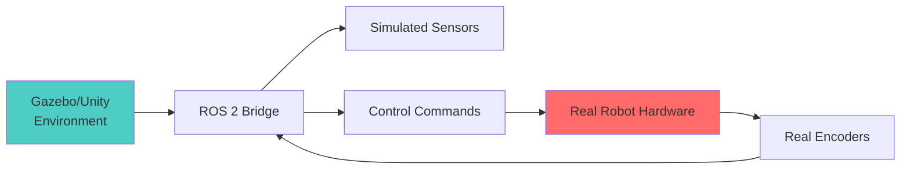

# Simulation Integration

Now that you can build realistic simulations, let's connect them to real robot workflows - navigation stacks, AI models, hardware testing, and production pipelines.

## ROS 2 Navigation Stack (Nav2)

Nav2 is the standard navigation framework for ROS 2. Your digital twin becomes the testing ground.

### Gazebo + Nav2 Setup

**1. Install Nav2**:

```bash
sudo apt install ros-humble-navigation2 ros-humble-nav2-bringup
```

**2. Launch simulation with Nav2**:

```python
# sim_nav.launch.py
from launch import LaunchDescription
from launch_ros.actions import Node
from launch.actions import IncludeLaunchDescription

def generate_launch_description():
    return LaunchDescription([
        # Start Gazebo
        IncludeLaunchDescription(
            'launch/gazebo.launch.py',
            launch_arguments={'world': 'office.world'}.items()
        ),

        # Spawn robot
        Node(
            package='gazebo_ros',
            executable='spawn_entity.py',
            arguments=['-entity', 'robot', '-file', 'robot.urdf']
        ),

        # Nav2
        IncludeLaunchDescription(
            'launch/navigation_launch.py',
            launch_arguments={
                'use_sim_time': 'true',
                'params_file': 'nav2_params.yaml'
            }.items()
        ),

        # SLAM (for mapping)
        Node(
            package='slam_toolbox',
            executable='async_slam_toolbox_node',
            parameters=[{
                'use_sim_time': True,
                'base_frame': 'base_link',
                'odom_frame': 'odom',
                'map_frame': 'map'
            }]
        ),
    ])
```

**3. Nav2 parameters for simulation**:

```yaml
# nav2_params.yaml
controller_server:
  ros__parameters:
    use_sim_time: True
    controller_frequency: 20.0
    min_x_velocity_threshold: 0.001
    min_y_velocity_threshold: 0.5
    min_theta_velocity_threshold: 0.001

    FollowPath:
      plugin: "dwb_core::DWBLocalPlanner"
      max_vel_x: 0.5
      min_vel_x: -0.5
      max_vel_theta: 1.0
      min_speed_xy: 0.0
      max_speed_xy: 0.5
      acc_lim_x: 2.5
      acc_lim_theta: 3.2

planner_server:
  ros__parameters:
    use_sim_time: True
    expected_planner_frequency: 20.0

    GridBased:
      plugin: "nav2_navfn_planner/NavfnPlanner"
      tolerance: 0.5
      use_astar: false
      allow_unknown: true

costmap_2d:
  global_costmap:
    global_costmap:
      ros__parameters:
        use_sim_time: True
        robot_radius: 0.22
        resolution: 0.05
        plugins: ["static_layer", "obstacle_layer", "inflation_layer"]

  local_costmap:
    local_costmap:
      ros__parameters:
        use_sim_time: True
        robot_radius: 0.22
        resolution: 0.05
        width: 3
        height: 3
        plugins: ["obstacle_layer", "inflation_layer"]
```

**4. Test navigation**:

```bash
# Launch everything
ros2 launch sim_nav.launch.py

# Send navigation goal
ros2 topic pub /goal_pose geometry_msgs/PoseStamped "{
  header: {frame_id: 'map'},
  pose: {
    position: {x: 5.0, y: 3.0, z: 0.0},
    orientation: {w: 1.0}
  }
}"
```

### Unity + Nav2 Setup

Unity requires ROS TCP Endpoint bridge:

**ROS 2 side**:

```bash
ros2 run ros_tcp_endpoint default_server_endpoint \
  --ros-args -p ROS_IP:=127.0.0.1 -p ROS_TCP_PORT:=10000
```

**Unity side** (C# script):

```csharp
using Unity.Robotics.ROSTCPConnector;
using RosMessageTypes.Geometry;

public class NavGoalSubscriber : MonoBehaviour {
    ROSConnection ros;

    void Start() {
        ros = ROSConnection.GetOrCreateInstance();
        ros.Subscribe<PoseStampedMsg>("goal_pose", ReceiveGoal);
    }

    void ReceiveGoal(PoseStampedMsg goal) {
        Vector3 position = new Vector3(
            (float)goal.pose.position.x,
            (float)goal.pose.position.y,
            (float)goal.pose.position.z
        );

        // Move robot to goal
        transform.position = position;
    }
}
```

## AI Perception Integration

Use simulation to train and test perception models.

### Object Detection Pipeline

**1. Camera data from Gazebo**:

```bash
# Camera images published to /camera/image_raw
ros2 topic info /camera/image_raw
# Type: sensor_msgs/msg/Image
```

**2. Object detection node** (PyTorch + YOLO):

```python
import rclpy
from rclpy.node import Node
from sensor_msgs.msg import Image
from vision_msgs.msg import Detection2DArray, Detection2D
from cv_bridge import CvBridge
import torch
import cv2

class ObjectDetectionNode(Node):
    def __init__(self):
        super().__init__('object_detector')

        # Load YOLO model
        self.model = torch.hub.load('ultralytics/yolov5', 'yolov5s')
        self.bridge = CvBridge()

        # Subscribe to camera
        self.sub = self.create_subscription(
            Image, '/camera/image_raw', self.detect_callback, 10
        )

        # Publish detections
        self.pub = self.create_publisher(
            Detection2DArray, '/detections', 10
        )

    def detect_callback(self, msg):
        # Convert ROS image → OpenCV
        cv_image = self.bridge.imgmsg_to_cv2(msg, 'rgb8')

        # Run inference
        results = self.model(cv_image)

        # Convert to ROS Detection2DArray
        detections = Detection2DArray()
        detections.header = msg.header

        for *xyxy, conf, cls in results.xyxy[0]:
            det = Detection2D()
            det.bbox.center.x = (xyxy[0] + xyxy[2]) / 2
            det.bbox.center.y = (xyxy[1] + xyxy[3]) / 2
            det.bbox.size_x = xyxy[2] - xyxy[0]
            det.bbox.size_y = xyxy[3] - xyxy[1]

            det.results[0].hypothesis.class_id = str(int(cls))
            det.results[0].hypothesis.score = float(conf)

            detections.detections.append(det)

        self.pub.publish(detections)

def main():
    rclpy.init()
    node = ObjectDetectionNode()
    rclpy.spin(node)
```

**3. Visualize in RViz**:

```bash
ros2 run rviz2 rviz2
# Add → By topic → /detections → Detection2DArray
```

### Visual SLAM Integration

Test SLAM algorithms in simulation before hardware.

**ORB-SLAM3 with Gazebo**:

```bash
# Install ORB-SLAM3
git clone https://github.com/UZ-SLAMLab/ORB_SLAM3.git
cd ORB_SLAM3
./build.sh

# ROS 2 wrapper
git clone https://github.com/zang09/ORB_SLAM3_ROS2.git src/orb_slam3_ros2
colcon build --packages-select orb_slam3_ros2

# Run with simulated camera
ros2 run orb_slam3_ros2 mono \
  vocabulary/ORBvoc.txt \
  config/camera_params.yaml
```

**Camera calibration file** (match Gazebo camera):

```yaml
# camera_params.yaml
Camera.width: 640
Camera.height: 480
Camera.fx: 554.25
Camera.fy: 554.25
Camera.cx: 320.5
Camera.cy: 240.5

Camera.k1: 0.0
Camera.k2: 0.0
Camera.p1: 0.0
Camera.p2: 0.0

Camera.fps: 30.0
Camera.RGB: 1
```

## Synthetic Data Generation

Train AI models with infinite labeled data from simulation.

### Unity Perception Package

**1. Install Unity Perception**:

```
Window → Package Manager → Add by name: com.unity.perception
```

**2. Setup Perception Camera**:

```csharp
using UnityEngine.Perception.GroundTruth;

public class DatasetGenerator : MonoBehaviour {
    void Start() {
        // Add perception camera
        Camera cam = GetComponent<Camera>();
        PerceptionCamera perceptionCam = cam.gameObject.AddComponent<PerceptionCamera>();

        // Add labelers
        perceptionCam.AddLabeler(new BoundingBox2DLabeler());
        perceptionCam.AddLabeler(new SemanticSegmentationLabeler());
        perceptionCam.AddLabeler(new InstanceSegmentationLabeler());

        perceptionCam.showVisualizations = true;
    }
}
```

**3. Define label configuration**:

```csharp
using UnityEngine.Perception.GroundTruth;

[CreateAssetMenu(menuName = "Perception/ID Label Config")]
public class RoboticsLabelConfig : IdLabelConfig {
    void Awake() {
        Init(new List<IdLabelEntry> {
            new IdLabelEntry { id = 1, label = "person" },
            new IdLabelEntry { id = 2, label = "chair" },
            new IdLabelEntry { id = 3, label = "table" },
            new IdLabelEntry { id = 4, label = "door" },
            new IdLabelEntry { id = 5, label = "obstacle" }
        });
    }
}
```

**4. Run scenario** (generates dataset automatically):

```csharp
using UnityEngine.Perception.Randomization.Scenarios;

public class DataCollectionScenario : FixedLengthScenario {
    public int framesPerIteration = 100;
    public int totalIterations = 100;  // 10,000 images

    protected override void OnIterationStart() {
        // Randomization happens here
        base.OnIterationStart();
    }
}
```

**Output format** (COCO JSON):

```json
{
  "images": [
    {
      "id": 1,
      "file_name": "0001.png",
      "width": 640,
      "height": 480
    }
  ],
  "annotations": [
    {
      "id": 1,
      "image_id": 1,
      "category_id": 1,
      "bbox": [120, 80, 200, 300],
      "area": 60000,
      "iscrowd": 0
    }
  ]
}
```

### Gazebo Synthetic Data

**Record rosbag with labels**:

```python
# label_publisher.py
import rclpy
from rclpy.node import Node
from vision_msgs.msg import Detection3DArray, Detection3D
from gazebo_msgs.srv import GetModelState

class LabelPublisher(Node):
    def __init__(self):
        super().__init__('label_publisher')

        # Service to get object poses from Gazebo
        self.cli = self.create_client(GetModelState, '/gazebo/get_model_state')

        # Publish ground truth labels
        self.pub = self.create_publisher(Detection3DArray, '/labels', 10)

        self.timer = self.create_timer(0.1, self.publish_labels)

    def publish_labels(self):
        # Query object positions from Gazebo
        req = GetModelState.Request()
        req.model_name = 'person'
        req.relative_entity_name = 'robot::camera_link'

        future = self.cli.call_async(req)
        future.add_done_callback(self.handle_response)

    def handle_response(self, future):
        try:
            response = future.result()

            # Create label
            labels = Detection3DArray()
            det = Detection3D()
            det.bbox.center.position = response.pose.position
            det.results[0].hypothesis.class_id = "person"
            det.results[0].hypothesis.score = 1.0

            labels.detections.append(det)
            self.pub.publish(labels)
        except Exception as e:
            self.get_logger().error(f'Service call failed: {e}')
```

**Record dataset**:

```bash
ros2 bag record /camera/image_raw /camera/depth /labels -o training_data
```

## Domain Randomization

Close the sim-to-real gap with randomization.

### Randomization Strategies

**1. Visual randomization**:
- Lighting (intensity, color, direction)
- Textures (walls, floors, objects)
- Camera parameters (exposure, gain, distortion)
- Object materials (reflectivity, roughness)

**2. Physics randomization**:
- Friction coefficients (floor, objects)
- Mass and inertia (±20% variation)
- Joint damping and stiffness
- Contact parameters

**3. Sensor randomization**:
- Camera noise (Gaussian, salt-and-pepper)
- LiDAR dropout (random missing points)
- IMU drift and bias

### Unity Domain Randomization

**Lighting randomizer**:

```csharp
using UnityEngine.Perception.Randomization.Randomizers;

[Serializable]
[AddRandomizerMenu("Perception/Light Randomizer")]
public class LightRandomizer : Randomizer {
    public FloatParameter intensity = new FloatParameter {
        value = new UniformSampler(0.3f, 2.0f)
    };

    public ColorRgbParameter color = new ColorRgbParameter {
        red = new UniformSampler(0.8f, 1.0f),
        green = new UniformSampler(0.8f, 1.0f),
        blue = new UniformSampler(0.8f, 1.0f)
    };

    Light[] lights;

    protected override void OnIterationStart() {
        if (lights == null)
            lights = FindObjectsOfType<Light>();

        foreach (var light in lights) {
            light.intensity = intensity.Sample();
            light.color = color.Sample();
        }
    }
}
```

**Texture randomizer**:

```csharp
public class TextureRandomizer : Randomizer {
    public Texture2D[] floorTextures;
    public Texture2D[] wallTextures;

    GameObject[] floors;
    GameObject[] walls;

    protected override void OnIterationStart() {
        if (floors == null) {
            floors = GameObject.FindGameObjectsWithTag("Floor");
            walls = GameObject.FindGameObjectsWithTag("Wall");
        }

        // Randomize floor
        foreach (var floor in floors) {
            var renderer = floor.GetComponent<Renderer>();
            renderer.material.mainTexture =
                floorTextures[Random.Range(0, floorTextures.Length)];
        }

        // Randomize walls
        foreach (var wall in walls) {
            var renderer = wall.GetComponent<Renderer>();
            renderer.material.mainTexture =
                wallTextures[Random.Range(0, wallTextures.Length)];
        }
    }
}
```

**Physics randomizer**:

```csharp
public class PhysicsRandomizer : Randomizer {
    public FloatParameter friction = new FloatParameter {
        value = new UniformSampler(0.3f, 1.0f)
    };

    protected override void OnIterationStart() {
        // Randomize ground friction
        GameObject ground = GameObject.Find("Ground");
        PhysicMaterial mat = ground.GetComponent<Collider>().material;
        mat.dynamicFriction = friction.Sample();
        mat.staticFriction = friction.Sample();
    }
}
```

### Gazebo Domain Randomization

**Gazebo plugin for randomization**:

```cpp
// domain_randomizer_plugin.cpp
#include <gazebo/gazebo.hh>
#include <gazebo/physics/physics.hh>
#include <random>

namespace gazebo {
  class DomainRandomizerPlugin : public WorldPlugin {
  public:
    void Load(physics::WorldPtr _world, sdf::ElementPtr _sdf) {
      this->world = _world;

      // Randomize every second
      this->updateConnection = event::Events::ConnectWorldUpdateBegin(
        std::bind(&DomainRandomizerPlugin::OnUpdate, this));

      this->timer = 0.0;
    }

    void OnUpdate() {
      this->timer += this->world->Physics()->GetMaxStepSize();

      if (this->timer > 1.0) {  // Every 1 second
        RandomizeLighting();
        RandomizePhysics();
        this->timer = 0.0;
      }
    }

    void RandomizeLighting() {
      std::uniform_real_distribution<double> dist(0.5, 1.5);

      auto light = this->world->LightByName("sun");
      if (light) {
        double intensity = dist(this->rng);
        light->SetDiffuseColor(ignition::math::Color(
          intensity, intensity, intensity, 1.0
        ));
      }
    }

    void RandomizePhysics() {
      std::uniform_real_distribution<double> friction(0.5, 1.5);

      auto model = this->world->ModelByName("robot");
      if (model) {
        for (auto link : model->GetLinks()) {
          for (auto collision : link->GetCollisions()) {
            auto surface = collision->GetSurface();
            surface->FrictionPyramid()->SetMuPrimary(friction(this->rng));
          }
        }
      }
    }

  private:
    physics::WorldPtr world;
    event::ConnectionPtr updateConnection;
    double timer;
    std::mt19937 rng{std::random_device{}()};
  };

  GZ_REGISTER_WORLD_PLUGIN(DomainRandomizerPlugin)
}
```

## Hardware-in-the-Loop (HIL) Testing

Test real hardware with simulated environment.

### HIL Architecture



**Setup**:

1. **Simulate environment and sensors** (Gazebo/Unity)
2. **Real robot receives commands** from control stack
3. **Real encoders/IMU** feed back actual state

**Example** (real motors, simulated vision):

```python
# hil_bridge.py
import rclpy
from rclpy.node import Node
from geometry_msgs.msg import Twist
from sensor_msgs.msg import JointState
import serial  # pyserial

class HILBridge(Node):
    def __init__(self):
        super().__init__('hil_bridge')

        # Connect to real hardware (Arduino, etc.)
        self.serial = serial.Serial('/dev/ttyUSB0', 115200)

        # Subscribe to simulated control commands
        self.cmd_sub = self.create_subscription(
            Twist, '/cmd_vel', self.cmd_callback, 10
        )

        # Publish real joint states
        self.joint_pub = self.create_publisher(
            JointState, '/joint_states', 10
        )

        self.timer = self.create_timer(0.01, self.read_encoders)

    def cmd_callback(self, msg):
        # Send commands to real motors
        cmd = f"V {msg.linear.x} {msg.angular.z}\n"
        self.serial.write(cmd.encode())

    def read_encoders(self):
        # Read real encoder data
        if self.serial.in_waiting:
            line = self.serial.readline().decode().strip()
            # Parse: "E left_pos right_pos"
            parts = line.split()
            if parts[0] == 'E':
                joint_state = JointState()
                joint_state.name = ['left_wheel', 'right_wheel']
                joint_state.position = [float(parts[1]), float(parts[2])]
                self.joint_pub.publish(joint_state)
```

## CI/CD with Simulation

Automate testing with GitHub Actions.

### GitHub Actions Workflow

```yaml
# .github/workflows/robot-test.yml
name: Robot CI

on: [push, pull_request]

jobs:
  test:
    runs-on: ubuntu-22.04
    container:
      image: osrf/ros:humble-desktop

    steps:
    - uses: actions/checkout@v3

    - name: Install dependencies
      run: |
        apt-get update
        apt-get install -y ros-humble-gazebo-ros-pkgs
        rosdep install --from-paths src --ignore-src -r -y

    - name: Build workspace
      run: |
        source /opt/ros/humble/setup.bash
        colcon build

    - name: Launch simulation tests
      run: |
        source install/setup.bash

        # Start Gazebo headless
        ros2 launch robot_sim test.launch.py headless:=true &
        sleep 10  # Wait for startup

        # Run navigation test
        ros2 run robot_tests navigation_test

        # Check results
        if [ $? -eq 0 ]; then
          echo "✅ Navigation test passed"
        else
          echo "❌ Navigation test failed"
          exit 1
        fi
```

### Automated Test Script

```python
# navigation_test.py
import rclpy
from rclpy.node import Node
from geometry_msgs.msg import PoseStamped
from nav_msgs.msg import Odometry
import time

class NavigationTest(Node):
    def __init__(self):
        super().__init__('navigation_test')

        self.goal_pub = self.create_publisher(
            PoseStamped, '/goal_pose', 10
        )

        self.odom_sub = self.create_subscription(
            Odometry, '/odom', self.odom_callback, 10
        )

        self.current_pose = None
        self.test_passed = False

    def odom_callback(self, msg):
        self.current_pose = msg.pose.pose

    def run_test(self):
        # Send goal
        goal = PoseStamped()
        goal.header.frame_id = 'map'
        goal.pose.position.x = 5.0
        goal.pose.position.y = 3.0
        goal.pose.orientation.w = 1.0

        self.goal_pub.publish(goal)
        self.get_logger().info('Goal sent: (5.0, 3.0)')

        # Wait up to 60 seconds
        timeout = time.time() + 60
        while time.time() < timeout:
            if self.current_pose:
                dx = self.current_pose.position.x - 5.0
                dy = self.current_pose.position.y - 3.0
                dist = (dx**2 + dy**2)**0.5

                if dist < 0.5:  # Within 50cm
                    self.get_logger().info('✅ Goal reached!')
                    self.test_passed = True
                    return True

            time.sleep(0.1)

        self.get_logger().error('❌ Goal not reached within timeout')
        return False

def main():
    rclpy.init()
    test = NavigationTest()

    # Spin for 2 seconds to get odometry
    for _ in range(20):
        rclpy.spin_once(test, timeout_sec=0.1)

    # Run test
    success = test.run_test()

    test.destroy_node()
    rclpy.shutdown()

    exit(0 if success else 1)
```

## Performance Benchmarking

Measure simulation performance and robot metrics.

### Metrics to Track

**Simulation performance**:
- Real-time factor (RTF): sim_time / wall_time
- Physics update rate (Hz)
- Rendering FPS
- Memory usage

**Robot performance**:
- Navigation success rate
- Time to goal
- Path smoothness
- Collision avoidance distance

### Benchmarking Script

```python
# benchmark.py
import rclpy
from rclpy.node import Node
from rosgraph_msgs.msg import Clock
import time
import psutil
import json

class BenchmarkNode(Node):
    def __init__(self):
        super().__init__('benchmark')

        self.clock_sub = self.create_subscription(
            Clock, '/clock', self.clock_callback, 10
        )

        self.sim_time = 0.0
        self.wall_start = time.time()
        self.sim_start = 0.0

        self.timer = self.create_timer(1.0, self.report_metrics)

    def clock_callback(self, msg):
        self.sim_time = msg.clock.sec + msg.clock.nanosec * 1e-9
        if self.sim_start == 0.0:
            self.sim_start = self.sim_time

    def report_metrics(self):
        wall_elapsed = time.time() - self.wall_start
        sim_elapsed = self.sim_time - self.sim_start

        if wall_elapsed > 0:
            rtf = sim_elapsed / wall_elapsed
        else:
            rtf = 0.0

        # System metrics
        cpu = psutil.cpu_percent()
        mem = psutil.virtual_memory().percent

        metrics = {
            'rtf': round(rtf, 2),
            'cpu_percent': round(cpu, 1),
            'memory_percent': round(mem, 1),
            'sim_time': round(sim_elapsed, 2),
            'wall_time': round(wall_elapsed, 2)
        }

        self.get_logger().info(f'Metrics: {json.dumps(metrics)}')

def main():
    rclpy.init()
    node = BenchmarkNode()
    rclpy.spin(node)
```

**Expected output**:

```
[INFO] Metrics: {"rtf": 0.95, "cpu_percent": 45.3, "memory_percent": 32.1,
                 "sim_time": 95.2, "wall_time": 100.0}
```

**Interpretation**:
- RTF = 0.95 → Running at 95% real-time (slightly slower than real-time)
- RTF > 1.0 → Faster than real-time (good for training)
- RTF < 0.5 → Too slow, optimize simulation

## Best Practices

**1. Start Simple**:
- Test with basic environments before complex worlds
- Single robot before multi-robot
- Validate physics with simple scenarios (ball drop, friction tests)

**2. Incremental Integration**:
- Test each component independently (perception, planning, control)
- Add complexity gradually
- Use unit tests for each integration point

**3. Domain Randomization Strategy**:
- Start with narrow distributions, gradually widen
- Prioritize parameters with largest sim-to-real gap
- Monitor training stability as you increase randomization

**4. Hardware Validation**:
- Always validate sim-trained models on real hardware
- Use sim for 90% of testing, hardware for final 10%
- Implement safety checks (e-stop, collision detection)

**5. Version Control**:
- Track simulation configurations (world files, parameters)
- Version models and training datasets
- Document sim-to-real transfer results

## Next Steps

Ready to synthesize everything you've learned? Continue to [Summary](/docs/module-02-digital-twin/summary) for best practices, limitations, and a decision framework for choosing between Gazebo and Unity.

---

**Key Takeaway**: Simulation becomes powerful when integrated with production workflows - Nav2 for navigation, PyTorch for perception, synthetic data for training, and CI/CD for automated testing. Master these integrations to accelerate development from prototype to production.
