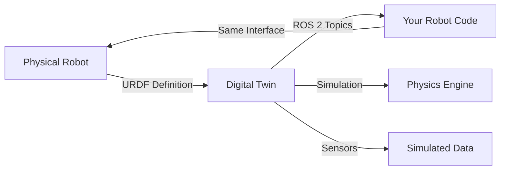
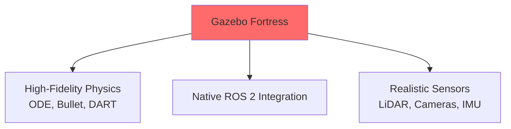
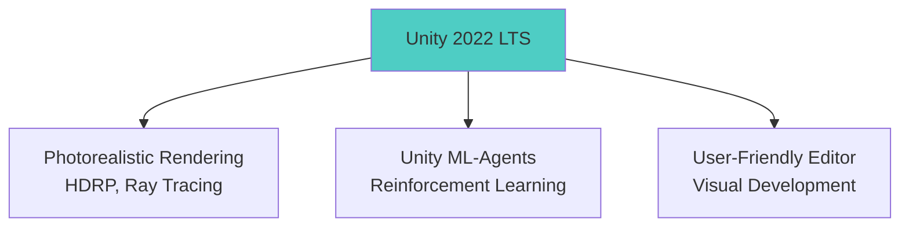
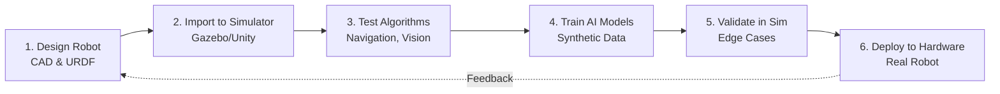

# Module 2: Digital Twin - Safe Testing Before Hardware

## The $100,000 Question

Imagine spending months building a humanoid robot. You write navigation code, test it for the first time, and watch your robot:
- Walk straight into a wall (broken sensors: $2,000)
- Fall down stairs (structural damage: $5,000)
- Drop an expensive object it was supposed to grasp (lawsuit pending)

**Or**, you could test everything in simulation first, find the bugs, and deploy working code to hardware.

This is why **digital twins** - virtual replicas of your robot - are essential for modern robotics.

## What is a Digital Twin?

A **digital twin** is a virtual model of your physical robot that:
- Mirrors the robot's geometry, kinematics, and dynamics
- Simulates sensors (cameras, LiDAR, IMU) with realistic noise
- Runs in a physics engine that models gravity, friction, collisions
- Connects to ROS 2 as if it were real hardware



**The key insight**: Your robot code doesn't know if it's talking to simulation or real hardware - the ROS 2 interface is identical.

## Why Simulation is Non-Negotiable

### 1. Safety

Testing dangerous scenarios without risk:
- **Collision recovery**: What happens if the robot hits an obstacle?
- **Fall detection**: Can it detect and prevent falls?
- **Emergency stops**: Does the e-stop work reliably?

In simulation, you can crash a thousand times without consequences.

### 2. Speed

Iterate 10x faster:
- No hardware setup time (plug in batteries, calibrate sensors)
- No mechanical wear from repeated tests
- Run multiple simulations in parallel
- Fast-forward time for long-duration tests

**Example**: Train a walking controller that takes 100 hours of real-time data. In simulation with 10x speedup, that's 10 hours.

### 3. Cost

Avoid expensive mistakes:
- Test before buying hardware
- Validate design decisions (sensor placement, joint limits)
- Train 100 virtual robots instead of building 100 real ones
- No repair costs from testing failures

**ROI**: Simulation infrastructure costs $0-$5,000 (software + GPU). One serious robot crash costs more.

### 4. Reproducibility

Exact replay of scenarios:
- Record simulation states and replay from any point
- Unit tests for robot behaviors
- Compare algorithm performance on identical conditions
- Debug with deterministic physics (optional)

### 5. Scalability

Train AI models at scale:
- Generate millions of training samples
- Domain randomization (vary lighting, textures, physics)
- Synthetic data for perception (labeled automatically)
- Multi-robot simulations for fleet algorithms

## Two Simulators, Different Strengths

This module covers **two complementary simulators**:

### Gazebo (Physics-First)



**Strengths**:
- ✅ Accurate physics simulation (contact forces, friction)
- ✅ Deep ROS 2 integration (gazebo_ros_pkgs)
- ✅ Widely used in research and industry
- ✅ Open-source and free

**Best for**: Navigation, manipulation, physics-critical tasks

**Weaknesses**:
- ❌ Basic graphics (not photorealistic)
- ❌ Steeper learning curve
- ❌ Limited visual ML training

### Unity (Graphics-First)



**Strengths**:
- ✅ Photorealistic graphics for computer vision
- ✅ Easy scene creation (drag-and-drop editor)
- ✅ ML-Agents for training (imitation, RL)
- ✅ Cross-platform (Windows, Linux, macOS)

**Best for**: Vision algorithms, synthetic data generation, ML training

**Weaknesses**:
- ❌ Less accurate physics than Gazebo
- ❌ Proprietary (free for small projects, paid for large)
- ❌ ROS integration requires Unity Robotics Hub

### Which Should You Use?

| Use Case | Recommended Simulator |
|----------|---------------------|
| Navigation & path planning | **Gazebo** (needs accurate physics) |
| Object detection & vision | **Unity** (needs realistic visuals) |
| Manipulation & grasping | **Gazebo** (contact forces matter) |
| RL training (walking, balance) | **Both** (Gazebo for physics, Unity for visual diversity) |
| Rapid prototyping | **Unity** (faster scene creation) |
| Production deployment | **Gazebo** (better ROS 2 support) |

**Pro tip**: Use both! Train vision models in Unity, test navigation in Gazebo, deploy to real robot.

## Real-World Example: Humanoid Walking

Let's trace how simulation accelerates humanoid development:

**Without Simulation**:
1. Design robot mechanics (2 months)
2. Build prototype ($50,000, 1 month)
3. Test walking controller
4. Robot falls and breaks ankle joint ($3,000 repair, 2 weeks)
5. Fix code, test again
6. Repeat until it works (6+ months total)

**With Simulation**:
1. Design robot in CAD, export URDF (1 week)
2. Import to Gazebo, test walking controller
3. Virtual robot falls 10,000 times (1 week of testing)
4. Refine controller until stable
5. Deploy to real robot, works on first try (2 months total)

**Time saved**: 4 months. **Money saved**: $50,000+ in repairs.

## The Sim-to-Real Gap

Simulation isn't perfect. The **sim-to-real gap** is the difference between simulated and real-world performance.

**Common gaps**:
- Physics approximations (friction coefficients, contact dynamics)
- Sensor noise models (cameras have lens distortion, LiDAR has dropout)
- Unmodeled effects (cable drag, motor backlash)
- Visual domain shift (textures, lighting)

**Solutions** (covered in later chapters):
1. **Domain randomization**: Vary physics parameters during training
2. **Sensor noise injection**: Add realistic noise to simulated sensors
3. **System identification**: Measure real robot properties, match simulation
4. **Sim-to-real transfer**: Fine-tune in real world after sim training

:::tip Reality Check
Simulation is a tool, not a silver bullet. Always test on real hardware before production deployment. Use simulation to catch 90% of issues, hardware for the final 10%.
:::

## What You'll Learn

By the end of this module, you'll be able to:

✅ Set up Gazebo and Unity for robot simulation
✅ Create realistic environments and sensor models
✅ Spawn robots from URDF descriptions
✅ Integrate simulation with ROS 2 navigation and perception
✅ Generate synthetic training data for AI models
✅ Understand physics engines and their trade-offs
✅ Apply domain randomization for sim-to-real transfer

## Learning Path

This module follows a structured progression:

1. **Overview** (this chapter) - Why simulation is essential
2. **Architecture** - How simulators work (physics engines, rendering, sensors)
3. **Tooling** - Hands-on with Gazebo and Unity
4. **Integration** - Connecting simulation to ROS 2 and AI pipelines
5. **Summary** - Best practices and limitations

## Prerequisites

Before diving into simulation, ensure you have:

- **Module 1 knowledge**: ROS 2 fundamentals, URDF, topics/services
- **Graphics hardware**: GPU recommended (NVIDIA for ray tracing)
- **Linux environment**: Ubuntu 22.04 for Gazebo, any OS for Unity
- **Basic 3D concepts**: Coordinate systems, transforms, meshes

## Installation Overview

**Gazebo Fortress** (detailed in Tooling chapter):
```bash
sudo apt install ros-humble-gazebo-ros-pkgs
```

**Unity 2022 LTS** (detailed in Tooling chapter):
- Download Unity Hub
- Install Unity 2022.3 LTS
- Add Unity Robotics Hub package

## The Simulation Workflow

Here's how simulation fits into the robot development pipeline:



**Iteration loop**: Design → Simulate → Test → Refine → Repeat until confident → Deploy

## Next Steps

Ready to understand how simulators work under the hood? Continue to [Architecture](/docs/module-02-digital-twin/architecture) to learn about physics engines, rendering pipelines, and sensor models.

---

**Key Takeaway**: Digital twins enable **safe, fast, and cost-effective** robot development by testing algorithms in simulation before risking expensive hardware. Master Gazebo for physics accuracy and Unity for visual realism.
