# Module 2 Summary: Digital Twins

Congratulations! You've mastered digital twins - the safe testing ground for humanoid robots. Let's consolidate what you've learned and chart the path to production.

## Key Concepts Recap

### 1. What is a Digital Twin?

A **digital twin** is a virtual replica of your physical robot that:
- Mirrors geometry, kinematics, and dynamics from URDF
- Simulates sensors (camera, LiDAR, IMU) with realistic noise
- Runs in physics engines modeling gravity, friction, collisions
- Connects to ROS 2 with identical interfaces to hardware

**Core benefit**: Test algorithms in simulation before risking expensive hardware.

### 2. Simulator Architecture


**Key layers**:
- **Physics**: Rigid body dynamics, contact forces, joint constraints
- **Rendering**: Visual output for cameras and displays
- **Sensors**: Ray-casting (LiDAR), camera models with noise/distortion
- **ROS integration**: Plugins (Gazebo) or TCP bridge (Unity)
- **Time management**: Simulation time vs. wall time, real-time factor

### 3. Gazebo vs. Unity

| Aspect | Gazebo | Unity |
|--------|--------|-------|
| **Primary Strength** | Accurate physics | Photorealistic graphics |
| **Physics Engines** | ODE, Bullet, DART | PhysX |
| **Graphics Quality** | Basic (Ogre3D) | Advanced (HDRP, ray tracing) |
| **ROS 2 Integration** | Native (gazebo_ros_pkgs) | Via TCP bridge |
| **Best Use Case** | Navigation, manipulation | Vision AI, synthetic data |
| **Learning Curve** | Steeper (XML configuration) | Easier (visual editor) |
| **Cost** | Free, open-source | Free for small projects |
| **Platform** | Linux-first | Cross-platform |

**Decision framework**:
- **Use Gazebo when**: Physics accuracy matters (manipulation, contact-rich tasks)
- **Use Unity when**: Visual realism matters (computer vision, ML training)
- **Use both**: Train vision in Unity, test navigation in Gazebo

### 4. Integration Patterns

**ROS 2 Navigation (Nav2)**:
- Launch Gazebo/Unity with simulated robot
- Configure Nav2 with `use_sim_time: true`
- Test path planning, obstacle avoidance, SLAM
- Deploy same code to real robot

**AI Perception**:
- Object detection: PyTorch/YOLO on simulated camera feeds
- Visual SLAM: ORB-SLAM3 with simulated depth
- Synthetic data: Unity Perception for labeled datasets

**Domain Randomization**:
- Visual: Lighting, textures, camera parameters
- Physics: Friction, mass, joint properties
- Sensor: Noise, dropout, distortion

**CI/CD**:
- GitHub Actions with headless Gazebo
- Automated navigation tests
- Performance benchmarking (RTF, success rate)

## What Simulation Does Well

### ✅ Strengths

1. **Safety**
   - Test dangerous scenarios (falls, collisions) without damage
   - Iterate on edge cases infinitely
   - No risk to expensive hardware

2. **Speed**
   - 10x faster iteration than hardware
   - Run multiple simulations in parallel
   - Fast-forward time for long-duration tests

3. **Cost**
   - One-time setup (software + GPU) vs. repeated hardware
   - No repair costs from failed tests
   - Train 100 virtual robots instead of building 100 real ones

4. **Reproducibility**
   - Exact replay of scenarios
   - Deterministic physics (optional)
   - Unit tests for robot behaviors

5. **Scalability**
   - Generate millions of training samples
   - Domain randomization for robust models
   - Synthetic data with automatic labels

## What Simulation Doesn't Do Well

### ❌ Limitations & Gotchas

1. **Sim-to-Real Gap**
   - Physics approximations (friction, contact dynamics)
   - Sensor models never perfectly match reality
   - Unmodeled effects (cable drag, motor backlash, wear)
   - **Mitigation**: Domain randomization, system identification, hardware validation

2. **Not All Physics is Accurate**
   - Deformable objects (cloth, soft bodies) are computationally expensive
   - Fluid dynamics (water, air) are simplified
   - Contact-rich manipulation has accuracy limits
   - **Mitigation**: Use conservative safety margins, validate on hardware

3. **Performance Bottlenecks**
   - Complex scenes slow down (many objects, high-poly meshes)
   - Real-time factor may drop below 1.0
   - GPU-intensive rendering
   - **Mitigation**: LOD, simple collision shapes, headless mode for training

4. **Learning Curve**
   - Gazebo: SDF/URDF syntax, plugin system
   - Unity: C# scripting, scene setup
   - Both: Physics tuning, sensor calibration
   - **Mitigation**: Start simple, use provided examples, iterate

5. **Over-Reliance Risk**
   - **Danger**: Trusting simulation without hardware validation
   - **Reality**: Always test on real robot before production
   - **Rule**: 90% simulation testing, 10% hardware validation

## Decision Framework: When to Use Which Simulator

### Gazebo is Best For:

✅ **Navigation & path planning**
- Requires accurate physics (momentum, friction)
- Need realistic obstacle collisions
- Example: Humanoid walking through cluttered space

✅ **Manipulation & grasping**
- Contact forces matter (grasp stability)
- Joint torque limits critical
- Example: Robot arm picking objects

✅ **ROS 2-centric workflows**
- Deep integration with Nav2, MoveIt
- Native support in ROS packages
- Example: Production robots using ROS ecosystem

✅ **Research prototyping**
- Open-source, extensible
- Large community, many tutorials
- Example: Academic research platforms

### Unity is Best For:

✅ **Computer vision & perception**
- Photorealistic rendering for cameras
- Accurate lighting, shadows, reflections
- Example: Training object detection models

✅ **Synthetic data generation**
- Unity Perception for automatic labels
- Domain randomization built-in
- Example: Generating 100k labeled images

✅ **Reinforcement learning**
- Unity ML-Agents for RL training
- Fast iteration for policy learning
- Example: Learning humanoid locomotion

✅ **Rapid scene creation**
- Drag-and-drop editor
- Asset store for environments
- Example: Quickly testing indoor navigation

### Use Both When:

🔄 **Vision + Navigation**
- Train object detection in Unity (photorealism)
- Test navigation stack in Gazebo (physics)
- Deploy to real robot

🔄 **Sim-to-Real Transfer**
- Train policies in Unity (visual diversity)
- Validate physics in Gazebo
- Fine-tune on hardware

## Best Practices for Production

### 1. Start Simple, Add Complexity

**Phase 1**: Basic environment
- Empty world, ground plane
- Simple robot (box + wheels)
- Validate physics (does it fall with gravity?)

**Phase 2**: Add sensors
- Camera publishing images
- LiDAR publishing scans
- Verify ROS topics

**Phase 3**: Add navigation
- Spawn obstacles
- Test path planning
- Measure success rate

**Phase 4**: Domain randomization
- Randomize lighting
- Vary physics parameters
- Train robust models

### 2. Match Simulation to Reality

**System identification**:
```python
# Measure real robot parameters
real_mass = measure_mass()  # 50.2 kg
real_friction = measure_friction()  # μ = 0.8

# Update URDF
<inertial>
  <mass value="50.2"/>  <!-- Match measured -->
</inertial>

# Update Gazebo
<surface>
  <friction>
    <ode><mu>0.8</mu></ode>  <!-- Match measured -->
  </friction>
</surface>
```

**Sensor calibration**:
```yaml
# Match real camera intrinsics
Camera.fx: 615.3  # From calibration
Camera.fy: 615.8
Camera.cx: 320.1
Camera.cy: 241.5

# Match real camera distortion
Camera.k1: -0.17
Camera.k2: 0.03
```

### 3. Domain Randomization Strategy

**Start narrow, widen gradually**:

```python
# Week 1: Narrow ranges
light_intensity = uniform(0.8, 1.2)
friction = uniform(0.7, 1.3)

# Week 4: Wider ranges (if training stable)
light_intensity = uniform(0.3, 2.0)
friction = uniform(0.3, 1.5)
```

**Prioritize high-impact parameters**:
1. Lighting (biggest visual domain shift)
2. Friction (affects navigation accuracy)
3. Camera noise (sensor realism)
4. Mass distribution (affects dynamics)

### 4. Testing & Validation

**Simulation unit tests**:

```python
# test_navigation.py
def test_obstacle_avoidance():
    """Robot should avoid obstacles within 1m"""
    spawn_robot(x=0, y=0)
    spawn_obstacle(x=2, y=0)  # 2m ahead

    send_goal(x=5, y=0)  # Goal behind obstacle
    result = wait_for_result(timeout=60)

    assert result.success, "Navigation failed"
    assert min_distance_to_obstacle > 0.5, "Too close to obstacle"
```

**Hardware validation**:

```bash
# 1. Test in simulation (many scenarios)
for scenario in scenarios:
    run_simulation(scenario)
    assert success_rate > 0.95

# 2. Test subset on hardware (critical scenarios)
for critical_scenario in critical_scenarios:
    run_hardware_test(critical_scenario)
    assert success_rate > 0.90  # Lower threshold, real-world variability
```

### 5. Version Control Everything

**Track these in git**:
- World files (`.world`, Unity scenes)
- Robot models (URDF/SDF)
- Simulation parameters (physics, sensors)
- Launch files
- Domain randomization configs

**Tag for reproducibility**:

```bash
git tag -a sim-v1.0 -m "Simulation config for navigation v1.0"
git push --tags
```

### 6. Document Sim-to-Real Transfer

**Record transfer results**:

```markdown
# Sim-to-Real Transfer Report

## Task: Obstacle Avoidance Navigation

### Simulation Results
- Success rate: 98% (1000 trials)
- Avg time to goal: 45s
- Min obstacle distance: 0.52m

### Hardware Results (First Try)
- Success rate: 72% (50 trials)
- Avg time to goal: 62s
- Min obstacle distance: 0.31m

### Gap Analysis
1. **Friction difference**: Sim μ=1.0, real μ=0.7
2. **Sensor noise**: Sim σ=0.01, real σ=0.03
3. **Latency**: Sim 10ms, real 50ms

### Adjustments
1. Reduced sim friction to 0.7
2. Increased sim sensor noise to 0.03
3. Added 40ms latency to control loop

### Hardware Results (After Tuning)
- Success rate: 89% (100 trials) ✅
```

## Common Pitfalls to Avoid

### ❌ Pitfall 1: Perfect Simulation

**Problem**: Using ideal sensors with no noise
```xml
<!-- BAD: No noise -->
<sensor name="camera" type="camera">
  <camera>
    <image><width>640</width></image>
  </camera>
</sensor>
```

**Solution**: Add realistic noise
```xml
<!-- GOOD: Realistic noise -->
<sensor name="camera" type="camera">
  <camera>
    <image><width>640</width></image>
    <noise>
      <type>gaussian</type>
      <stddev>0.007</stddev>  <!-- Match real camera -->
    </noise>
  </camera>
</sensor>
```

### ❌ Pitfall 2: Skipping Hardware Validation

**Problem**: "It works in sim, ship it!"

**Solution**: Always test on hardware
- Run critical scenarios on real robot
- Measure performance gap (sim vs. real)
- Iterate on simulation to close gap

### ❌ Pitfall 3: Overfitting to One Environment

**Problem**: Training only in one simulated room

**Solution**: Domain randomization
```csharp
// Randomize environments
string[] rooms = {"office", "warehouse", "home", "outdoor"};
foreach (var room in rooms) {
    LoadEnvironment(room);
    TrainPolicy();
}
```

### ❌ Pitfall 4: Ignoring Performance

**Problem**: Simulation runs at 0.1x real-time (too slow for training)

**Solution**: Profile and optimize
```bash
# Check RTF (should be > 1.0 for training)
ros2 topic echo /clock

# Optimize:
# - Use headless mode (no rendering)
# - Reduce physics iterations
# - Use simple collision shapes
# - Disable unnecessary sensors
```

### ❌ Pitfall 5: Not Tracking Simulation Config

**Problem**: "This worked last week, now it doesn't. What changed?"

**Solution**: Version control
```bash
git log --oneline
# a1b2c3d Update friction coefficient to 0.8
# d4e5f6g Add camera noise
# g7h8i9j Reduce physics step size
```

## Checklist: Are You Ready for Hardware?

Before deploying to a real robot:

- [ ] Tested in simulation with 95%+ success rate across diverse scenarios
- [ ] Added realistic sensor noise (camera, LiDAR, IMU)
- [ ] Matched physics parameters (mass, friction, inertia) to real robot
- [ ] Used domain randomization (lighting, textures, physics)
- [ ] Implemented safety checks (e-stop, collision detection, joint limits)
- [ ] Tested hardware-in-the-loop (if available)
- [ ] Documented sim-to-real transfer plan
- [ ] Started with controlled environment on hardware (not production immediately)
- [ ] Have rollback plan if hardware tests fail

## Looking Ahead: The AI-Powered Robot

Simulation is your **testing foundation**. Now let's add intelligence.

```mermaid
graph TB
    Sim[Module 2: Digital Twin<br/>Safe Testing] --> AI[Module 3: AI Brain<br/>Perception & Planning]
    ROS[Module 1: ROS 2<br/>Communication] --> Sim
    ROS --> AI
    AI --> VLA[Module 4: VLA<br/>Voice → Actions]

    style Sim fill:#4ECDC4
```



**Module 2 (Digital Twin)** - Safe testing ground ✅ **Complete!**

**Module 3 (AI Brain - NVIDIA Isaac)**:
- Advanced perception (object detection, pose estimation)
- Visual SLAM and localization
- Motion planning with MoveIt 2
- Behavior trees for task sequencing

**Module 4 (Vision-Language-Action)**:
- Voice commands → robot actions
- LLM-based task planning
- End-to-end learned policies
- Humanoid capstone project

## Final Thoughts

Digital twins are **not a replacement for hardware** - they're a force multiplier. Use simulation to:

1. **Design**: Test robot designs before manufacturing
2. **Develop**: Iterate on algorithms 10x faster
3. **Train**: Generate unlimited data for AI models
4. **Validate**: Catch 90% of bugs before hardware
5. **Deploy**: Confident first hardware deploy

**The 90/10 rule**: 90% of testing in simulation, 10% validation on hardware.

**The reality check**: Always test on real robot before production. Simulation guides you, hardware proves you.

## Resources for Deeper Learning

**Gazebo**:
- [Gazebo Tutorials](https://gazebosim.org/docs)
- [ROS 2 Gazebo Integration](https://github.com/ros-simulation/gazebo_ros_pkgs)
- [SDF Format Specification](http://sdformat.org/)

**Unity**:
- [Unity Robotics Hub](https://github.com/Unity-Technologies/Unity-Robotics-Hub)
- [Unity Perception](https://github.com/Unity-Technologies/com.unity.perception)
- [Unity ML-Agents](https://github.com/Unity-Technologies/ml-agents)

**Sim-to-Real Transfer**:
- *Sim-to-Real Transfer in Robotics* (research papers)
- *Domain Randomization for Transferring Deep Neural Networks* (Tobin et al.)
- NVIDIA Isaac Sim documentation

**Community**:
- [Gazebo Community](https://community.gazebosim.org/)
- [ROS Simulation SIG](https://discourse.ros.org/c/simulation)
- [Unity Robotics Forum](https://forum.unity.com/forums/robotics.623/)

## Next Module

Ready to add intelligence to your digital twin? Continue to [Module 3: AI Brain](/docs/module-03-ai-brain/overview) to learn NVIDIA Isaac, perception pipelines, and motion planning for autonomous humanoid robots.

---

**Key Takeaway**: Master **both Gazebo and Unity** - physics accuracy (Gazebo) for navigation/manipulation, visual realism (Unity) for perception/ML. Close the sim-to-real gap with domain randomization, realistic sensors, and always validate on hardware before production.
