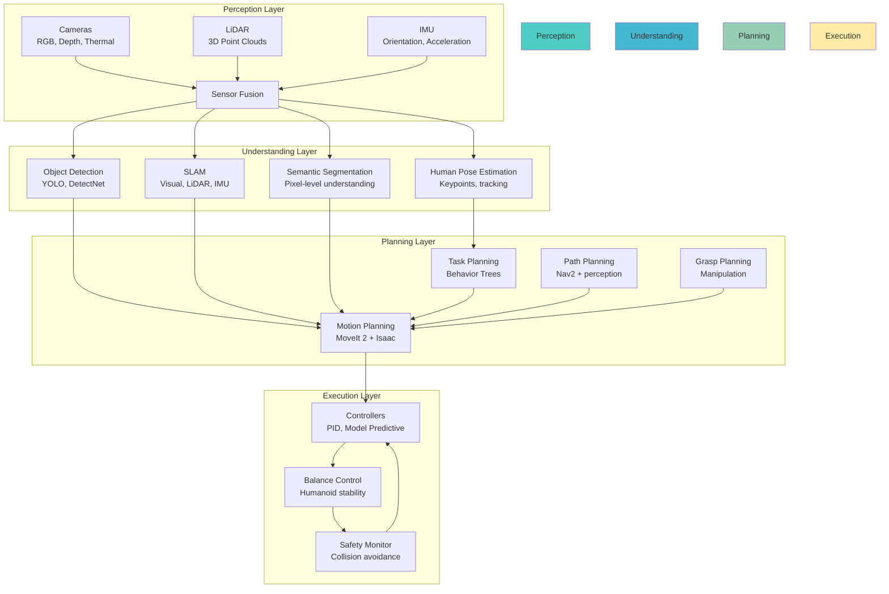

# Isaac Architecture: The AI Brain Systems

Now that you understand Isaac's ecosystem, let's dive into how the AI brain actually works. The architecture is built around three core systems: **Perception**, **Planning**, and **Execution**, all optimized for real-time robotics.

## The AI Brain Pipeline



## Perception Architecture

### Sensor Processing Pipeline

Isaac optimizes sensor data processing with GPU acceleration:

```python
# Isaac ROS perception pipeline
import rclpy
from rclpy.node import Node
from sensor_msgs.msg import Image, CameraInfo
from vision_msgs.msg import Detection2DArray
from geometry_msgs.msg import PointStamped

class IsaacPerceptionPipeline(Node):
    def __init__(self):
        super().__init__('isaac_perception_pipeline')

        # GPU-accelerated image processing
        self.image_sub = self.create_subscription(
            Image, '/camera/rgb/image_raw', self.process_image, 10
        )

        # Multiple perception nodes in pipeline
        self.object_detector = self.create_perception_node('detectnet')
        self.segmentation = self.create_perception_node('segmentation')
        self.depth_processor = self.create_perception_node('depth_processing')

        # Output topics
        self.detections_pub = self.create_publisher(
            Detection2DArray, '/isaac/detections', 10
        )
        self.segmentation_pub = self.create_publisher(
            Image, '/isaac/segmentation', 10
        )

    def process_image(self, msg):
        # GPU-accelerated preprocessing
        preprocessed = self.gpu_preprocess(msg)

        # Parallel processing of different perception tasks
        detections = self.object_detector.run(preprocessed)
        segmentation = self.segmentation.run(preprocessed)
        depth_analysis = self.depth_processor.run(msg)

        # Publish results
        self.detections_pub.publish(detections)
        self.segmentation_pub.publish(segmentation)
```

### Isaac ROS Perception Nodes

**1. Object Detection (DetectNet)**:
```bash
# Isaac ROS DetectNet node
ros2 run isaac_ros_detectnet detectnet_node \
  --ros-args \
  -p model_name:=ssd_mobilenet_v2_coco \
  -p confidence_threshold:=0.5 \
  -r image_raw:=/camera/rgb/image_raw \
  -r image:=/camera/rgb/image_processed
```

**2. Visual SLAM**:
```bash
# Isaac ROS Visual SLAM
ros2 run isaac_ros_visual_slam visual_slam_node \
  --ros-args \
  -p enable_imu_fusion:=true \
  -p map_frame:=map \
  -p odom_frame:=odom \
  -p base_frame:=base_link
```

**3. Semantic Segmentation**:
```bash
# Isaac ROS Segmentation
ros2 run isaac_ros_segmentation segmentation_node \
  --ros-args \
  -p model_name:=fcn_resnet101_coco \
  -r image:=/camera/rgb/image_raw
```

### Multi-Sensor Fusion

Isaac excels at combining multiple sensor inputs:

```yaml
# sensor_fusion.yaml
sensor_fusion:
  ros__parameters:
    # Synchronize different sensor timestamps
    timestamp_synchronization:
      camera_to_lidar_max_delay: 0.05  # 50ms
      imu_to_camera_max_delay: 0.01   # 10ms

    # Sensor weights for fusion
    sensor_weights:
      camera: 0.6     # High confidence in vision
      lidar: 0.3      # Good for distance
      imu: 0.1        # Good for orientation

    # Fusion algorithm
    fusion_algorithm: "kalman_filter"  # or "particle_filter"
```

## Planning Architecture

### Motion Planning (MoveIt 2 + Isaac Extensions)

Isaac enhances MoveIt 2 with GPU-accelerated collision checking:

```python
# Isaac-enhanced motion planner
import rclpy
from moveit_msgs.srv import GetMotionPlan
from moveit_msgs.msg import MotionPlanRequest
from geometry_msgs.msg import PoseStamped

class IsaacMotionPlanner:
    def __init__(self):
        # GPU-accelerated collision checking
        self.collision_checker = self.create_gpu_collision_checker()

        # Enhanced path planners
        self.planners = {
            'ompl': self.create_ompl_planner(),
            'chomp': self.create_chomp_planner(),
            'stomp': self.create_stomp_planner()
        }

    def plan_motion(self, start_pose, goal_pose, scene):
        # GPU-accelerated collision checking
        collision_objects = self.process_scene_gpu(scene)

        # Multi-threaded planning with different algorithms
        plans = []
        for name, planner in self.planners.items():
            plan = planner.plan(start_pose, goal_pose, collision_objects)
            if plan.success:
                plans.append(plan)

        # Select best plan based on criteria
        best_plan = self.select_best_plan(plans)
        return best_plan

    def select_best_plan(self, plans):
        # Criteria: safety, efficiency, smoothness
        return max(plans, key=lambda p: p.safety_score * 0.4 +
                                      p.efficiency_score * 0.4 +
                                      p.smoothness_score * 0.2)
```

### Task Planning with Behavior Trees

Isaac uses behavior trees for complex task planning:

```xml
<!-- navigation_task.xml -->
<root main_tree_to_execute="MainTree">
  <BehaviorTree ID="MainTree">
    <Sequence>
      <DetectGoalObjects />
      <NavigateToGoal>
        <Fallback>
          <DirectPathToGoal />
          <PathPlanningWithObstacles />
        </Fallback>
      </NavigateToGoal>
      <VerifyGoalReached>
        <Fallback>
          <GoalReached />
          <RetryNavigation max_attempts="3" />
        </Fallback>
      </VerifyGoalReached>
    </Sequence>
  </BehaviorTree>
</root>
```

**Behavior Tree Node Types**:

```cpp
// Custom Isaac behavior tree nodes
class IsaacBehaviorTreeNodes {
public:
    // Perception-based conditions
    class DetectObject : public BT::ConditionNode {
        BT::NodeStatus tick() override {
            auto detections = get_perception_data();
            return detections.found_object ?
                   BT::NodeStatus::SUCCESS : BT::NodeStatus::FAILURE;
        }
    };

    // Navigation actions
    class NavigateToPose : public BT::ActionNodeBase {
        BT::NodeStatus tick() override {
            // Use Isaac-enhanced Nav2
            return navigate_with_isaac(goal_pose_);
        }
    };

    // Manipulation sequences
    class PickAndPlace : public BT::SequenceNode {
        BT::NodeStatus tick() override {
            // Complex manipulation with Isaac planning
            return execute_manipulation_sequence();
        }
    };
};
```

### Path Planning Integration

Isaac enhances Nav2 with perception-aware planning:

```yaml
# isaac_nav2_params.yaml
local_costmap:
  local_costmap:
    ros__parameters:
      update_frequency: 10.0
      publish_frequency: 10.0
      global_frame: odom
      robot_base_frame: base_link
      use_sim_time: True
      resolution: 0.05
      # Isaac-specific enhancements
      plugins: [
        "static_layer",
        "obstacle_layer",
        "isaac_perception_layer",  # Isaac perception fusion
        "inflation_layer"
      ]

isaac_perception_layer:
  ros__parameters:
    enabled: True
    observation_sources: ["perception_objects"]
    perception_objects:
      topic: "/isaac/detections"
      max_obstacle_height: 2.0
      min_obstacle_height: 0.0
      obstacle_range: 3.0
      raytrace_range: 4.0
      # Perception confidence threshold
      confidence_threshold: 0.7
```

## Execution Architecture

### GPU-Accelerated Control

Isaac provides GPU-accelerated controllers for humanoid robots:

```cpp
// Isaac GPU-accelerated controller
#include <cuda_runtime.h>
#include <isaac_control/Controller.h>

class IsaacGPUController : public Controller {
public:
    IsaacGPUController() {
        // Initialize GPU memory for control calculations
        cudaMalloc(&d_control_matrix, sizeof(Matrix) * MAX_CONTROLLERS);
        cudaMalloc(&d_state_vector, sizeof(Vector) * MAX_STATES);
    }

    void compute_control_commands(const RobotState& state,
                                 const Trajectory& trajectory) override {
        // GPU kernel for control computation
        compute_control_kernel<<<blocks, threads>>>(
            d_control_matrix, d_state_vector,
            state.data(), trajectory.data()
        );
        cudaDeviceSynchronize();
    }

private:
    float* d_control_matrix;  // GPU memory
    float* d_state_vector;    // GPU memory
};
```

### Balance Control for Humanoids

Critical for humanoid robots using Isaac's balance system:

```python
# Isaac humanoid balance controller
import numpy as np
from geometry_msgs.msg import WrenchStamped
from std_msgs.msg import Float64MultiArray

class IsaacBalanceController:
    def __init__(self):
        # Center of Mass (CoM) tracking
        self.com_controller = self.create_com_controller()

        # Zero Moment Point (ZMP) control
        self.zmp_controller = self.create_zmp_controller()

        # Whole-body control for humanoid
        self.whole_body_controller = self.create_whole_body_controller()

    def balance_control(self, current_state, desired_state):
        # Calculate CoM trajectory
        com_trajectory = self.calculate_com_trajectory(
            current_state, desired_state
        )

        # ZMP-based stability control
        zmp_reference = self.calculate_zmp_reference(com_trajectory)

        # Whole-body control allocation
        joint_commands = self.whole_body_controller.compute(
            current_state, com_trajectory, zmp_reference
        )

        return joint_commands

    def calculate_com_trajectory(self, current_state, desired_state):
        # GPU-accelerated trajectory optimization
        return self.gpu_trajectory_optimizer.optimize(
            current_state.com, desired_state.com
        )
```

### Safety and Monitoring

Isaac includes comprehensive safety systems:

```yaml
# isaac_safety_config.yaml
safety_system:
  ros__parameters:
    # Collision detection
    collision_threshold: 0.3  # meters
    collision_prediction_horizon: 2.0  # seconds

    # Joint limit monitoring
    joint_position_threshold: 0.1  # radians from limit
    joint_velocity_threshold: 10.0  # rad/s

    # Emergency stop
    emergency_stop_conditions:
      - joint_torque_exceeded
      - collision_imminent
      - position_error_too_large
      - communication_timeout

    # Recovery behaviors
    recovery_behaviors:
      - move_to_safe_position
      - stop_all_motors
      - publish_error_status
```

## Isaac Message Transport (NITROS)

Optimized message transport for AI workloads:

```python
# NITROS (NVIDIA Isaac Transport for ROS) example
from isaac_ros_nitros import NitrosNode
from sensor_msgs.msg import Image
from vision_msgs.msg import Detection2DArray

class OptimizedPerceptionNode(NitrosNode):
    def __init__(self):
        super().__init__('optimized_perception')

        # NITROS automatically optimizes transport
        self.declare_parameter('input_type', 'nitros_image_rgb8')
        self.declare_parameter('output_type', 'nitros_detection2_d_array')

        # Subscriptions and publishers
        self.image_sub = self.create_subscription(
            Image, 'image_in', self.image_callback, 10
        )

        self.detection_pub = self.create_publisher(
            Detection2DArray, 'detections_out', 10
        )

    def image_callback(self, msg):
        # GPU-accelerated processing
        detections = self.detect_objects_gpu(msg)
        self.detection_pub.publish(detections)
```

## GPU Optimization Architecture

### TensorRT Integration

Isaac uses TensorRT for optimized AI inference:

```cpp
// TensorRT integration in Isaac
#include <NvInfer.h>
#include <isaac_ros_tensor_rt/TensorRTInference.h>

class IsaacTensorRTNode {
private:
    nvinfer1::ICudaEngine* engine_;
    nvinfer1::IExecutionContext* context_;
    void* buffers_[2];  // Input and output buffers
    cudaStream_t stream_;

public:
    void initialize_model(const std::string& model_path) {
        // Load optimized TensorRT model
        engine_ = load_tensorrt_model(model_path);
        context_ = engine_->createExecutionContext();

        // Allocate GPU buffers
        cudaMalloc(&buffers_[0], input_size_);
        cudaMalloc(&buffers_[1], output_size_);
        cudaStreamCreate(&stream_);
    }

    void run_inference(const void* input_data, void* output_data) {
        // Asynchronous GPU inference
        cudaMemcpyAsync(buffers_[0], input_data, input_size_,
                       cudaMemcpyHostToDevice, stream_);

        context_->enqueueV2(buffers_, stream_, nullptr);

        cudaMemcpyAsync(output_data, buffers_[1], output_size_,
                       cudaMemcpyDeviceToHost, stream_);

        cudaStreamSynchronize(stream_);
    }
};
```

### CUDA-Accelerated Algorithms

```python
# Python interface to CUDA kernels
import pycuda.autoinit
import pycuda.driver as cuda
import numpy as np

class IsaacCUDAPerception:
    def __init__(self):
        # Load CUDA kernels for perception
        self.kernel = self.load_cuda_kernel('perception_kernels.ptx')

    def process_pointcloud_gpu(self, pointcloud_data):
        # GPU-accelerated point cloud processing
        gpu_data = cuda.mem_alloc(pointcloud_data.nbytes)
        cuda.memcpy_htod(gpu_data, pointcloud_data)

        # Execute CUDA kernel
        self.kernel.preprocess_pointcloud(
            np.int32(len(pointcloud_data)),
            gpu_data,
            block=(256, 1, 1),
            grid=(len(pointcloud_data) // 256 + 1, 1)
        )

        # Copy result back to CPU
        result = np.empty_like(pointcloud_data)
        cuda.memcpy_dtoh(result, gpu_data)
        return result
```

## System Integration Architecture

### Isaac App Framework

```python
# Isaac App structure
from isaac_ros.app IsaacApp
from isaac_ros.components import (
    PerceptionComponent,
    PlanningComponent,
    ControlComponent
)

class HumanoidAIApp(IsaacApp):
    def __init__(self):
        super().__init__('humanoid_ai_app')

        # Component-based architecture
        self.perception = PerceptionComponent(
            nodes=[
                'isaac_ros_detectnet',
                'isaac_ros_visual_slam',
                'isaac_ros_segmentation'
            ]
        )

        self.planning = PlanningComponent(
            nodes=[
                'moveit2_planning',
                'nav2_planning',
                'behavior_tree'
            ]
        )

        self.control = ControlComponent(
            nodes=[
                'joint_trajectory_controller',
                'balance_controller',
                'safety_monitor'
            ]
        )

    def setup_composition(self):
        # Define node composition and connections
        self.composition.add_node(self.perception)
        self.composition.add_node(self.planning)
        self.composition.add_node(self.control)

        # Connect perception to planning
        self.composition.connect(
            'perception/detections',
            'planning/obstacles'
        )

        # Connect planning to control
        self.composition.connect(
            'planning/trajectory',
            'control/commands'
        )
```

### Resource Management

Isaac intelligently manages GPU and CPU resources:

```yaml
# resource_management.yaml
resource_manager:
  ros__parameters:
    # GPU memory allocation
    gpu_memory_fraction: 0.8  # Use 80% of GPU memory
    gpu_memory_padding: 0.1   # Reserve 10% for system

    # CPU thread management
    cpu_threads_per_node: 4
    cpu_affinity_enabled: true

    # Priority scheduling
    perception_priority: "high"      # Real-time perception
    planning_priority: "medium"      # Important but not real-time
    control_priority: "critical"     # Critical for safety

    # Load balancing
    dynamic_load_balancing: true
    fallback_to_cpu: true  # If GPU overloaded
```

## Performance Optimization

### Real-time Constraints

Isaac maintains real-time performance:

```python
# Real-time performance monitoring
class IsaacPerformanceMonitor:
    def __init__(self):
        self.target_frequencies = {
            'perception': 30.0,    # Hz
            'planning': 10.0,      # Hz
            'control': 100.0,      # Hz
            'safety': 200.0        # Hz
        }

    def monitor_performance(self):
        for component, target_freq in self.target_frequencies.items():
            actual_freq = self.measure_frequency(component)
            latency = self.measure_latency(component)

            if actual_freq < target_freq * 0.9:  # 10% tolerance
                self.log_performance_issue(
                    component, actual_freq, target_freq
                )

            if latency > self.get_max_latency(component):
                self.trigger_performance_recovery(component)
```

## Best Practices for Architecture

### 1. Modular Design
- Separate perception, planning, and control into distinct nodes
- Use standard ROS 2 interfaces between components
- Enable independent development and testing

### 2. Resource Awareness
- Monitor GPU memory and utilization
- Use appropriate message types (compressed when possible)
- Implement fallbacks when resources are constrained

### 3. Safety First
- Always have safety monitoring in parallel with main systems
- Implement emergency stop capabilities
- Use redundancy for critical functions

### 4. Performance Monitoring
- Track inference times, planning times, and control rates
- Set up alerts for performance degradation
- Log performance data for optimization

## Next Steps

Ready to get hands-on with Isaac's tools? Continue to [Tooling](/docs/module-03-ai-brain/tooling) to learn how to install, configure, and use Isaac ROS packages, Isaac Sim, and Isaac Lab for your humanoid robot.

---

**Key Takeaway**: Isaac's architecture is built around GPU-accelerated perception, intelligent planning, and real-time execution systems. The modular design with optimized message transport (NITROS) and TensorRT integration enables high-performance AI for robotics applications.