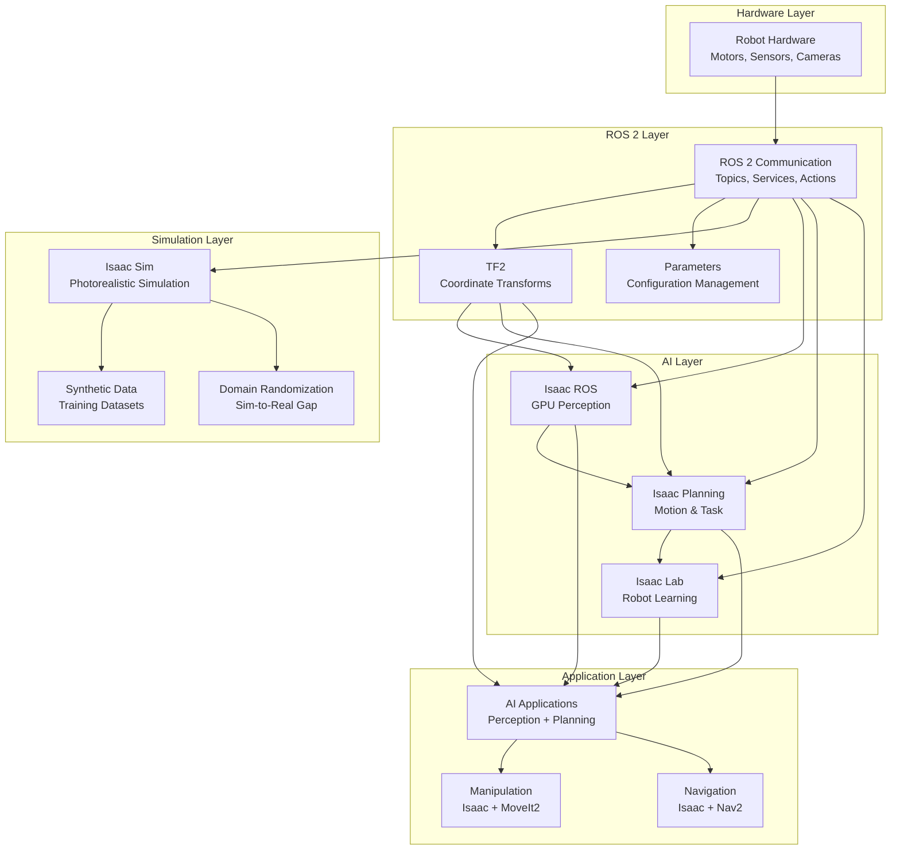

# Isaac Integration: Connecting AI with ROS 2 and Simulation

Now that you understand Isaac's components, let's integrate them with your existing ROS 2 and simulation infrastructure. This creates a complete AI-powered robot system.

## Complete AI-Robot Architecture



## Isaac ROS + Traditional ROS 2 Integration

### Message Type Compatibility

Isaac ROS uses optimized message types that need to be compatible with traditional ROS 2:

```python
# message_compatibility.py
import rclpy
from rclpy.node import Node
from sensor_msgs.msg import Image
from isaac_ros_messages.msg import IsaacImage  # Optimized format
from vision_msgs.msg import Detection2DArray
from std_msgs.msg import Header

class MessageCompatibilityNode(Node):
    def __init__(self):
        super().__init__('message_compatibility')

        # Isaac ROS publisher (optimized format)
        self.isaac_pub = self.create_publisher(
            IsaacImage, 'isaac/image_optimized', 10
        )

        # Traditional ROS 2 subscriber (standard format)
        self.ros_sub = self.create_subscription(
            Image, 'camera/image_raw', self.ros_image_callback, 10
        )

        # Isaac ROS subscriber
        self.isaac_sub = self.create_subscription(
            IsaacImage, 'isaac/image_optimized', self.isaac_image_callback, 10
        )

        # Converter node
        self.converter = self.create_converter()

    def ros_image_callback(self, msg):
        """Convert standard ROS image to Isaac format"""
        isaac_msg = self.converter.ros_to_isaac(msg)
        self.isaac_pub.publish(isaac_msg)

    def isaac_image_callback(self, msg):
        """Convert Isaac format to standard ROS image"""
        ros_msg = self.converter.isaac_to_ros(msg)
        # Process with standard ROS 2 nodes
        self.process_with_standard_nodes(ros_msg)

    def process_with_standard_nodes(self, image_msg):
        """Process with traditional ROS 2 perception nodes"""
        # Can now use standard OpenCV, PyTorch, etc.
        pass
```

### Launch File Integration

**ai_robot_system.launch.py**:

```python
from launch import LaunchDescription
from launch_ros.actions import Node, ComposableNodeContainer
from launch.actions import DeclareLaunchArgument
from launch.substitutions import LaunchConfiguration
from launch.conditions import IfCondition
from launch_ros.descriptions import ComposableNode

def generate_launch_description():
    # Launch arguments
    use_sim_time = LaunchConfiguration('use_sim_time', default='false')
    enable_perception = LaunchConfiguration('enable_perception', default='true')
    enable_navigation = LaunchConfiguration('enable_navigation', default='true')

    # Isaac ROS perception container
    perception_container = ComposableNodeContainer(
        name='isaac_perception_container',
        namespace='',
        package='rclcpp_components',
        executable='component_container_mt',
        parameters=[{'use_sim_time': use_sim_time}],
        composable_node_descriptions=[
            ComposableNode(
                package='isaac_ros_image_pipeline',
                plugin='nvidia::isaac_ros::image_proc::ImageFormatConverterNode',
                name='image_format_converter',
                parameters=[{
                    'use_sim_time': use_sim_time,
                    'input_format': 'rgb8',
                    'output_format': 'rgba8'
                }],
                remappings=[
                    ('image_raw', 'camera/image_raw'),
                    ('image', 'camera/image_rgba')
                ]
            ),
            ComposableNode(
                package='isaac_ros_detectnet',
                plugin='nvidia::isaac_ros::detectnet::DetectNetNode',
                name='detectnet',
                parameters=[{
                    'use_sim_time': use_sim_time,
                    'model_name': 'ssd_mobilenet_v2_coco',
                    'confidence_threshold': 0.7
                }],
                remappings=[
                    ('image', 'camera/image_rgba'),
                    ('detections', 'isaac/detections')
                ]
            ),
            ComposableNode(
                package='isaac_ros_visual_slam',
                plugin='nvidia::isaac_ros::visual_slam::VisualSLAMNode',
                name='visual_slam',
                parameters=[{
                    'use_sim_time': use_sim_time,
                    'enable_imu_fusion': True,
                    'map_frame': 'map',
                    'odom_frame': 'odom'
                }],
                remappings=[
                    ('/visual_slam/image', 'camera/image_rgba'),
                    ('/visual_slam/camera_info', 'camera/camera_info'),
                    ('/visual_slam/imu', 'imu/data')
                ]
            )
        ],
        condition=IfCondition(enable_perception)
    )

    # Traditional ROS 2 navigation (Nav2)
    nav2_bringup_launch = IncludeLaunchDescription(
        PythonLaunchDescriptionSource([
            get_package_share_directory('nav2_bringup'),
            '/launch/navigation_launch.py'
        ]),
        launch_arguments={
            'use_sim_time': use_sim_time,
            'params_file': '/path/to/nav2_params.yaml'
        }.items(),
        condition=IfCondition(enable_navigation)
    )

    # Isaac-enhanced navigation
    isaac_nav_node = Node(
        package='isaac_ros_navigation',
        executable='isaac_navigation_node',
        name='isaac_navigation',
        parameters=[
            {'use_sim_time': use_sim_time},
            {'perception_topic': 'isaac/detections'},
            {'map_topic': 'map'},
            {'cmd_vel_topic': 'cmd_vel'}
        ],
        remappings=[
            ('/perception_objects', 'isaac/detections'),
            ('/cmd_vel', 'robot/cmd_vel')
        ],
        condition=IfCondition(enable_navigation)
    )

    return LaunchDescription([
        DeclareLaunchArgument('use_sim_time', default_value='false'),
        DeclareLaunchArgument('enable_perception', default_value='true'),
        DeclareLaunchArgument('enable_navigation', default_value='true'),
        perception_container,
        nav2_bringup_launch,
        isaac_nav_node
    ])
```

### TF2 Integration with Isaac

Isaac uses TF2 for coordinate transformations:

```yaml
# tf_integration.yaml
tf_broadcaster:
  ros__parameters:
    # Isaac perception transforms
    perception_frame: "camera_rgb_optical_frame"
    detection_frame: "detection_frame"
    map_frame: "map"
    odom_frame: "odom"
    base_frame: "base_link"

    # Transform publishing settings
    publish_frequency: 50.0
    buffer_size: 10
    use_sim_time: false
```

```python
# tf_integration_node.py
import rclpy
from rclpy.node import Node
from tf2_ros import TransformBroadcaster, TransformListener
from tf2_ros.buffer import Buffer
from geometry_msgs.msg import TransformStamped, PointStamped
from vision_msgs.msg import Detection2DArray
from builtin_interfaces.msg import Time

class IsaacTFIntegration(Node):
    def __init__(self):
        super().__init__('isaac_tf_integration')

        # TF broadcasters and listeners
        self.tf_broadcaster = TransformBroadcaster(self)
        self.tf_buffer = Buffer()
        self.tf_listener = TransformListener(self.tf_buffer, self)

        # Isaac perception subscriber
        self.detection_sub = self.create_subscription(
            Detection2DArray, 'isaac/detections', self.detection_callback, 10
        )

        # Timer for publishing transforms
        self.tf_timer = self.create_timer(0.02, self.publish_transforms)

    def detection_callback(self, msg):
        """Process detections and transform to world coordinates"""
        for detection in msg.detections:
            # Transform detection from camera frame to world frame
            try:
                transform = self.tf_buffer.lookup_transform(
                    'map',  # Target frame
                    'camera_rgb_optical_frame',  # Source frame
                    Time(),  # Latest available
                    timeout=rclpy.duration.Duration(seconds=1.0)
                )

                # Transform detection point
                world_point = self.transform_point(
                    detection.bbox.center, transform
                )

                # Publish world coordinates
                self.publish_world_coordinates(world_point, detection)

            except Exception as e:
                self.get_logger().warn(f'Transform lookup failed: {e}')

    def publish_transforms(self):
        """Publish robot transforms"""
        # Example: Publish camera to base_link transform
        t = TransformStamped()
        t.header.stamp = self.get_clock().now().to_msg()
        t.header.frame_id = 'base_link'
        t.child_frame_id = 'camera_rgb_optical_frame'

        # Set transform (position and orientation)
        t.transform.translation.x = 0.1
        t.transform.translation.y = 0.0
        t.transform.translation.z = 0.5
        t.transform.rotation.x = 0.0
        t.transform.rotation.y = 0.0
        t.transform.rotation.z = 0.0
        t.transform.rotation.w = 1.0

        self.tf_broadcaster.sendTransform(t)
```

## Isaac Sim + Isaac ROS Integration

### Isaac Sim ROS Bridge Configuration

```yaml
# isaac_sim_bridge_config.yaml
isaac_sim_bridge:
  ros__parameters:
    # Bridge settings
    bridge_frequency: 30.0
    use_sim_time: true

    # Topic mappings
    topic_mappings:
      # Camera data
      - ["/isaac_sim/camera/rgb/image", "/camera/image_raw", "sensor_msgs/Image", "ros2"]
      - ["/isaac_sim/camera/depth/image", "/camera/depth/image_raw", "sensor_msgs/Image", "ros2"]

      # LiDAR data
      - ["/isaac_sim/lidar/points", "/lidar/points", "sensor_msgs/PointCloud2", "ros2"]

      # Robot state
      - ["/isaac_sim/robot/joint_states", "/joint_states", "sensor_msgs/JointState", "ros2"]
      - ["/isaac_sim/robot/odom", "/odom", "nav_msgs/Odometry", "ros2"]
      - ["/isaac_sim/robot/imu", "/imu/data", "sensor_msgs/Imu", "ros2"]

      # Control commands
      - ["/cmd_vel", "/isaac_sim/robot/cmd_vel", "geometry_msgs/Twist", "ros2"]
      - ["/joint_commands", "/isaac_sim/robot/joint_commands", "sensor_msgs/JointState", "ros2"]

    # QoS profiles
    qos_profiles:
      sensor_data:
        reliability: "best_effort"
        durability: "volatile"
        history: "keep_last"
        depth: 1
      control_commands:
        reliability: "reliable"
        durability: "volatile"
        history: "keep_last"
        depth: 10
      critical_data:
        reliability: "reliable"
        durability: "transient_local"
        history: "keep_last"
        depth: 10
```

### Isaac Sim Python Script for Integration

```python
# isaac_sim_integration.py
from omni.isaac.kit import SimulationApp
from omni.isaac.core import World
from omni.isaac.core.utils.stage import add_reference_to_stage
from omni.isaac.core.utils.nucleus import get_assets_root_path
from omni.isaac.core.utils.prims import get_prim_at_path
from omni.isaac.sensor import Camera, RotatingLidar
import carb

# Start Isaac Sim
config = {
    "headless": False,
    "physics_dt": 1.0/60.0,
    "rendering_dt": 1.0/30.0,
    "stage_units_in_meters": 1.0
}
simulation_app = SimulationApp(config)

# Import ROS bridge after Isaac Sim is initialized
from omni.isaac.ros_bridge import ROSBridge

def setup_isaac_sim_with_ros():
    # Create world
    world = World(stage_units_in_meters=1.0)

    # Add ground plane
    world.scene.add_default_ground_plane()

    # Add robot
    assets_root_path = get_assets_root_path()
    if assets_root_path is None:
        carb.log_error("Could not find Isaac Sim assets. Please check your installation.")

    # Add humanoid robot
    robot_path = "/World/Robot"
    add_reference_to_stage(
        usd_path=f"{assets_root_path}/Isaac/Robots/Humanoid/humanoid_instanceable.usd",
        prim_path=robot_path
    )

    # Add sensors to robot
    camera = Camera(
        prim_path=f"{robot_path}/Camera",
        frequency=30,
        resolution=(640, 480),
        position=(0.2, 0.0, 0.8),
        orientation=(0.0, 0.0, 0.0, 1.0)
    )

    lidar = RotatingLidar(
        prim_path=f"{robot_path}/LiDAR",
        rotation_frequency=10,
        channels=16,
        range=20.0,
        position=(0.1, 0.0, 0.9)
    )

    # Initialize ROS bridge
    ros_bridge = ROSBridge()
    ros_bridge.initialize()

    # Set up ROS publishers/subscribers
    camera.set_render_product_frequency(30)
    lidar.set_frequency(10)

    # Configure ROS topics
    camera.add_ros_topic("/isaac_sim/camera/rgb/image")
    lidar.add_ros_topic("/isaac_sim/lidar/points")

    return world, camera, lidar

def run_simulation_with_ros():
    world, camera, lidar = setup_isaac_sim_with_ros()

    # Reset world
    world.reset()

    # Simulation loop
    while simulation_app.is_running():
        # Step simulation
        world.step(render=True)

        # Update ROS bridge
        if world.is_playing():
            if world.current_time_step_index == 0:
                world.reset(soft=True)

            # Process ROS callbacks
            # ros_bridge.process_callbacks()  # Uncomment when using real ROS bridge

    simulation_app.close()

if __name__ == "__main__":
    run_simulation_with_ros()
```

## Isaac Lab + Simulation Integration

### Training in Isaac Sim with Isaac Lab

```python
# sim_training_integration.py
from omni.isaac.orbit.envs import RLTaskEnv
from omni.isaac.orbit.assets import Articulation
from omni.isaac.orbit.sensors import Camera, ContactSensor
import torch
import numpy as np

class IsaacSimTrainingEnv(RLTaskEnv):
    def __init__(self, cfg):
        super().__init__(cfg)

        # Robot setup in Isaac Sim
        self.robot = Articulation(
            prim_path="/World/Robot",
            name="humanoid_robot",
            translation=torch.tensor([0.0, 0.0, 1.0])
        )

        # Scene setup
        self.setup_scene()

        # Task parameters
        self.target_pos = torch.tensor([5.0, 0.0, 0.0])
        self.initial_pos = torch.tensor([0.0, 0.0, 1.0])

        # Domain randomization
        self.randomization_params = {
            'lighting': True,
            'textures': True,
            'physics': True,
            'mass_variance': 0.1,
            'friction_variance': 0.2
        }

    def setup_scene(self):
        """Setup simulation scene with randomization"""
        # Add ground plane
        self.add_ground_plane()

        # Add obstacles
        self.add_random_obstacles()

        # Setup lighting
        self.setup_random_lighting()

        # Setup textures
        self.setup_random_textures()

    def reset(self):
        """Reset environment with domain randomization"""
        # Apply domain randomization
        self.randomize_environment()

        # Reset robot to initial position
        self.robot.reset()
        self.robot.set_root_position(self.initial_pos)

        # Randomize target position
        self.target_pos = self.sample_random_target()

        return self.get_observation()

    def randomize_environment(self):
        """Apply domain randomization to simulation"""
        # Randomize lighting
        if self.randomization_params['lighting']:
            self.randomize_lighting()

        # Randomize textures
        if self.randomization_params['textures']:
            self.randomize_textures()

        # Randomize physics parameters
        if self.randomization_params['physics']:
            self.randomize_physics()

    def get_observation(self):
        """Get observation for RL training"""
        # Robot state
        root_pos = self.robot.data.root_pos_w
        root_vel = self.robot.data.root_vel_w
        joint_pos = self.robot.data.joint_pos
        joint_vel = self.robot.data.joint_vel

        # Task-relevant information
        target_rel_pos = self.target_pos - root_pos[:2]  # Only x,y
        up_proj = root_pos[2] - self.initial_pos[2]      # Height above ground

        # Concatenate observations
        obs = torch.cat([
            joint_pos,                    # Joint positions
            joint_vel,                    # Joint velocities
            root_vel,                     # Base velocity
            target_rel_pos,               # Relative target position
            torch.tensor([up_proj]),      # Up projection
        ])

        return obs

    def compute_reward(self, actions):
        """Compute reward for current step"""
        # Get current state
        root_pos = self.robot.data.root_pos_w
        root_vel = self.robot.data.root_vel_w

        # Distance to target
        dist_to_target = torch.norm(self.target_pos[:2] - root_pos[:2])

        # Reward for moving towards target
        target_reward = torch.exp(-dist_to_target / 2.0)

        # Penalty for falling
        height_penalty = 0.0
        if root_pos[2] < 0.5:  # Robot fell
            height_penalty = -100.0

        # Velocity reward (moving forward)
        forward_vel = torch.clamp(root_vel[0], 0.0, 2.0)
        vel_reward = forward_vel * 0.1

        # Small action penalty
        action_penalty = torch.sum(torch.square(actions)) * 0.001

        total_reward = target_reward + vel_reward + height_penalty - action_penalty
        return total_reward

    def sample_random_target(self):
        """Sample random target position"""
        angle = torch.rand(1) * 2 * torch.pi
        radius = 3.0 + torch.rand(1) * 2.0  # 3-5m from start
        x = radius * torch.cos(angle)
        y = radius * torch.sin(angle)
        return torch.tensor([x.item(), y.item(), 0.0])
```

### Isaac Lab Training Script with Simulation

```python
# train_with_simulation.py
from omni.isaac.orbit_tasks.utils import parse_env_cfg
from omni.isaac.orbit.envs import RLTaskEnv
from omni.isaac.orbit.utils import configclass
from rsl_rl.runners import OnPolicyRunner
from rsl_rl.algorithms import PPO
from rsl_rl.modules import ActorCritic

@configclass
class HumanoidSimEnvCfg:
    # Environment settings
    episode_length = 500
    action_scale = 0.5
    control_dt = 0.02  # 50 Hz

    # Domain randomization
    randomization_params = {
        'lighting': True,
        'textures': True,
        'physics': True,
        'frequency': 100  # Randomize every 100 episodes
    }

    # Robot settings
    robot_cfg = {
        "asset_file": "humanoid.usd",
        "default_dof_pos": [0.0] * 28,
        "stiffness": 800.0,
        "damping": 50.0
    }

def train_humanoid_in_simulation():
    """Train humanoid robot in Isaac Sim using Isaac Lab"""
    # Parse configuration
    env_cfg = HumanoidSimEnvCfg()

    # Create Isaac Sim environment
    env = IsaacSimTrainingEnv(cfg=env_cfg)

    # Initialize policy network
    actor_critic = ActorCritic(
        num_obs=env.observation_space.shape[0],
        num_actions=env.action_space.shape[0],
        actor_hidden_dims=[512, 256, 128],
        critic_hidden_dims=[512, 256, 128],
        activation="elu"
    )

    # Initialize PPO algorithm
    ppo = PPO(
        actor_critic=actor_critic,
        device=env.device,
        num_learning_epochs=5,
        num_mini_batches=4,
        clip_param=0.2,
        gamma=0.99,
        lam=0.95,
        value_loss_coef=1.0,
        entropy_coef=0.001,
        learning_rate=1.0e-3
    )

    # Initialize training runner
    runner = OnPolicyRunner(
        env=env,
        algo=ppo,
        num_steps_per_env=24,      # 24 * 500 = 12000 steps per iteration
        max_iterations=2000,       # Train for 2000 iterations
        save_interval=50,          # Save every 50 iterations
        experiment_name="humanoid_sim_train",
        run_name="ppo_humanoid"
    )

    # Start training
    runner.learn(initial_atlans=0)

    # Save final policy
    runner.save(directory="models/humanoid_policy")

if __name__ == "__main__":
    train_humanoid_in_simulation()
```

## Isaac ROS + Isaac Lab Integration

### Deploying Trained Policies

```python
# policy_deployment.py
import rclpy
from rclpy.node import Node
from sensor_msgs.msg import JointState, Image, Imu
from geometry_msgs.msg import Twist
from std_msgs.msg import Float64MultiArray
import torch
import numpy as np

class IsaacPolicyDeploymentNode(Node):
    def __init__(self):
        super().__init__('isaac_policy_deployment')

        # Load trained policy from Isaac Lab
        self.policy = self.load_trained_policy('models/humanoid_policy.pth')
        self.policy.eval()  # Set to evaluation mode

        # Robot state tracking
        self.current_joint_pos = None
        self.current_joint_vel = None
        self.current_imu_data = None

        # ROS subscribers for sensor data
        self.joint_sub = self.create_subscription(
            JointState, '/joint_states', self.joint_callback, 10
        )
        self.imu_sub = self.create_subscription(
            Imu, '/imu/data', self.imu_callback, 10
        )
        self.camera_sub = self.create_subscription(
            Image, '/camera/image_raw', self.camera_callback, 10
        )

        # ROS publisher for robot commands
        self.cmd_pub = self.create_publisher(
            JointState, '/robot/joint_commands', 10
        )

        # Control timer
        self.control_timer = self.create_timer(0.02, self.control_step)  # 50 Hz

    def load_trained_policy(self, model_path):
        """Load trained policy from Isaac Lab"""
        # Load model architecture and weights
        policy = torch.load(model_path, map_location='cpu')
        return policy

    def joint_callback(self, msg):
        """Update joint state from robot"""
        self.current_joint_pos = np.array(msg.position)
        self.current_joint_vel = np.array(msg.velocity)

    def imu_callback(self, msg):
        """Update IMU data from robot"""
        self.current_imu_data = {
            'orientation': [msg.orientation.x, msg.orientation.y, msg.orientation.z, msg.orientation.w],
            'angular_velocity': [msg.angular_velocity.x, msg.angular_velocity.y, msg.angular_velocity.z],
            'linear_acceleration': [msg.linear_acceleration.x, msg.linear_acceleration.y, msg.linear_acceleration.z]
        }

    def camera_callback(self, msg):
        """Process camera data (for perception-enhanced control)"""
        # Convert ROS image to tensor for perception
        image_tensor = self.ros_image_to_tensor(msg)

        # Run perception if needed
        if hasattr(self, 'perception_model'):
            detections = self.perception_model(image_tensor)

    def control_step(self):
        """Main control loop using trained policy"""
        if self.current_joint_pos is None or self.current_joint_vel is None:
            return  # Wait for sensor data

        # Prepare observation for policy
        obs = self.prepare_observation()

        # Get action from trained policy
        with torch.no_grad():
            obs_tensor = torch.tensor(obs, dtype=torch.float32).unsqueeze(0)
            action = self.policy(obs_tensor).squeeze(0).numpy()

        # Convert action to joint commands
        joint_commands = self.convert_action_to_joints(action)

        # Apply safety checks
        if self.safety_check(joint_commands):
            # Publish commands to robot
            cmd_msg = JointState()
            cmd_msg.header.stamp = self.get_clock().now().to_msg()
            cmd_msg.position = joint_commands.tolist()
            cmd_msg.velocity = [0.0] * len(joint_commands)  # Zero velocity for position control
            cmd_msg.effort = [0.0] * len(joint_commands)    # Zero effort

            self.cmd_pub.publish(cmd_msg)

    def prepare_observation(self):
        """Prepare observation vector for policy"""
        # This should match the observation format used during training in Isaac Lab
        obs = np.concatenate([
            self.current_joint_pos,           # Joint positions
            self.current_joint_vel,           # Joint velocities
            self.get_base_velocity(),         # Base velocity (estimated from IMU)
            self.get_target_direction(),      # Direction to target
            self.get_up_projection(),         # Up projection (from IMU)
        ])
        return obs

    def safety_check(self, joint_commands):
        """Safety validation before sending commands"""
        # Check joint limits
        joint_limits = self.get_joint_limits()
        for i, cmd in enumerate(joint_commands):
            if cmd < joint_limits[i][0] or cmd > joint_limits[i][1]:
                self.get_logger().warn(f'Joint {i} command {cmd} exceeds limits {joint_limits[i]}')
                return False

        # Check for sudden large movements
        if self.current_joint_pos is not None:
            delta = np.abs(joint_commands - self.current_joint_pos)
            if np.any(delta > 0.5):  # 0.5 rad limit
                self.get_logger().warn('Large joint movement detected')
                return False

        return True

    def get_joint_limits(self):
        """Get robot joint limits"""
        # Return [(min1, max1), (min2, max2), ...]
        return [(-3.14, 3.14)] * len(self.current_joint_pos)
```

## Isaac Integration with Nav2 and MoveIt2

### Isaac-Enhanced Navigation

```yaml
# isaac_nav2_params.yaml
amcl:
  ros__parameters:
    use_sim_time: True
    alpha1: 0.2
    alpha2: 0.2
    alpha3: 0.2
    alpha4: 0.2
    alpha5: 0.2
    base_frame_id: "base_footprint"
    beam_skip_distance: 0.5
    beam_skip_error_threshold: 0.9
    beam_skip_threshold: 0.3
    do_beamskip: false
    global_frame_id: "map"
    lambda_short: 0.1
    likelihood_max_dist: 2.0
    max_beams: 60
    max_particles: 2000
    min_particles: 500
    odom_frame_id: "odom"
    pf_err: 0.05
    pf_z: 0.99
    recovery_alpha_fast: 0.0
    recovery_alpha_slow: 0.0
    resample_interval: 1
    robot_model_type: "nav2_amcl::DifferentialMotionModel"
    save_pose_delay: 0.2
    save_pose_rate: 0.5
    sigma_hit: 0.2
    tf_broadcast: true
    transform_tolerance: 1.0
    update_min_a: 0.2
    update_min_d: 0.25
    z_hit: 0.5
    z_max: 0.05
    z_rand: 0.5
    z_short: 0.05

bt_navigator:
  ros__parameters:
    use_sim_time: True
    global_frame: "map"
    robot_base_frame: "base_link"
    odom_topic: "/odom"
    bt_loop_duration: 10
    default_server_timeout: 20
    enable_groot_monitoring: True
    groot_zmq_publisher_port: 1666
    groot_zmq_server_port: 1667
    # Isaac-specific behavior tree
    default_nav_to_pose_bt_xml: "bt_isaac_nav_to_pose.xml"
    default_nav_through_poses_bt_xml: "bt_isaac_nav_through_poses.xml"

controller_server:
  ros__parameters:
    use_sim_time: True
    controller_frequency: 20.0
    min_x_velocity_threshold: 0.001
    min_y_velocity_threshold: 0.5
    min_theta_velocity_threshold: 0.001
    # Isaac-enhanced controllers
    IsaacDiffDriveController:
      plugin: "nvidia::isaac_ros::controller::IsaacDiffDriveController"
      odometry_topic: "/odom"
      left_wheel_names: ["left_wheel_joint"]
      right_wheel_names: ["right_wheel_joint"]
      wheel_separation: 0.3
      wheel_radius: 0.1
      cmd_vel_timeout: 0.5

local_costmap:
  local_costmap:
    ros__parameters:
      update_frequency: 10.0
      publish_frequency: 10.0
      global_frame: odom
      robot_base_frame: base_link
      use_sim_time: True
      rolling_window: true
      width: 3
      height: 3
      resolution: 0.05
      # Isaac perception layer
      plugins: [
        "static_layer",
        "obstacle_layer",
        "isaac_perception_layer",  # Isaac-enhanced obstacle detection
        "inflation_layer"
      ]
      inflation_layer:
        plugin: "nav2_costmap_2d::InflationLayer"
        cost_scaling_factor: 3.0
        inflation_radius: 0.55
      obstacle_layer:
        plugin: "nav2_costmap_2d::ObstacleLayer"
        enabled: True
        observation_sources: scan
        scan:
          topic: "/scan"
          max_obstacle_height: 2.0
          clearing: True
          marking: True
          data_type: "LaserScan"
          raytrace_max_range: 3.0
          raytrace_min_range: 0.0
          obstacle_max_range: 2.5
          obstacle_min_range: 0.0
      isaac_perception_layer:
        plugin: "nvidia::isaac_ros::costmap::IsaacPerceptionLayer"
        enabled: True
        observation_sources: ["isaac_detections"]
        isaac_detections:
          topic: "/isaac/detections"
          max_obstacle_height: 2.0
          min_obstacle_height: 0.0
          obstacle_range: 3.0
          raytrace_range: 4.0
          observation_persistence: 0.0
          expected_update_rate: 0.0
          data_type: "PointCloud2"
          marking: True
          clearing: True
          inf_is_valid: False
          voxel_size: 0.025
```

### Isaac-Enhanced MoveIt2 Integration

```python
# isaac_moveit_integration.py
import rclpy
from rclpy.node import Node
from moveit_msgs.srv import GetMotionPlan
from moveit_msgs.msg import MotionPlanRequest
from sensor_msgs.msg import JointState
from geometry_msgs.msg import PoseStamped
from vision_msgs.msg import Detection2DArray
import numpy as np

class IsaacMoveItIntegrationNode(Node):
    def __init__(self):
        super().__init__('isaac_moveit_integration')

        # MoveIt2 motion planning service client
        self.motion_plan_cli = self.create_client(
            GetMotionPlan, 'plan_kinematic_path'
        )

        # Isaac perception subscriber
        self.detection_sub = self.create_subscription(
            Detection2DArray, '/isaac/detections', self.detection_callback, 10
        )

        # Joint state subscriber
        self.joint_sub = self.create_subscription(
            JointState, '/joint_states', self.joint_callback, 10
        )

        # Motion planning publisher
        self.plan_pub = self.create_publisher(
            JointState, '/motion_plan', 10
        )

        # Store detected obstacles for collision checking
        self.obstacles = []

    def detection_callback(self, msg):
        """Update obstacles from Isaac perception"""
        self.obstacles = []
        for detection in msg.detections:
            # Convert detection to 3D obstacle position
            obstacle_3d_pos = self.detection_to_3d_position(detection)
            self.obstacles.append(obstacle_3d_pos)

    def plan_motion_with_obstacles(self, start_pose, goal_pose):
        """Plan motion with Isaac-detected obstacles"""
        # Create motion plan request
        request = MotionPlanRequest()
        request.workspace_parameters.header.frame_id = 'map'
        request.start_state.joint_state = self.current_joint_state
        request.goal_constraints = [self.create_goal_constraint(goal_pose)]

        # Add obstacles to planning scene
        request.planning_options.planning_scene_diff.world.collision_objects = \
            self.create_collision_objects_from_detections()

        # Call MoveIt2 planning service
        future = self.motion_plan_cli.call_async(request)
        future.add_done_callback(self.motion_plan_callback)

    def create_collision_objects_from_detections(self):
        """Create MoveIt2 collision objects from Isaac detections"""
        collision_objects = []

        for i, obstacle_pos in enumerate(self.obstacles):
            obj = CollisionObject()
            obj.header.frame_id = 'map'
            obj.id = f'detected_obstacle_{i}'

            # Create primitive shape (box) for obstacle
            box = SolidPrimitive()
            box.type = SolidPrimitive.BOX
            box.dimensions = [0.3, 0.3, 0.3]  # 30cm cube

            pose = Pose()
            pose.position.x = obstacle_pos[0]
            pose.position.y = obstacle_pos[1]
            pose.position.z = obstacle_pos[2] / 2.0  # Half height
            pose.orientation.w = 1.0

            obj.primitives.append(box)
            obj.primitive_poses.append(pose)
            obj.operation = CollisionObject.ADD

            collision_objects.append(obj)

        return collision_objects
```

## Performance Optimization for Integration

### GPU Resource Management

```python
# gpu_resource_manager.py
import torch
import rclpy
from rclpy.node import Node
from std_msgs.msg import Float64MultiArray
import threading
import time

class IsaacGPUResourceManager(Node):
    def __init__(self):
        super().__init__('isaac_gpu_resource_manager')

        # GPU monitoring
        self.gpu_monitor_pub = self.create_publisher(
            Float64MultiArray, '/gpu_monitoring', 10
        )

        # Resource allocation
        self.perception_gpu_memory = 0.4  # 40% for perception
        self.planning_gpu_memory = 0.3    # 30% for planning
        self.learning_gpu_memory = 0.3    # 30% for learning

        # Monitor timer
        self.monitor_timer = self.create_timer(1.0, self.monitor_gpu_usage)

        # Resource optimization thread
        self.optimization_thread = threading.Thread(target=self.optimize_resources)
        self.optimization_thread.daemon = True
        self.optimization_thread.start()

    def monitor_gpu_usage(self):
        """Monitor GPU usage and publish metrics"""
        if torch.cuda.is_available():
            gpu_info = Float64MultiArray()

            # Memory usage
            memory_allocated = torch.cuda.memory_allocated() / 1024**3  # GB
            memory_reserved = torch.cuda.memory_reserved() / 1024**3    # GB
            memory_utilization = torch.cuda.utilization()               # Percentage

            gpu_info.data = [
                memory_allocated,
                memory_reserved,
                memory_utilization,
                torch.cuda.get_device_name()
            ]

            self.gpu_monitor_pub.publish(gpu_info)

    def optimize_resources(self):
        """Optimize GPU resource allocation"""
        while rclpy.ok():
            # Check if memory usage is too high
            if torch.cuda.memory_allocated() > 0.8 * torch.cuda.get_device_properties(0).total_memory:
                # Clear cache
                torch.cuda.empty_cache()

                # Reduce batch sizes temporarily
                self.reduce_batch_sizes()

                # Wait before restoring
                time.sleep(5.0)

                # Restore normal batch sizes
                self.restore_batch_sizes()

            time.sleep(10.0)  # Check every 10 seconds

    def reduce_batch_sizes(self):
        """Reduce batch sizes to free up GPU memory"""
        # Implementation depends on specific nodes
        self.get_logger().info('Reducing batch sizes to optimize GPU memory')

    def restore_batch_sizes(self):
        """Restore normal batch sizes"""
        self.get_logger().info('Restoring normal batch sizes')
```

## Safety and Monitoring Integration

### Isaac Safety Monitor

```python
# isaac_safety_monitor.py
import rclpy
from rclpy.node import Node
from sensor_msgs.msg import JointState, Imu, PointCloud2
from geometry_msgs.msg import Twist
from std_msgs.msg import Bool
from builtin_interfaces.msg import Time
import numpy as np

class IsaacSafetyMonitor(Node):
    def __init__(self):
        super().__init__('isaac_safety_monitor')

        # Safety state
        self.emergency_stop = False
        self.safety_violation = False

        # Subscribers for monitoring
        self.joint_sub = self.create_subscription(
            JointState, '/joint_states', self.joint_callback, 10
        )
        self.imu_sub = self.create_subscription(
            Imu, '/imu/data', self.imu_callback, 10
        )
        self.lidar_sub = self.create_subscription(
            PointCloud2, '/lidar/points', self.lidar_callback, 10
        )
        self.cmd_sub = self.create_subscription(
            Twist, '/cmd_vel', self.command_callback, 10
        )

        # Publishers for safety
        self.emergency_stop_pub = self.create_publisher(
            Bool, '/emergency_stop', 10
        )
        self.safety_status_pub = self.create_publisher(
            Bool, '/safety_status', 10
        )

        # Safety timer
        self.safety_timer = self.create_timer(0.1, self.check_safety)

        # Safety parameters
        self.joint_limits = {
            'min_position': -3.0,
            'max_position': 3.0,
            'max_velocity': 5.0,
            'max_torque': 100.0
        }
        self.collision_threshold = 0.5  # meters
        self.fall_threshold = 0.3       # meters (height)

    def joint_callback(self, msg):
        """Monitor joint states for safety"""
        for i, position in enumerate(msg.position):
            if abs(position) > self.joint_limits['max_position']:
                self.trigger_safety_violation(f'Joint {i} position limit exceeded')
                return

        for i, velocity in enumerate(msg.velocity):
            if abs(velocity) > self.joint_limits['max_velocity']:
                self.trigger_safety_violation(f'Joint {i} velocity limit exceeded')
                return

    def imu_callback(self, msg):
        """Monitor IMU for fall detection"""
        # Check if robot has fallen (height below threshold)
        # This would need to be integrated with localization
        pass

    def lidar_callback(self, msg):
        """Monitor LiDAR for collision avoidance"""
        # Process point cloud to detect nearby obstacles
        # If obstacle too close, trigger safety
        pass

    def command_callback(self, msg):
        """Monitor commands for safety"""
        # Check if commanded velocity is too high
        if abs(msg.linear.x) > 2.0 or abs(msg.angular.z) > 1.0:
            self.trigger_safety_violation('Commanded velocity too high')
            return

    def check_safety(self):
        """Main safety check function"""
        safety_ok = not self.safety_violation

        # Publish safety status
        status_msg = Bool()
        status_msg.data = safety_ok
        self.safety_status_pub.publish(status_msg)

        if not safety_ok:
            # Publish emergency stop
            stop_msg = Bool()
            stop_msg.data = True
            self.emergency_stop_pub.publish(stop_msg)

    def trigger_safety_violation(self, reason):
        """Trigger safety violation"""
        self.get_logger().error(f'Safety violation: {reason}')
        self.safety_violation = True
```

## Integration Testing

### Isaac Integration Test Suite

```python
# integration_tests.py
import unittest
import rclpy
from rclpy.node import Node
from sensor_msgs.msg import Image, JointState
from vision_msgs.msg import Detection2DArray
from std_msgs.msg import Bool
import time

class IsaacIntegrationTests(unittest.TestCase):
    def setUp(self):
        rclpy.init()
        self.node = Node('integration_test_node')

    def tearDown(self):
        rclpy.shutdown()

    def test_perception_pipeline(self):
        """Test Isaac ROS perception pipeline"""
        # Subscribe to camera input
        camera_sub = self.node.create_subscription(
            Image, '/camera/image_raw', lambda msg: None, 10
        )

        # Subscribe to detection output
        detection_results = []
        def detection_callback(msg):
            detection_results.append(msg)

        detection_sub = self.node.create_subscription(
            Detection2DArray, '/isaac/detections', detection_callback, 10
        )

        # Wait for detections
        start_time = time.time()
        while len(detection_results) == 0 and time.time() - start_time < 10.0:
            rclpy.spin_once(self.node, timeout_sec=0.1)

        # Verify detections were received
        self.assertGreater(len(detection_results), 0, "No detections received from Isaac perception")

    def test_ros_bridge_connection(self):
        """Test Isaac Sim ROS bridge connection"""
        # Check if Isaac Sim topics are available
        topics = self.node.get_topic_names_and_types()
        isaac_topics = [topic for topic in topics if 'isaac_sim' in topic[0]]

        self.assertGreater(len(isaac_topics), 0, "No Isaac Sim topics found")

    def test_gpu_acceleration(self):
        """Test GPU acceleration is working"""
        import torch
        self.assertTrue(torch.cuda.is_available(), "CUDA not available for GPU acceleration")

        # Test basic GPU operation
        x = torch.randn(1000, 1000).cuda()
        y = torch.randn(1000, 1000).cuda()
        z = torch.mm(x, y)  # Matrix multiplication on GPU
        self.assertEqual(z.shape, (1000, 1000), "GPU matrix multiplication failed")

    def test_safety_system(self):
        """Test safety system integration"""
        safety_status = []
        def safety_callback(msg):
            safety_status.append(msg.data)

        safety_sub = self.node.create_subscription(
            Bool, '/safety_status', safety_callback, 10
        )

        # Wait for safety status
        start_time = time.time()
        while len(safety_status) == 0 and time.time() - start_time < 5.0:
            rclpy.spin_once(self.node, timeout_sec=0.1)

        if len(safety_status) > 0:
            self.assertTrue(safety_status[0], "Safety system reports unsafe state")

def run_integration_tests():
    """Run all integration tests"""
    test_suite = unittest.TestLoader().loadTestsFromTestCase(IsaacIntegrationTests)
    test_runner = unittest.TextTestRunner(verbosity=2)
    result = test_runner.run(test_suite)
    return result.wasSuccessful()

if __name__ == '__main__':
    success = run_integration_tests()
    exit(0 if success else 1)
```

## Best Practices for Integration

### 1. Modular Architecture
- Use separate nodes for perception, planning, and control
- Implement proper error handling between components
- Use composition containers for related functionality

### 2. Performance Monitoring
- Monitor GPU utilization and memory usage
- Track inference times and planning frequencies
- Set up alerts for performance degradation

### 3. Safety Integration
- Implement safety monitors in parallel with main systems
- Use hardware-independent safety checks
- Test emergency stop procedures regularly

### 4. Testing Strategy
- Test each component independently before integration
- Use simulation for extensive testing before hardware
- Implement automated integration tests

## Next Steps

Ready to put it all together? Continue to [Summary](/docs/module-03-ai-brain/summary) to review Isaac integration best practices, production deployment strategies, and prepare for the Vision-Language-Action module.

---

**Key Takeaway**: Isaac integration combines GPU-accelerated perception, intelligent planning, and learning systems with traditional ROS 2 infrastructure. Proper integration requires careful attention to message compatibility, resource management, and safety systems for production deployment.