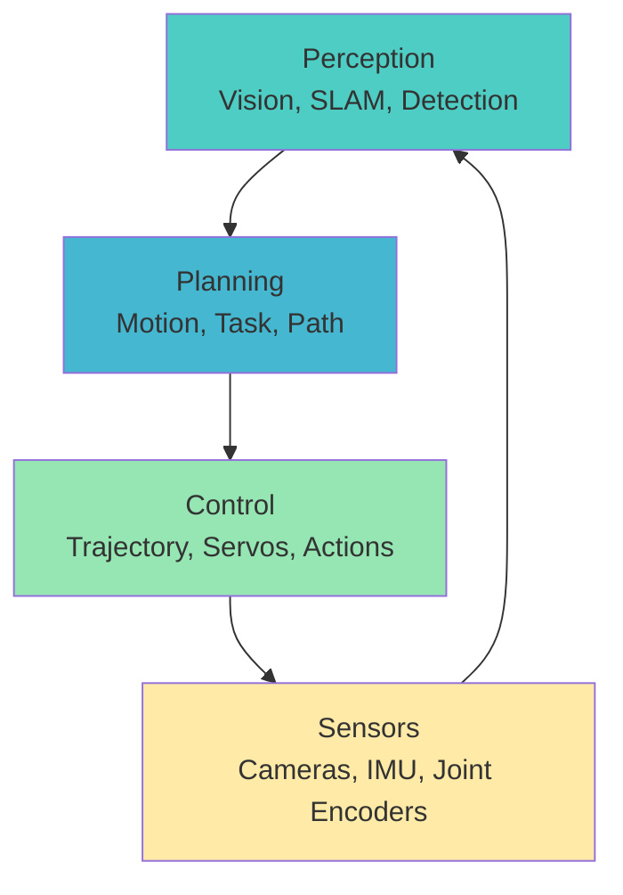
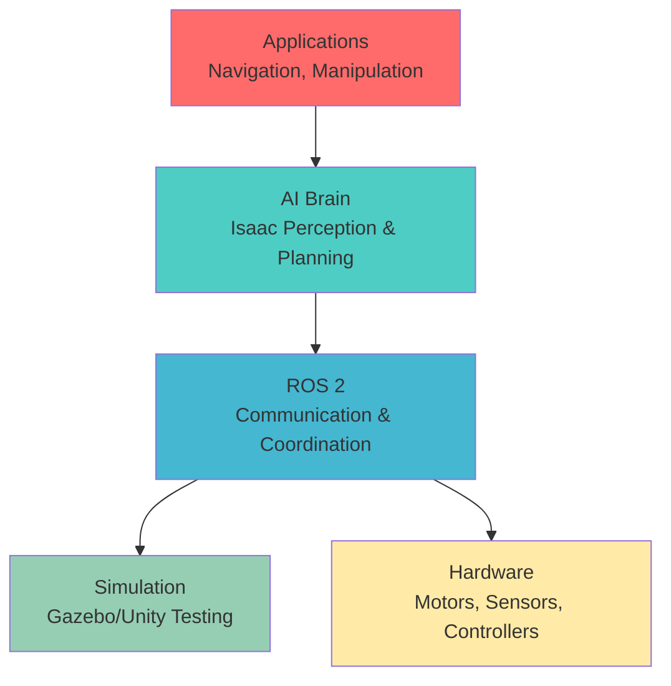

# Module 3: AI Brain - NVIDIA Isaac

Welcome to the intelligence layer of humanoid robotics. Where ROS 2 provides communication and simulation provides a safe testing ground, **NVIDIA Isaac** brings the AI brain that makes robots truly autonomous.

## The $50,000 Question

Imagine a humanoid robot that can:
- **See and understand** its environment (not just detect obstacles)
- **Plan complex sequences** of actions (not just react to inputs)
- **Learn from experience** (not just follow pre-programmed paths)
- **Adapt to new situations** (not just handle known scenarios)

This is the difference between a **reactive robot** and an **autonomous agent**. Your robot becomes truly useful when it can operate independently in unstructured environments.

## What is NVIDIA Isaac?

**NVIDIA Isaac** is NVIDIA's robotics platform that brings AI to robotics. It's not just a single tool - it's an ecosystem:

- **Isaac ROS**: ROS 2 packages optimized for NVIDIA hardware (CUDA, TensorRT)
- **Isaac Sim**: Gazebo-based simulation with photorealistic rendering
- **Isaac Lab**: Framework for robot learning and manipulation
- **Isaac Apps**: Pre-built applications (navigation, manipulation)
- **Triton Inference Server**: AI model deployment for robotics

### Why Isaac for Humanoid Robotics?

**1. GPU-Accelerated AI**
- Real-time perception (object detection, segmentation, pose estimation)
- Fast motion planning with collision checking
- Simultaneous processing of multiple sensors

**2. Hardware Integration**
- Optimized for NVIDIA Jetson, RTX, and EGX platforms
- CUDA kernels for sensor processing
- TensorRT for model optimization

**3. Production-Ready**
- Built for industrial deployment
- Safety features and monitoring
- Scalable from single robot to fleet

### The AI Brain Architecture



**Perception**: Understanding the world through sensors
- Object detection and recognition
- 3D scene reconstruction (SLAM)
- Human pose estimation
- Semantic segmentation

**Planning**: Deciding what to do next
- Motion planning (MoveIt 2 + Isaac extensions)
- Task planning (behavior trees, PDDL)
- Path planning (Nav2 + perception integration)
- Manipulation planning (grasping, tool use)

**Control**: Executing actions
- Trajectory generation
- Joint servo control
- Balance and stability (for humanoid robots)
- Safety monitoring

## Core Components of Isaac

### Isaac ROS

ROS 2 packages with GPU acceleration:

```bash
# Isaac ROS packages
ros2 pkg list | grep isaac
# Output:
# - isaac_ros_apriltag (marker detection)
# - isaac_ros_compressed_image_transport (GPU compression)
# - isaac_ros_detectnet (object detection)
# - isaac_ros_image_pipeline (GPU-accelerated image processing)
# - isaac_ros_managed_nitros (optimized message transport)
# - isaac_ros_nitros (message conversion)
# - isaac_ros_pointcloud_utils (3D point cloud processing)
# - isaac_ros_visual_slam (SLAM with IMU fusion)
```

### Isaac Sim

Enhanced Gazebo for AI training:

- **Photorealistic rendering** (Omniverse-based)
- **Synthetic data generation** (automatic labels)
- **Domain randomization** (lighting, textures, physics)
- **Multi-robot simulation** (fleets of robots)

### Isaac Lab

Framework for robot learning:

- **Reinforcement learning** environments
- **Manipulation** tasks and benchmarks
- **Learning algorithms** (PPO, SAC, etc.)
- **Simulation-to-real** transfer tools

## The Autonomous Robot Stack

Isaac sits on top of your ROS 2 foundation:



**Hardware Layer**: Motors, cameras, IMU, joint encoders
**ROS 2 Layer**: Communication, message passing, distributed systems
**Simulation Layer**: Safe testing and training environment
**AI Layer**: Perception, planning, learning (Isaac)
**Application Layer**: Navigation, manipulation, human interaction

## Real-World Applications

### NVIDIA's Project Amelia (Concept)

NVIDIA's humanoid robot concept demonstrates Isaac's capabilities:
- **Perception**: Real-time object detection and scene understanding
- **Planning**: Complex manipulation sequences
- **Learning**: Adapting to new tasks through demonstration

### Warehouse Automation

- **Pick-and-place**: 3D object detection + grasp planning
- **Navigation**: Dynamic obstacle avoidance in human spaces
- **Fleet management**: Coordinated multi-robot operations

### Assistive Robotics

- **Human detection**: Safe interaction with people
- **Gesture recognition**: Understanding human intentions
- **Task learning**: Adapting to individual needs

## Isaac vs. Alternatives

| Aspect | NVIDIA Isaac | Traditional ROS | Other AI Frameworks |
|--------|---------------|-----------------|-------------------|
| **GPU Acceleration** | Native CUDA/TensorRT | Limited | Some (OpenVINO, etc.) |
| **Perception** | Optimized for vision | Generic | Specialized (TensorFlow, PyTorch) |
| **Simulation** | Isaac Sim (Omniverse) | Gazebo, Unity | Custom simulators |
| **Hardware** | NVIDIA platforms | Any | Various accelerators |
| **Industrial** | Production-focused | Research-focused | Varies |
| **Learning** | Isaac Lab | External RL | Specialized frameworks |

## Module Learning Path

**Chapter 1: Overview** (This chapter) - AI brain concepts and Isaac ecosystem
**Chapter 2: Architecture** - Isaac ROS, perception pipelines, planning systems
**Chapter 3: Tooling** - Isaac ROS packages, Isaac Sim, Isaac Lab usage
**Chapter 4: Integration** - Connecting Isaac with ROS 2 and simulation
**Chapter 5: Summary** - Best practices and production deployment

## Prerequisites

Before diving into Isaac, ensure you understand:
- ✅ **ROS 2 concepts** (topics, services, actions, TF2)
- ✅ **Simulation basics** (Gazebo, sensor integration)
- ✅ **Python/C++ programming** for robotics
- ✅ **Basic computer vision** (image processing, detection)

You don't need deep AI expertise - we'll cover the essentials. Isaac provides the infrastructure to use AI without implementing algorithms from scratch.

## The AI-First Approach

Traditional robotics: **Sense → Plan → Act** (reactive)

AI-powered robotics: **Perceive → Understand → Reason → Act** (autonomous)

```python
# Traditional approach
if obstacle_detected():
    stop_robot()
    find_alternative_path()

# AI approach
scene = perceive_environment(camera_data)
intent = understand_scene(scene, context)
action = reason_about_action(intent, goals)
execute_action(action)
```

## Next Steps

Ready to dive into the technical architecture? Continue to [Architecture](/docs/module-03-ai-brain/architecture) to understand how Isaac's perception, planning, and control systems work together to create intelligent robots.

---

**Key Takeaway**: NVIDIA Isaac transforms robots from reactive machines into intelligent agents by providing GPU-accelerated perception, planning, and learning capabilities. It's the AI brain that enables true autonomy in humanoid robots.