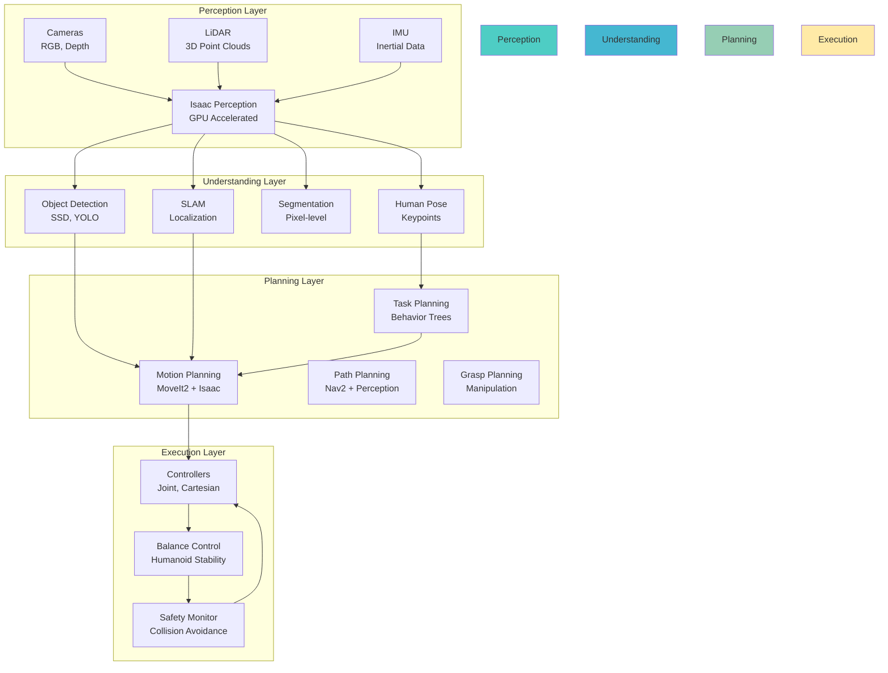
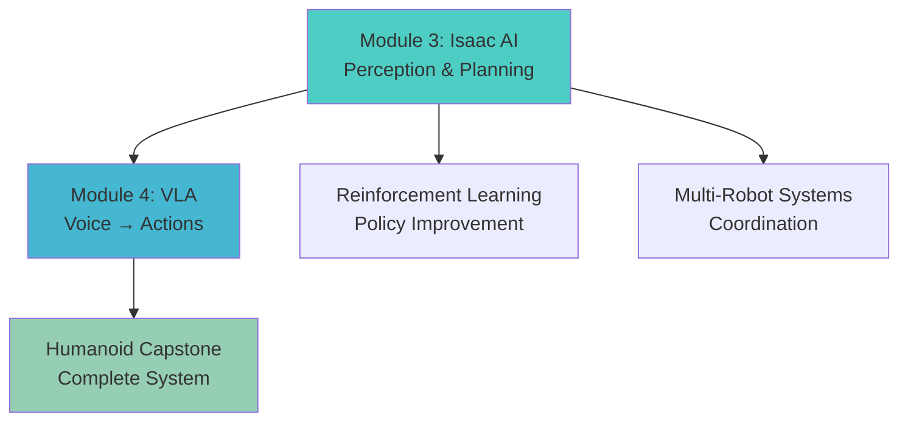

# Module 3 Summary: AI Brain - NVIDIA Isaac

Congratulations! You've mastered NVIDIA Isaac - the AI brain that transforms reactive robots into intelligent, autonomous agents. Let's synthesize everything you've learned and prepare for production deployment.

## Key Concepts Recap

### 1. Isaac Ecosystem Overview

NVIDIA Isaac is a complete AI platform for robotics:

**Isaac ROS**: GPU-accelerated perception nodes
- DetectNet for object detection
- Visual SLAM with IMU fusion
- Image processing with CUDA acceleration
- NITROS for optimized message transport

**Isaac Sim**: Photorealistic simulation
- USD-based scene management
- PhysX physics engine
- RTX rendering for photorealism
- Synthetic data generation with automatic labels

**Isaac Lab**: Robot learning framework
- Reinforcement learning environments
- Domain randomization for sim-to-real transfer
- Manipulation and locomotion tasks
- Policy training and deployment

### 2. The AI-First Robot Architecture



### 3. Integration Architecture

Isaac integrates with your existing stack:

**ROS 2 Foundation**: Communication, services, actions
**Simulation Layer**: Safe testing and synthetic data
**AI Layer**: Perception, planning, learning
**Application Layer**: Navigation, manipulation, human interaction

### 4. GPU Optimization Techniques

**TensorRT Integration**: Optimized model inference
**CUDA Acceleration**: Parallel processing for perception
**NITROS**: Optimized message transport
**Memory Management**: Efficient GPU memory usage

## What Isaac Does Well

### ✅ Strengths

1. **GPU-Accelerated Performance**
   - Real-time perception (30+ FPS object detection)
   - Fast motion planning with collision checking
   - Parallel processing of multiple sensors
   - Optimized inference with TensorRT

2. **Photorealistic Simulation**
   - Domain randomization for robust models
   - Synthetic data with automatic labels
   - Physics-accurate environments
   - Multi-robot simulation capabilities

3. **Production-Ready AI**
   - Reinforcement learning for complex behaviors
   - Perception-aware planning
   - Safety monitoring and emergency stops
   - Industrial deployment capabilities

4. **Complete Ecosystem**
   - End-to-end pipeline from perception to action
   - Integration with ROS 2 and existing tools
   - Hardware optimization for NVIDIA platforms
   - Comprehensive tooling (Sim, Lab, ROS)

## What Isaac Doesn't Do Well

### ❌ Limitations & Gotchas

1. **Hardware Dependencies**
   - Requires NVIDIA GPU for full acceleration
   - High-end GPU needed for photorealistic rendering
   - TensorRT models require NVIDIA hardware
   - **Mitigation**: Use CPU fallbacks for non-NVIDIA hardware

2. **Learning Curve**
   - Complex architecture with multiple components
   - Requires understanding of CUDA, TensorRT
   - Integration with existing ROS 2 systems
   - **Mitigation**: Start with simple perception tasks, gradually add complexity

3. **Resource Intensive**
   - High GPU memory usage for photorealistic rendering
   - CPU overhead for perception pipelines
   - Network bandwidth for sensor data
   - **Mitigation**: Optimize batch sizes, use mixed precision, implement resource management

4. **Licensing & Costs**
   - Isaac Sim requires Omniverse subscription
   - Some components may have licensing restrictions
   - High-end GPUs required for optimal performance
   - **Mitigation**: Plan budget for hardware and software licenses

5. **Overfitting Risk**
   - Models trained in simulation may not transfer to real world
   - Domain randomization needs careful tuning
   - Synthetic data may not capture real-world complexity
   - **Mitigation**: Always validate on real hardware, use gradual domain randomization

## Best Practices for Production

### 1. Architecture Best Practices

**Modular Design**:
```yaml
# Separate components for maintainability
perception_pipeline:
  nodes: [
    "image_format_converter",
    "detectnet",
    "visual_slam",
    "semantic_segmentation"
  ]

planning_pipeline:
  nodes: [
    "motion_planner",
    "task_planner",
    "path_planner"
  ]

execution_pipeline:
  nodes: [
    "controllers",
    "balance_system",
    "safety_monitor"
  ]
```

**Resource Management**:
```python
# GPU resource allocation
class IsaacResourceManager:
    def __init__(self):
        self.perception_gpu_fraction = 0.4  # 40% for perception
        self.planning_gpu_fraction = 0.3    # 30% for planning
        self.learning_gpu_fraction = 0.3    # 30% for learning (if training)

    def optimize_resources(self):
        # Monitor and adjust resource allocation
        if gpu_utilization > 0.8:
            reduce_batch_sizes()
            clear_gpu_cache()
```

### 2. Safety-First Development

**Safety Monitor Implementation**:
```python
# Always implement safety in parallel with main systems
class IsaacSafetyMonitor:
    def __init__(self):
        # Independent safety checks
        self.emergency_stop = False
        self.safety_violation = False

    def check_joint_limits(self, joint_commands):
        for i, cmd in enumerate(joint_commands):
            if cmd < joint_limits[i][0] or cmd > joint_limits[i][1]:
                self.trigger_emergency_stop(f'Joint {i} limit exceeded')

    def check_collisions(self, robot_pose, obstacles):
        for obstacle in obstacles:
            if distance(robot_pose, obstacle) < safety_threshold:
                self.trigger_emergency_stop('Collision imminent')
```

### 3. Performance Optimization

**GPU Memory Management**:
```python
# Optimize GPU memory usage
def optimize_gpu_memory():
    # Use mixed precision where possible
    if torch.cuda.is_bfloat16_supported():
        with torch.cuda.amp.autocast(dtype=torch.bfloat16):
            # Run inference
            pass

    # Clear cache periodically
    if torch.cuda.memory_allocated() > 0.8 * max_memory:
        torch.cuda.empty_cache()
```

**Batch Size Optimization**:
```python
def auto_tune_batch_size(model, data_loader):
    max_batch_size = 8
    current_batch_size = max_batch_size

    while current_batch_size > 1:
        try:
            test_batch = next(iter(data_loader))
            with torch.no_grad():
                _ = model(test_batch[:current_batch_size])
            break
        except RuntimeError as e:
            if "out of memory" in str(e):
                current_batch_size //= 2
                torch.cuda.empty_cache()
            else:
                raise e

    return current_batch_size
```

### 4. Testing and Validation

**Simulation-to-Reality Testing**:
```python
# Test pipeline
def sim_to_real_validation():
    # 1. Test in simulation (1000 trials)
    sim_success_rate = test_in_simulation()
    assert sim_success_rate > 0.95, "Simulation success rate too low"

    # 2. Test on real robot in controlled environment (100 trials)
    real_success_rate = test_on_real_robot()
    assert real_success_rate > 0.85, "Real robot success rate too low"

    # 3. Gradually increase complexity
    increase_environment_complexity()
    retest()
```

**Integration Testing**:
```python
# Automated integration tests
def run_integration_tests():
    tests = [
        test_perception_pipeline(),
        test_ros_bridge_connection(),
        test_gpu_acceleration(),
        test_safety_system()
    ]

    all_passed = all(tests)
    assert all_passed, "Some integration tests failed"
```

### 5. Deployment Strategies

**Gradual Rollout**:
1. **Development**: Test with Isaac Sim
2. **Validation**: Test on real robot in lab
3. **Pilot**: Limited deployment in controlled environment
4. **Production**: Full deployment with monitoring

**Monitoring and Observability**:
```yaml
# Monitoring configuration
monitoring:
  gpu_metrics:
    - utilization
    - memory_usage
    - temperature
  performance_metrics:
    - inference_time
    - planning_frequency
    - control_rate
  safety_metrics:
    - emergency_stops
    - safety_violations
    - recovery_attempts
```

## Production Deployment Checklist

Before deploying Isaac-powered robots:

- [ ] **Hardware Validation**: GPU acceleration working, sufficient memory
- [ ] **Perception Testing**: Object detection accuracy > 90% in target environment
- [ ] **Planning Validation**: Motion planning success rate > 95%
- [ ] **Safety Systems**: Emergency stops and collision avoidance functional
- [ ] **Simulation Testing**: Extensive testing in Isaac Sim with domain randomization
- [ ] **Real Robot Testing**: Validation on actual hardware in target environment
- [ ] **Performance Monitoring**: GPU utilization, inference times, control rates
- [ ] **Safety Validation**: All safety checks passing, emergency procedures tested
- [ ] **Backup Plans**: Fallback behaviors when AI systems fail
- [ ] **Monitoring Setup**: Metrics collection and alerting configured
- [ ] **Documentation**: Runbooks for common issues and procedures

## Common Pitfalls to Avoid

### ❌ Pitfall 1: Over-Reliance on Simulation

**Problem**: "It works perfectly in Isaac Sim, so it will work on the real robot"

**Solution**: Always test on real hardware
- Test 10% of scenarios on real robot
- Document sim-to-real gaps
- Implement robustness to environment differences

### ❌ Pitfall 2: GPU Memory Exhaustion

**Problem**: Running out of GPU memory during inference

**Solution**: Implement resource management
```python
# Monitor and manage GPU memory
if torch.cuda.memory_allocated() > 0.8 * max_memory:
    reduce_batch_sizes()
    clear_cache()
    implement_fallback_to_cpu()
```

### ❌ Pitfall 3: Ignoring Safety Systems

**Problem**: Bypassing safety checks for performance

**Solution**: Safety as primary concern
- Safety systems run in parallel with main systems
- Emergency stops are always active
- Safety checks cannot be disabled

### ❌ Pitfall 4: Complex Initial Deployments

**Problem**: Deploying complex AI behaviors immediately

**Solution**: Gradual complexity increase
- Start with basic perception and navigation
- Add complex behaviors incrementally
- Validate each new capability

### ❌ Pitfall 5: Insufficient Monitoring

**Problem**: Not tracking system performance and health

**Solution**: Comprehensive monitoring
- GPU utilization and memory
- Inference and planning times
- Safety system activations
- Error rates and recovery

## Performance Benchmarks

### Expected Performance Targets

**Perception**:
- Object detection: 30+ FPS with TensorRT models
- SLAM: Real-time with IMU fusion
- Semantic segmentation: 20+ FPS on RTX 3090

**Planning**:
- Motion planning: < 100ms per plan
- Path planning: < 50ms with perception integration
- Task planning: Real-time with behavior trees

**Control**:
- Joint control: 100+ Hz for humanoid robots
- Balance control: 200+ Hz for stability
- Safety monitoring: 1000+ Hz for immediate response

### Optimization Strategies

**If Performance is Too Slow**:
1. Use TensorRT for model optimization
2. Reduce batch sizes
3. Use mixed precision (FP16)
4. Optimize network architecture
5. Use CPU fallback for non-critical tasks

**If GPU Memory is Exceeded**:
1. Reduce input resolution
2. Use model quantization
3. Implement memory pooling
4. Use CPU for some operations
5. Optimize batch processing

## Looking Ahead: Vision-Language-Action Systems

Isaac provides the foundation for advanced AI capabilities:



**Module 3 (Isaac AI)** - Intelligence layer ✅ **Complete!**

**Module 4 (Vision-Language-Action)**:
- Voice command processing
- LLM-based task planning
- Vision-language models
- End-to-end learned policies
- Humanoid capstone project

## Decision Framework: Isaac vs. Alternatives

### Choose Isaac When:

✅ **GPU Acceleration is Critical**
- Real-time perception required
- Complex AI models needed
- High-throughput sensor processing

✅ **NVIDIA Hardware Available**
- RTX/Quadro GPUs for training
- Jetson for edge deployment
- CUDA-capable hardware

✅ **Industrial Deployment**
- Production-ready systems needed
- Safety and reliability paramount
- Professional support required

✅ **Complete Ecosystem**
- Need simulation, perception, planning
- Want integrated solution
- Require synthetic data generation

### Consider Alternatives When:

🔄 **CPU-Based Solutions**
- NVIDIA hardware not available
- Cost constraints
- Simpler perception needs

🔄 **Custom Solutions**
- Very specific requirements
- Existing investment in other frameworks
- Research-focused applications

## Troubleshooting Guide

### Performance Issues

**Slow Inference**:
```bash
# Check GPU utilization
nvidia-smi

# Monitor memory usage
watch -n 1 'nvidia-smi --query-gpu=memory.used,memory.total --format=csv'

# Optimize models with TensorRT
python -c "import torch_tensorrt; torch_tensorrt.optimize()"
```

**High Memory Usage**:
```python
# Clear GPU cache
torch.cuda.empty_cache()

# Monitor memory allocation
print(f"Allocated: {torch.cuda.memory_allocated()/1024**3:.2f} GB")
print(f"Reserved: {torch.cuda.memory_reserved()/1024**3:.2f} GB")
```

### Integration Problems

**ROS Bridge Issues**:
```bash
# Check available topics
ros2 topic list | grep isaac

# Verify QoS compatibility
ros2 topic info /topic_name

# Test bridge connection
ros2 run isaac_ros_common test_bridge_connection
```

**Safety System Activation**:
```bash
# Check safety status
ros2 topic echo /safety_status

# Monitor safety violations
ros2 topic echo /safety_violations
```

## Resources for Continued Learning

**Official Documentation**:
- [NVIDIA Isaac ROS](https://nvidia-isaac-ros.github.io/)
- [Isaac Sim Documentation](https://docs.omniverse.nvidia.com/isaacsim/latest/)
- [Isaac Lab Documentation](https://isaac-orbit.github.io/)

**Tutorials and Examples**:
- Isaac ROS GitHub Repository
- Isaac Sim Sample Scenes
- Isaac Lab Example Environments

**Community**:
- NVIDIA Developer Forums
- ROS Answers (tag: nvidia-isaac)
- Isaac Sim Community

**Research Papers**:
- "Isaac Sim: Towards High Fidelity Simulation for Robotic Manipulation"
- "GPU-Accelerated Perception for Robotics"
- "Sim-to-Real Transfer in Robotics with Domain Randomization"

## Final Thoughts

Isaac transforms robots from reactive machines into intelligent agents by providing:

1. **Perception**: Real-time object detection, SLAM, and scene understanding
2. **Planning**: Motion planning with AI-aware collision checking
3. **Learning**: Reinforcement learning for complex behaviors
4. **Safety**: Built-in safety systems and monitoring
5. **Integration**: Seamless connection with ROS 2 and existing systems

**The Isaac advantage**: GPU acceleration enables real-time AI that would be impossible on CPU alone, making truly autonomous humanoid robots feasible.

**The production reality**: Success requires careful attention to safety, performance, and gradual deployment - not just technical capability.

## Next Module

Ready to add voice and language capabilities to your AI-powered robot? Continue to [Module 4: Vision-Language-Action](/docs/module-04-vla/overview) to learn how to make your humanoid robot understand voice commands, reason about tasks using LLMs, and execute complex vision-language-action policies.

---

**Key Takeaway**: Isaac provides the AI brain for autonomous robots with GPU-accelerated perception, intelligent planning, and safe execution. Master the complete pipeline from simulation training to real-world deployment for production-ready humanoid robots.