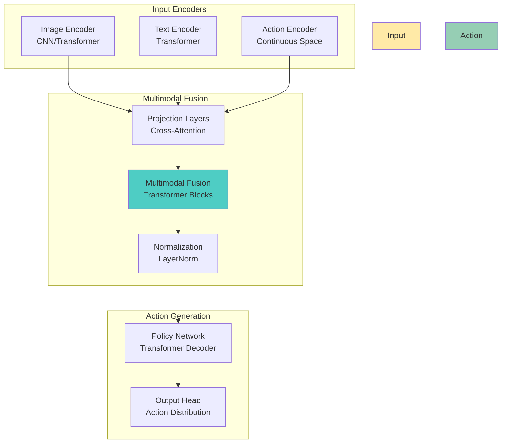

# VLA Architecture: Model Design and Training

Now that you understand the VLA concept, let's dive into the technical architecture that makes vision-language-action systems possible. This chapter covers the model designs, training methodologies, and technical foundations that enable robots to understand and execute natural language commands.

## VLA Model Architectures

### 1. Foundation Model Architecture

The core VLA architecture combines three modalities in a unified transformer-based model:



### 2. RT-2 Architecture (Robotics Transformer 2)

RT-2 represents a breakthrough in language-to-action mapping:

```python
# RT-2 model architecture
import torch
import torch.nn as nn
from transformers import VisionEncoderDecoderModel, CLIPVisionModel, CLIPTextModel

class RT2Model(nn.Module):
    def __init__(self, config):
        super().__init__()

        # Vision encoder (CLIP Vision)
        self.vision_encoder = CLIPVisionModel.from_pretrained("openai/clip-vit-base-patch32")

        # Text encoder (CLIP Text)
        self.text_encoder = CLIPTextModel.from_pretrained("openai/clip-vit-base-patch32")

        # Action decoder (Transformer)
        self.action_decoder = nn.TransformerDecoder(
            decoder_layer=nn.TransformerDecoderLayer(
                d_model=config.hidden_size,
                nhead=config.num_attention_heads,
                dim_feedforward=config.intermediate_size
            ),
            num_layers=config.num_hidden_layers
        )

        # Action head (maps to robot actions)
        self.action_head = nn.Linear(config.hidden_size, config.action_space_size)

        # Language head (for text generation)
        self.language_head = nn.Linear(config.hidden_size, config.vocab_size)

    def forward(self, pixel_values, input_ids, action_targets=None):
        # Encode visual input
        vision_outputs = self.vision_encoder(pixel_values=pixel_values)
        vision_features = vision_outputs.last_hidden_state  # [batch, seq_len, hidden_size]

        # Encode text input
        text_outputs = self.text_encoder(input_ids=input_ids)
        text_features = text_outputs.last_hidden_state  # [batch, seq_len, hidden_size]

        # Multimodal fusion
        multimodal_features = self.fuse_modalities(vision_features, text_features)

        # Generate actions
        action_logits = self.action_head(multimodal_features)

        # Optional: Generate language responses
        language_logits = self.language_head(multimodal_features)

        return {
            'action_logits': action_logits,
            'language_logits': language_logits,
            'multimodal_features': multimodal_features
        }

    def fuse_modalities(self, vision_features, text_features):
        """Fuse vision and text features using cross-attention"""
        # Cross-attention between vision and text
        fused_features = torch.cat([vision_features, text_features], dim=1)

        # Apply transformer layers for fusion
        fused_features = self.action_decoder(fused_features, fused_features)

        return fused_features
```

### 3. Diffusion Policy Architecture

Diffusion policies generate action sequences using denoising diffusion:

```python
# Diffusion policy for action generation
import torch
import torch.nn as nn
import torch.nn.functional as F

class DiffusionPolicy(nn.Module):
    def __init__(self, config):
        super().__init__()

        # Visual encoder
        self.visual_encoder = VisualEncoder(config)

        # Language encoder
        self.lang_encoder = LanguageEncoder(config)

        # Diffusion model
        self.diffusion = GaussianDiffusion(
            model=ActionTransformer(config),
            timesteps=config.diffusion_steps,
            sampling_timesteps=config.sampling_timesteps
        )

        # Conditioning network
        self.conditioning_net = nn.Sequential(
            nn.Linear(config.vision_dim + config.lang_dim, config.hidden_dim),
            nn.ReLU(),
            nn.Linear(config.hidden_dim, config.conditioning_dim)
        )

    def forward(self, vision_input, lang_input, action_targets=None):
        # Encode visual and language inputs
        vision_features = self.visual_encoder(vision_input)
        lang_features = self.lang_encoder(lang_input)

        # Create conditioning
        conditioning = self.conditioning_net(
            torch.cat([vision_features, lang_features], dim=-1)
        )

        if self.training and action_targets is not None:
            # Training: compute loss
            loss = self.diffusion.p_losses(
                action_targets,
                conditioning=conditioning
            )
            return {'loss': loss}
        else:
            # Inference: sample actions
            actions = self.diffusion.sample(
                shape=action_targets.shape if action_targets is not None else (batch_size, seq_len, action_dim),
                conditioning=conditioning
            )
            return {'actions': actions}

class GaussianDiffusion(nn.Module):
    def __init__(self, model, timesteps=1000, sampling_timesteps=250):
        super().__init__()
        self.model = model
        self.timesteps = timesteps
        self.sampling_timesteps = sampling_timesteps

        # Noise schedule
        self.register_buffer('betas', self._get_betas(timesteps))
        self.register_buffer('alphas', 1. - self.betas)
        self.register_buffer('alphas_cumprod', torch.cumprod(self.alphas, dim=0))

    def forward(self, x_start, conditioning=None):
        # Add noise and denoise
        t = torch.randint(0, self.timesteps, (x_start.shape[0],), device=x_start.device)
        noise = torch.randn_like(x_start)

        x_noisy = self.q_sample(x_start, t, noise)
        pred_noise = self.model(x_noisy, t, conditioning)

        return F.mse_loss(noise, pred_noise)
```

## Training Methodologies

### 1. Multimodal Pre-training

VLA models require large-scale pre-training on multimodal datasets:

```python
# Multimodal pre-training dataset
class VLADataset(torch.utils.data.Dataset):
    def __init__(self, data_path, transforms=None):
        self.data_path = data_path
        self.transforms = transforms

        # Load multimodal data: (image, text, action)
        self.data = self.load_multimodal_data(data_path)

    def __getitem__(self, idx):
        item = self.data[idx]

        # Load image
        image = self.load_image(item['image_path'])
        if self.transforms:
            image = self.transforms(image)

        # Tokenize text
        text_tokens = self.tokenize(item['instruction'])

        # Load action sequence
        actions = self.load_actions(item['action_path'])

        return {
            'pixel_values': image,
            'input_ids': text_tokens,
            'actions': actions,
            'task_id': item['task_id']
        }

    def load_multimodal_data(self, path):
        """Load multimodal dataset with images, text, and actions"""
        # Example: Bridge dataset, RLBench, Open X-Embodiment
        # Contains: (RGB images, natural language instructions, robot trajectories)
        pass

# Pre-training loop
def pretrain_vla_model(model, dataset, config):
    dataloader = torch.utils.data.DataLoader(
        dataset,
        batch_size=config.batch_size,
        shuffle=True,
        num_workers=config.num_workers
    )

    optimizer = torch.optim.AdamW(
        model.parameters(),
        lr=config.learning_rate,
        weight_decay=config.weight_decay
    )

    scheduler = torch.optim.lr_scheduler.CosineAnnealingLR(
        optimizer,
        T_max=config.max_steps
    )

    model.train()
    for epoch in range(config.num_epochs):
        for batch in dataloader:
            # Move to device
            batch = {k: v.to(config.device) for k, v in batch.items()}

            # Forward pass
            outputs = model(
                pixel_values=batch['pixel_values'],
                input_ids=batch['input_ids'],
                action_targets=batch['actions']
            )

            # Compute loss
            loss = outputs['loss']

            # Backward pass
            optimizer.zero_grad()
            loss.backward()
            optimizer.step()

            # Update learning rate
            scheduler.step()

            # Log metrics
            if global_step % config.log_interval == 0:
                print(f"Step {global_step}, Loss: {loss.item():.4f}")
```

### 2. Imitation Learning

Learning from human demonstrations:

```python
# Imitation learning with behavioral cloning
class ImitationLearning:
    def __init__(self, model, config):
        self.model = model
        self.config = config
        self.loss_fn = nn.MSELoss()

    def behavioral_cloning_loss(self, model_actions, expert_actions):
        """Standard behavioral cloning loss"""
        return self.loss_fn(model_actions, expert_actions)

    def dagger_loss(self, model_actions, expert_actions, current_actions):
        """DAgger-style loss combining model and expert actions"""
        # Mix expert demonstrations with model predictions
        alpha = self.get_adaptation_coefficient()
        return alpha * self.loss_fn(model_actions, expert_actions) + \
               (1 - alpha) * self.loss_fn(model_actions, current_actions)

    def train_step(self, batch):
        """Single training step for imitation learning"""
        # Encode multimodal inputs
        vision_features = self.model.visual_encoder(batch['pixel_values'])
        lang_features = self.model.lang_encoder(batch['input_ids'])

        # Generate action predictions
        predicted_actions = self.model.action_decoder(
            vision_features,
            lang_features,
            batch['action_targets']
        )

        # Compute imitation loss
        loss = self.behavioral_cloning_loss(
            predicted_actions,
            batch['expert_actions']
        )

        return loss

# Dataset for human demonstrations
class HumanDemonstrationDataset:
    def __init__(self, demonstrations_path):
        self.demonstrations = self.load_demonstrations(demonstrations_path)

    def __getitem__(self, idx):
        demo = self.demonstrations[idx]

        # Extract: images, language, actions
        return {
            'images': demo['frames'],           # Video frames
            'language': demo['instruction'],    # Natural language
            'actions': demo['trajectory'],      # Robot actions
            'success': demo['success']          # Success flag
        }
```

### 3. Reinforcement Learning with Human Feedback (RLHF)

Incorporating human preferences:

```python
# RLHF for VLA systems
class VLAWithHumanFeedback:
    def __init__(self, model, reward_model, config):
        self.model = model
        self.reward_model = reward_model
        self.config = config

    def compute_reward(self, state, action, next_state, human_feedback):
        """Compute reward combining environment and human feedback"""
        # Environment reward
        env_reward = self.get_environment_reward(state, action, next_state)

        # Human feedback reward
        feedback_reward = self.reward_model(state, action, human_feedback)

        # Combined reward
        total_reward = env_reward + self.config.feedback_weight * feedback_reward

        return total_reward

    def train_reward_model(self, preference_pairs):
        """Train reward model from human preferences"""
        for state_action_pair, preference in preference_pairs:
            # Train to predict human preferences
            predicted_preference = self.reward_model(
                state_action_pair['better'],
                state_action_pair['worse']
            )

            # Update reward model parameters
            loss = self.preference_loss(predicted_preference, preference)
            self.update_reward_model(loss)

    def policy_gradient_step(self, trajectory):
        """Policy gradient update with human feedback rewards"""
        states, actions, rewards = trajectory

        # Compute advantages using human feedback rewards
        advantages = self.compute_advantages_with_feedback(rewards)

        # Policy gradient update
        log_probs = self.model.get_log_probabilities(states, actions)
        loss = -(log_probs * advantages).mean()

        return loss
```

## Vision-Language Integration

### 1. CLIP-Based Integration

Using CLIP for vision-language alignment:

```python
# CLIP-based vision-language integration
import torch
import torch.nn as nn
from transformers import CLIPProcessor, CLIPModel

class CLIPVLA(nn.Module):
    def __init__(self, config):
        super().__init__()

        # Load pre-trained CLIP model
        self.clip_model = CLIPModel.from_pretrained("openai/clip-vit-base-patch32")
        self.processor = CLIPProcessor.from_pretrained("openai/clip-vit-base-patch32")

        # Projection layers for action generation
        self.vision_projection = nn.Linear(
            self.clip_model.config.vision_config.hidden_size,
            config.action_dim
        )

        self.text_projection = nn.Linear(
            self.clip_model.config.text_config.hidden_size,
            config.action_dim
        )

        # Action decoder
        self.action_decoder = nn.Sequential(
            nn.Linear(config.action_dim * 2, config.hidden_dim),
            nn.ReLU(),
            nn.Linear(config.hidden_dim, config.action_dim)
        )

    def forward(self, pixel_values, input_ids):
        # Get CLIP embeddings
        vision_outputs = self.clip_model.get_image_features(pixel_values)
        text_outputs = self.clip_model.get_text_features(input_ids)

        # Normalize embeddings
        vision_features = F.normalize(vision_outputs, dim=-1)
        text_features = F.normalize(text_outputs, dim=-1)

        # Project to action space
        vision_action = self.vision_projection(vision_features)
        text_action = self.text_projection(text_features)

        # Combine and decode actions
        combined = torch.cat([vision_action, text_action], dim=-1)
        actions = self.action_decoder(combined)

        return actions

    def compute_similarity(self, pixel_values, input_ids):
        """Compute vision-language similarity for grounding"""
        vision_features = self.clip_model.get_image_features(pixel_values)
        text_features = self.clip_model.get_text_features(input_ids)

        # Cosine similarity
        similarity = F.cosine_similarity(vision_features, text_features, dim=-1)

        return similarity
```

### 2. Grounded Language Learning

Connecting language to visual elements:

```python
# Grounded language learning for object identification
class GroundedLanguageLearner(nn.Module):
    def __init__(self, config):
        super().__init__()

        # Object detection backbone
        self.detection_model = self.build_detection_model()

        # Language grounding module
        self.grounding_module = nn.TransformerEncoder(
            nn.TransformerEncoderLayer(
                d_model=config.hidden_size,
                nhead=config.num_attention_heads
            ),
            num_layers=config.num_layers
        )

        # Object-text matching
        self.matching_head = nn.Linear(config.hidden_size, 1)

    def forward(self, images, text_descriptions):
        # Detect objects in images
        object_features, object_boxes = self.detection_model(images)

        # Encode text descriptions
        text_features = self.encode_text(text_descriptions)

        # Ground text to objects
        grounded_features = self.ground_text_to_objects(
            object_features,
            text_features,
            object_boxes
        )

        # Compute object-text matching scores
        matching_scores = self.matching_head(grounded_features)

        return {
            'object_features': object_features,
            'matching_scores': matching_scores,
            'grounded_features': grounded_features
        }

    def ground_text_to_objects(self, obj_features, text_features, obj_boxes):
        """Ground language to specific objects in the scene"""
        # Cross-attention between text and objects
        attended_objects = self.grounding_module(
            obj_features.transpose(0, 1),  # [seq_len, batch, hidden]
            text_features.transpose(0, 1)
        ).transpose(0, 1)

        return attended_objects

    def identify_target_object(self, text_command, object_list):
        """Identify which object in the scene matches the text command"""
        # For each object, compute similarity with text command
        similarities = []
        for obj in object_list:
            obj_text = f"{obj['category']} {obj['color']} {obj['size']}"
            similarity = self.compute_text_similarity(text_command, obj_text)
            similarities.append(similarity)

        # Return object with highest similarity
        target_idx = torch.argmax(torch.tensor(similarities))
        return object_list[target_idx]
```

## Action Space Design

### 1. Continuous Action Spaces

For smooth robot control:

```python
# Continuous action space for robot control
class ContinuousActionSpace:
    def __init__(self, action_bounds):
        """
        action_bounds: dict with 'low' and 'high' bounds for each action dimension
        Example: {
            'position': {'low': [-1, -1, -1], 'high': [1, 1, 1]},
            'orientation': {'low': [-1, -1, -1, -1], 'high': [1, 1, 1, 1]},
            'gripper': {'low': [0], 'high': [1]}
        }
        """
        self.action_bounds = action_bounds
        self.action_dim = self.compute_action_dim()

    def compute_action_dim(self):
        """Compute total action dimension"""
        dim = 0
        for bounds in self.action_bounds.values():
            dim += len(bounds['low'])
        return dim

    def normalize_actions(self, raw_actions):
        """Normalize actions to [-1, 1] range"""
        normalized = []
        start_idx = 0

        for action_type, bounds in self.action_bounds.items():
            low, high = bounds['low'], bounds['high']
            low, high = torch.tensor(low), torch.tensor(high)

            action_slice = raw_actions[..., start_idx:start_idx + len(low)]
            normalized_slice = 2 * (action_slice - low) / (high - low) - 1
            normalized.append(normalized_slice)
            start_idx += len(low)

        return torch.cat(normalized, dim=-1)

    def unnormalize_actions(self, normalized_actions):
        """Unnormalize actions from [-1, 1] to original bounds"""
        unnormalized = []
        start_idx = 0

        for action_type, bounds in self.action_bounds.items():
            low, high = bounds['low'], bounds['high']
            low, high = torch.tensor(low), torch.tensor(high)

            norm_slice = normalized_actions[..., start_idx:start_idx + len(low)]
            unnorm_slice = (norm_slice + 1) * (high - low) / 2 + low
            unnormalized.append(unnorm_slice)
            start_idx += len(low)

        return torch.cat(unnormalized, dim=-1)
```

### 2. Discrete Action Spaces

For symbolic planning:

```python
# Discrete action space for high-level planning
class DiscreteActionSpace:
    def __init__(self, action_vocab):
        """
        action_vocab: list of possible actions
        Example: ['navigate_to', 'pick_up', 'place_at', 'open', 'close', ...]
        """
        self.action_vocab = action_vocab
        self.action_to_idx = {action: idx for idx, action in enumerate(action_vocab)}
        self.idx_to_action = {idx: action for action, idx in self.action_to_idx.items()}
        self.vocab_size = len(action_vocab)

    def tokenize_action(self, action):
        """Convert action string to token ID"""
        return self.action_to_idx.get(action, -1)

    def detokenize_action(self, token_id):
        """Convert token ID back to action string"""
        return self.idx_to_action.get(token_id, 'unknown')

    def get_action_logits(self, hidden_states):
        """Get action logits from hidden states"""
        # Linear projection to action space
        action_logits = nn.Linear(hidden_states.shape[-1], self.vocab_size)(hidden_states)
        return action_logits
```

## Training Data Requirements

### 1. Multimodal Datasets

VLA systems require diverse multimodal training data:

```python
# Multimodal dataset structure
class MultimodalDataset:
    def __init__(self, dataset_config):
        self.datasets = []

        # Include diverse datasets
        for dataset_name in dataset_config.datasets:
            if dataset_name == 'bridge_dataset':
                self.datasets.append(BridgeDataset(dataset_config.bridge_path))
            elif dataset_name == 'rlbench':
                self.datasets.append(RLBenchDataset(dataset_config.rlbench_path))
            elif dataset_name == 'open_x_embodiment':
                self.datasets.append(OpenXEmbodimentDataset(dataset_config.openx_path))

        self.dataset_weights = dataset_config.weights

    def __getitem__(self, idx):
        # Sample from different datasets with given weights
        dataset_idx = self.sample_dataset()
        item_idx = self.sample_from_dataset(dataset_idx)

        return self.datasets[dataset_idx][item_idx]

# Example dataset structures
class BridgeDataset:
    """
    Contains: (RGB images, natural language instructions, robot trajectories)
    Format: {
        'image': torch.Tensor,  # RGB image
        'instruction': str,     # Natural language command
        'trajectory': {         # Robot action sequence
            'positions': torch.Tensor,
            'orientations': torch.Tensor,
            'gripper': torch.Tensor
        },
        'task_description': str,
        'success': bool
    }
    """
    pass

class RLBenchDataset:
    """
    Contains: (multi-view images, task descriptions, demonstrations)
    Format: {
        'front_view': torch.Tensor,
        'wrist_view': torch.Tensor,
        'task_name': str,
        'demonstration': List[Dict],
        'variations': List[str]
    }
    """
    pass
```

### 2. Data Augmentation Strategies

For robust VLA training:

```python
# Data augmentation for VLA training
import torchvision.transforms as T
from PIL import Image

class VLAAugmentation:
    def __init__(self, config):
        self.config = config

        # Vision augmentations
        self.vision_transforms = T.Compose([
            T.RandomResizedCrop(224, scale=(0.8, 1.0)),
            T.RandomHorizontalFlip(p=0.5),
            T.ColorJitter(brightness=0.2, contrast=0.2, saturation=0.2, hue=0.1),
            T.GaussianBlur(kernel_size=3),
            T.ToTensor(),
            T.Normalize(mean=[0.485, 0.456, 0.406], std=[0.229, 0.224, 0.225])
        ])

        # Language augmentations
        self.lang_augmentations = {
            'synonym_replacement': self.synonym_replacement,
            'paraphrase': self.paraphrase,
            'noise_injection': self.noise_injection
        }

    def augment_batch(self, batch):
        """Apply augmentations to multimodal batch"""
        # Augment images
        batch['pixel_values'] = self.augment_images(batch['pixel_values'])

        # Augment language (optional)
        if self.config.augment_language:
            batch['input_ids'] = self.augment_language(batch['input_ids'])

        # Augment actions (geometric transformations)
        batch['actions'] = self.augment_actions(batch['actions'])

        return batch

    def augment_images(self, images):
        """Apply vision augmentations"""
        augmented_images = []
        for img in images:
            # Convert tensor to PIL Image if needed
            if isinstance(img, torch.Tensor):
                img = T.ToPILImage()(img)
            augmented_img = self.vision_transforms(img)
            augmented_images.append(augmented_img)

        return torch.stack(augmented_images)

    def augment_language(self, input_ids):
        """Apply language augmentations"""
        augmented_ids = []
        for ids in input_ids:
            # Convert to text, apply augmentation, convert back
            text = self.tokenizer.decode(ids, skip_special_tokens=True)

            if torch.rand(1) < self.config.augment_prob:
                text = self.lang_augmentations['synonym_replacement'](text)

            augmented_ids.append(self.tokenizer.encode(text))

        return torch.stack(augmented_ids)
```

## Model Scaling and Optimization

### 1. Efficient Training Strategies

```python
# Efficient training for large VLA models
class EfficientVLATraining:
    def __init__(self, model, config):
        self.model = model
        self.config = config

        # Apply optimizations
        self.apply_optimizations()

    def apply_optimizations(self):
        """Apply various optimizations for efficient training"""

        # Mixed precision training
        self.scaler = torch.cuda.amp.GradScaler()

        # Gradient checkpointing
        if self.config.gradient_checkpointing:
            self.model.gradient_checkpointing_enable()

        # Parameter efficient fine-tuning
        if self.config.peft_method == 'lora':
            self.apply_lora()
        elif self.config.peft_method == 'adapter':
            self.apply_adapters()

    def apply_lora(self):
        """Apply Low-Rank Adaptation for efficient fine-tuning"""
        from peft import LoraConfig, get_peft_model

        lora_config = LoraConfig(
            r=16,
            lora_alpha=32,
            target_modules=["query", "value", "key", "dense"],
            lora_dropout=0.1,
            bias="none"
        )

        self.model = get_peft_model(self.model, lora_config)

    def training_step(self, batch):
        """Optimized training step with mixed precision"""
        with torch.cuda.amp.autocast():
            outputs = self.model(
                pixel_values=batch['pixel_values'],
                input_ids=batch['input_ids'],
                action_targets=batch['actions']
            )

            loss = outputs['loss']

        # Scale loss and backward
        self.scaler.scale(loss).backward()

        # Unscale and clip gradients
        self.scaler.unscale_(self.optimizer)
        torch.nn.utils.clip_grad_norm_(self.model.parameters(), max_norm=1.0)

        # Update parameters
        self.scaler.step(self.optimizer)
        self.scaler.update()

        return loss.item()
```

### 2. Inference Optimization

```python
# Optimized inference for VLA models
class OptimizedVLAInference:
    def __init__(self, model, config):
        self.model = model
        self.config = config

        # Apply optimizations
        self.optimize_for_inference()

    def optimize_for_inference(self):
        """Optimize model for fast inference"""

        # JIT compilation
        if self.config.jit_compile:
            self.model = torch.jit.script(self.model)

        # TensorRT optimization (for NVIDIA GPUs)
        if self.config.use_tensorrt:
            self.model = self.optimize_with_tensorrt()

        # Quantization
        if self.config.quantize:
            self.model = torch.quantization.quantize_dynamic(
                self.model, {torch.nn.Linear}, dtype=torch.qint8
            )

    def generate_actions(self, image, text_command, max_steps=100):
        """Generate actions for given image and text command"""
        # Encode inputs
        pixel_values = self.preprocess_image(image)
        input_ids = self.tokenize_text(text_command)

        # Generate actions step by step
        actions = []
        for step in range(max_steps):
            with torch.no_grad():
                action = self.model(
                    pixel_values=pixel_values,
                    input_ids=input_ids
                )

            actions.append(action)

            # Check termination condition
            if self.is_task_complete(action):
                break

        return torch.stack(actions)

    def preprocess_image(self, image):
        """Optimized image preprocessing"""
        # Resize and normalize
        image = T.Resize((224, 224))(image)
        image = T.ToTensor()(image)
        image = T.Normalize(mean=[0.485, 0.456, 0.406], std=[0.229, 0.224, 0.225])(image)

        return image.unsqueeze(0)  # Add batch dimension
```

## Architecture Selection Guidelines

### When to Use Different Architectures

**RT-2 Style Models**:
- ✅ Best for: Language-to-action mapping, generalization across tasks
- ✅ Use when: Need strong language understanding and task planning
- ✅ Good for: Navigation, manipulation with natural language

**Diffusion Policy Models**:
- ✅ Best for: Precise action generation, handling uncertainty
- ✅ Use when: Need smooth, continuous action sequences
- ✅ Good for: Fine manipulation, trajectory generation

**CLIP-Based Models**:
- ✅ Best for: Object identification, visual grounding
- ✅ Use when: Need strong vision-language alignment
- ✅ Good for: Object-centric tasks, visual search

**Unified Transformers**:
- ✅ Best for: End-to-end learning, maximum flexibility
- ✅ Use when: Have large-scale training data
- ✅ Good for: General-purpose robots, complex reasoning

## Performance Optimization

### 1. Memory Management

```python
# Memory-efficient VLA implementation
class MemoryEfficientVLA(nn.Module):
    def __init__(self, config):
        super().__init__()
        self.config = config

        # Use gradient checkpointing for memory efficiency
        self.use_gradient_checkpointing = True

        # Initialize model components
        self.vision_encoder = self.create_vision_encoder()
        self.text_encoder = self.create_text_encoder()
        self.fusion_layer = self.create_fusion_layer()
        self.action_head = self.create_action_head()

    def create_vision_encoder(self):
        """Create memory-efficient vision encoder"""
        # Use smaller backbone or efficient attention
        from transformers import EfficientNetModel
        return EfficientNetModel.from_pretrained("google/efficientnet-b0")

    def create_text_encoder(self):
        """Create memory-efficient text encoder"""
        # Use distilled models or efficient attention
        from transformers import DistilBertModel
        return DistilBertModel.from_pretrained("distilbert-base-uncased")

    def forward(self, pixel_values, input_ids):
        """Memory-efficient forward pass"""

        # Process with gradient checkpointing if enabled
        if self.use_gradient_checkpointing:
            vision_features = torch.utils.checkpoint.checkpoint(
                self.vision_encoder, pixel_values
            )
            text_features = torch.utils.checkpoint.checkpoint(
                self.text_encoder, input_ids
            )
        else:
            vision_features = self.vision_encoder(pixel_values)
            text_features = self.text_encoder(input_ids)

        # Fuse features
        fused_features = self.fusion_layer(
            vision_features, text_features
        )

        # Generate actions
        actions = self.action_head(fused_features)

        return actions
```

### 2. Latency Optimization

```python
# Latency-optimized VLA for real-time applications
class RealTimeVLA(nn.Module):
    def __init__(self, config):
        super().__init__()
        self.config = config

        # Use lightweight components
        self.vision_backbone = self.create_lightweight_vision_backbone()
        self.text_backbone = self.create_lightweight_text_backbone()
        self.policy_head = self.create_efficient_policy_head()

        # Cache for recurrent processing
        self.hidden_cache = None

    def create_lightweight_vision_backbone(self):
        """Create lightweight vision backbone"""
        # Use MobileNet or similar for fast inference
        import torchvision.models as models
        return models.mobilenet_v2(pretrained=True).features

    def create_lightweight_text_backbone(self):
        """Create lightweight text backbone"""
        # Use small transformer or LSTM
        return nn.LSTM(
            input_size=768,  # BERT base embedding size
            hidden_size=256,
            num_layers=2,
            batch_first=True
        )

    def forward(self, pixel_values, input_ids, use_cache=False):
        """Optimized forward pass for low latency"""

        # Extract visual features
        vision_features = self.vision_backbone(pixel_values)
        vision_features = torch.flatten(vision_features, start_dim=1)

        # Extract text features
        text_features, _ = self.text_backbone(input_ids)
        text_features = text_features[:, -1, :]  # Use last token

        # Simple fusion (avoid expensive attention)
        fused_features = torch.cat([vision_features, text_features], dim=-1)

        # Direct action prediction
        actions = self.policy_head(fused_features)

        return actions
```

## Best Practices for VLA Architecture

### 1. Modularity

- Design components that can be independently updated
- Use clear interfaces between vision, language, and action modules
- Enable component replacement without full model retraining

### 2. Scalability

- Design for different compute budgets (edge vs. cloud)
- Support different model sizes (small for real-time, large for accuracy)
- Enable distributed training for large models

### 3. Safety

- Include safety constraints in action generation
- Validate actions before execution
- Implement fallback behaviors when uncertain

### 4. Interpretability

- Provide attention weights for vision-language alignment
- Enable action explanation capabilities
- Track decision-making process for debugging

## Next Steps

Ready to implement voice control capabilities? Continue to [Voice Control](/docs/module-04-vla/voice-control) to learn how to process natural language commands, implement speech recognition, and create conversational interfaces for your humanoid robot.

---

**Key Takeaway**: VLA architectures combine vision, language, and action in unified transformer models that can understand natural language commands and execute them as robot actions. Proper architecture selection and training methodologies are crucial for effective human-robot interaction.