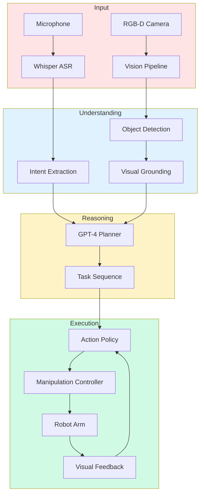

# Capstone Project: Build a VLA Table-Top Assistant Robot

Welcome to your final challenge! Build a complete **Vision-Language-Action robot** that demonstrates everything you've learned. This capstone project integrates voice control, LLM reasoning, computer vision, and action execution into a working robotic system.

## Project Overview

**Goal**: Build a table-top assistant robot that can:
1. **Listen**: Understand voice commands like "Pick up the red cup"
2. **See**: Detect and localize objects using computer vision
3. **Reason**: Plan multi-step tasks using an LLM (GPT-4/Claude)
4. **Act**: Execute manipulation tasks (grasp, place, transport)

**Difficulty**: Advanced (requires all Module 4 skills)

**Time Estimate**: 2-4 weeks (depending on hardware availability)

**Hardware Options**:
- **Real Robot**: 6-DOF robot arm + gripper + camera
- **Simulation**: Gazebo or Isaac Sim (recommended for learning)

---

## System Architecture



---

## Phase 1: Setup and Infrastructure (Week 1)

### Hardware Setup

**Option A: Simulation (Recommended for Learning)**

```bash
# Install Gazebo Classic
sudo apt-get install ros-humble-gazebo-ros-pkgs

# Or Install Isaac Sim (for NVIDIA GPU users)
# Follow: https://docs.omniverse.nvidia.com/isaacsim/latest/installation.html

# Create workspace
mkdir -p ~/vla_capstone_ws/src
cd ~/vla_capstone_ws
```

**Option B: Real Hardware**

Required:
- 6-DOF robot arm (UR5, Franka Emika, or similar)
- 2-finger parallel gripper
- Intel RealSense D435 or similar RGB-D camera
- Microphone (USB or array)
- Workstation with GPU (GTX 1080+ or better)

### Software Dependencies

```bash
# Install ROS 2 Humble
sudo apt install ros-humble-desktop-full

# Install Python dependencies
pip3 install \
    openai \
    anthropic \
    whisper \
    transformers \
    torch \
    ultralytics \
    opencv-python \
    pyrealsense2 \
    sounddevice \
    numpy \
    scipy

# Install MoveIt 2 (for motion planning)
sudo apt install ros-humble-moveit

# Clone project template
cd ~/vla_capstone_ws/src
git clone https://github.com/your-repo/vla_capstone.git
```

### Project Structure

```
vla_capstone_ws/
├── src/
│   ├── vla_capstone/
│   │   ├── launch/
│   │   │   └── capstone_system.launch.py
│   │   ├── config/
│   │   │   ├── robot.yaml
│   │   │   └── camera.yaml
│   │   ├── vla_capstone/
│   │   │   ├── voice_module.py
│   │   │   ├── vision_module.py
│   │   │   ├── llm_module.py
│   │   │   ├── action_module.py
│   │   │   └── orchestrator.py
│   │   └── test/
│   └── vla_interfaces/
│       └── msg/
│           ├── VoiceCommand.msg
│           ├── VisionResult.msg
│           ├── TaskPlan.msg
│           └── ActionCommand.msg
└── install/
```

---

## Phase 2: Voice Control Module (Days 1-3)

### Implement Voice Recognition

Create `vla_capstone/voice_module.py`:

```python
#!/usr/bin/env python3
import rclpy
from rclpy.node import Node
import sounddevice as sd
import numpy as np
import whisper
from vla_interfaces.msg import VoiceCommand
import threading
import queue

class VoiceModule(Node):
    """Voice recognition using Whisper"""

    def __init__(self):
        super().__init__('voice_module')

        # Load Whisper model
        self.get_logger().info("Loading Whisper model...")
        self.model = whisper.load_model("base")  # or "small" for better accuracy

        # Publisher
        self.command_pub = self.create_publisher(
            VoiceCommand,
            '/vla/voice/command',
            10
        )

        # Audio parameters
        self.sample_rate = 16000
        self.audio_queue = queue.Queue()

        # Wake word detection (simple version)
        self.wake_words = ["robot", "hey robot", "assistant"]
        self.listening = False

        # Start audio capture thread
        self.audio_thread = threading.Thread(target=self.capture_audio, daemon=True)
        self.audio_thread.start()

        self.get_logger().info("Voice module ready. Say 'Hey robot' to activate.")

    def capture_audio(self):
        """Capture audio from microphone"""
        with sd.InputStream(samplerate=self.sample_rate, channels=1, callback=self.audio_callback):
            while rclpy.ok():
                # Process audio chunks
                if self.audio_queue.qsize() > 5:  # ~5 seconds of audio
                    self.process_audio()

    def audio_callback(self, indata, frames, time, status):
        """Audio input callback"""
        self.audio_queue.put(indata.copy())

    def process_audio(self):
        """Process audio buffer with Whisper"""
        # Collect audio chunks
        audio_data = []
        while not self.audio_queue.empty():
            audio_data.append(self.audio_queue.get())

        if not audio_data:
            return

        # Convert to numpy array
        audio = np.concatenate(audio_data, axis=0).squeeze()

        # Transcribe with Whisper
        result = self.model.transcribe(audio, language="en", fp16=False)
        text = result["text"].strip().lower()

        if not text:
            return

        # Check for wake word
        if not self.listening:
            for wake_word in self.wake_words:
                if wake_word in text:
                    self.listening = True
                    self.get_logger().info("Activated! Listening for command...")
                    return

        # Process command if listening
        if self.listening:
            # Remove wake word if present
            for wake_word in self.wake_words:
                text = text.replace(wake_word, "").strip()

            if text:
                self.publish_command(text, result.get("confidence", 0.9))
                self.listening = False
                self.get_logger().info(f"Command: {text}")

    def publish_command(self, text, confidence):
        """Publish voice command"""
        msg = VoiceCommand()
        msg.text = text
        msg.confidence = confidence
        msg.language = "en-US"
        msg.timestamp = self.get_clock().now().to_msg()

        self.command_pub.publish(msg)


def main():
    rclpy.init()
    node = VoiceModule()
    rclpy.spin(node)
    node.destroy_node()
    rclpy.shutdown()


if __name__ == '__main__':
    main()
```

### Test Voice Module

```bash
# Terminal 1: Run voice module
ros2 run vla_capstone voice_module

# Terminal 2: Monitor commands
ros2 topic echo /vla/voice/command
```

Try saying: "Hey robot, pick up the red cup"

---

## Phase 3: Vision Module (Days 4-7)

### Implement Object Detection and Grounding

Create `vla_capstone/vision_module.py`:

```python
#!/usr/bin/env python3
import rclpy
from rclpy.node import Node
from sensor_msgs.msg import Image
from vla_interfaces.msg import VisionResult, DetectedObject
from cv_bridge import CvBridge
import cv2
import numpy as np
import torch
from ultralytics import YOLO
from transformers import CLIPProcessor, CLIPModel

class VisionModule(Node):
    """Object detection and visual grounding"""

    def __init__(self):
        super().__init__('vision_module')

        # CV Bridge
        self.bridge = CvBridge()

        # Load YOLO for object detection
        self.get_logger().info("Loading YOLO model...")
        self.yolo = YOLO('yolov8n.pt')  # or yolov8m.pt for better accuracy

        # Load CLIP for visual grounding
        self.get_logger().info("Loading CLIP model...")
        self.device = "cuda" if torch.cuda.is_available() else "cpu"
        self.clip_model = CLIPModel.from_pretrained("openai/clip-vit-base-patch32").to(self.device)
        self.clip_processor = CLIPProcessor.from_pretrained("openai/clip-vit-base-patch32")

        # Subscribers
        self.image_sub = self.create_subscription(
            Image,
            '/camera/color/image_raw',
            self.image_callback,
            10
        )

        # Publishers
        self.vision_pub = self.create_publisher(
            VisionResult,
            '/vla/vision/result',
            10
        )

        # Processing rate
        self.create_timer(0.1, self.process_vision)  # 10 Hz

        self.latest_image = None
        self.get_logger().info("Vision module ready")

    def image_callback(self, msg):
        """Store latest image"""
        self.latest_image = self.bridge.imgmsg_to_cv2(msg, desired_encoding='bgr8')

    def process_vision(self):
        """Process vision periodically"""
        if self.latest_image is None:
            return

        # Run YOLO detection
        results = self.yolo(self.latest_image)[0]

        # Extract detections
        detected_objects = []
        for box in results.boxes:
            obj = DetectedObject()
            obj.label = results.names[int(box.cls)]
            obj.confidence = float(box.conf)

            # Bounding box
            x1, y1, x2, y2 = box.xyxy[0].cpu().numpy()
            obj.bbox = [int(x1), int(y1), int(x2 - x1), int(y2 - y1)]

            # Extract color (simple heuristic)
            roi = self.latest_image[int(y1):int(y2), int(x1):int(x2)]
            obj.color = self.detect_color(roi)

            detected_objects.append(obj)

        # Publish results
        vision_msg = VisionResult()
        vision_msg.objects = detected_objects
        vision_msg.scene_description = f"Detected {len(detected_objects)} objects"
        vision_msg.timestamp = self.get_clock().now().to_msg()
        self.vision_pub.publish(vision_msg)

    def detect_color(self, roi):
        """Simple color detection"""
        if roi.size == 0:
            return "unknown"

        # Convert to HSV
        hsv = cv2.cvtColor(roi, cv2.COLOR_BGR2HSV)
        mean_hue = np.mean(hsv[:, :, 0])

        # Simple color classification
        if mean_hue < 15 or mean_hue > 165:
            return "red"
        elif 15 <= mean_hue < 45:
            return "yellow"
        elif 45 <= mean_hue < 75:
            return "green"
        elif 75 <= mean_hue < 135:
            return "blue"
        else:
            return "other"

    def ground_query(self, text_query, candidates):
        """Ground text query to visual objects using CLIP"""
        if not candidates:
            return None

        # Prepare CLIP inputs
        images = []
        for obj in candidates:
            x, y, w, h = obj.bbox
            roi = self.latest_image[y:y+h, x:x+w]
            images.append(roi)

        inputs = self.clip_processor(
            text=[text_query],
            images=images,
            return_tensors="pt",
            padding=True
        ).to(self.device)

        # Compute similarities
        with torch.no_grad():
            outputs = self.clip_model(**inputs)
            logits_per_text = outputs.logits_per_text
            probs = logits_per_text.softmax(dim=1).cpu().numpy()[0]

        # Return best match
        best_idx = np.argmax(probs)
        return candidates[best_idx] if probs[best_idx] > 0.3 else None


def main():
    rclpy.init()
    node = VisionModule()
    rclpy.spin(node)
    node.destroy_node()
    rclpy.shutdown()


if __name__ == '__main__':
    main()
```

### Test Vision Module

```bash
# Terminal 1: Play camera feed (or use real camera)
ros2 run image_publisher image_publisher_node image:=/path/to/test_image.jpg

# Terminal 2: Run vision module
ros2 run vla_capstone vision_module

# Terminal 3: Monitor vision results
ros2 topic echo /vla/vision/result
```

---

## Phase 4: LLM Planning Module (Days 8-10)

### Implement Task Planning

Create `vla_capstone/llm_module.py`:

```python
#!/usr/bin/env python3
import rclpy
from rclpy.node import Node
from vla_interfaces.msg import VoiceCommand, VisionResult, TaskPlan
import openai
import os
import json

class LLMModule(Node):
    """LLM-based task planning"""

    def __init__(self):
        super().__init__('llm_module')

        # OpenAI API
        openai.api_key = os.getenv("OPENAI_API_KEY")

        # Subscribers
        self.voice_sub = self.create_subscription(
            VoiceCommand,
            '/vla/voice/command',
            self.voice_callback,
            10
        )

        self.vision_sub = self.create_subscription(
            VisionResult,
            '/vla/vision/result',
            self.vision_callback,
            10
        )

        # Publisher
        self.plan_pub = self.create_publisher(
            TaskPlan,
            '/vla/task/plan',
            10
        )

        self.latest_vision = None
        self.get_logger().info("LLM module ready")

    def vision_callback(self, msg):
        """Store latest vision"""
        self.latest_vision = msg

    def voice_callback(self, msg):
        """Plan task based on voice command"""
        command = msg.text
        self.get_logger().info(f"Planning task for: {command}")

        # Generate plan with LLM
        plan = self.generate_plan(command, self.latest_vision)

        if plan:
            # Publish plan
            plan_msg = TaskPlan()
            plan_msg.command = command
            plan_msg.tasks = json.dumps(plan)
            plan_msg.timestamp = self.get_clock().now().to_msg()
            self.plan_pub.publish(plan_msg)

            self.get_logger().info(f"Generated plan: {len(plan)} steps")

    def generate_plan(self, command, vision):
        """Generate task plan using GPT-4"""
        # Format visual context
        vision_context = "No visual data"
        if vision:
            objects = [f"{obj.label} ({obj.color})" for obj in vision.objects]
            vision_context = f"Visible objects: {', '.join(objects)}"

        # Create prompt
        prompt = f"""
You are a robot task planner. Given a command and visual context, generate a detailed, executable task plan.

Command: "{command}"
Visual Context: {vision_context}

Robot Capabilities:
- navigate(x, y, z): Move robot arm to position
- identify_object(description): Find object matching description
- grasp(object_id): Pick up object
- place(x, y, z): Put down held object
- wait(seconds): Pause
- speak(message): Say something to user

Generate a JSON array of tasks. Each task must have:
- type: action name
- params: dictionary of parameters
- description: human-readable description

IMPORTANT:
- Ensure tasks are physically feasible
- Include visual verification steps
- Handle errors gracefully
- Keep plans concise (3-7 steps)

Respond with ONLY valid JSON, no explanation.
"""

        try:
            response = openai.chat.completions.create(
                model="gpt-4",
                messages=[
                    {"role": "system", "content": "You are an expert robot task planner. Output only valid JSON."},
                    {"role": "user", "content": prompt}
                ],
                temperature=0.7,
                max_tokens=500
            )

            plan_json = response.choices[0].message.content
            plan = json.loads(plan_json)

            return plan if isinstance(plan, list) else []

        except Exception as e:
            self.get_logger().error(f"LLM planning failed: {e}")
            return []


def main():
    rclpy.init()
    node = LLMModule()
    rclpy.spin(node)
    node.destroy_node()
    rclpy.shutdown()


if __name__ == '__main__':
    main()
```

### Test LLM Module

```bash
# Set API key
export OPENAI_API_KEY="your-key-here"

# Terminal 1: Run LLM module
ros2 run vla_capstone llm_module

# Terminal 2: Send test command
ros2 topic pub /vla/voice/command vla_interfaces/msg/VoiceCommand "{text: 'pick up the red cup', confidence: 0.95}"

# Terminal 3: Monitor plan
ros2 topic echo /vla/task/plan
```

---

## Phase 5: Action Execution Module (Days 11-14)

### Implement Action Controller

Create `vla_capstone/action_module.py`:

```python
#!/usr/bin/env python3
import rclpy
from rclpy.node import Node
from vla_interfaces.msg import TaskPlan, VisionResult
from geometry_msgs.msg import Pose
import json
import time

class ActionModule(Node):
    """Execute planned tasks on robot"""

    def __init__(self):
        super().__init__('action_module')

        # Subscribers
        self.plan_sub = self.create_subscription(
            TaskPlan,
            '/vla/task/plan',
            self.plan_callback,
            10
        )

        self.vision_sub = self.create_subscription(
            VisionResult,
            '/vla/vision/result',
            self.vision_callback,
            10
        )

        # Robot state
        self.latest_vision = None
        self.executing = False

        self.get_logger().info("Action module ready")

    def vision_callback(self, msg):
        """Store latest vision for closed-loop control"""
        self.latest_vision = msg

    def plan_callback(self, msg):
        """Execute task plan"""
        if self.executing:
            self.get_logger().warn("Already executing a plan")
            return

        plan = json.loads(msg.tasks)
        self.get_logger().info(f"Executing plan with {len(plan)} steps")

        self.executing = True
        success = self.execute_plan(plan)
        self.executing = False

        if success:
            self.get_logger().info("Plan executed successfully!")
        else:
            self.get_logger().error("Plan execution failed")

    def execute_plan(self, plan):
        """Execute each task in the plan"""
        for i, task in enumerate(plan):
            task_type = task.get('type')
            params = task.get('params', {})
            description = task.get('description', '')

            self.get_logger().info(f"Step {i+1}/{len(plan)}: {description}")

            # Execute task based on type
            if task_type == 'navigate':
                success = self.navigate(params)
            elif task_type == 'identify_object':
                success = self.identify_object(params)
            elif task_type == 'grasp':
                success = self.grasp(params)
            elif task_type == 'place':
                success = self.place(params)
            elif task_type == 'wait':
                success = self.wait(params)
            elif task_type == 'speak':
                success = self.speak(params)
            else:
                self.get_logger().warn(f"Unknown task type: {task_type}")
                success = False

            if not success:
                self.get_logger().error(f"Task {i+1} failed: {description}")
                return False

        return True

    def navigate(self, params):
        """Move robot arm to position"""
        x = params.get('x', 0)
        y = params.get('y', 0)
        z = params.get('z', 0)

        self.get_logger().info(f"Navigating to ({x}, {y}, {z})")

        # TODO: Implement with MoveIt or robot SDK
        # For now, simulate
        time.sleep(1.0)
        return True

    def identify_object(self, params):
        """Find object in scene"""
        description = params.get('description', '')
        self.get_logger().info(f"Identifying: {description}")

        if not self.latest_vision:
            return False

        # Find matching object
        for obj in self.latest_vision.objects:
            if description.lower() in obj.label.lower() or description.lower() in obj.color.lower():
                self.get_logger().info(f"Found {obj.label} ({obj.color})")
                return True

        return False

    def grasp(self, params):
        """Grasp object"""
        object_id = params.get('object_id', '')
        self.get_logger().info(f"Grasping object: {object_id}")

        # TODO: Implement grasp planning and execution
        time.sleep(1.5)
        return True

    def place(self, params):
        """Place held object"""
        x = params.get('x', 0)
        y = params.get('y', 0)
        z = params.get('z', 0)

        self.get_logger().info(f"Placing object at ({x}, {y}, {z})")

        # TODO: Implement place action
        time.sleep(1.0)
        return True

    def wait(self, params):
        """Wait for specified duration"""
        duration = params.get('seconds', 1.0)
        self.get_logger().info(f"Waiting {duration}s")
        time.sleep(duration)
        return True

    def speak(self, params):
        """Speak message (text-to-speech)"""
        message = params.get('message', '')
        self.get_logger().info(f"Speaking: {message}")

        # TODO: Implement TTS
        return True


def main():
    rclpy.init()
    node = ActionModule()
    rclpy.spin(node)
    node.destroy_node()
    rclpy.shutdown()


if __name__ == '__main__':
    main()
```

---

## Phase 6: System Integration (Days 15-20)

### Launch File

Create `launch/capstone_system.launch.py`:

```python
from launch import LaunchDescription
from launch_ros.actions import Node

def generate_launch_description():
    return LaunchDescription([
        # Voice module
        Node(
            package='vla_capstone',
            executable='voice_module',
            name='voice_module',
            output='screen'
        ),

        # Vision module
        Node(
            package='vla_capstone',
            executable='vision_module',
            name='vision_module',
            output='screen'
        ),

        # LLM module
        Node(
            package='vla_capstone',
            executable='llm_module',
            name='llm_module',
            output='screen'
        ),

        # Action module
        Node(
            package='vla_capstone',
            executable='action_module',
            name='action_module',
            output='screen'
        ),
    ])
```

### Build and Launch

```bash
# Build workspace
cd ~/vla_capstone_ws
colcon build

# Source workspace
source install/setup.bash

# Launch complete system
ros2 launch vla_capstone capstone_system.launch.py
```

---

## Testing and Evaluation

### Test Scenarios

1. **Simple Pick and Place**:
   - Command: "Pick up the red cube"
   - Expected: Robot identifies red cube, grasps it, lifts it

2. **Complex Multi-Step Task**:
   - Command: "Move the blue box to the left side of the table"
   - Expected: Navigate → Identify → Grasp → Transport → Place

3. **Error Handling**:
   - Command: "Pick up the green ball" (when no green objects present)
   - Expected: Robot identifies missing object, provides feedback

4. **Natural Language Variations**:
   - "Grab that red thing"
   - "Can you get me the cup?"
   - "Put it over there"

### Evaluation Metrics

- **Command Understanding**: Accuracy of speech recognition (>90%)
- **Object Detection**: mAP@0.5 (>80%)
- **Task Success Rate**: Completed tasks / Total tasks (>70%)
- **End-to-End Latency**: Command to action start (&lt;10 seconds)
- **Error Recovery**: Graceful handling of failures

---

## Challenges and Extensions

### Extension Ideas

1. **Advanced Visual Grounding**: Implement relative spatial reasoning ("the cup to the left of the plate")
2. **Multi-Object Manipulation**: Handle tasks involving multiple objects
3. **Long-Horizon Planning**: Tasks requiring 10+ steps
4. **Human-in-the-Loop**: Ask clarification questions when uncertain
5. **Learning from Feedback**: Improve from user corrections

---

## Submission Requirements

1. **Demo Video** (3-5 minutes):
   - Show end-to-end system working
   - Demonstrate at least 3 different commands
   - Show error handling

2. **Code Repository**:
   - Well-documented code
   - README with setup instructions
   - Example commands and expected behaviors

3. **Technical Report** (5-10 pages):
   - System architecture
   - Design decisions and trade-offs
   - Challenges encountered and solutions
   - Performance metrics and evaluation
   - Future improvements

4. **Live Demo** (if possible):
   - Interactive demonstration
   - Q&A session

---

## Congratulations!

You've built a complete Vision-Language-Action robot from scratch! This capstone project demonstrates mastery of:
- Multimodal AI integration (vision + language)
- LLM-based reasoning and planning
- Robot control and manipulation
- System engineering and integration

**You're now ready to build the next generation of intelligent robots!**

---

**Next Steps**: Share your project, contribute to open-source, or continue to advanced humanoid robotics topics!
