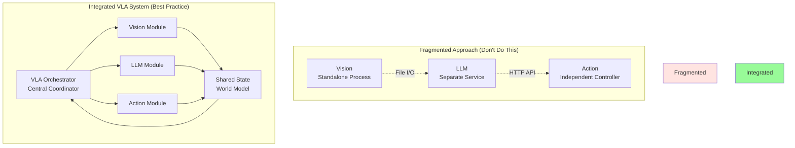

# VLA System Integration - Building a Unified Robotic Intelligence

After building individual VLA components—voice control, LLM reasoning, vision processing, and action execution—the critical challenge is **integrating them into a cohesive, reliable, production-ready system**. This chapter teaches you how to orchestrate these components with proper communication, error handling, and performance optimization.

## The Integration Challenge

Building separate components is straightforward. Making them work together seamlessly is the real engineering challenge.

**Why Integration is Hard:**
- **Timing synchronization**: Vision updates at 30 FPS, LLMs respond in seconds
- **Error propagation**: A vision failure shouldn't crash the entire system
- **Resource management**: GPU, CPU, memory contention between components
- **State consistency**: Ensuring all components share a coherent world view
- **Latency constraints**: Real-time action execution despite slow LLM inference

### Traditional vs. Integrated VLA



## VLA Integration Architecture

### 1. Middleware Selection: ROS 2 as the Integration Backbone

**ROS 2 DDS** provides the ideal foundation for VLA integration:

```python
# vla_integration/vla_orchestrator.py
import rclpy
from rclpy.node import Node
from rclpy.qos import QoSProfile, QoSReliabilityPolicy, QoSDurabilityPolicy

from std_msgs.msg import String
from sensor_msgs.msg import Image, PointCloud2
from geometry_msgs.msg import Twist
from vla_interfaces.msg import (
    VoiceCommand,
    LLMResponse,
    VisionResult,
    ActionCommand,
    VLAState
)

class VLAOrchestrator(Node):
    """
    Central orchestrator for Vision-Language-Action system.
    Coordinates all VLA components with proper error handling and state management.
    """

    def __init__(self):
        super().__init__('vla_orchestrator')

        # QoS profiles for different data types
        self.sensor_qos = QoSProfile(
            reliability=QoSReliabilityPolicy.BEST_EFFORT,
            durability=QoSDurabilityPolicy.VOLATILE,
            depth=10
        )

        self.command_qos = QoSProfile(
            reliability=QoSReliabilityPolicy.RELIABLE,
            durability=QoSDurabilityPolicy.TRANSIENT_LOCAL,
            depth=10
        )

        # Subscribers for VLA inputs
        self.voice_sub = self.create_subscription(
            VoiceCommand,
            '/vla/voice/command',
            self.voice_callback,
            self.command_qos
        )

        self.vision_sub = self.create_subscription(
            VisionResult,
            '/vla/vision/result',
            self.vision_callback,
            self.sensor_qos
        )

        self.llm_sub = self.create_subscription(
            LLMResponse,
            '/vla/llm/response',
            self.llm_callback,
            self.command_qos
        )

        self.action_feedback_sub = self.create_subscription(
            String,
            '/vla/action/feedback',
            self.action_feedback_callback,
            self.command_qos
        )

        # Publishers for VLA outputs
        self.llm_request_pub = self.create_publisher(
            String,
            '/vla/llm/request',
            self.command_qos
        )

        self.action_command_pub = self.create_publisher(
            ActionCommand,
            '/vla/action/command',
            self.command_qos
        )

        self.state_pub = self.create_publisher(
            VLAState,
            '/vla/state',
            self.command_qos
        )

        # Internal state
        self.current_state = VLAState()
        self.current_state.status = "IDLE"
        self.latest_vision_result = None
        self.current_command = None
        self.task_plan = []
        self.current_task_idx = 0

        # Timer for state publishing and health monitoring
        self.create_timer(0.1, self.publish_state)  # 10 Hz
        self.create_timer(1.0, self.health_check)   # 1 Hz

        self.get_logger().info("VLA Orchestrator initialized")

    def voice_callback(self, msg: VoiceCommand):
        """Handle incoming voice commands"""
        self.get_logger().info(f"Received voice command: {msg.text}")

        # Update state
        self.current_state.status = "PROCESSING_COMMAND"
        self.current_command = msg.text

        # Prepare LLM request with current vision context
        llm_request = self.prepare_llm_request(msg.text, self.latest_vision_result)

        # Publish to LLM module
        llm_msg = String()
        llm_msg.data = llm_request
        self.llm_request_pub.publish(llm_msg)

        self.get_logger().info("Forwarded to LLM for task planning")

    def vision_callback(self, msg: VisionResult):
        """Handle vision processing results"""
        self.latest_vision_result = msg

        # If we're executing actions, provide visual feedback to action module
        if self.current_state.status == "EXECUTING_ACTION":
            self.update_action_with_vision(msg)

    def llm_callback(self, msg: LLMResponse):
        """Handle LLM task planning responses"""
        self.get_logger().info(f"Received LLM plan: {msg.plan}")

        # Parse task plan
        self.task_plan = self.parse_task_plan(msg.plan)
        self.current_task_idx = 0

        # Start executing first task
        if self.task_plan:
            self.execute_next_task()
        else:
            self.get_logger().warn("Empty task plan received")
            self.current_state.status = "IDLE"

    def action_feedback_callback(self, msg: String):
        """Handle action execution feedback"""
        feedback = msg.data
        self.get_logger().info(f"Action feedback: {feedback}")

        if feedback == "TASK_COMPLETE":
            self.current_task_idx += 1
            if self.current_task_idx < len(self.task_plan):
                self.execute_next_task()
            else:
                self.get_logger().info("All tasks completed successfully")
                self.current_state.status = "IDLE"
                self.task_plan = []
        elif feedback.startswith("ERROR"):
            self.handle_action_error(feedback)

    def execute_next_task(self):
        """Execute the next task in the plan"""
        if self.current_task_idx >= len(self.task_plan):
            return

        task = self.task_plan[self.current_task_idx]
        self.get_logger().info(f"Executing task {self.current_task_idx + 1}/{len(self.task_plan)}: {task}")

        # Create action command
        action_cmd = ActionCommand()
        action_cmd.task_id = f"task_{self.current_task_idx}"
        action_cmd.task_type = task['type']
        action_cmd.parameters = str(task['params'])
        action_cmd.vision_context = str(self.latest_vision_result) if self.latest_vision_result else ""

        # Publish action command
        self.action_command_pub.publish(action_cmd)
        self.current_state.status = "EXECUTING_ACTION"

    def prepare_llm_request(self, command: str, vision_result) -> str:
        """Prepare LLM request with command and visual context"""
        prompt = f"""
Task: {command}

Current Visual Context:
{self.format_vision_context(vision_result) if vision_result else "No vision data available"}

Generate a detailed task plan as a JSON array of tasks.
Each task should have: {{"type": "action_type", "params": {{}}, "description": "..."}}

Available action types:
- navigate: move to location
- grasp: pick up object
- place: put down object
- inspect: examine object/area
- wait: pause for condition

Respond with valid JSON only.
"""
        return prompt

    def format_vision_context(self, vision_result) -> str:
        """Format vision results for LLM consumption"""
        if not vision_result:
            return "No visual data"

        return f"""
Detected objects: {len(vision_result.objects)} objects
- {', '.join([f"{obj.label} ({obj.confidence:.2f})" for obj in vision_result.objects])}

Scene layout: {vision_result.scene_description}
Robot position: {vision_result.robot_pose}
"""

    def parse_task_plan(self, plan_json: str) -> list:
        """Parse LLM response into task list"""
        import json
        try:
            tasks = json.loads(plan_json)
            return tasks if isinstance(tasks, list) else []
        except json.JSONDecodeError:
            self.get_logger().error(f"Failed to parse LLM response: {plan_json}")
            return []

    def update_action_with_vision(self, vision_result):
        """Provide real-time vision feedback to action executor"""
        # This enables closed-loop visual servoing
        pass

    def handle_action_error(self, error_msg: str):
        """Handle errors during action execution"""
        self.get_logger().error(f"Action error: {error_msg}")

        # Simple retry logic (can be more sophisticated)
        if "COLLISION" in error_msg or "UNREACHABLE" in error_msg:
            self.get_logger().info("Requesting LLM to replan...")
            # Request replanning from LLM with error context
            replan_request = f"Previous plan failed: {error_msg}. Command was: {self.current_command}. Please generate alternative plan."
            msg = String()
            msg.data = replan_request
            self.llm_request_pub.publish(msg)
        else:
            # Critical error, abort
            self.current_state.status = "ERROR"
            self.task_plan = []

    def publish_state(self):
        """Publish current VLA system state"""
        self.current_state.timestamp = self.get_clock().now().to_msg()
        self.current_state.current_task = f"{self.current_task_idx}/{len(self.task_plan)}" if self.task_plan else "none"
        self.state_pub.publish(self.current_state)

    def health_check(self):
        """Monitor component health"""
        # Check last message times, detect failures
        # This is a simplified version - production systems need robust health monitoring
        pass


def main(args=None):
    rclpy.init(args=args)
    orchestrator = VLAOrchestrator()

    try:
        rclpy.spin(orchestrator)
    except KeyboardInterrupt:
        pass
    finally:
        orchestrator.destroy_node()
        rclpy.shutdown()


if __name__ == '__main__':
    main()
```

## Message Interface Definitions

### Custom VLA Messages

Create custom ROS 2 interfaces for VLA communication:

```bash
# vla_interfaces/msg/VoiceCommand.msg
string text
float32 confidence
string language
builtin_interfaces/Time timestamp
```

```bash
# vla_interfaces/msg/VisionResult.msg
string scene_description
geometry_msgs/Pose robot_pose
DetectedObject[] objects
builtin_interfaces/Time timestamp

# DetectedObject.msg
string label
float32 confidence
geometry_msgs/Point position
geometry_msgs/Vector3 dimensions
string color
```

```bash
# vla_interfaces/msg/LLMResponse.msg
string request_id
string plan  # JSON-encoded task plan
float32 confidence
string reasoning
builtin_interfaces/Time timestamp
```

```bash
# vla_interfaces/msg/ActionCommand.msg
string task_id
string task_type
string parameters  # JSON-encoded params
string vision_context
int32 priority
builtin_interfaces/Time timestamp
```

```bash
# vla_interfaces/msg/VLAState.msg
string status  # IDLE, PROCESSING_COMMAND, EXECUTING_ACTION, ERROR
string current_task
string error_message
builtin_interfaces/Time timestamp
```

## Advanced Integration Patterns

### 1. Asynchronous LLM Integration with Action Server

```python
# vla_integration/llm_action_server.py
import rclpy
from rclpy.action import ActionServer
from rclpy.node import Node
from vla_interfaces.action import PlanTask
import asyncio
from openai import AsyncOpenAI
import os

class LLMPlanningServer(Node):
    """
    Action server for LLM-based task planning.
    Uses async/await for non-blocking LLM calls.
    """

    def __init__(self):
        super().__init__('llm_planning_server')

        self._action_server = ActionServer(
            self,
            PlanTask,
            'plan_task',
            self.execute_callback
        )

        # Async OpenAI client
        self.llm_client = AsyncOpenAI(api_key=os.getenv("OPENAI_API_KEY"))

        self.get_logger().info("LLM Planning Server ready")

    async def execute_callback(self, goal_handle):
        """Execute task planning via LLM"""
        self.get_logger().info(f"Planning task: {goal_handle.request.command}")

        # Feedback during planning
        feedback_msg = PlanTask.Feedback()
        feedback_msg.status = "Analyzing command..."
        goal_handle.publish_feedback(feedback_msg)

        try:
            # Call LLM asynchronously
            response = await self.llm_client.chat.completions.create(
                model="gpt-4",
                messages=[
                    {"role": "system", "content": "You are a robot task planner. Generate executable task plans in JSON format."},
                    {"role": "user", "content": self.create_prompt(goal_handle.request)}
                ],
                temperature=0.7,
                max_tokens=1000
            )

            plan = response.choices[0].message.content

            # Validate plan
            feedback_msg.status = "Validating plan..."
            goal_handle.publish_feedback(feedback_msg)

            if self.validate_plan(plan):
                goal_handle.succeed()
                result = PlanTask.Result()
                result.plan = plan
                result.success = True
                return result
            else:
                goal_handle.abort()
                result = PlanTask.Result()
                result.success = False
                result.error = "Generated plan failed validation"
                return result

        except Exception as e:
            self.get_logger().error(f"LLM planning failed: {e}")
            goal_handle.abort()
            result = PlanTask.Result()
            result.success = False
            result.error = str(e)
            return result

    def create_prompt(self, request) -> str:
        """Create detailed prompt for LLM"""
        return f"""
Command: {request.command}
Visual Context: {request.vision_context}
Robot Capabilities: {request.capabilities}

Generate a task plan as JSON array: [{{"type": "...", "params": {{...}}, "description": "..."}}]
"""

    def validate_plan(self, plan: str) -> bool:
        """Validate plan feasibility"""
        import json
        try:
            tasks = json.loads(plan)
            # Check if valid JSON array
            if not isinstance(tasks, list):
                return False
            # Check each task has required fields
            for task in tasks:
                if 'type' not in task or 'params' not in task:
                    return False
            return True
        except:
            return False


def main():
    rclpy.init()
    server = LLMPlanningServer()

    # Use async executor for async/await support
    executor = rclpy.executors.MultiThreadedExecutor()
    executor.add_node(server)

    try:
        executor.spin()
    except KeyboardInterrupt:
        pass
    finally:
        server.destroy_node()
        rclpy.shutdown()


if __name__ == '__main__':
    main()
```

### 2. Vision-Language Grounding Bridge

```python
# vla_integration/vision_language_bridge.py
import rclpy
from rclpy.node import Node
from sensor_msgs.msg import Image
from vla_interfaces.msg import VisionResult, GroundingRequest, GroundingResult
from cv_bridge import CvBridge
import torch
from transformers import CLIPProcessor, CLIPModel
import numpy as np

class VisionLanguageBridge(Node):
    """
    Bridges vision and language modalities using CLIP for grounding.
    Enables queries like "the red cup on the table" to be grounded to image regions.
    """

    def __init__(self):
        super().__init__('vision_language_bridge')

        # CLIP model for vision-language grounding
        self.device = "cuda" if torch.cuda.is_available() else "cpu"
        self.model = CLIPModel.from_pretrained("openai/clip-vit-large-patch14").to(self.device)
        self.processor = CLIPProcessor.from_pretrained("openai/clip-vit-large-patch14")

        self.bridge = CvBridge()
        self.latest_image = None

        # Subscribers
        self.image_sub = self.create_subscription(
            Image,
            '/camera/color/image_raw',
            self.image_callback,
            10
        )

        self.grounding_sub = self.create_subscription(
            GroundingRequest,
            '/vla/grounding/request',
            self.grounding_callback,
            10
        )

        # Publisher
        self.grounding_pub = self.create_publisher(
            GroundingResult,
            '/vla/grounding/result',
            10
        )

        self.get_logger().info("Vision-Language Bridge initialized with CLIP")

    def image_callback(self, msg: Image):
        """Store latest image for grounding"""
        self.latest_image = self.bridge.imgmsg_to_cv2(msg, desired_encoding='rgb8')

    def grounding_callback(self, msg: GroundingRequest):
        """Ground language query to visual elements"""
        if self.latest_image is None:
            self.get_logger().warn("No image available for grounding")
            return

        query = msg.query  # e.g., "red cup", "person waving", "blue box"

        # Use CLIP to find matching regions
        results = self.ground_query_to_image(query, self.latest_image, msg.candidates)

        # Publish results
        result_msg = GroundingResult()
        result_msg.query = query
        result_msg.matches = results
        result_msg.timestamp = self.get_clock().now().to_msg()
        self.grounding_pub.publish(result_msg)

    def ground_query_to_image(self, query: str, image: np.ndarray, candidates: list) -> list:
        """
        Ground text query to image regions using CLIP similarity.

        Args:
            query: Natural language description
            image: RGB image (H, W, 3)
            candidates: List of candidate object detections

        Returns:
            Ranked list of matching candidates
        """
        # Prepare inputs for CLIP
        inputs = self.processor(
            text=[query],
            images=[image],
            return_tensors="pt",
            padding=True
        ).to(self.device)

        # Get CLIP embeddings
        with torch.no_grad():
            outputs = self.model(**inputs)
            text_embeds = outputs.text_embeds
            image_embeds = outputs.image_embeds

            # Normalize embeddings
            text_embeds = text_embeds / text_embeds.norm(dim=-1, keepdim=True)
            image_embeds = image_embeds / image_embeds.norm(dim=-1, keepdim=True)

            # Compute similarity
            similarity = (text_embeds @ image_embeds.T).squeeze(0)

        # For each candidate detection, compute region similarity
        matches = []
        for candidate in candidates:
            # Extract region
            x, y, w, h = candidate.bbox
            region = image[y:y+h, x:x+w]

            # Compute CLIP similarity for this region
            region_inputs = self.processor(
                text=[query],
                images=[region],
                return_tensors="pt",
                padding=True
            ).to(self.device)

            with torch.no_grad():
                region_outputs = self.model(**region_inputs)
                region_similarity = (text_embeds @ region_outputs.image_embeds.T).item()

            matches.append({
                'object_id': candidate.object_id,
                'label': candidate.label,
                'bbox': [x, y, w, h],
                'similarity': region_similarity,
                'description': f"{candidate.label} at ({x}, {y})"
            })

        # Sort by similarity
        matches.sort(key=lambda x: x['similarity'], reverse=True)

        return matches


def main():
    rclpy.init()
    bridge = VisionLanguageBridge()
    rclpy.spin(bridge)
    bridge.destroy_node()
    rclpy.shutdown()


if __name__ == '__main__':
    main()
```

### 3. Error Recovery and State Management

```python
# vla_integration/error_recovery.py
import rclpy
from rclpy.node import Node
from std_msgs.msg import String
from enum import Enum
from vla_interfaces.msg import VLAState, ErrorEvent
import time

class RecoveryStrategy(Enum):
    RETRY = "retry"
    REPLAN = "replan"
    ABORT = "abort"
    HUMAN_INTERVENTION = "human"

class ErrorRecoveryManager(Node):
    """
    Manages error recovery strategies for VLA system.
    Implements hierarchical recovery: retry → replan → abort → human
    """

    def __init__(self):
        super().__init__('error_recovery_manager')

        # Error tracking
        self.error_history = []
        self.retry_counts = {}
        self.max_retries = 3

        # Subscribers
        self.error_sub = self.create_subscription(
            ErrorEvent,
            '/vla/error',
            self.error_callback,
            10
        )

        # Publishers
        self.recovery_pub = self.create_publisher(
            String,
            '/vla/recovery/command',
            10
        )

        self.get_logger().info("Error Recovery Manager initialized")

    def error_callback(self, msg: ErrorEvent):
        """Handle system errors with appropriate recovery strategy"""
        error_type = msg.error_type
        component = msg.component
        context = msg.context

        self.get_logger().warn(f"Error in {component}: {error_type}")

        # Log error
        self.error_history.append({
            'type': error_type,
            'component': component,
            'context': context,
            'timestamp': time.time()
        })

        # Determine recovery strategy
        strategy = self.select_recovery_strategy(error_type, component)

        # Execute recovery
        self.execute_recovery(strategy, msg)

    def select_recovery_strategy(self, error_type: str, component: str) -> RecoveryStrategy:
        """
        Select appropriate recovery strategy based on error type and history.
        """
        # Count recent errors
        recent_errors = [e for e in self.error_history if time.time() - e['timestamp'] < 60]

        # Vision errors: retry with different parameters
        if component == "vision" and error_type in ["NO_OBJECTS_DETECTED", "LOW_CONFIDENCE"]:
            return RecoveryStrategy.RETRY

        # Action errors: replan if possible
        if component == "action" and error_type in ["COLLISION", "UNREACHABLE", "GRASP_FAILED"]:
            retry_key = f"{component}_{error_type}"
            retries = self.retry_counts.get(retry_key, 0)

            if retries < self.max_retries:
                self.retry_counts[retry_key] = retries + 1
                return RecoveryStrategy.REPLAN
            else:
                return RecoveryStrategy.ABORT

        # LLM errors: retry with modified prompt
        if component == "llm" and error_type in ["TIMEOUT", "INVALID_RESPONSE"]:
            return RecoveryStrategy.RETRY

        # Critical errors: human intervention
        if error_type in ["SAFETY_VIOLATION", "HARDWARE_FAILURE"]:
            return RecoveryStrategy.HUMAN_INTERVENTION

        # Default: abort
        return RecoveryStrategy.ABORT

    def execute_recovery(self, strategy: RecoveryStrategy, error_msg: ErrorEvent):
        """Execute selected recovery strategy"""
        self.get_logger().info(f"Executing recovery strategy: {strategy.value}")

        recovery_cmd = String()

        if strategy == RecoveryStrategy.RETRY:
            recovery_cmd.data = f"RETRY:{error_msg.component}:{error_msg.task_id}"
        elif strategy == RecoveryStrategy.REPLAN:
            recovery_cmd.data = f"REPLAN:{error_msg.task_id}:reason={error_msg.error_type}"
        elif strategy == RecoveryStrategy.ABORT:
            recovery_cmd.data = f"ABORT:{error_msg.task_id}"
            self.reset_retry_counts()
        elif strategy == RecoveryStrategy.HUMAN_INTERVENTION:
            recovery_cmd.data = f"HUMAN_REQUIRED:{error_msg.error_type}:{error_msg.context}"
            self.request_human_assistance(error_msg)

        self.recovery_pub.publish(recovery_cmd)

    def reset_retry_counts(self):
        """Reset retry counters after abort"""
        self.retry_counts.clear()

    def request_human_assistance(self, error_msg: ErrorEvent):
        """Notify human operator of critical error"""
        # In production: send notification, email, dashboard alert
        self.get_logger().error(f"HUMAN ASSISTANCE REQUIRED: {error_msg.error_type}")


def main():
    rclpy.init()
    manager = ErrorRecoveryManager()
    rclpy.spin(manager)
    manager.destroy_node()
    rclpy.shutdown()


if __name__ == '__main__':
    main()
```

## Performance Optimization

### 1. Parallel Processing Pipeline

```python
# vla_integration/parallel_pipeline.py
import rclpy
from rclpy.node import Node
from rclpy.executors import MultiThreadedExecutor
from concurrent.futures import ThreadPoolExecutor
import time

class ParallelVLAPipeline(Node):
    """
    Optimized VLA pipeline with parallel processing.
    Vision and LLM reasoning run concurrently.
    """

    def __init__(self):
        super().__init__('parallel_vla_pipeline')

        # Thread pool for parallel execution
        self.executor_pool = ThreadPoolExecutor(max_workers=4)

        # Pipeline stages
        self.vision_queue = []
        self.llm_queue = []
        self.action_queue = []

        # Performance metrics
        self.metrics = {
            'vision_latency': [],
            'llm_latency': [],
            'action_latency': [],
            'total_latency': []
        }

        self.get_logger().info("Parallel VLA Pipeline initialized")

    def process_command_parallel(self, command: str, image):
        """
        Process command with parallel vision and LLM execution.
        """
        start_time = time.time()

        # Submit vision and LLM tasks in parallel
        vision_future = self.executor_pool.submit(self.process_vision, image)
        llm_future = self.executor_pool.submit(self.process_llm_initial, command)

        # Wait for both to complete
        vision_result = vision_future.result()
        llm_initial = llm_future.result()

        # Combine results for final LLM planning
        llm_plan = self.process_llm_with_vision(llm_initial, vision_result)

        # Execute actions
        action_result = self.execute_actions(llm_plan, vision_result)

        total_time = time.time() - start_time
        self.metrics['total_latency'].append(total_time)

        self.get_logger().info(f"Pipeline completed in {total_time:.2f}s")

        return action_result

    def process_vision(self, image):
        """Vision processing (can run in parallel)"""
        start = time.time()
        # Vision processing logic
        time.sleep(0.5)  # Simulate processing
        latency = time.time() - start
        self.metrics['vision_latency'].append(latency)
        return {"objects": [], "scene": "kitchen"}

    def process_llm_initial(self, command):
        """Initial LLM processing (can run in parallel with vision)"""
        start = time.time()
        # LLM intent extraction
        time.sleep(1.0)  # Simulate LLM call
        latency = time.time() - start
        return {"intent": "fetch_object", "object": "cup"}

    def process_llm_with_vision(self, llm_initial, vision_result):
        """Final LLM planning with vision context"""
        start = time.time()
        # Combined LLM planning
        time.sleep(0.8)  # Simulate LLM call
        latency = time.time() - start
        self.metrics['llm_latency'].append(latency)
        return {"plan": ["navigate", "grasp", "return"]}

    def execute_actions(self, plan, vision_result):
        """Execute action plan"""
        start = time.time()
        # Action execution
        time.sleep(2.0)  # Simulate execution
        latency = time.time() - start
        self.metrics['action_latency'].append(latency)
        return {"status": "success"}

    def print_metrics(self):
        """Print performance metrics"""
        if self.metrics['total_latency']:
            avg_total = sum(self.metrics['total_latency']) / len(self.metrics['total_latency'])
            avg_vision = sum(self.metrics['vision_latency']) / len(self.metrics['vision_latency'])
            avg_llm = sum(self.metrics['llm_latency']) / len(self.metrics['llm_latency'])
            avg_action = sum(self.metrics['action_latency']) / len(self.metrics['action_latency'])

            self.get_logger().info(f"""
Performance Metrics:
- Average Total Latency: {avg_total:.2f}s
- Average Vision Latency: {avg_vision:.2f}s
- Average LLM Latency: {avg_llm:.2f}s
- Average Action Latency: {avg_action:.2f}s
""")
```

### 2. Caching and State Optimization

```python
# vla_integration/state_cache.py
from functools import lru_cache
import hashlib
import time

class VLAStateCache:
    """
    Intelligent caching for VLA states to avoid redundant computation.
    """

    def __init__(self, max_size=1000):
        self.vision_cache = {}
        self.llm_cache = {}
        self.max_size = max_size

    def cache_vision_result(self, image_hash: str, result):
        """Cache vision processing result"""
        if len(self.vision_cache) >= self.max_size:
            # Remove oldest entry
            oldest = min(self.vision_cache.items(), key=lambda x: x[1]['timestamp'])
            del self.vision_cache[oldest[0]]

        self.vision_cache[image_hash] = {
            'result': result,
            'timestamp': time.time()
        }

    def get_cached_vision(self, image_hash: str):
        """Retrieve cached vision result if fresh enough"""
        if image_hash in self.vision_cache:
            cached = self.vision_cache[image_hash]
            # Only use cache if less than 5 seconds old
            if time.time() - cached['timestamp'] < 5.0:
                return cached['result']
        return None

    @lru_cache(maxsize=100)
    def cache_llm_response(self, prompt_hash: str, response: str):
        """Cache LLM responses for identical prompts"""
        return response

    def compute_image_hash(self, image) -> str:
        """Compute perceptual hash of image for caching"""
        # Simple hash - in production use perceptual hashing
        return hashlib.md5(image.tobytes()).hexdigest()
```

## Launch Configuration

### Complete VLA System Launch File

```python
# vla_integration/launch/vla_system.launch.py
from launch import LaunchDescription
from launch_ros.actions import Node
from launch.actions import DeclareLaunchArgument
from launch.substitutions import LaunchConfiguration

def generate_launch_description():
    """
    Launch complete VLA system with all components.
    """

    return LaunchDescription([
        # Parameters
        DeclareLaunchArgument(
            'use_sim_time',
            default_value='false',
            description='Use simulation time'
        ),

        DeclareLaunchArgument(
            'log_level',
            default_value='info',
            description='Logging level'
        ),

        # VLA Orchestrator (central coordinator)
        Node(
            package='vla_integration',
            executable='vla_orchestrator',
            name='vla_orchestrator',
            output='screen',
            parameters=[{
                'use_sim_time': LaunchConfiguration('use_sim_time')
            }],
            arguments=['--ros-args', '--log-level', LaunchConfiguration('log_level')]
        ),

        # Voice Control Module
        Node(
            package='vla_voice',
            executable='voice_recognition_node',
            name='voice_recognition',
            output='screen'
        ),

        # Vision Processing Module
        Node(
            package='vla_vision',
            executable='vision_processor_node',
            name='vision_processor',
            output='screen',
            parameters=[{
                'model': 'yolov8',
                'confidence_threshold': 0.5
            }]
        ),

        # Vision-Language Bridge
        Node(
            package='vla_integration',
            executable='vision_language_bridge',
            name='vl_bridge',
            output='screen'
        ),

        # LLM Planning Server
        Node(
            package='vla_integration',
            executable='llm_planning_server',
            name='llm_planner',
            output='screen'
        ),

        # Action Execution Module
        Node(
            package='vla_action',
            executable='action_executor_node',
            name='action_executor',
            output='screen'
        ),

        # Error Recovery Manager
        Node(
            package='vla_integration',
            executable='error_recovery_manager',
            name='error_recovery',
            output='screen'
        ),

        # State Monitor (visualization)
        Node(
            package='vla_integration',
            executable='state_monitor',
            name='state_monitor',
            output='screen'
        ),
    ])
```

Launch the system:
```bash
ros2 launch vla_integration vla_system.launch.py
```

## Testing and Validation

### Integration Test Framework

```python
# tests/test_vla_integration.py
import pytest
import rclpy
from vla_integration.vla_orchestrator import VLAOrchestrator
from vla_interfaces.msg import VoiceCommand, VisionResult, LLMResponse
import time

class TestVLAIntegration:
    """Integration tests for VLA system"""

    @pytest.fixture
    def orchestrator(self):
        rclpy.init()
        node = VLAOrchestrator()
        yield node
        node.destroy_node()
        rclpy.shutdown()

    def test_voice_to_action_pipeline(self, orchestrator):
        """Test complete voice-to-action pipeline"""
        # Simulate voice command
        voice_cmd = VoiceCommand()
        voice_cmd.text = "Bring me the red cup"
        voice_cmd.confidence = 0.95

        # Inject command
        orchestrator.voice_callback(voice_cmd)

        # Wait for processing
        time.sleep(0.5)

        # Verify LLM request was published
        assert orchestrator.current_command == "Bring me the red cup"
        assert orchestrator.current_state.status == "PROCESSING_COMMAND"

    def test_error_recovery(self, orchestrator):
        """Test error recovery mechanism"""
        # Simulate action error
        error_feedback = "ERROR: COLLISION_DETECTED"
        orchestrator.handle_action_error(error_feedback)

        # Verify recovery initiated
        # In real test, would check for replan request

    def test_multimodal_grounding(self):
        """Test vision-language grounding"""
        # Test CLIP-based grounding
        pass
```

## Best Practices for VLA Integration

### 1. Modularity and Interfaces
- ✅ Define clear message interfaces between components
- ✅ Use ROS 2 actions for long-running tasks
- ✅ Use services for request-response patterns
- ✅ Use topics for streaming data

### 2. Error Handling
- ✅ Implement hierarchical error recovery
- ✅ Log all errors with context
- ✅ Provide graceful degradation
- ✅ Monitor component health continuously

### 3. Performance
- ✅ Run vision and LLM in parallel when possible
- ✅ Cache repeated computations
- ✅ Use async/await for I/O-bound operations
- ✅ Profile and optimize bottlenecks

### 4. State Management
- ✅ Maintain centralized state in orchestrator
- ✅ Publish state regularly for monitoring
- ✅ Ensure state consistency across failures
- ✅ Use transactional state updates

### 5. Testing
- ✅ Write integration tests for complete pipelines
- ✅ Mock expensive components (LLM, vision) in tests
- ✅ Test error scenarios and recovery
- ✅ Benchmark performance regularly

## Next Steps

Now that you understand VLA system integration, proceed to:
- **[Tooling](/docs/module-04-vla/tooling)**: Development tools for VLA systems
- **[Summary](/docs/module-04-vla/summary)**: Module recap and key takeaways
- **[Capstone](/docs/module-04-vla/capstone)**: Build your end-to-end VLA robot

---

**Key Takeaway**: Successful VLA integration requires careful orchestration of vision, language, and action components with proper error handling, state management, and performance optimization. ROS 2 provides the ideal middleware for building reliable, production-ready VLA systems.
