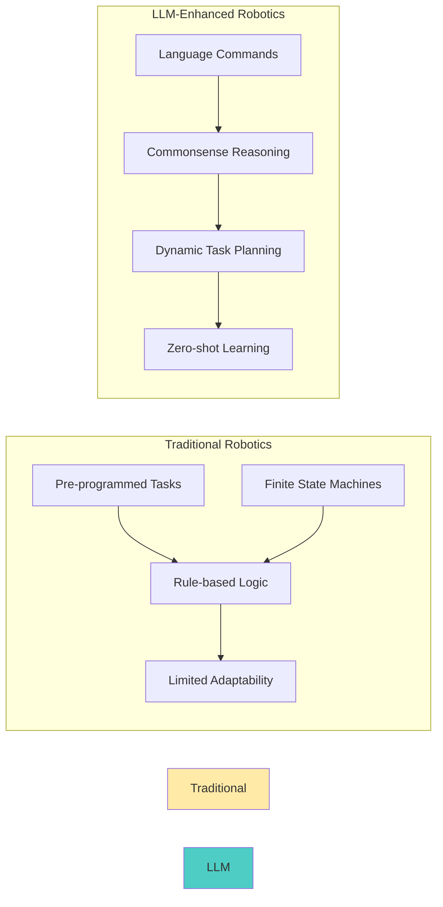

# LLM Integration: Large Language Models for Robot Task Planning

Large Language Models (LLMs) represent a revolutionary leap in enabling humanoid robots to understand complex instructions, reason about tasks, and plan sophisticated multi-step behaviors. This chapter explores how to integrate powerful LLMs like GPT, Claude, and specialized robotics models for advanced task planning and reasoning.

## The Power of LLMs in Robotics

### Why LLMs for Robots?

Traditional robotics approaches rely on pre-programmed behaviors and finite state machines. LLMs bring:

1. **Natural Language Understanding**: Process complex, nuanced instructions
2. **Commonsense Reasoning**: Apply general knowledge to specific tasks
3. **Task Decomposition**: Break complex goals into executable steps
4. **Adaptability**: Handle novel situations without reprogramming
5. **Zero-Shot Learning**: Execute new tasks from instruction alone

### The LLM Robotics Revolution



## LLM Architectures for Robotics

### 1. GPT-Based Models

**OpenAI GPT Models** for robotics:

```python
# GPT-based task planning for robots
import openai
import json
from typing import Dict, List, Optional

class GPTRobotPlanner:
    def __init__(self, api_key: str, model: str = "gpt-4"):
        """
        Initialize GPT-based robot planner

        Args:
            api_key: OpenAI API key
            model: GPT model to use ("gpt-3.5-turbo", "gpt-4", etc.)
        """
        openai.api_key = api_key
        self.model = model
        self.system_prompt = self._create_system_prompt()

    def _create_system_prompt(self) -> str:
        """Create system prompt for robot task planning"""
        return """
        You are an expert robot task planner. Your job is to decompose human instructions into executable robot actions.
        Always respond in JSON format with the following structure:
        {
            "task_breakdown": [
                {
                    "step": 1,
                    "description": "What to do",
                    "action": "action_type",
                    "parameters": {"param1": "value1", "param2": "value2"},
                    "preconditions": ["condition1", "condition2"],
                    "postconditions": ["condition1", "condition2"]
                }
            ],
            "potential_issues": ["issue1", "issue2"],
            "safety_considerations": ["safety1", "safety2"]
        }

        Available actions:
        - navigate_to(location)
        - identify_object(object_description)
        - grasp_object(object_id)
        - place_object(location)
        - open_container(container_id)
        - close_container(container_id)
        - inspect_object(object_id)
        - transport_object(from_location, to_location)
        - wait(duration_seconds)
        - ask_for_help(question)

        Think step by step and provide detailed breakdown.
        """

    def plan_task(self, instruction: str, robot_capabilities: Dict = None) -> Dict:
        """
        Plan a task based on natural language instruction

        Args:
            instruction: Natural language task instruction
            robot_capabilities: Dictionary of robot capabilities

        Returns:
            Dictionary containing task plan and considerations
        """
        messages = [
            {"role": "system", "content": self.system_prompt},
            {"role": "user", "content": f"Robot capabilities: {robot_capabilities}" if robot_capabilities else ""},
            {"role": "user", "content": f"Instruction: {instruction}"}
        ]

        try:
            response = openai.ChatCompletion.create(
                model=self.model,
                messages=messages,
                temperature=0.3,  # Lower temperature for more consistent planning
                max_tokens=2000,
                response_format={"type": "json_object"}
            )

            plan = json.loads(response.choices[0].message.content)
            return plan

        except Exception as e:
            return {
                "error": str(e),
                "task_breakdown": [],
                "potential_issues": ["Failed to generate plan"],
                "safety_considerations": ["Manual intervention required"]
            }

    def refine_plan(self, original_plan: Dict, feedback: str) -> Dict:
        """Refine plan based on feedback"""
        messages = [
            {"role": "system", "content": self.system_prompt},
            {"role": "user", "content": f"Original plan: {json.dumps(original_plan)}"},
            {"role": "user", "content": f"Feedback: {feedback}"}
        ]

        response = openai.ChatCompletion.create(
            model=self.model,
            messages=messages,
            temperature=0.2,
            max_tokens=2000,
            response_format={"type": "json_object"}
        )

        refined_plan = json.loads(response.choices[0].message.content)
        return refined_plan

# Example usage
def example_gpt_planning():
    planner = GPTRobotPlanner(api_key="your-api-key")

    instruction = "Please bring me the red coffee mug from the kitchen counter and place it on my desk"
    capabilities = {
        "navigation": True,
        "grasping": True,
        "object_recognition": True,
        "manipulation": True,
        "max_payload": 1.0  # kg
    }

    plan = planner.plan_task(instruction, capabilities)
    print(json.dumps(plan, indent=2))
```

### 2. Claude-Based Integration

**Anthropic Claude** for safer, more controlled planning:

```python
# Claude-based robot planning with safety emphasis
import anthropic
import json
from typing import Dict, List

class ClaudeRobotPlanner:
    def __init__(self, api_key: str, model: str = "claude-3-opus-20240229"):
        """
        Initialize Claude-based robot planner

        Args:
            api_key: Anthropic API key
            model: Claude model to use
        """
        self.client = anthropic.Anthropic(api_key=api_key)
        self.model = model
        self.system_prompt = self._create_claude_system_prompt()

    def _create_claude_system_prompt(self) -> str:
        """Create Claude-specific system prompt with safety emphasis"""
        return """
        You are a robot task planning assistant. Your role is to decompose human instructions into safe, executable robot actions.

        IMPORTANT SAFETY RULES:
        1. Always consider robot safety and human safety
        2. Identify potential hazards and suggest mitigation
        3. Verify object properties before manipulation
        4. Respect robot capabilities and limitations
        5. Ask for clarification when instructions are ambiguous

        Output format must be JSON with this exact structure:
        {
            "task_analysis": {
                "goal": "what the user wants",
                "key_objects": ["object1", "object2"],
                "key_locations": ["location1", "location2"],
                "constraints": ["constraint1", "constraint2"]
            },
            "step_by_step_plan": [
                {
                    "step_number": 1,
                    "action": "action_type",
                    "description": "what the robot should do",
                    "parameters": {"param1": "value1"},
                    "safety_check": "what to verify",
                    "estimated_time": "time_in_seconds"
                }
            ],
            "safety_considerations": [
                {
                    "hazard": "potential danger",
                    "mitigation": "how to prevent it",
                    "severity": "high/medium/low"
                }
            ],
            "verification_steps": ["step1", "step2"],
            "fallback_procedures": ["procedure1", "procedure2"]
        }

        Available actions:
        - navigate_to(location, speed="normal")
        - detect_objects(category="all", location="current")
        - identify_object(description, location)
        - grasp_object(object_id, grasp_type="precision")
        - place_object(object_id, location, placement_type="stable")
        - open_container(container_id)
        - close_container(container_id)
        - inspect_object(object_id, inspection_type="visual/tactile")
        - transport_object(object_id, destination)
        - wait(duration_seconds)
        - communicate(message, destination="user/display")
        - emergency_stop()

        Always prioritize safety and provide detailed safety considerations.
        """

    def plan_task(self, instruction: str, environment: Dict = None, robot_state: Dict = None) -> Dict:
        """
        Plan task with Claude, emphasizing safety and verification

        Args:
            instruction: Natural language instruction
            environment: Current environment state
            robot_state: Current robot state

        Returns:
            Detailed task plan with safety considerations
        """
        environment_str = json.dumps(environment, indent=2) if environment else "Unknown environment"
        robot_state_str = json.dumps(robot_state, indent=2) if robot_state else "Unknown robot state"

        message = self.client.messages.create(
            model=self.model,
            max_tokens=3000,
            temperature=0.2,
            system=self.system_prompt,
            messages=[
                {
                    "role": "user",
                    "content": f"Environment state:\n{environment_str}\n\nRobot state:\n{robot_state_str}\n\nInstruction: {instruction}"
                }
            ]
        )

        try:
            plan = json.loads(message.content[0].text)
            return plan
        except json.JSONDecodeError:
            return {
                "error": "Failed to parse Claude response as JSON",
                "raw_response": message.content[0].text
            }

    def validate_plan_safety(self, plan: Dict) -> Dict:
        """Additional safety validation for Claude-generated plans"""
        safety_issues = []
        recommendations = []

        for step in plan.get("step_by_step_plan", []):
            action = step.get("action", "")
            params = step.get("parameters", {})

            # Check for potentially unsafe actions
            if action == "grasp_object":
                if params.get("object_id") == "unknown":
                    safety_issues.append(f"Step {step.get('step_number')}: Attempting to grasp unknown object")
                    recommendations.append("Verify object identity before grasping")

            elif action == "navigate_to":
                if params.get("location") == "unknown":
                    safety_issues.append(f"Step {step.get('step_number')}: Navigating to unknown location")
                    recommendations.append("Map and verify location before navigation")

        return {
            "safety_issues": safety_issues,
            "recommendations": recommendations,
            "is_safe": len(safety_issues) == 0
        }
```

### 3. PaLM-E and Robotics-Specific Models

**Google's PaLM-E** for embodied reasoning:

```python
# PaLM-E inspired robot planning
import torch
import torch.nn as nn
from transformers import AutoTokenizer, AutoModelForSeq2SeqLM
from typing import Dict, List, Tuple

class PaLMERobotPlanner:
    def __init__(self, model_name: str = "google/flan-t5-xxl"):
        """
        Initialize PaLM-E style robot planner using FLAN-T5 as base

        Args:
            model_name: Pretrained model name
        """
        self.tokenizer = AutoTokenizer.from_pretrained(model_name)
        self.model = AutoModelForSeq2SeqLM.from_pretrained(
            model_name,
            torch_dtype=torch.float16,
            device_map="auto"  # Automatically use available GPUs
        )
        self.device = next(self.model.parameters()).device

    def plan_with_perception(self, instruction: str, perceptual_data: Dict) -> Dict:
        """
        Plan task incorporating perceptual data (PaLM-E style)

        Args:
            instruction: Natural language instruction
            perceptual_data: Dictionary containing visual, spatial, and sensory data

        Returns:
            Task plan incorporating perceptual information
        """
        # Format instruction with perceptual context
        prompt = self._format_perceptual_prompt(instruction, perceptual_data)

        # Tokenize and generate
        inputs = self.tokenizer.encode(prompt, return_tensors="pt").to(self.device)

        with torch.no_grad():
            outputs = self.model.generate(
                inputs,
                max_length=1024,
                num_return_sequences=1,
                temperature=0.3,
                do_sample=True,
                pad_token_id=self.tokenizer.pad_token_id
            )

        response = self.tokenizer.decode(outputs[0], skip_special_tokens=True)

        # Parse the response
        return self._parse_planning_response(response)

    def _format_perceptual_prompt(self, instruction: str, perceptual_data: Dict) -> str:
        """Format prompt that incorporates perceptual data"""
        visual_context = perceptual_data.get('visual_objects', [])
        spatial_context = perceptual_data.get('spatial_relationships', [])
        affordances = perceptual_data.get('object_affordances', [])

        prompt_parts = [
            "You are a robot task planner that incorporates real-time perception.",
            f"Instruction: {instruction}",
            "",
            "Perceptual Context:"
        ]

        if visual_context:
            prompt_parts.append(f"Visible objects: {', '.join(visual_context)}")

        if spatial_context:
            prompt_parts.append(f"Spatial relationships: {', '.join(spatial_context)}")

        if affordances:
            prompt_parts.append(f"Object affordances: {', '.join(affordances)}")

        prompt_parts.extend([
            "",
            "Provide a detailed step-by-step plan that leverages the perceptual information.",
            "Output in JSON format with: task_steps, object_identifications, spatial_reasoning, safety_considerations"
        ])

        return "\n".join(prompt_parts)

    def _parse_planning_response(self, response: str) -> Dict:
        """Parse the model response into structured format"""
        # In practice, you'd want more robust parsing
        # This is a simplified version
        import re
        import json

        # Look for JSON in the response
        json_match = re.search(r'\{.*\}', response, re.DOTALL)
        if json_match:
            try:
                return json.loads(json_match.group())
            except json.JSONDecodeError:
                pass

        # If no JSON found, create a basic structure
        return {
            "raw_response": response,
            "task_steps": self._extract_task_steps(response),
            "object_identifications": self._extract_objects(response),
            "spatial_reasoning": self._extract_spatial_info(response),
            "safety_considerations": self._extract_safety_info(response)
        }

    def _extract_task_steps(self, text: str) -> List[Dict]:
        """Extract task steps from text"""
        # Simplified extraction - in practice, use more sophisticated NLP
        steps = []
        for i, line in enumerate(text.split('\n')):
            if any(keyword in line.lower() for keyword in ['step', 'navigate', 'grasp', 'place', 'move']):
                steps.append({
                    "step_number": i + 1,
                    "description": line.strip(),
                    "action_type": self._infer_action_type(line)
                })
        return steps

    def _infer_action_type(self, line: str) -> str:
        """Infer action type from text description"""
        line_lower = line.lower()
        if 'navigate' in line_lower or 'go to' in line_lower or 'move to' in line_lower:
            return 'navigation'
        elif 'grasp' in line_lower or 'pick' in line_lower or 'take' in line_lower:
            return 'manipulation'
        elif 'place' in line_lower or 'put' in line_lower:
            return 'placement'
        elif 'detect' in line_lower or 'find' in line_lower:
            return 'perception'
        else:
            return 'general'
```

## Task Planning and Reasoning

### 1. Hierarchical Task Planning

Breaking complex tasks into manageable subtasks:

```python
# Hierarchical task planning system
from dataclasses import dataclass
from enum import Enum
from typing import List, Dict, Any, Optional
import json

class TaskStatus(Enum):
    PENDING = "pending"
    IN_PROGRESS = "in_progress"
    COMPLETED = "completed"
    FAILED = "failed"
    ABORTED = "aborted"

class ActionType(Enum):
    NAVIGATION = "navigation"
    MANIPULATION = "manipulation"
    PERCEPTION = "perception"
    COMMUNICATION = "communication"
    WAIT = "wait"

@dataclass
class TaskStep:
    id: str
    description: str
    action_type: ActionType
    parameters: Dict[str, Any]
    preconditions: List[str]
    postconditions: List[str]
    estimated_duration: float  # seconds
    priority: int = 1  # Higher number = higher priority

@dataclass
class RobotCapability:
    name: str
    available: bool
    performance_metrics: Dict[str, float]

class HierarchicalTaskPlanner:
    def __init__(self):
        self.capabilities = self._initialize_capabilities()
        self.task_library = self._initialize_task_library()

    def _initialize_capabilities(self) -> Dict[str, RobotCapability]:
        """Initialize robot capabilities"""
        return {
            "navigation": RobotCapability(
                name="navigation",
                available=True,
                performance_metrics={"speed": 0.5, "accuracy": 0.99}
            ),
            "manipulation": RobotCapability(
                name="manipulation",
                available=True,
                performance_metrics={"precision": 0.01, "payload": 2.0}
            ),
            "perception": RobotCapability(
                name="perception",
                available=True,
                performance_metrics={"range": 5.0, "resolution": 0.01}
            ),
            "communication": RobotCapability(
                name="communication",
                available=True,
                performance_metrics={"range": 10.0, "bandwidth": 1.0}
            )
        }

    def _initialize_task_library(self) -> Dict[str, List[TaskStep]]:
        """Initialize library of common tasks and their decompositions"""
        return {
            "fetch_object": [
                TaskStep(
                    id="1",
                    description="Navigate to object location",
                    action_type=ActionType.NAVIGATION,
                    parameters={"destination": "object_location"},
                    preconditions=["robot_at_start", "path_clear"],
                    postconditions=["robot_at_object_location"],
                    estimated_duration=30.0
                ),
                TaskStep(
                    id="2",
                    description="Identify and localize target object",
                    action_type=ActionType.PERCEPTION,
                    parameters={"target_object": "object_description"},
                    preconditions=["robot_at_object_location"],
                    postconditions=["object_located", "object_pose_known"],
                    estimated_duration=5.0
                ),
                TaskStep(
                    id="3",
                    description="Grasp the target object",
                    action_type=ActionType.MANIPULATION,
                    parameters={"object_id": "target_object", "grasp_type": "precision"},
                    preconditions=["object_located", "gripper_open"],
                    postconditions=["object_grasped", "gripper_closed"],
                    estimated_duration=10.0
                ),
                TaskStep(
                    id="4",
                    description="Transport object to destination",
                    action_type=ActionType.NAVIGATION,
                    parameters={"destination": "delivery_location", "carrying_object": True},
                    preconditions=["object_grasped"],
                    postconditions=["robot_at_delivery_location", "object_still_grasped"],
                    estimated_duration=45.0
                ),
                TaskStep(
                    id="5",
                    description="Place object at destination",
                    action_type=ActionType.MANIPULATION,
                    parameters={"placement_location": "delivery_location"},
                    preconditions=["robot_at_delivery_location", "object_grasped"],
                    postconditions=["object_placed", "gripper_open"],
                    estimated_duration=8.0
                )
            ],
            "room_cleanup": [
                TaskStep(
                    id="1",
                    description="Survey room to identify objects needing attention",
                    action_type=ActionType.PERCEPTION,
                    parameters={"scan_area": "entire_room", "object_categories": ["trash", "misplaced"]},
                    preconditions=["robot_at_room_entry"],
                    postconditions=["objects_identified", "cleanup_plan_generated"],
                    estimated_duration=60.0
                ),
                TaskStep(
                    id="2",
                    description="Plan optimal cleanup sequence",
                    action_type=ActionType.COMMUNICATION,
                    parameters={"planning_algorithm": "shortest_path", "priority": "fragile_first"},
                    preconditions=["objects_identified"],
                    postconditions=["cleanup_sequence_planned"],
                    estimated_duration=10.0
                )
            ]
        }

    def plan_complex_task(self, high_level_goal: str, context: Dict = None) -> Dict:
        """
        Plan a complex task by decomposing into subtasks

        Args:
            high_level_goal: High-level task description
            context: Environmental and situational context

        Returns:
            Detailed execution plan
        """
        # Use LLM to decompose high-level goal
        decomposition = self._decompose_goal_with_llm(high_level_goal, context)

        # Validate and refine the plan
        validated_plan = self._validate_plan(decomposition)

        # Optimize the plan for efficiency
        optimized_plan = self._optimize_plan(validated_plan)

        return {
            "high_level_goal": high_level_goal,
            "decomposed_tasks": optimized_plan,
            "estimated_total_time": sum(step.estimated_duration for step in optimized_plan),
            "required_capabilities": self._analyze_capability_requirements(optimized_plan),
            "risk_assessment": self._assess_risks(optimized_plan)
        }

    def _decompose_goal_with_llm(self, goal: str, context: Dict) -> List[TaskStep]:
        """Use LLM to decompose goal into steps"""
        # This would call the LLM planner (GPT/Claude/PaLM-E)
        # For now, use task library lookup
        if goal.lower().startswith("fetch") or "bring me" in goal.lower():
            return self.task_library["fetch_object"].copy()
        elif "clean" in goal.lower() or "tidy" in goal.lower():
            return self.task_library["room_cleanup"].copy()
        else:
            # Default: return a generic sequence
            return [
                TaskStep(
                    id="1",
                    description="Analyze task requirements",
                    action_type=ActionType.PERCEPTION,
                    parameters={"analysis_type": "task_decomposition"},
                    preconditions=["task_received"],
                    postconditions=["task_analyzed"],
                    estimated_duration=5.0
                )
            ]

    def _validate_plan(self, plan: List[TaskStep]) -> List[TaskStep]:
        """Validate plan for consistency and feasibility"""
        validated_plan = []

        for step in plan:
            # Check if robot has required capabilities
            capability_required = self._get_capability_for_action(step.action_type)
            if capability_required and not self.capabilities[capability_required].available:
                # Need to handle capability unavailability
                print(f"Warning: Required capability {capability_required} not available")
                # Add error handling or alternative steps
                continue

            validated_plan.append(step)

        return validated_plan

    def _optimize_plan(self, plan: List[TaskStep]) -> List[TaskStep]:
        """Optimize plan for efficiency and safety"""
        # Simple optimization: sort by priority, group similar actions
        optimized = sorted(plan, key=lambda x: x.priority, reverse=True)

        # More sophisticated optimizations would include:
        # - Action parallelization where possible
        # - Path optimization for navigation steps
        # - Resource allocation optimization

        return optimized

    def _analyze_capability_requirements(self, plan: List[TaskStep]) -> Dict[str, int]:
        """Analyze which capabilities are needed and how often"""
        requirements = {}
        for step in plan:
            capability = self._get_capability_for_action(step.action_type)
            if capability:
                requirements[capability] = requirements.get(capability, 0) + 1

        return requirements

    def _assess_risks(self, plan: List[TaskStep]) -> List[Dict]:
        """Assess potential risks in the plan"""
        risks = []

        for step in plan:
            if step.action_type == ActionType.MANIPULATION:
                risks.append({
                    "step_id": step.id,
                    "risk_type": "manipulation",
                    "description": f"Risk of dropping object during {step.description}",
                    "severity": "medium",
                    "mitigation": "Use secure grasp, move slowly"
                })
            elif step.action_type == ActionType.NAVIGATION:
                risks.append({
                    "step_id": step.id,
                    "risk_type": "navigation",
                    "description": f"Risk of collision during {step.description}",
                    "severity": "high",
                    "mitigation": "Use obstacle detection, safe speed"
                })

        return risks

    def _get_capability_for_action(self, action_type: ActionType) -> Optional[str]:
        """Map action type to required capability"""
        action_to_capability = {
            ActionType.NAVIGATION: "navigation",
            ActionType.MANIPULATION: "manipulation",
            ActionType.PERCEPTION: "perception",
            ActionType.COMMUNICATION: "communication"
        }
        return action_to_capability.get(action_type)
```

### 2. Commonsense Reasoning

Integrating world knowledge and reasoning:

```python
# Commonsense reasoning for robots
import json
from typing import Dict, List, Any

class CommonsenseReasoner:
    def __init__(self):
        self.world_knowledge = self._load_world_knowledge()
        self.physical_constants = self._load_physical_constants()
        self.object_affordances = self._load_affordances()

    def _load_world_knowledge(self) -> Dict:
        """Load commonsense world knowledge"""
        return {
            "locations": {
                "kitchen": {
                    "typical_objects": ["cup", "plate", "food", "utensils"],
                    "activities": ["cooking", "eating", "cleaning"],
                    "social_rules": ["ask_before_using_others'_food"]
                },
                "bedroom": {
                    "typical_objects": ["clothes", "personal_items", "bed"],
                    "activities": ["sleeping", "dressing"],
                    "social_rules": ["knock_before_entering"]
                },
                "office": {
                    "typical_objects": ["documents", "computer", "stationery"],
                    "activities": ["working", "meeting"],
                    "social_rules": ["respect_work_space"]
                }
            },
            "object_properties": {
                "liquid": {
                    "container_requirement": True,
                    "spill_risk": True,
                    "transport_method": "stable_container"
                },
                "fragile": {
                    "careful_handling": True,
                    "drop_damage": True,
                    "transport_method": "secure_grip"
                },
                "heavy": {
                    "two_hand_transport": True,
                    "support_requirement": True,
                    "placement_care": True
                }
            },
            "causal_relationships": {
                "breaking": {
                    "causes": ["dropping_from_height", "applying_excessive_force"],
                    "effects": ["object_damage", "creating_mess"]
                },
                "spilling": {
                    "causes": ["tilting_container", "overfilling"],
                    "effects": ["liquid_spread", "surface_wetness"]
                }
            }
        }

    def _load_physical_constants(self) -> Dict:
        """Load physical constants and constraints"""
        return {
            "gravity": 9.81,
            "friction_coefficients": {
                "wood_wood": 0.4,
                "metal_wood": 0.3,
                "rubber_surface": 0.8
            },
            "material_strengths": {
                "paper": 30,  # MPa
                "cardboard": 200,
                "plastic": 50,
                "metal": 200
            }
        }

    def _load_affordances(self) -> Dict:
        """Load object affordances (what can be done with objects)"""
        return {
            "cup": ["hold", "drink_from", "stack", "wash"],
            "chair": ["sit_on", "move", "straddle"],
            "door": ["open", "close", "knock_on", "push"],
            "book": ["read", "open", "stack", "carry"],
            "knife": ["cut_with", "spread_with", "lift_carefully"],
            "sponge": ["clean_with", "absorb_liquid", "squeeze"]
        }

    def reason_about_task(self, task_description: str, current_state: Dict) -> Dict:
        """
        Apply commonsense reasoning to understand task implications

        Args:
            task_description: Natural language task description
            current_state: Current environmental and robot state

        Returns:
            Reasoning results with implications and constraints
        """
        # Parse the task
        task_analysis = self._analyze_task(task_description)

        # Apply world knowledge
        world_implications = self._apply_world_knowledge(task_analysis, current_state)

        # Consider physical constraints
        physical_constraints = self._apply_physical_constraints(task_analysis)

        # Assess affordances
        affordance_analysis = self._analyze_affordances(task_analysis)

        return {
            "task_analysis": task_analysis,
            "world_knowledge_implications": world_implications,
            "physical_constraints": physical_constraints,
            "affordance_analysis": affordance_analysis,
            "safety_considerations": self._derive_safety_considerations(
                task_analysis, world_implications, physical_constraints
            ),
            "recommended_approach": self._recommend_approach(
                task_analysis, world_implications, physical_constraints, affordance_analysis
            )
        }

    def _analyze_task(self, task_description: str) -> Dict:
        """Analyze task to identify key components"""
        analysis = {
            "action": self._extract_action(task_description),
            "objects": self._extract_objects(task_description),
            "locations": self._extract_locations(task_description),
            "constraints": self._extract_constraints(task_description)
        }

        return analysis

    def _extract_action(self, description: str) -> str:
        """Extract main action from description"""
        # Simplified extraction - in practice, use NLP
        import re
        action_patterns = [
            r'(fetch|bring|get|carry|transport)',
            r'(clean|tidy|organize|arrange)',
            r'(open|close|turn_on|turn_off)',
            r'(move|relocate|shift)'
        ]

        for pattern in action_patterns:
            match = re.search(pattern, description.lower())
            if match:
                return match.group(1)

        return "unknown"

    def _extract_objects(self, description: str) -> List[str]:
        """Extract objects mentioned in description"""
        # Simplified extraction
        import re
        object_patterns = [
            r'the (\w+) (?:cup|mug|bottle|glass|plate|dish)',
            r'(\w+) (?:cup|mug|bottle|glass|plate|dish)',
            r'(?:a|an) (\w+) (?:book|pen|phone|tablet)'
        ]

        objects = []
        for pattern in object_patterns:
            matches = re.findall(pattern, description.lower())
            objects.extend(matches)

        return objects

    def _apply_world_knowledge(self, task_analysis: Dict, current_state: Dict) -> Dict:
        """Apply world knowledge to understand task implications"""
        implications = {
            "location_context": {},
            "social_considerations": [],
            "activity_correlations": []
        }

        # Check location-based implications
        if "locations" in task_analysis:
            for location in task_analysis["locations"]:
                if location in self.world_knowledge["locations"]:
                    loc_info = self.world_knowledge["locations"][location]
                    implications["location_context"][location] = loc_info

                    # Add social rules if applicable
                    if "social_rules" in loc_info:
                        implications["social_considerations"].extend(loc_info["social_rules"])

        # Check object property implications
        if "objects" in task_analysis:
            for obj in task_analysis["objects"]:
                for prop, characteristics in self.world_knowledge["object_properties"].items():
                    if prop in obj:
                        implications[f"{obj}_properties"] = characteristics

        return implications

    def _apply_physical_constraints(self, task_analysis: Dict) -> Dict:
        """Apply physical constraints to task"""
        constraints = {
            "weight_limits": self.physical_constants["material_strengths"],
            "stability_factors": ["center_of_gravity", "base_support"],
            "force_limits": ["gripper_force", "collision_tolerance"]
        }

        return constraints

    def _analyze_affordances(self, task_analysis: Dict) -> Dict:
        """Analyze what can be done with involved objects"""
        affordance_results = {
            "object_affordances": {},
            "action_feasibility": {}
        }

        for obj in task_analysis.get("objects", []):
            if obj in self.object_affordances:
                affordance_results["object_affordances"][obj] = self.object_affordances[obj]

        return affordance_results

    def _derive_safety_considerations(self, task_analysis: Dict, world_implications: Dict,
                                     physical_constraints: Dict) -> List[str]:
        """Derive safety considerations from analysis"""
        safety_considerations = []

        # Fragile object handling
        for obj in task_analysis.get("objects", []):
            if "fragile" in obj or obj in ["glass", "ceramic", "electronics"]:
                safety_considerations.append(f"Handle {obj} carefully to prevent breakage")

        # Liquid handling
        if any(liquid in task_analysis.get("objects", []) for liquid in ["water", "coffee", "juice"]):
            safety_considerations.append("Use appropriate container to prevent spills")

        # Heavy object handling
        if any(heavy in task_analysis.get("objects", []) for heavy in ["box", "container", "bag"]):
            safety_considerations.append("Check weight before lifting, use proper technique")

        # Location-specific considerations
        if "bedroom" in task_analysis.get("locations", []):
            safety_considerations.append("Respect privacy, knock before entering")

        return safety_considerations

    def _recommend_approach(self, task_analysis: Dict, world_implications: Dict,
                           physical_constraints: Dict, affordance_analysis: Dict) -> str:
        """Recommend best approach based on analysis"""
        recommendations = []

        # Object-specific recommendations
        for obj in task_analysis.get("objects", []):
            if obj in ["glass", "ceramic"]:
                recommendations.append(f"For {obj}: Use gentle grip, move slowly")
            elif obj in ["liquid_container"]:
                recommendations.append(f"For {obj}: Keep upright, move steadily")

        # Location-specific recommendations
        for location in task_analysis.get("locations", []):
            if location == "kitchen":
                recommendations.append(f"In {location}: Be aware of others cooking")

        if recommendations:
            return "; ".join(recommendations)
        else:
            return "Proceed with standard protocols"
```

## Safety and Validation

### 1. Plan Validation System

Ensuring LLM-generated plans are safe and executable:

```python
# Plan validation system
from typing import Dict, List, Tuple
import json

class PlanValidator:
    def __init__(self):
        self.safety_rules = self._load_safety_rules()
        self.capability_checker = RobotCapabilityChecker()
        self.environment_validator = EnvironmentValidator()

    def _load_safety_rules(self) -> Dict:
        """Load safety validation rules"""
        return {
            "navigation": [
                {"rule": "avoid_narrow_spaces", "condition": "path_width < robot_width + 0.2"},
                {"rule": "check_ceiling_height", "condition": "ceiling_height < robot_height"},
                {"rule": "avoid_steep_slopes", "condition": "slope_angle > 15.0"}
            ],
            "manipulation": [
                {"rule": "check_object_weight", "condition": "object_weight > max_payload"},
                {"rule": "verify_grasp_stability", "condition": "object_shape == 'fragile'"},
                {"rule": "avoid_sharp_edges", "condition": "object_material == 'sharp'"}
            ],
            "general": [
                {"rule": "maintain_personal_space", "condition": "distance_to_person < 1.0"},
                {"rule": "avoid_restricted_areas", "condition": "location in restricted_zones"},
                {"rule": "emergency_stop_procedure", "condition": "any_hazard_detected"}
            ]
        }

    def validate_plan(self, plan: Dict, environment_state: Dict, robot_state: Dict) -> Dict:
        """
        Validate plan for safety and feasibility

        Args:
            plan: LLM-generated plan to validate
            environment_state: Current environment state
            robot_state: Current robot state

        Returns:
            Validation results with issues and recommendations
        """
        validation_results = {
            "is_valid": True,
            "critical_issues": [],
            "warnings": [],
            "suggestions": [],
            "validated_plan": plan.copy()
        }

        # Validate each step in the plan
        for step in plan.get("task_steps", []):
            step_validation = self._validate_single_step(step, environment_state, robot_state)

            # Merge validation results
            validation_results["critical_issues"].extend(step_validation["critical_issues"])
            validation_results["warnings"].extend(step_validation["warnings"])
            validation_results["suggestions"].extend(step_validation["suggestions"])

        # Overall plan validation
        overall_validation = self._validate_plan_overall(plan, environment_state, robot_state)
        validation_results["critical_issues"].extend(overall_validation["critical_issues"])
        validation_results["warnings"].extend(overall_validation["warnings"])
        validation_results["suggestions"].extend(overall_validation["suggestions"])

        # Update validity status
        validation_results["is_valid"] = len(validation_results["critical_issues"]) == 0

        return validation_results

    def _validate_single_step(self, step: Dict, env_state: Dict, robot_state: Dict) -> Dict:
        """Validate a single plan step"""
        step_validation = {
            "critical_issues": [],
            "warnings": [],
            "suggestions": []
        }

        action_type = step.get("action_type", "").lower()
        parameters = step.get("parameters", {})

        # Validate action-specific constraints
        if action_type == "navigation":
            self._validate_navigation_step(step, env_state, robot_state, step_validation)
        elif action_type == "manipulation":
            self._validate_manipulation_step(step, env_state, robot_state, step_validation)
        elif action_type == "perception":
            self._validate_perception_step(step, env_state, robot_state, step_validation)

        # Validate general safety rules
        self._validate_general_safety(step, env_state, robot_state, step_validation)

        return step_validation

    def _validate_navigation_step(self, step: Dict, env_state: Dict, robot_state: Dict,
                                 validation_results: Dict):
        """Validate navigation step"""
        params = step.get("parameters", {})
        destination = params.get("destination")

        if not destination:
            validation_results["critical_issues"].append("Navigation step missing destination")
            return

        # Check if destination is navigable
        if not self.environment_validator.is_navigable(destination, env_state):
            validation_results["critical_issues"].append(f"Destination {destination} is not navigable")

        # Check path safety
        path = self.environment_validator.get_path_to_destination(robot_state.get("position"), destination)
        if path:
            safety_check = self.environment_validator.validate_path_safety(path, env_state)
            if not safety_check["is_safe"]:
                validation_results["critical_issues"].extend(safety_check["issues"])

    def _validate_manipulation_step(self, step: Dict, env_state: Dict, robot_state: Dict,
                                   validation_results: Dict):
        """Validate manipulation step"""
        params = step.get("parameters", {})
        object_id = params.get("object_id")
        action = params.get("action", "")

        if not object_id:
            validation_results["critical_issues"].append("Manipulation step missing object_id")
            return

        # Check if object exists and is manipulable
        if not self.environment_validator.object_exists(object_id, env_state):
            validation_results["critical_issues"].append(f"Object {object_id} does not exist")
            return

        object_info = self.environment_validator.get_object_info(object_id, env_state)

        # Check if robot can manipulate this object
        capability_check = self.capability_checker.can_manipulate_object(
            robot_state, object_info
        )
        if not capability_check["can_perform"]:
            validation_results["critical_issues"].append(
                f"Robot cannot manipulate {object_id}: {capability_check['reason']}"
            )

        # Check for safety issues
        if object_info.get("fragility") == "high":
            if action in ["grasp", "lift", "move"]:
                validation_results["warnings"].append(
                    f"Object {object_id} is fragile, use gentle manipulation"
                )

        if object_info.get("weight", 0) > robot_state.get("max_payload", 0):
            validation_results["critical_issues"].append(
                f"Object {object_id} weighs {object_info.get('weight')}kg, exceeds payload capacity"
            )

    def _validate_perception_step(self, step: Dict, env_state: Dict, robot_state: Dict,
                                 validation_results: Dict):
        """Validate perception step"""
        params = step.get("parameters", {})
        target = params.get("target")

        if not target:
            validation_results["critical_issues"].append("Perception step missing target")
            return

        # Check if target is observable from current position
        observability = self.environment_validator.is_observable_from_position(
            target, robot_state.get("position"), env_state
        )
        if not observability["can_observe"]:
            validation_results["warnings"].append(
                f"Target {target} may not be observable from current position: {observability['reason']}"
            )

    def _validate_general_safety(self, step: Dict, env_state: Dict, robot_state: Dict,
                                validation_results: Dict):
        """Validate general safety constraints"""
        # Check for people in vicinity
        nearby_people = self.environment_validator.get_nearby_people(
            robot_state.get("position", [0, 0, 0]),
            env_state,
            radius=2.0
        )

        if nearby_people:
            validation_results["warnings"].append(
                f"People detected nearby: {len(nearby_people)} individuals. Maintain safe distance."
            )

        # Check for hazardous conditions
        hazards = self.environment_validator.detect_hazards(env_state)
        if hazards:
            validation_results["critical_issues"].extend([
                f"Hazard detected: {hazard}" for hazard in hazards
            ])

    def _validate_plan_overall(self, plan: Dict, env_state: Dict, robot_state: Dict) -> Dict:
        """Validate plan at overall level"""
        overall_validation = {
            "critical_issues": [],
            "warnings": [],
            "suggestions": []
        }

        # Check plan consistency
        if not plan.get("task_steps"):
            overall_validation["critical_issues"].append("Plan contains no steps")

        # Check for conflicting steps
        conflicts = self._detect_conflicting_steps(plan.get("task_steps", []))
        if conflicts:
            overall_validation["critical_issues"].extend(conflicts)

        # Check plan duration vs. battery life
        total_duration = sum(
            step.get("estimated_duration", 0) for step in plan.get("task_steps", [])
        )
        battery_life = robot_state.get("battery_remaining", 3600)  # seconds
        if total_duration > battery_life * 0.8:  # 80% threshold
            overall_validation["warnings"].append(
                f"Plan duration ({total_duration}s) may exceed battery capacity ({battery_life}s)"
            )

        return overall_validation

    def _detect_conflicting_steps(self, steps: List[Dict]) -> List[str]:
        """Detect potential conflicts between steps"""
        conflicts = []

        for i, step1 in enumerate(steps):
            for j, step2 in enumerate(steps[i+1:], i+1):
                # Check for contradictory preconditions/postconditions
                post1 = set(step1.get("postconditions", []))
                pre2 = set(step2.get("preconditions", []))

                # Look for contradictions
                contradiction = post1.intersection(set(f"not_{cond}" for cond in pre2))
                if contradiction:
                    conflicts.append(
                        f"Conflict between step {i+1} and step {j+1}: "
                        f"{contradiction} suggests contradiction"
                    )

        return conflicts

class RobotCapabilityChecker:
    """Check if robot can perform specific actions"""

    def can_manipulate_object(self, robot_state: Dict, object_info: Dict) -> Dict:
        """Check if robot can manipulate a specific object"""
        max_payload = robot_state.get("max_payload", 2.0)  # kg
        current_load = robot_state.get("current_payload", 0.0)  # kg
        object_weight = object_info.get("weight", 0.0)  # kg

        if object_weight > max_payload:
            return {
                "can_perform": False,
                "reason": f"Object weighs {object_weight}kg, exceeds max payload {max_payload}kg"
            }

        if current_load + object_weight > max_payload:
            return {
                "can_perform": False,
                "reason": f"Combined load would exceed max payload"
            }

        return {"can_perform": True, "reason": "Within payload limits"}

class EnvironmentValidator:
    """Validate environmental constraints and safety"""

    def is_navigable(self, location: str, env_state: Dict) -> bool:
        """Check if location is navigable"""
        # Implementation would check environment map
        return True  # Placeholder

    def get_path_to_destination(self, start: List[float], end: str) -> List[List[float]]:
        """Get navigation path to destination"""
        # Implementation would use path planning
        return []  # Placeholder

    def validate_path_safety(self, path: List[List[float]], env_state: Dict) -> Dict:
        """Validate path safety"""
        return {"is_safe": True, "issues": []}  # Placeholder

    def object_exists(self, object_id: str, env_state: Dict) -> bool:
        """Check if object exists in environment"""
        # Implementation would check object detection results
        return True  # Placeholder

    def get_object_info(self, object_id: str, env_state: Dict) -> Dict:
        """Get detailed information about an object"""
        return {"weight": 0.5, "fragility": "medium"}  # Placeholder

    def is_observable_from_position(self, target: str, position: List[float],
                                   env_state: Dict) -> Dict:
        """Check if target is observable from position"""
        return {"can_observe": True, "reason": "Line of sight available"}  # Placeholder

    def get_nearby_people(self, position: List[float], env_state: Dict,
                         radius: float) -> List[Dict]:
        """Get people within radius of position"""
        return []  # Placeholder

    def detect_hazards(self, env_state: Dict) -> List[str]:
        """Detect environmental hazards"""
        return []  # Placeholder
```

## Integration with Robot Systems

### 1. ROS 2 LLM Integration Node

```python
# ROS 2 node for LLM integration
import rclpy
from rclpy.node import Node
from std_msgs.msg import String
from geometry_msgs.msg import PoseStamped
from sensor_msgs.msg import JointState
from std_srvs.srv import Trigger
from .llm_interfaces.srv import TaskPlanRequest

class LLMIntegrationNode(Node):
    def __init__(self):
        super().__init__('llm_integration_node')

        # Initialize LLM planners
        self.gpt_planner = None
        self.claude_planner = None
        self.palm_e_planner = None

        # Initialize validators
        self.validator = PlanValidator()
        self.reasoner = CommonsenseReasoner()

        # Publishers
        self.plan_pub = self.create_publisher(String, 'robot_task_plan', 10)
        self.status_pub = self.create_publisher(String, 'llm_status', 10)

        # Subscribers
        self.command_sub = self.create_subscription(
            String, 'robot_command', self.command_callback, 10
        )

        # Services
        self.plan_service = self.create_service(
            TaskPlanRequest, 'generate_task_plan', self.plan_task_callback
        )
        self.validate_service = self.create_service(
            String, 'validate_plan', self.validate_plan_callback
        )

        # Timers
        self.status_timer = self.create_timer(1.0, self.publish_status)

        # Parameters
        self.declare_parameter('llm_provider', 'gpt')
        self.declare_parameter('model_name', 'gpt-4')
        self.declare_parameter('api_key', '')

        self.get_logger().info('LLM Integration node initialized')

    def command_callback(self, msg):
        """Handle high-level command from user"""
        try:
            command = msg.data
            self.get_logger().info(f'Received command: {command}')

            # Get current robot and environment state
            robot_state = self.get_robot_state()
            environment_state = self.get_environment_state()

            # Plan the task using appropriate LLM
            plan = self.generate_plan(command, robot_state, environment_state)

            if plan:
                # Validate the plan
                validation_results = self.validator.validate_plan(
                    plan, environment_state, robot_state
                )

                if validation_results["is_valid"]:
                    # Publish the plan
                    plan_msg = String()
                    plan_msg.data = str(plan)
                    self.plan_pub.publish(plan_msg)

                    self.get_logger().info('Valid plan published')
                else:
                    self.get_logger().warn(
                        f'Generated plan has issues: {validation_results["critical_issues"]}'
                    )
                    # Handle invalid plan (request human intervention, etc.)
            else:
                self.get_logger().error('Failed to generate plan')

        except Exception as e:
            self.get_logger().error(f'Error processing command: {e}')

    def generate_plan(self, instruction: str, robot_state: Dict, environment_state: Dict) -> Dict:
        """Generate task plan using configured LLM"""
        llm_provider = self.get_parameter('llm_provider').value

        if llm_provider == 'gpt':
            if not self.gpt_planner:
                api_key = self.get_parameter('api_key').value
                model_name = self.get_parameter('model_name').value
                self.gpt_planner = GPTRobotPlanner(api_key, model_name)

            return self.gpt_planner.plan_task(instruction, robot_state)

        elif llm_provider == 'claude':
            if not self.claude_planner:
                api_key = self.get_parameter('api_key').value
                model_name = self.get_parameter('model_name').value
                self.claude_planner = ClaudeRobotPlanner(api_key, model_name)

            return self.claude_planner.plan_task(instruction, environment_state, robot_state)

        elif llm_provider == 'palm-e':
            if not self.palm_e_planner:
                model_name = self.get_parameter('model_name').value
                self.palm_e_planner = PaLMERobotPlanner(model_name)

            perceptual_data = self.get_perceptual_data()
            return self.palm_e_planner.plan_with_perception(instruction, perceptual_data)

        else:
            self.get_logger().error(f'Unknown LLM provider: {llm_provider}')
            return None

    def get_robot_state(self) -> Dict:
        """Get current robot state"""
        # This would interface with robot state publisher
        return {
            "position": [0.0, 0.0, 0.0],
            "battery_level": 0.85,
            "current_payload": 0.0,
            "max_payload": 2.0,
            "capabilities": ["navigation", "manipulation", "perception"]
        }

    def get_environment_state(self) -> Dict:
        """Get current environment state"""
        # This would interface with perception and mapping systems
        return {
            "known_objects": [],
            "navigable_areas": [],
            "restricted_zones": [],
            "people_locations": []
        }

    def get_perceptual_data(self) -> Dict:
        """Get current perceptual data for PaLM-E style planning"""
        return {
            "visual_objects": [],
            "spatial_relationships": [],
            "object_affordances": []
        }

    def plan_task_callback(self, request, response):
        """Service callback for task planning"""
        try:
            plan = self.generate_plan(request.instruction, {}, {})

            if plan:
                response.success = True
                response.plan = str(plan)
                response.message = "Plan generated successfully"
            else:
                response.success = False
                response.message = "Failed to generate plan"

        except Exception as e:
            response.success = False
            response.message = f"Error generating plan: {str(e)}"

        return response

    def validate_plan_callback(self, request, response):
        """Service callback for plan validation"""
        try:
            plan = eval(request.data)  # Note: In practice, use safe json parsing
            validation_results = self.validator.validate_plan(plan, {}, {})

            response.data = str(validation_results)

        except Exception as e:
            response.data = f"Validation error: {str(e)}"

        return response

    def publish_status(self):
        """Publish LLM integration status"""
        status_msg = String()
        status_msg.data = "LLM Integration Node Running"
        self.status_pub.publish(status_msg)

def main(args=None):
    rclpy.init(args=args)

    llm_node = LLMIntegrationNode()

    try:
        rclpy.spin(llm_node)
    except KeyboardInterrupt:
        pass
    finally:
        llm_node.destroy_node()
        rclpy.shutdown()

if __name__ == '__main__':
    main()
```

## Performance Optimization

### 1. Efficient LLM Querying

```python
# Optimized LLM querying with caching and batching
import hashlib
import json
import time
from functools import wraps
from typing import Dict, Any, Callable

class OptimizedLLMInterface:
    def __init__(self, cache_size: int = 1000):
        self.cache = {}
        self.cache_order = []  # For LRU eviction
        self.cache_size = cache_size
        self.query_stats = {
            "total_queries": 0,
            "cached_responses": 0,
            "avg_response_time": 0.0
        }

    def cached_query(func: Callable) -> Callable:
        """Decorator for caching LLM queries"""
        @wraps(func)
        def wrapper(self, *args, **kwargs):
            # Create cache key from arguments
            cache_key = self._create_cache_key(args, kwargs)

            # Check cache first
            if cache_key in self.cache:
                self.query_stats["cached_responses"] += 1
                return self.cache[cache_key]

            # Call original function
            start_time = time.time()
            result = func(self, *args, **kwargs)
            response_time = time.time() - start_time

            # Update stats
            self.query_stats["total_queries"] += 1
            old_avg = self.query_stats["avg_response_time"]
            new_count = self.query_stats["total_queries"]
            self.query_stats["avg_response_time"] = (
                (old_avg * (new_count - 1) + response_time) / new_count
            )

            # Cache the result
            self._cache_result(cache_key, result)

            return result
        return wrapper

    def _create_cache_key(self, args: tuple, kwargs: Dict) -> str:
        """Create cache key from function arguments"""
        key_data = {
            "args": args,
            "kwargs": kwargs
        }
        key_str = json.dumps(key_data, sort_keys=True, default=str)
        return hashlib.md5(key_str.encode()).hexdigest()

    def _cache_result(self, key: str, result: Any):
        """Cache result with LRU eviction"""
        if key in self.cache_order:
            self.cache_order.remove(key)

        self.cache[key] = result
        self.cache_order.append(key)

        # Evict oldest if cache is full
        if len(self.cache_order) > self.cache_size:
            oldest_key = self.cache_order.pop(0)
            del self.cache[oldest_key]

    @cached_query
    def query_gpt(self, prompt: str, system_prompt: str = None) -> Dict:
        """Cached GPT query"""
        import openai

        messages = []
        if system_prompt:
            messages.append({"role": "system", "content": system_prompt})
        messages.append({"role": "user", "content": prompt})

        response = openai.ChatCompletion.create(
            model="gpt-4",
            messages=messages,
            temperature=0.3,
            max_tokens=1000,
            response_format={"type": "json_object"}
        )

        return json.loads(response.choices[0].message.content)

    def batch_query_optimization(self, queries: List[str], batch_size: int = 5) -> List[Dict]:
        """Optimize batch queries by grouping similar requests"""
        # Group similar queries
        query_groups = self._group_similar_queries(queries)

        results = []
        for group in query_groups:
            # Process each group
            if len(group) == 1:
                # Single query - process normally
                result = self.query_gpt(group[0])
                results.append(result)
            else:
                # Multiple similar queries - process together
                combined_result = self._process_query_group(group)
                results.extend([combined_result] * len(group))

        return results

    def _group_similar_queries(self, queries: List[str]) -> List[List[str]]:
        """Group similar queries together"""
        # Simple grouping by first few words
        groups = {}
        for query in queries:
            # Use first 3 words as group identifier
            key = " ".join(query.lower().split()[:3])
            if key not in groups:
                groups[key] = []
            groups[key].append(query)

        return list(groups.values())

    def _process_query_group(self, queries: List[str]) -> Dict:
        """Process a group of similar queries"""
        # For now, just process the first query
        # In practice, you might want to combine them intelligently
        return self.query_gpt(queries[0])

    def get_performance_stats(self) -> Dict:
        """Get performance statistics"""
        hit_rate = (
            self.query_stats["cached_responses"] / self.query_stats["total_queries"]
            if self.query_stats["total_queries"] > 0 else 0
        )

        return {
            **self.query_stats,
            "cache_hit_rate": hit_rate,
            "cache_size": len(self.cache),
            "cache_capacity": self.cache_size
        }
```

### 2. Adaptive Planning

Adjust planning based on execution feedback:

```python
# Adaptive planning system
class AdaptivePlanner:
    def __init__(self):
        self.execution_history = []
        self.performance_metrics = {}
        self.adaptation_rules = self._initialize_adaptation_rules()

    def _initialize_adaptation_rules(self) -> Dict:
        """Initialize rules for adapting plans based on execution"""
        return {
            "repeated_failures": {
                "condition": "same_failure_count > 3",
                "adaptation": "switch_to_backup_strategy"
            },
            "environment_changes": {
                "condition": "significant_env_change_detected",
                "adaptation": "regenerate_plan_with_new_context"
            },
            "performance_degradation": {
                "condition": "recent_execution_time > baseline_time * 1.5",
                "adaptation": "simplify_plan_reduce_complexity"
            }
        }

    def adapt_plan(self, current_plan: Dict, execution_feedback: Dict) -> Dict:
        """Adapt plan based on execution feedback"""
        self.execution_history.append(execution_feedback)

        # Analyze feedback for adaptation triggers
        adaptation_needed = self._analyze_feedback_for_adaptation(execution_feedback)

        if adaptation_needed:
            adapted_plan = self._apply_adaptation(current_plan, execution_feedback, adaptation_needed)
            return adapted_plan

        return current_plan

    def _analyze_feedback_for_adaptation(self, feedback: Dict) -> Dict:
        """Analyze execution feedback for adaptation needs"""
        adaptation_triggers = {}

        # Check for repeated failures
        recent_failures = self._get_recent_failures()
        if len(recent_failures) >= 3:
            failure_types = [f.get("failure_type") for f in recent_failures]
            if len(set(failure_types)) == 1:  # Same type of failure
                adaptation_triggers["repeated_failures"] = {
                    "failure_type": failure_types[0],
                    "count": len(recent_failures)
                }

        # Check for environment changes
        env_changes = feedback.get("environment_changes", {})
        if env_changes:
            adaptation_triggers["environment_changes"] = env_changes

        # Check for performance issues
        execution_time = feedback.get("execution_time", 0)
        expected_time = feedback.get("expected_time", 0)
        if expected_time > 0 and execution_time > expected_time * 1.5:
            adaptation_triggers["performance_degradation"] = {
                "actual_time": execution_time,
                "expected_time": expected_time,
                "ratio": execution_time / expected_time
            }

        return adaptation_triggers

    def _get_recent_failures(self, lookback_hours: int = 1) -> List[Dict]:
        """Get recent failures from execution history"""
        recent_failures = []
        current_time = time.time()

        for entry in reversed(self.execution_history[-20:]):  # Look at last 20 executions
            if (entry.get("status") == "failed" and
                current_time - entry.get("timestamp", current_time) < lookback_hours * 3600):
                recent_failures.append(entry)

        return recent_failures

    def _apply_adaptation(self, plan: Dict, feedback: Dict, triggers: Dict) -> Dict:
        """Apply adaptations to plan based on triggers"""
        adapted_plan = plan.copy()

        for trigger_type, trigger_details in triggers.items():
            if trigger_type == "repeated_failures":
                adapted_plan = self._handle_repeated_failures(adapted_plan, trigger_details)
            elif trigger_type == "environment_changes":
                adapted_plan = self._handle_environment_changes(adapted_plan, trigger_details)
            elif trigger_type == "performance_degradation":
                adapted_plan = self._handle_performance_degradation(adapted_plan, trigger_details)

        return adapted_plan

    def _handle_repeated_failures(self, plan: Dict, details: Dict) -> Dict:
        """Handle adaptation for repeated failures"""
        failure_type = details.get("failure_type", "")

        if failure_type == "grasp_failure":
            # Try alternative grasp strategies
            for step in plan.get("task_steps", []):
                if step.get("action_type") == "manipulation" and "grasp" in step.get("description", ""):
                    step["parameters"]["grasp_type"] = "power"  # Switch from precision to power grasp
                    step["parameters"]["approach_angle"] = "top_down"  # Try different approach

        elif failure_type == "navigation_failure":
            # Increase safety margins, use different paths
            for step in plan.get("task_steps", []):
                if step.get("action_type") == "navigation":
                    step["parameters"]["safety_margin"] = 0.3  # Increase from default
                    step["parameters"]["preferred_path"] = "wider_route"  # Use wider paths

        return plan

    def _handle_environment_changes(self, plan: Dict, details: Dict) -> Dict:
        """Handle adaptation for environment changes"""
        # Regenerate plan with updated environment context
        # This would typically involve calling the LLM again with new context
        return plan  # Placeholder - in practice, regenerate with new context

    def _handle_performance_degradation(self, plan: Dict, details: Dict) -> Dict:
        """Handle adaptation for performance issues"""
        # Simplify plan, reduce complexity
        original_steps = plan.get("task_steps", [])
        simplified_steps = []

        for step in original_steps:
            # Keep essential steps, simplify non-critical ones
            if step.get("priority", 1) >= 2:  # High priority steps
                simplified_steps.append(step)
            else:
                # Simplify lower priority steps
                simplified_step = step.copy()
                simplified_step["parameters"]["precision"] = "medium"  # Reduce from high
                simplified_steps.append(simplified_step)

        plan["task_steps"] = simplified_steps
        return plan
```

## Best Practices for LLM Integration

### 1. Safety-First Design

- **Always validate** LLM-generated plans before execution
- **Implement fallbacks** when LLM responses are inadequate
- **Use multiple validation layers** (capability, environment, safety)
- **Maintain human oversight** for critical operations

### 2. Performance Considerations

- **Cache common queries** to reduce API calls and latency
- **Batch similar requests** when possible
- **Use appropriate model sizes** for different tasks
- **Implement timeouts** to prevent hanging

### 3. Context Management

- **Maintain conversation history** for coherent interactions
- **Provide rich environmental context** to LLMs
- **Update context in real-time** as situation changes
- **Handle context overflow** gracefully

### 4. Error Handling

- **Graceful degradation** when LLM services are unavailable
- **Meaningful error messages** for debugging
- **Alternative planning methods** when primary LLM fails
- **Logging and monitoring** for system health

## Next Steps

Ready to enhance your robot's visual understanding? Continue to [Vision Processing](/docs/module-04-vla/vision-processing) to learn how to integrate computer vision with language understanding for object identification, scene analysis, and visual grounding in your humanoid robot.

---

**Key Takeaway**: LLM integration brings sophisticated reasoning and task planning capabilities to robots, enabling them to understand complex instructions and adapt to novel situations. Proper integration requires careful attention to safety, validation, and performance optimization.