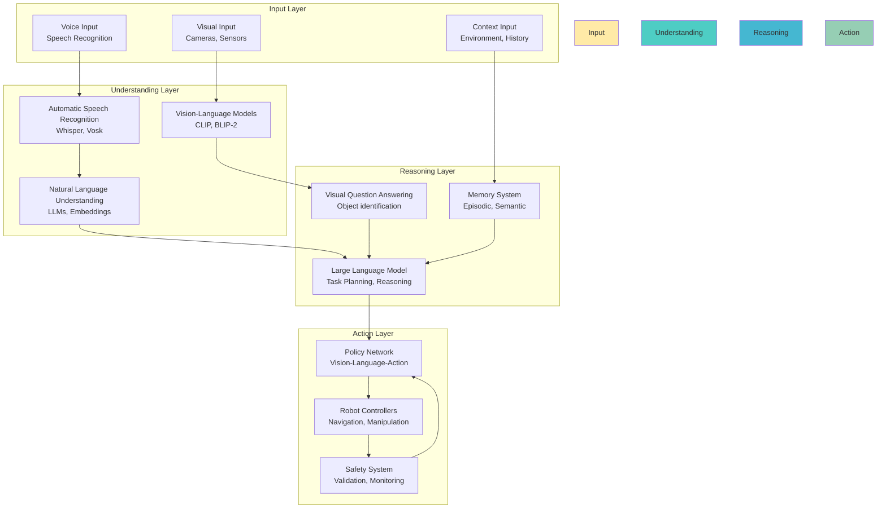
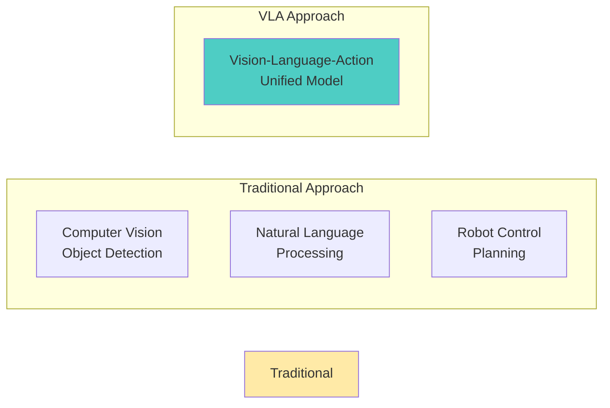

# Module 4: Vision-Language-Action (VLA) - Making Robots Understand Humans

Welcome to the final frontier of humanoid robotics: **Vision-Language-Action (VLA)** systems that enable robots to understand natural language commands, reason about tasks using Large Language Models (LLMs), and execute complex multi-modal policies that bridge human communication with robotic action.

## The $100,000 Question

Imagine a humanoid robot that can:
- **Listen and understand** natural voice commands ("Please bring me the red cup from the kitchen")
- **Reason and plan** complex multi-step tasks (navigate → identify → grasp → transport → deliver)
- **Perceive and act** using vision to execute the requested action
- **Interact naturally** with humans in unstructured environments

This is the difference between a **task-specific robot** and a **general-purpose assistant**. Your robot becomes truly useful when it can accept natural human instructions and execute them autonomously.

## What is Vision-Language-Action (VLA)?

**Vision-Language-Action (VLA)** is an AI architecture that jointly learns from visual, linguistic, and action data to enable robots to understand and execute natural language commands. Unlike traditional approaches that handle vision, language, and action separately, VLA creates a unified system where:

- **Vision** provides the robot's "eyes" to perceive the world
- **Language** provides the robot's "understanding" of human commands
- **Action** provides the robot's "hands" to execute tasks

### The VLA Revolution

Traditional robotics: **Perceive → Plan → Act** (reactive to pre-programmed tasks)

VLA robotics: **Understand → Reason → Execute** (responsive to natural language)

```python
# Traditional approach
if object_detected(color="red", type="cup"):
    navigate_to_kitchen()
    grasp_object()
    transport_to_person()

# VLA approach
command = "Bring me the red cup from the kitchen"
intent = llm_reasoning(command)  # Understand
task_plan = generate_plan(intent)  # Reason
execute_multimodal_policy(task_plan)  # Execute
```

### VLA Architecture Components



## Why VLA for Humanoid Robotics?

### 1. Natural Human-Robot Interaction

**Voice Commands**: No need for specialized interfaces or programming
- "Robot, please clean up the table"
- "Can you bring me my glasses?"
- "Show me how to make coffee"

**Context Awareness**: Understanding spatial relationships and object properties
- "The blue pen on the desk" (color + location)
- "The cup to your left" (relative positioning)
- "The heavy box that's hard to lift" (properties)

### 2. General-Purpose Capability

**Zero-Shot Learning**: Execute tasks never explicitly programmed
- Understanding novel object combinations
- Adapting to new environments
- Handling ambiguous or complex requests

**Transfer Learning**: Apply knowledge from one domain to another
- Kitchen skills to office tasks
- Object manipulation to navigation
- Social interaction to physical tasks

### 3. Multimodal Understanding

**Cross-Modal Reasoning**: Connecting vision and language
- "That thing" → pointing + visual identification
- "The one that looks like..." → visual similarity matching
- "The same as yesterday" → memory + visual comparison

## Core VLA Technologies

### Large Language Models (LLMs)

**Foundation Models**:
- **GPT-4, Claude**: General reasoning and task planning
- **PaLM-E**: Robot-specific language understanding
- **RT-2**: Reasoning and task planning for robots

**Robot-Specific LLMs**:
- **RT-2 (Robotics Transformer 2)**: Maps language to robot actions
- **Instruct2Act**: Instruction following for manipulation
- **SayCan**: Language-guided task execution

### Vision-Language Models (VLMs)

**Pre-trained Models**:
- **CLIP**: Text-image similarity for object identification
- **BLIP-2**: Vision-language understanding and generation
- **Flamingo**: Open-ended visual question answering

**Robot-Specific VLMs**:
- **EmbodiedGPT**: Embodied reasoning and planning
- **VoxPoser**: 3D-aware manipulation planning
- **Grounded Language Learning**: Physical interaction understanding

### Action Generation Models

**Policy Networks**:
- **Diffusion Policies**: Generating action sequences
- **Transformer Policies**: Sequence-to-action mapping
- **Reinforcement Learning**: Learning from human feedback

## The VLA Pipeline

### 1. Input Processing

**Speech-to-Text**:
```python
# Voice command processing
command = speech_to_text(audio_input)
# "Please bring me the red cup from the kitchen"
```

**Visual Processing**:
```python
# Scene understanding
objects = detect_objects(camera_input)
# [{"name": "cup", "color": "red", "location": "kitchen_counter"}]
```

### 2. Multimodal Understanding

**Language Understanding**:
```python
# Parse command semantics
intent = llm_understand(command)
# Intent: {action: "fetch", object: "red cup", location: "kitchen"}
```

**Visual Grounding**:
```python
# Connect language to visual elements
target_object = ground_language_to_vision(intent, objects)
# target_object: "red cup at kitchen_counter"
```

### 3. Task Planning

**Hierarchical Planning**:
```python
# Generate task sequence
task_plan = llm_plan(intent)
# [
#   "navigate_to_kitchen",
#   "identify_red_cup",
#   "plan_grasp_approach",
#   "execute_grasp",
#   "transport_to_person"
# ]
```

### 4. Action Execution

**Policy Execution**:
```python
# Execute with vision-language feedback
for task in task_plan:
    action = policy_network(vision_input, task)
    execute_action(action)
    verify_completion()
```

## Real-World VLA Applications

### Assistive Robotics

**Elderly Care**:
- "I need my medication from the nightstand"
- "Can you turn off the lights?"
- "Call my daughter for me"

**Disability Assistance**:
- "Please get my water bottle"
- "Move that book to my desk"
- "Read this email to me"

### Industrial Applications

**Warehouse Operations**:
- "Find the package with tracking number 12345"
- "Move all blue boxes to the loading dock"
- "Inspect this item for damage"

**Manufacturing**:
- "Show me how to assemble this part"
- "Quality check this component"
- "Replace the defective unit"

### Service Robotics

**Hospitality**:
- "Take this order to table 5"
- "Clean the lobby area"
- "Guide the guest to the conference room"

**Retail**:
- "Help me find size 10 shoes"
- "Restock the shelves in aisle 3"
- "Answer customer questions about products"

## VLA vs. Traditional Approaches

| Aspect | Traditional Robotics | VLA Robotics |
|--------|---------------------|--------------|
| **Input** | Structured commands, pre-programmed tasks | Natural language, voice commands |
| **Understanding** | Rule-based, limited vocabulary | LLM-powered, contextual understanding |
| **Flexibility** | Fixed task sequences | Dynamic task planning |
| **Learning** | Supervised learning from demonstrations | Zero-shot, few-shot learning |
| **Generalization** | Task-specific | Cross-task, cross-domain |
| **Human Interaction** | Limited, technical interface | Natural, conversational |
| **Development** | Manual programming per task | Prompt-based task specification |

## VLA Architecture Patterns

### 1. LLM-First Approach

**Architecture**: LLM → Task Planner → Action Generator → Robot

**Use Case**: Complex reasoning, multi-step planning

**Advantages**: Strong reasoning capabilities, natural language understanding

**Limitations**: May generate physically impossible actions

### 2. Vision-First Approach

**Architecture**: Vision → Object Detection → Action Mapping → LLM Validation

**Use Case**: Precise manipulation, visual servoing

**Advantages**: Accurate visual grounding, real-time feedback

**Limitations**: Limited reasoning, language understanding gaps

### 3. Unified Approach

**Architecture**: Joint vision-language-action model

**Use Case**: End-to-end learning, general-purpose tasks

**Advantages**: Optimal cross-modal integration, efficient inference

**Limitations**: Requires large-scale training data, complex training

## Module Learning Path

**Chapter 1: Overview** (This chapter) - VLA concepts and multimodal AI
**Chapter 2: Architecture** - VLA model architectures and training approaches
**Chapter 3: Voice Control** - Speech recognition, natural language processing
**Chapter 4: LLM Integration** - Large language models for task planning
**Chapter 5: Vision Processing** - Visual understanding and grounding
**Chapter 6: Action Execution** - Converting language to robot actions, capstone project

## Prerequisites

Before diving into VLA, ensure you understand:
- ✅ **ROS 2 concepts** (communication, coordination)
- ✅ **Simulation basics** (Gazebo, Unity for testing)
- ✅ **AI/ML fundamentals** (neural networks, training concepts)
- ✅ **Isaac AI systems** (perception, planning, learning)

You don't need deep expertise in transformers or LLMs - we'll cover the essentials. VLA provides the infrastructure to use advanced AI without implementing models from scratch.

## The Multimodal Revolution

VLA represents a paradigm shift from single-modality to multimodal AI:

**Unimodal (Traditional)**: Separate systems for vision, language, action
**Multimodal (VLA)**: Unified system that learns cross-modal relationships



## Next Steps

Ready to dive into the technical architecture? Continue to [Architecture](/docs/module-04-vla/architecture) to understand how VLA models are designed, trained, and integrated with humanoid robots.

---

**Key Takeaway**: VLA systems enable natural human-robot interaction by combining vision, language, and action in a unified AI architecture. This creates general-purpose robots that can understand voice commands and execute complex tasks without explicit programming.