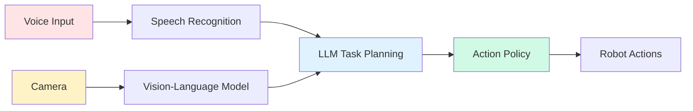

# Module 4 Summary - Your VLA Journey Complete

Congratulations! You've completed Module 4 and mastered **Vision-Language-Action (VLA)** systems—the cutting edge of humanoid robotics. You can now build robots that understand natural language, perceive their environment, and execute complex tasks autonomously.

## What You've Learned

### 1. VLA Fundamentals (Overview + Architecture)

**Core Concept**: VLA unifies vision, language, and action into a single AI system that enables robots to understand and execute natural language commands.

**Key Takeaways**:
- VLA bridges the gap between human communication and robot action
- Multimodal AI learns joint representations across vision, language, and action
- Foundation models (LLMs + VLMs) enable zero-shot and few-shot task execution
- RT-2, PaLM-E, and other specialized models power real-world VLA systems

**Architecture Patterns**:


**Real-World Impact**:
- Assistive robotics: "Bring me my medication"
- Industrial automation: "Inspect this component for defects"
- Service robots: "Clean the conference room"

---

### 2. Voice Control (Chapter 3)

**Core Concept**: Transform natural speech into structured robot commands using ASR, NLU, and dialogue management.

**Key Technologies**:
- **Whisper** (OpenAI): State-of-the-art multilingual ASR
- **Vosk**: Lightweight offline speech recognition
- **Rhasspy**: Open-source voice assistant framework
- **NLU Pipelines**: Intent extraction, entity recognition, slot filling

**Implementation Highlights**:
```python
# End-to-end voice pipeline
audio → Whisper ASR → "Pick up the red cup"
→ Intent Classifier → {action: "grasp", object: "red cup", color: "red"}
→ LLM Planning → [navigate, identify, grasp, return]
→ Action Execution
```

**Best Practices**:
- Use wake word detection to avoid false triggers
- Implement confidence thresholds (>0.8 for critical commands)
- Provide audio feedback for command confirmation
- Handle speech recognition errors gracefully
- Support multi-turn dialogues for complex tasks

---

### 3. LLM Integration (Chapter 4)

**Core Concept**: Leverage large language models (GPT-4, Claude, PaLM-E) for task planning, reasoning, and human-robot interaction.

**LLM Capabilities for Robotics**:
1. **Task Decomposition**: "Clean the kitchen" → [clear_dishes, wipe_counters, sweep_floor]
2. **Context Understanding**: "Put it back" requires memory of previous object
3. **Error Recovery**: Generate alternative plans when actions fail
4. **Natural Interaction**: Conversational interfaces for complex instructions

**Prompt Engineering for Robots**:
```python
# Effective robot prompt structure
prompt = f"""
You are a robot task planner. Given a command and visual context, generate a feasible task plan.

Command: {user_command}
Visual Context: {detected_objects_and_positions}
Robot Capabilities: {available_actions}
Current State: {robot_position_and_held_objects}

Generate a JSON task plan with: type, params, description, preconditions.
Ensure physical feasibility and safety.
"""
```

**Integration Patterns**:
- **Async API Calls**: Don't block robot control during LLM inference
- **Streaming Responses**: Process LLM output incrementally
- **Fallback Logic**: Have rule-based backup for LLM failures
- **Cost Management**: Cache responses, use cheaper models for simple tasks

---

### 4. Vision Processing (Chapter 5)

**Core Concept**: Enable robots to see and understand their environment using computer vision and vision-language models.

**Vision Pipeline**:
```
Camera → Object Detection (YOLO/EfficientDet)
→ Visual Grounding (CLIP/BLIP-2)
→ 3D Understanding (Depth + Segmentation)
→ Scene Graph (Objects + Relationships)
→ VLA Policy
```

**Key Technologies**:
- **CLIP**: Zero-shot object recognition via text-image similarity
- **BLIP-2**: Vision-language understanding and VQA
- **GroundingDINO**: Open-vocabulary object detection
- **SAM (Segment Anything)**: Universal image segmentation
- **Depth Estimation**: RealSense, ZED cameras, or monocular depth models

**Visual Grounding**:
```python
# Connect language to vision
query = "the red cup on the left side of the table"
→ CLIP similarity → Find cup (color: red, confidence: 0.92)
→ Spatial reasoning → Filter by position (left of table center)
→ Output: Object ID, 3D coordinates, grasp affordances
```

**Best Practices**:
- Use multiple cameras for better spatial coverage
- Combine RGB + Depth for robust 3D understanding
- Implement visual tracking for moving objects
- Cache visual features to reduce computation
- Handle occlusions and lighting variations

---

### 5. Action Execution (Chapter 6)

**Core Concept**: Convert high-level language-vision understanding into precise robot actions.

**Action Hierarchy**:
```
High-Level: "Bring me coffee"
↓ Task Planning (LLM)
Mid-Level: [navigate_to_kitchen, locate_coffee, grasp_cup, pour_coffee, transport_to_person]
↓ Motion Planning
Low-Level: Joint trajectories, gripper commands, navigation waypoints
↓ Robot Controllers
Hardware: Motors, actuators, sensors
```

**Policy Types**:
1. **Diffusion Policies**: Generate smooth, multi-modal action distributions
2. **Transformer Policies**: Sequence-to-sequence action prediction
3. **Hybrid Policies**: Combine learned and classical control

**Closed-Loop Execution**:
```python
while not task_complete:
    # Get current visual feedback
    vision_feedback = get_camera_frame()

    # Update policy with current state
    action = policy.predict(vision_feedback, language_goal)

    # Execute action
    robot.execute(action)

    # Verify success
    if check_failure(vision_feedback):
        replan_or_retry()
```

**Safety Considerations**:
- Collision avoidance (sensor-based + predictive)
- Force/torque limits for manipulation
- Emergency stop mechanisms
- Human-in-the-loop for critical operations
- Graceful degradation on sensor failures

---

### 6. System Integration (Chapter 7)

**Core Concept**: Orchestrate all VLA components into a reliable, production-ready system.

**Integration Challenges Solved**:
- **Timing synchronization**: Vision at 30Hz, LLM at 1Hz, actions at 10Hz
- **Error propagation**: Isolate failures, implement recovery strategies
- **Resource management**: GPU sharing between vision and LLM
- **State consistency**: Centralized orchestrator for shared world model

**ROS 2 Integration Pattern**:
```
VLA Orchestrator (Central Coordinator)
├── Voice Module (ASR + NLU)
├── Vision Module (Object Detection + VLM)
├── LLM Module (Task Planning)
├── Action Module (Motion + Manipulation)
└── Error Recovery Module (Fault Tolerance)
```

**Best Practices**:
- Use ROS 2 DDS for reliable communication
- Implement hierarchical error recovery (retry → replan → abort)
- Cache expensive computations (LLM, vision features)
- Monitor system health continuously
- Maintain detailed logs for debugging

---

### 7. Development Tooling (Chapter 8)

**Core Concept**: Professional VLA development requires robust tools for building, testing, debugging, and deploying.

**Your Toolkit**:
- **Development**: VS Code + ROS extensions, custom CLI tools
- **Testing**: pytest (unit), ROS 2 integration tests, simulation testing
- **Debugging**: RQT tools, RViz2, GDB/pdb integration
- **Monitoring**: Prometheus metrics, Grafana dashboards, OpenTelemetry tracing
- **CI/CD**: GitHub Actions, Docker, automated deployment

**Testing Strategy**:
```
Unit Tests (80%+ coverage)
→ Integration Tests (critical paths)
→ Simulation Testing (Gazebo/Isaac Sim)
→ Hardware Testing (staged rollout)
→ Production Monitoring
```

**Performance Optimization**:
- Parallel processing (vision + LLM concurrently)
- Result caching (vision, LLM responses)
- Async/await for I/O-bound operations
- Profile and optimize bottlenecks

---

## Key Architectural Decisions

### 1. When to Use VLA vs. Traditional Robotics

**Use VLA When**:
- Tasks require natural language understanding
- Zero-shot generalization to new objects/tasks
- Human-robot collaboration with flexible instructions
- Unstructured environments with high variability

**Use Traditional Methods When**:
- Fixed, repetitive tasks (manufacturing assembly)
- Hard real-time constraints (&lt;1ms)
- Safety-critical operations requiring formal verification
- Limited compute resources (embedded systems)

**Hybrid Approach** (Best of both worlds):
- VLA for high-level planning and understanding
- Classical control for low-level execution and safety
- LLM for task decomposition, PID for motor control

---

### 2. Cloud vs. Edge Deployment

| Aspect | Cloud LLM | On-Device LLM |
|--------|-----------|---------------|
| **Latency** | 1-3 seconds | 100-500ms |
| **Cost** | $0.01-0.10/call | One-time hardware |
| **Privacy** | Data leaves device | Fully private |
| **Capability** | GPT-4, Claude (best) | Llama 3 8B (limited) |
| **Connectivity** | Requires internet | Works offline |

**Recommendation**:
- Use cloud for complex reasoning (task planning)
- Use edge for simple decisions (safety checks, object classification)
- Implement graceful degradation when connectivity lost

---

### 3. End-to-End vs. Modular VLA

**End-to-End VLA** (e.g., RT-2):
- Single model: Image + Language → Actions
- Pros: Optimal integration, end-to-end learning
- Cons: Requires massive data, hard to debug, limited interpretability

**Modular VLA** (Recommended for most):
- Separate modules: ASR → LLM → Vision → Policy
- Pros: Easier debugging, swappable components, interpretable
- Cons: Integration complexity, sub-optimal joint optimization

**Hybrid Approach**:
- Modular for high-level (speech, LLM, object detection)
- End-to-end learned policy for low-level visuomotor control

---

## Common Pitfalls and Solutions

### 1. LLM Hallucinations in Task Planning

**Problem**: LLM generates physically impossible or unsafe plans.

**Solution**:
- Validate LLM output with feasibility checker
- Provide explicit constraints in prompts ("avoid touching red objects")
- Use structured output (JSON) with schema validation
- Implement physics-based simulation verification
- Maintain an "executable action" whitelist

### 2. Visual Grounding Failures

**Problem**: "Red cup" maps to wrong object or none.

**Solution**:
- Use multiple visual cues (color + shape + context)
- Implement spatial reasoning (left/right, near/far)
- Provide visual feedback to user ("Is this the red cup?")
- Maintain object tracking for temporal consistency
- Fall back to user clarification for ambiguous cases

### 3. Action Execution Drift

**Problem**: Accumulated errors cause actions to fail (grasping misses object).

**Solution**:
- Implement closed-loop visual servoing
- Use force/torque feedback for contact detection
- Re-detect object before grasp attempt
- Plan grasp approach with multiple candidate poses
- Retry with adjusted parameters (wider grasp, different angle)

### 4. System Latency Issues

**Problem**: End-to-end latency >5 seconds makes robot feel unresponsive.

**Solution**:
- Run vision and LLM inference in parallel
- Stream LLM responses for incremental processing
- Cache frequent LLM queries and vision features
- Use faster models for interactive tasks (GPT-3.5 vs GPT-4)
- Provide progress feedback ("Thinking...", "Navigating...")

### 5. Error Recovery Cascades

**Problem**: One failure causes chain reaction of errors.

**Solution**:
- Implement hierarchical recovery (retry → replan → abort → human)
- Isolate component failures (don't crash whole system)
- Maintain safe default state ("return to home position")
- Log detailed error context for debugging
- Provide user with recovery options ("Try again?" "Do something else?")

---

## Production Deployment Checklist

### Pre-Deployment
- [ ] Unit tests passing (>80% coverage)
- [ ] Integration tests passing (critical paths)
- [ ] Simulation testing complete (Gazebo/Isaac Sim)
- [ ] Hardware testing on target robot
- [ ] Safety protocols validated
- [ ] Error recovery tested (all failure modes)
- [ ] Performance benchmarks met (latency, throughput)
- [ ] Documentation complete (user manual, API docs)

### Deployment
- [ ] Docker images built and versioned
- [ ] Environment variables configured (.env)
- [ ] Secrets management (API keys) secure
- [ ] CI/CD pipeline configured
- [ ] Monitoring dashboards setup (Grafana)
- [ ] Logging aggregation configured
- [ ] Alerting rules defined (Prometheus)
- [ ] Backup and recovery procedures documented

### Post-Deployment
- [ ] Monitor system metrics (latency, errors, success rate)
- [ ] Collect user feedback
- [ ] Analyze failure modes
- [ ] Iterate on prompts and parameters
- [ ] Update models as needed
- [ ] Maintain audit trail for safety-critical operations

---

## Your VLA Skillset

You now have the skills to:
- ✅ Build multimodal AI systems that understand speech and vision
- ✅ Integrate LLMs (GPT-4, Claude, PaLM-E) for robot task planning
- ✅ Implement visual grounding with CLIP, BLIP-2, and SAM
- ✅ Design and deploy VLA action policies (diffusion, transformer)
- ✅ Orchestrate complex systems with ROS 2 middleware
- ✅ Test, debug, and monitor production VLA robots
- ✅ Handle errors and edge cases gracefully
- ✅ Deploy VLA systems in real-world environments

---

## The Future of VLA

### Emerging Trends
1. **Multimodal Foundation Models**: GPT-4V, Gemini, Claude 3 with native vision
2. **Embodied AI**: Models trained specifically for robotics (RT-X, Octo)
3. **Sim-to-Real Transfer**: Train in simulation, deploy to real robots
4. **Human-in-the-Loop Learning**: Robots learn from corrections
5. **Federated VLA**: Share learned policies across robot fleets

### Open Challenges
- Real-time VLA (&lt;100ms latency)
- Long-horizon task planning (multi-hour tasks)
- Safety guarantees for learned policies
- Sample-efficient learning (reduce data requirements)
- Explainable AI for robot decisions

### Your Role
The VLA revolution is just beginning. As someone who understands both the foundations and the practical implementation, you're positioned to:
- Build the next generation of assistant robots
- Contribute to open-source VLA frameworks
- Research novel VLA architectures
- Deploy VLA in new domains (healthcare, agriculture, space)

---

## Next Steps

### 1. Build Your Capstone Project
Apply everything you've learned in the **[Capstone Project](/docs/module-04-vla/capstone)**: build a complete VLA robot that:
- Understands voice commands
- Reasons with LLMs
- Perceives with vision
- Executes complex manipulation tasks

### 2. Continue Learning
- **Module 5**: Advanced Humanoid Applications (if available)
- **Specialize**: Deep dive into LLM fine-tuning, vision models, or control
- **Research**: Read latest VLA papers (RT-2, PaLM-E, VoxPoser)

### 3. Join the Community
- **ROS Discourse**: Share your VLA implementations
- **Humanoid Robotics Discord**: Connect with other builders
- **Open-Source Contributions**: Contribute to VLA frameworks

### 4. Real-World Projects
- Build a home assistant robot
- Create an industrial inspection system
- Develop accessibility tools for disabled users
- Participate in robotics competitions

---

## Final Thoughts

Vision-Language-Action represents a paradigm shift in robotics—from programmed machines to intelligent assistants that understand and adapt to human needs. You've learned not just the theory but the practical engineering required to build these systems.

The robots of tomorrow won't be programmed for every scenario. They'll learn, adapt, and collaborate with humans using natural language and multimodal understanding. **You now have the skills to build those robots.**

---

**Module 4 Complete! You're ready for the Capstone Project.**

Continue to **[Capstone Project](/docs/module-04-vla/capstone)** →
