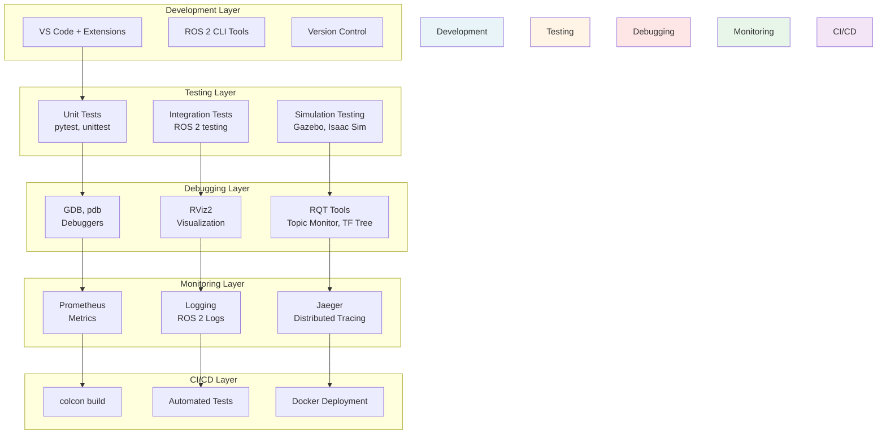

# VLA Development Tooling - Your Production-Ready Toolkit

Building production VLA systems requires more than just code—you need **robust development tools**, **debugging frameworks**, **testing infrastructure**, and **monitoring systems**. This chapter provides your complete toolkit for professional VLA development.

## The VLA Development Stack



## 1. Development Environment Setup

### VS Code Configuration for VLA Development

Create `.vscode/settings.json`:

```json
{
  "python.defaultInterpreterPath": "/usr/bin/python3",
  "python.analysis.extraPaths": [
    "/opt/ros/humble/lib/python3.10/site-packages",
    "${workspaceFolder}/install/lib/python3.10/site-packages"
  ],
  "python.autoComplete.extraPaths": [
    "/opt/ros/humble/lib/python3.10/site-packages",
    "${workspaceFolder}/install/lib/python3.10/site-packages"
  ],
  "python.linting.enabled": true,
  "python.linting.pylintEnabled": true,
  "python.linting.flake8Enabled": true,
  "python.formatting.provider": "black",
  "editor.formatOnSave": true,
  "files.associations": {
    "*.launch.py": "python",
    "*.msg": "ros-msg",
    "*.srv": "ros-srv",
    "*.action": "ros-action"
  },
  "ros.distro": "humble",
  "C_Cpp.default.includePath": [
    "/opt/ros/humble/include/**"
  ]
}
```

### Essential VS Code Extensions

```bash
# Install ROS extension
code --install-extension ms-iot.vscode-ros

# Python extensions
code --install-extension ms-python.python
code --install-extension ms-python.vscode-pylance

# YAML support for ROS configs
code --install-extension redhat.vscode-yaml

# Docker support
code --install-extension ms-azuretools.vscode-docker

# Git integration
code --install-extension eamodio.gitlens
```

### Workspace Configuration

Create `vla_workspace/setup.sh`:

```bash
#!/bin/bash
# VLA Development Workspace Setup

export VLA_WS=~/vla_workspace

# Source ROS 2
source /opt/ros/humble/setup.bash

# Source workspace
if [ -f "$VLA_WS/install/setup.bash" ]; then
    source "$VLA_WS/install/setup.bash"
fi

# Set environment variables
export GAZEBO_MODEL_PATH=$GAZEBO_MODEL_PATH:$VLA_WS/src/models
export PYTHONPATH=$PYTHONPATH:$VLA_WS/src

# LLM API keys (use .env file in production)
if [ -f "$VLA_WS/.env" ]; then
    export $(cat $VLA_WS/.env | xargs)
fi

# ROS domain ID for multi-robot
export ROS_DOMAIN_ID=42

# Debugging flags
export RCUTILS_CONSOLE_OUTPUT_FORMAT="[{severity}] [{name}]: {message}"
export RCUTILS_COLORIZED_OUTPUT=1

echo "VLA Development Environment Loaded"
echo "Workspace: $VLA_WS"
echo "ROS Distro: $ROS_DISTRO"
```

## 2. ROS 2 CLI Tools for VLA Development

### Essential ROS 2 Commands

```bash
# 1. Topic Inspection
# Monitor voice commands
ros2 topic echo /vla/voice/command

# Monitor LLM responses with rate
ros2 topic hz /vla/llm/response

# View topic details
ros2 topic info /vla/vision/result --verbose

# Record VLA session for replay
ros2 bag record /vla/voice/command /vla/vision/result /vla/llm/response /vla/action/command

# 2. Node Management
# List all VLA nodes
ros2 node list

# Node details
ros2 node info /vla_orchestrator

# 3. Service Inspection
# List available services
ros2 service list

# Call vision processing service
ros2 service call /vla/vision/process_image vla_interfaces/srv/ProcessImage "{image_path: '/tmp/test.jpg'}"

# 4. Action Management
# List action servers
ros2 action list

# Send goal to LLM planning action
ros2 action send_goal /plan_task vla_interfaces/action/PlanTask "{command: 'pick up red cup'}" --feedback

# 5. Parameter Management
# List parameters
ros2 param list /vision_processor

# Get parameter
ros2 param get /vision_processor confidence_threshold

# Set parameter (runtime)
ros2 param set /vision_processor confidence_threshold 0.7
```

### Custom ROS 2 CLI Tools

Create `tools/vla_cli.py`:

```python
#!/usr/bin/env python3
"""
VLA Command Line Interface
Provides convenient commands for VLA system management
"""

import click
import rclpy
from rclpy.node import Node
from std_msgs.msg import String
from vla_interfaces.msg import VoiceCommand, VLAState
import json
import time

class VLACLINode(Node):
    def __init__(self):
        super().__init__('vla_cli')

        # Publishers
        self.voice_pub = self.create_subscription(
            VoiceCommand,
            '/vla/voice/command',
            self.create_publisher(VoiceCommand, '/vla/voice/command', 10)
        )

        self.state_sub = self.create_subscription(
            VLAState,
            '/vla/state',
            self.state_callback,
            10
        )

        self.latest_state = None

    def state_callback(self, msg):
        self.latest_state = msg

@click.group()
def cli():
    """VLA System Command Line Interface"""
    pass

@cli.command()
@click.argument('command')
def send_command(command):
    """Send voice command to VLA system"""
    rclpy.init()
    node = VLACLINode()

    # Create and publish voice command
    msg = VoiceCommand()
    msg.text = command
    msg.confidence = 1.0
    msg.language = "en-US"
    msg.timestamp = node.get_clock().now().to_msg()

    node.voice_pub.publish(msg)
    click.echo(f"✓ Command sent: {command}")

    node.destroy_node()
    rclpy.shutdown()

@cli.command()
def status():
    """Check VLA system status"""
    rclpy.init()
    node = VLACLINode()

    # Spin briefly to get state
    for _ in range(10):
        rclpy.spin_once(node, timeout_sec=0.1)

    if node.latest_state:
        click.echo(f"""
VLA System Status:
------------------
Status: {node.latest_state.status}
Current Task: {node.latest_state.current_task}
Error: {node.latest_state.error_message or 'None'}
""")
    else:
        click.echo("❌ Unable to connect to VLA system")

    node.destroy_node()
    rclpy.shutdown()

@cli.command()
@click.option('--duration', default=10, help='Recording duration in seconds')
def record(duration):
    """Record VLA session"""
    import subprocess

    topics = [
        '/vla/voice/command',
        '/vla/vision/result',
        '/vla/llm/response',
        '/vla/action/command',
        '/vla/state'
    ]

    bag_name = f"vla_session_{int(time.time())}"
    cmd = ['ros2', 'bag', 'record'] + topics + ['-o', bag_name, '--duration', str(duration)]

    click.echo(f"Recording for {duration} seconds...")
    subprocess.run(cmd)
    click.echo(f"✓ Saved to {bag_name}")

@cli.command()
def health():
    """Run health check on all VLA components"""
    rclpy.init()
    node = Node('vla_health_check')

    required_nodes = [
        '/vla_orchestrator',
        '/voice_recognition',
        '/vision_processor',
        '/llm_planner',
        '/action_executor'
    ]

    available_nodes = node.get_node_names()

    click.echo("VLA Health Check:")
    click.echo("-" * 40)

    all_healthy = True
    for required in required_nodes:
        if required in available_nodes:
            click.echo(f"✓ {required}: RUNNING")
        else:
            click.echo(f"❌ {required}: NOT FOUND")
            all_healthy = False

    if all_healthy:
        click.echo("\n✓ All components healthy")
    else:
        click.echo("\n❌ Some components missing")

    node.destroy_node()
    rclpy.shutdown()

if __name__ == '__main__':
    cli()
```

Install and use:
```bash
# Make executable
chmod +x tools/vla_cli.py
ln -s $(pwd)/tools/vla_cli.py /usr/local/bin/vla

# Usage
vla send-command "pick up the red cup"
vla status
vla health
vla record --duration 30
```

## 3. Debugging Tools

### RQT Tools for VLA Systems

```bash
# 1. RQT Graph - Visualize node connections
rqt_graph

# 2. Topic Monitor - Real-time topic visualization
rqt_topic

# 3. Message Publisher - Test components individually
rqt_msg

# 4. Parameter Reconfigure - Runtime parameter tuning
rqt_reconfigure

# 5. Console - Log viewer
rqt_console

# 6. Bag Player - Replay recorded sessions
rqt_bag
```

### Custom RQT Plugin for VLA Monitoring

Create `rqt_vla/vla_monitor.py`:

```python
# rqt_vla/vla_monitor.py
from rqt_gui_py.plugin import Plugin
from python_qt_binding.QtWidgets import QWidget, QVBoxLayout, QLabel, QTextEdit
from python_qt_binding.QtCore import QTimer
from vla_interfaces.msg import VLAState
import rclpy

class VLAMonitor(Plugin):
    """
    RQT plugin for monitoring VLA system state
    """

    def __init__(self, context):
        super(VLAMonitor, self).__init__(context)
        self.setObjectName('VLAMonitor')

        # Create widget
        self._widget = QWidget()
        layout = QVBoxLayout()

        # Status labels
        self.status_label = QLabel('Status: Unknown')
        self.task_label = QLabel('Task: None')
        self.log_text = QTextEdit()
        self.log_text.setReadOnly(True)

        layout.addWidget(self.status_label)
        layout.addWidget(self.task_label)
        layout.addWidget(self.log_text)

        self._widget.setLayout(layout)
        context.add_widget(self._widget)

        # ROS 2 subscription
        self.node = context.node
        self.state_sub = self.node.create_subscription(
            VLAState,
            '/vla/state',
            self.state_callback,
            10
        )

        # Update timer
        self.timer = QTimer()
        self.timer.timeout.connect(self.update_display)
        self.timer.start(100)  # 10 Hz

    def state_callback(self, msg):
        self.latest_state = msg

    def update_display(self):
        if hasattr(self, 'latest_state'):
            self.status_label.setText(f"Status: {self.latest_state.status}")
            self.task_label.setText(f"Task: {self.latest_state.current_task}")
            if self.latest_state.error_message:
                self.log_text.append(f"ERROR: {self.latest_state.error_message}")
```

### Python Debugger Integration

```python
# vla_orchestrator.py with debugging
import pdb
import sys

class VLAOrchestrator(Node):
    def llm_callback(self, msg: LLMResponse):
        """Handle LLM responses with optional debugging"""

        # Set breakpoint for debugging
        if '--debug' in sys.argv:
            pdb.set_trace()

        # Or use conditional breakpoints
        if msg.confidence < 0.5:
            # Drop into debugger for low-confidence responses
            import pdb; pdb.set_trace()

        # Normal processing
        self.task_plan = self.parse_task_plan(msg.plan)
```

Run with debugger:
```bash
ros2 run vla_integration vla_orchestrator --debug
```

### ROS 2 Launch Debugging

```python
# launch/vla_system_debug.launch.py
from launch import LaunchDescription
from launch_ros.actions import Node
from launch.actions import ExecuteProcess

def generate_launch_description():
    return LaunchDescription([
        # Launch VLA orchestrator with GDB
        ExecuteProcess(
            cmd=['xterm', '-e', 'gdb', '-ex', 'run', '--args',
                 'python3', '-m', 'vla_integration.vla_orchestrator'],
            output='screen',
            prefix='gdb -ex run --args'
        ),

        # Other nodes run normally
        Node(
            package='vla_voice',
            executable='voice_recognition_node',
            name='voice_recognition',
            output='screen'
        ),
    ])
```

## 4. Testing Framework

### Unit Testing

```python
# tests/unit/test_llm_integration.py
import pytest
import rclpy
from unittest.mock import Mock, patch
from vla_integration.llm_action_server import LLMPlanningServer
from vla_interfaces.action import PlanTask

class TestLLMPlanning:
    """Unit tests for LLM planning module"""

    @pytest.fixture
    def node(self):
        rclpy.init()
        node = LLMPlanningServer()
        yield node
        node.destroy_node()
        rclpy.shutdown()

    def test_prompt_creation(self, node):
        """Test LLM prompt generation"""
        request = Mock()
        request.command = "Pick up red cup"
        request.vision_context = "Red cup at (1.0, 2.0)"
        request.capabilities = "grasp, navigate"

        prompt = node.create_prompt(request)

        assert "Pick up red cup" in prompt
        assert "Red cup" in prompt
        assert "grasp" in prompt

    def test_plan_validation_valid(self, node):
        """Test plan validation with valid JSON"""
        valid_plan = '''
        [
            {"type": "navigate", "params": {"x": 1.0, "y": 2.0}},
            {"type": "grasp", "params": {"object": "cup"}}
        ]
        '''
        assert node.validate_plan(valid_plan) == True

    def test_plan_validation_invalid(self, node):
        """Test plan validation with invalid JSON"""
        invalid_plan = "not json"
        assert node.validate_plan(invalid_plan) == False

    @patch('openai.AsyncOpenAI')
    async def test_llm_call_success(self, mock_openai, node):
        """Test successful LLM API call"""
        # Mock LLM response
        mock_response = Mock()
        mock_response.choices = [Mock(message=Mock(content='[{"type": "test"}]'))]
        mock_openai.return_value.chat.completions.create.return_value = mock_response

        goal_handle = Mock()
        goal_handle.request = Mock(
            command="test",
            vision_context="",
            capabilities=""
        )

        result = await node.execute_callback(goal_handle)
        assert result.success == True
```

### Integration Testing

```python
# tests/integration/test_vla_pipeline.py
import pytest
import rclpy
from rclpy.executors import SingleThreadedExecutor
from vla_integration.vla_orchestrator import VLAOrchestrator
from vla_interfaces.msg import VoiceCommand, VisionResult, LLMResponse
import time
import threading

class TestVLAPipeline:
    """Integration tests for complete VLA pipeline"""

    @pytest.fixture
    def vla_system(self):
        """Setup complete VLA system"""
        rclpy.init()

        # Create orchestrator
        orchestrator = VLAOrchestrator()

        # Create executor in separate thread
        executor = SingleThreadedExecutor()
        executor.add_node(orchestrator)

        spin_thread = threading.Thread(target=executor.spin, daemon=True)
        spin_thread.start()

        time.sleep(0.5)  # Let system initialize

        yield orchestrator

        executor.shutdown()
        orchestrator.destroy_node()
        rclpy.shutdown()

    def test_voice_command_processing(self, vla_system):
        """Test voice command triggers LLM planning"""
        # Create publishers for testing
        node = rclpy.create_node('test_node')
        voice_pub = node.create_publisher(VoiceCommand, '/vla/voice/command', 10)

        # Send voice command
        cmd = VoiceCommand()
        cmd.text = "Pick up the blue box"
        cmd.confidence = 0.95
        voice_pub.publish(cmd)

        # Wait for processing
        time.sleep(1.0)

        # Verify orchestrator received command
        assert vla_system.current_command == "Pick up the blue box"
        assert vla_system.current_state.status == "PROCESSING_COMMAND"

        node.destroy_node()

    def test_vision_llm_action_pipeline(self, vla_system):
        """Test complete pipeline from vision to action"""
        node = rclpy.create_node('test_node')

        # Publish vision result
        vision_pub = node.create_publisher(VisionResult, '/vla/vision/result', 10)
        vision_msg = VisionResult()
        vision_msg.scene_description = "Kitchen with red cup on counter"
        vision_pub.publish(vision_msg)

        time.sleep(0.2)

        # Publish voice command
        voice_pub = node.create_publisher(VoiceCommand, '/vla/voice/command', 10)
        voice_cmd = VoiceCommand()
        voice_cmd.text = "Get the red cup"
        voice_pub.publish(voice_cmd)

        time.sleep(0.5)

        # Simulate LLM response
        llm_pub = node.create_publisher(LLMResponse, '/vla/llm/response', 10)
        llm_resp = LLMResponse()
        llm_resp.plan = '[{"type": "navigate", "params": {"target": "counter"}}]'
        llm_pub.publish(llm_resp)

        time.sleep(0.5)

        # Verify task plan was created
        assert len(vla_system.task_plan) > 0
        assert vla_system.current_state.status == "EXECUTING_ACTION"

        node.destroy_node()
```

### Behavior Testing with Robot Action

```python
# tests/behavior/test_manipulation.py
import pytest
import rclpy
from geometry_msgs.msg import Pose
from vla_interfaces.msg import ActionCommand

class TestManipulationBehaviors:
    """Test high-level manipulation behaviors"""

    def test_pick_and_place(self):
        """Test complete pick-and-place sequence"""
        # This would run in simulation (Gazebo/Isaac Sim)
        rclpy.init()
        node = rclpy.create_node('behavior_test')

        action_pub = node.create_publisher(ActionCommand, '/vla/action/command', 10)

        # Send pick command
        pick_cmd = ActionCommand()
        pick_cmd.task_type = "grasp"
        pick_cmd.parameters = '{"object": "red_cup", "position": [1.0, 0.5, 0.8]}'
        action_pub.publish(pick_cmd)

        # Wait and verify (in real test, would check simulation state)
        rclpy.spin_once(node, timeout_sec=5.0)

        # Send place command
        place_cmd = ActionCommand()
        place_cmd.task_type = "place"
        place_cmd.parameters = '{"target": [2.0, 0.5, 0.8]}'
        action_pub.publish(place_cmd)

        rclpy.spin_once(node, timeout_sec=5.0)

        node.destroy_node()
        rclpy.shutdown()
```

### Running Tests

```bash
# Run all tests
pytest tests/ -v

# Run specific test file
pytest tests/unit/test_llm_integration.py -v

# Run with coverage
pytest tests/ --cov=vla_integration --cov-report=html

# Run integration tests only
pytest tests/integration/ -v -s

# Run tests in parallel
pytest tests/ -n auto
```

## 5. Simulation Testing

### Gazebo Integration

```python
# launch/vla_gazebo.launch.py
from launch import LaunchDescription
from launch.actions import IncludeLaunchDescription
from launch.launch_description_sources import PythonLaunchDescriptionSource
from launch_ros.actions import Node
import os

def generate_launch_description():
    return LaunchDescription([
        # Launch Gazebo with custom world
        IncludeLaunchDescription(
            PythonLaunchDescriptionSource([
                os.path.join(
                    get_package_share_directory('gazebo_ros'),
                    'launch',
                    'gazebo.launch.py'
                )
            ]),
            launch_arguments={'world': 'worlds/kitchen.world'}.items()
        ),

        # Spawn robot
        Node(
            package='gazebo_ros',
            executable='spawn_entity.py',
            arguments=['-entity', 'humanoid_robot', '-file', 'models/robot.urdf'],
            output='screen'
        ),

        # Launch VLA system
        IncludeLaunchDescription(
            PythonLaunchDescriptionSource([
                'launch/vla_system.launch.py'
            ])
        ),
    ])
```

### Isaac Sim Integration

```python
# tools/isaac_sim_test.py
from omni.isaac.kit import SimulationApp

simulation_app = SimulationApp({"headless": False})

from omni.isaac.core import World
from omni.isaac.core.robots import Robot
from omni.isaac.core.utils.stage import add_reference_to_stage
import numpy as np
import rclpy
from vla_interfaces.msg import VisionResult

class IsaacSimVLATest:
    """Test VLA system in Isaac Sim"""

    def __init__(self):
        self.world = World(stage_units_in_meters=1.0)

        # Add robot
        self.robot = self.world.scene.add(
            Robot(
                prim_path="/World/Robot",
                name="humanoid",
                usd_path="assets/humanoid.usd"
            )
        )

        # Add objects
        add_reference_to_stage(
            usd_path="assets/red_cup.usd",
            prim_path="/World/RedCup"
        )

        # Setup ROS 2
        rclpy.init()
        self.node = rclpy.create_node('isaac_sim_test')
        self.vision_pub = self.node.create_publisher(
            VisionResult,
            '/vla/vision/result',
            10
        )

    def run_test(self):
        """Run simulation test"""
        self.world.reset()

        for i in range(1000):
            # Step simulation
            self.world.step(render=True)

            # Publish synthetic vision data
            if i % 10 == 0:
                vision_msg = self.create_vision_msg()
                self.vision_pub.publish(vision_msg)

            # Spin ROS
            rclpy.spin_once(self.node, timeout_sec=0)

    def create_vision_msg(self):
        """Create vision message from simulation"""
        # Get object positions from simulation
        cup_pose = self.world.scene.get_object("red_cup").get_world_pose()

        msg = VisionResult()
        msg.scene_description = "Kitchen scene with red cup"
        msg.objects = [
            {
                'label': 'red_cup',
                'position': cup_pose[0].tolist(),
                'confidence': 0.95
            }
        ]
        return msg

if __name__ == '__main__':
    test = IsaacSimVLATest()
    test.run_test()
    simulation_app.close()
```

## 6. Performance Monitoring

### Prometheus Metrics

```python
# vla_integration/metrics.py
from prometheus_client import Counter, Histogram, Gauge, start_http_server
import time

class VLAMetrics:
    """Prometheus metrics for VLA system"""

    def __init__(self, port=8000):
        # Start metrics server
        start_http_server(port)

        # Command metrics
        self.commands_total = Counter(
            'vla_commands_total',
            'Total number of voice commands processed'
        )

        self.commands_success = Counter(
            'vla_commands_success_total',
            'Total number of successful commands'
        )

        self.commands_failed = Counter(
            'vla_commands_failed_total',
            'Total number of failed commands'
        )

        # Latency metrics
        self.llm_latency = Histogram(
            'vla_llm_latency_seconds',
            'LLM response latency'
        )

        self.vision_latency = Histogram(
            'vla_vision_latency_seconds',
            'Vision processing latency'
        )

        self.action_latency = Histogram(
            'vla_action_latency_seconds',
            'Action execution latency'
        )

        self.total_latency = Histogram(
            'vla_total_latency_seconds',
            'End-to-end command latency'
        )

        # System state
        self.active_tasks = Gauge(
            'vla_active_tasks',
            'Number of tasks currently executing'
        )

        self.error_count = Counter(
            'vla_errors_total',
            'Total number of errors',
            ['component', 'error_type']
        )

# Usage in VLA Orchestrator
class VLAOrchestrator(Node):
    def __init__(self):
        super().__init__('vla_orchestrator')
        self.metrics = VLAMetrics(port=8000)
        self.command_start_time = None

    def voice_callback(self, msg):
        self.metrics.commands_total.inc()
        self.command_start_time = time.time()
        # ... rest of processing

    def action_feedback_callback(self, msg):
        if msg.data == "TASK_COMPLETE":
            # Record successful completion
            self.metrics.commands_success.inc()

            # Record total latency
            if self.command_start_time:
                latency = time.time() - self.command_start_time
                self.metrics.total_latency.observe(latency)
        elif msg.data.startswith("ERROR"):
            self.metrics.commands_failed.inc()
```

### Grafana Dashboard Configuration

```yaml
# grafana/vla_dashboard.json
{
  "dashboard": {
    "title": "VLA System Monitoring",
    "panels": [
      {
        "title": "Commands Per Minute",
        "targets": [
          {
            "expr": "rate(vla_commands_total[1m])"
          }
        ],
        "type": "graph"
      },
      {
        "title": "Success Rate",
        "targets": [
          {
            "expr": "rate(vla_commands_success_total[5m]) / rate(vla_commands_total[5m])"
          }
        ],
        "type": "gauge"
      },
      {
        "title": "Latency Distribution",
        "targets": [
          {
            "expr": "histogram_quantile(0.95, vla_total_latency_seconds)"
          }
        ],
        "type": "heatmap"
      },
      {
        "title": "Active Tasks",
        "targets": [
          {
            "expr": "vla_active_tasks"
          }
        ],
        "type": "graph"
      }
    ]
  }
}
```

## 7. Logging and Tracing

### Structured Logging

```python
# vla_integration/logging_config.py
import logging
import json
from datetime import datetime

class JSONFormatter(logging.Formatter):
    """Format logs as JSON for structured logging"""

    def format(self, record):
        log_obj = {
            'timestamp': datetime.utcnow().isoformat(),
            'level': record.levelname,
            'logger': record.name,
            'message': record.getMessage(),
            'module': record.module,
            'function': record.funcName,
            'line': record.lineno
        }

        # Add extra fields
        if hasattr(record, 'command'):
            log_obj['command'] = record.command
        if hasattr(record, 'task_id'):
            log_obj['task_id'] = record.task_id

        return json.dumps(log_obj)

def setup_logging():
    """Configure structured logging for VLA system"""
    logger = logging.getLogger('vla')
    logger.setLevel(logging.INFO)

    # Console handler with JSON formatting
    handler = logging.StreamHandler()
    handler.setFormatter(JSONFormatter())
    logger.addHandler(handler)

    # File handler
    file_handler = logging.FileHandler('/var/log/vla/system.log')
    file_handler.setFormatter(JSONFormatter())
    logger.addHandler(file_handler)

    return logger

# Usage
logger = setup_logging()
logger.info('Voice command received', extra={'command': 'pick up cup', 'confidence': 0.95})
```

### Distributed Tracing with OpenTelemetry

```python
# vla_integration/tracing.py
from opentelemetry import trace
from opentelemetry.sdk.trace import TracerProvider
from opentelemetry.sdk.trace.export import BatchSpanProcessor
from opentelemetry.exporter.jaeger.thrift import JaegerExporter

def setup_tracing(service_name='vla-orchestrator'):
    """Setup distributed tracing with Jaeger"""
    trace.set_tracer_provider(TracerProvider())

    jaeger_exporter = JaegerExporter(
        agent_host_name='localhost',
        agent_port=6831,
    )

    trace.get_tracer_provider().add_span_processor(
        BatchSpanProcessor(jaeger_exporter)
    )

    return trace.get_tracer(service_name)

# Usage in VLA components
tracer = setup_tracing('vla-orchestrator')

class VLAOrchestrator(Node):
    def voice_callback(self, msg):
        with tracer.start_as_current_span("process_voice_command") as span:
            span.set_attribute("command", msg.text)
            span.set_attribute("confidence", msg.confidence)

            # Child spans for sub-operations
            with tracer.start_as_current_span("llm_request"):
                llm_request = self.prepare_llm_request(msg.text, self.latest_vision_result)
                self.llm_request_pub.publish(llm_msg)
```

## 8. CI/CD Pipeline

### GitHub Actions Workflow

```yaml
# .github/workflows/vla_ci.yml
name: VLA CI/CD

on:
  push:
    branches: [ main, develop ]
  pull_request:
    branches: [ main ]

jobs:
  build-and-test:
    runs-on: ubuntu-22.04
    container:
      image: ros:humble

    steps:
      - uses: actions/checkout@v3

      - name: Install Dependencies
        run: |
          apt-get update
          apt-get install -y python3-pip
          pip3 install pytest pytest-cov

      - name: Build Workspace
        run: |
          source /opt/ros/humble/setup.bash
          colcon build --packages-select vla_integration vla_interfaces

      - name: Run Tests
        run: |
          source /opt/ros/humble/setup.bash
          source install/setup.bash
          pytest tests/ --cov=vla_integration --cov-report=xml

      - name: Upload Coverage
        uses: codecov/codecov-action@v3
        with:
          files: ./coverage.xml

      - name: Build Docker Image
        if: github.ref == 'refs/heads/main'
        run: |
          docker build -t vla-system:latest .

      - name: Push to Registry
        if: github.ref == 'refs/heads/main'
        run: |
          echo "${{ secrets.DOCKER_PASSWORD }}" | docker login -u "${{ secrets.DOCKER_USERNAME }}" --password-stdin
          docker push vla-system:latest
```

### Dockerfile for VLA System

```dockerfile
# Dockerfile
FROM ros:humble

# Install dependencies
RUN apt-get update && apt-get install -y \
    python3-pip \
    ros-humble-gazebo-ros-pkgs \
    && rm -rf /var/lib/apt/lists/*

# Install Python packages
RUN pip3 install \
    openai \
    anthropic \
    transformers \
    torch \
    opencv-python \
    prometheus-client

# Copy workspace
WORKDIR /workspace
COPY . /workspace/

# Build ROS workspace
RUN . /opt/ros/humble/setup.sh && \
    colcon build --cmake-args -DCMAKE_BUILD_TYPE=Release

# Setup entrypoint
COPY docker/entrypoint.sh /entrypoint.sh
RUN chmod +x /entrypoint.sh
ENTRYPOINT ["/entrypoint.sh"]

CMD ["ros2", "launch", "vla_integration", "vla_system.launch.py"]
```

## Best Practices Summary

### Development
- ✅ Use VS Code with ROS extensions for efficient development
- ✅ Configure proper workspace setup scripts
- ✅ Use version control with meaningful commits
- ✅ Write documentation alongside code

### Testing
- ✅ Write unit tests for all components (>80% coverage)
- ✅ Create integration tests for critical paths
- ✅ Test in simulation before deploying to hardware
- ✅ Use automated testing in CI/CD

### Debugging
- ✅ Use RQT tools for visual debugging
- ✅ Leverage ROS 2 bag files for replay debugging
- ✅ Set conditional breakpoints for tricky bugs
- ✅ Use structured logging for production debugging

### Monitoring
- ✅ Expose Prometheus metrics for all services
- ✅ Create Grafana dashboards for visualization
- ✅ Implement distributed tracing for complex flows
- ✅ Set up alerts for critical failures

### Deployment
- ✅ Use Docker for consistent deployment
- ✅ Implement CI/CD for automated testing and deployment
- ✅ Version all dependencies explicitly
- ✅ Document deployment procedures

## Next Steps

Now that you have a complete VLA development toolkit, proceed to:
- **[Summary](/docs/module-04-vla/summary)**: Module recap and key learnings
- **[Capstone](/docs/module-04-vla/capstone)**: Build your end-to-end VLA robot project

---

**Key Takeaway**: Professional VLA development requires robust tooling for development, testing, debugging, and monitoring. Master these tools to build production-ready robotic systems with confidence.
