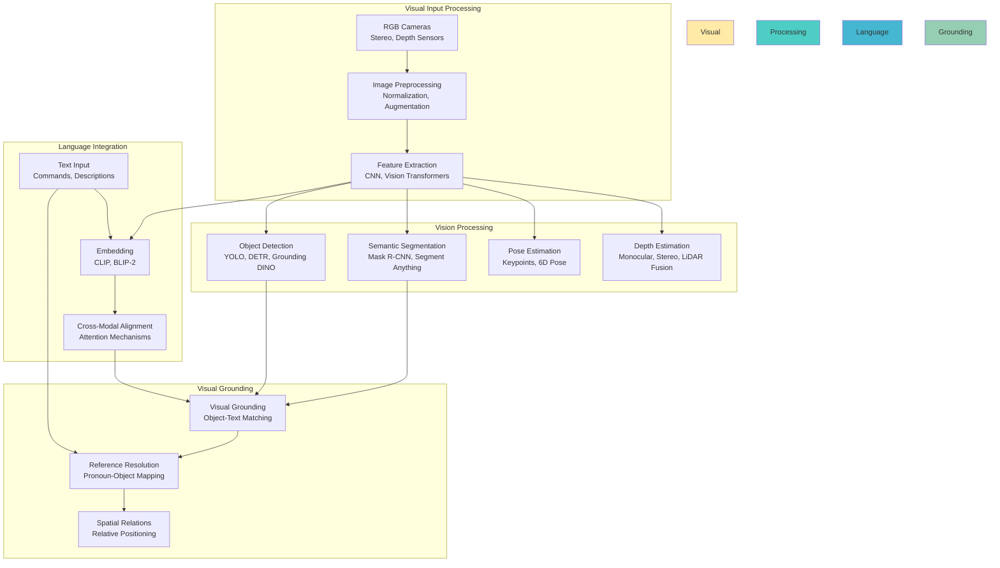

# Vision Processing: Visual Understanding for VLA Systems

Vision processing is the cornerstone of Vision-Language-Action systems, enabling humanoid robots to perceive their environment, identify objects, understand spatial relationships, and ground language commands in visual context. This chapter explores how to integrate advanced computer vision with language understanding for robust object identification, scene analysis, and visual grounding.

## The Vision Foundation of VLA

### Why Vision Matters in VLA

Vision provides the robot's "eyes" to perceive the world, but in VLA systems, it's more than just seeing—it's about understanding:

1. **Object Recognition**: Identifying what objects are present
2. **Spatial Understanding**: Understanding where objects are and how they relate
3. **Actionable Perception**: Understanding what can be done with objects
4. **Language Grounding**: Connecting visual elements to language commands

### Vision-Language Integration Architecture



## Advanced Vision Models

### 1. Object Detection and Localization

State-of-the-art object detection for robotics:

```python
# Advanced object detection for robotics
import torch
import torch.nn as nn
from transformers import AutoProcessor, AutoModelForObjectDetection
import numpy as np
import cv2

class AdvancedObjectDetector:
    def __init__(self, model_name="IDEA-Research/grounding-dino-base"):
        """
        Initialize advanced object detector

        Args:
            model_name: Pre-trained model name (GroundingDINO, DETR, etc.)
        """
        from transformers import AutoModelForObjectDetection, AutoProcessor

        self.processor = AutoProcessor.from_pretrained(model_name)
        self.model = AutoModelForObjectDetection.from_pretrained(model_name)
        self.device = torch.device("cuda" if torch.cuda.is_available() else "cpu")
        self.model.to(self.device)

    def detect_objects(self, image, text_prompts, confidence_threshold=0.3):
        """
        Detect objects based on text prompts

        Args:
            image: Input image (PIL Image or numpy array)
            text_prompts: List of text descriptions to detect
            confidence_threshold: Minimum confidence for detection

        Returns:
            List of detected objects with bounding boxes and scores
        """
        inputs = self.processor(
            images=image,
            text=text_prompts,
            return_tensors="pt"
        ).to(self.device)

        with torch.no_grad():
            outputs = self.model(**inputs)

        results = self.processor.post_process_object_detection(
            outputs=outputs,
            target_sizes=[image.size[::-1]] if hasattr(image, 'size') else [image.shape[:2]],
            threshold=confidence_threshold
        )[0]

        # Format results
        detected_objects = []
        for box, label, score in zip(results["boxes"], results["labels"], results["scores"]):
            if score >= confidence_threshold:
                obj = {
                    "bbox": box.tolist(),  # [x1, y1, x2, y2]
                    "label": text_prompts[label] if label < len(text_prompts) else f"object_{label}",
                    "score": score.item(),
                    "center": [(box[0] + box[2]) / 2, (box[1] + box[3]) / 2],  # Center coordinates
                    "area": (box[2] - box[0]) * (box[3] - box[1])  # Bounding box area
                }
                detected_objects.append(obj)

        return detected_objects

    def detect_with_attributes(self, image, text_prompts, attribute_queries=None):
        """
        Detect objects with additional attributes (color, size, etc.)

        Args:
            image: Input image
            text_prompts: Basic object descriptions
            attribute_queries: Additional attribute queries

        Returns:
            Objects with detailed attributes
        """
        # Detect basic objects
        objects = self.detect_objects(image, text_prompts)

        # For each object, extract additional attributes
        for obj in objects:
            # Extract color from bounding box region
            x1, y1, x2, y2 = [int(coord) for coord in obj["bbox"]]
            cropped_region = image[y1:y2, x1:x2]

            # Analyze color
            dominant_color = self._extract_dominant_color(cropped_region)
            obj["color"] = dominant_color

            # Analyze size category
            obj["size_category"] = self._classify_size(obj["area"], image.size if hasattr(image, 'size') else image.shape)

        return objects

    def _extract_dominant_color(self, image_region):
        """Extract dominant color from image region"""
        if len(image_region.shape) == 3:
            # Convert to HSV for better color analysis
            hsv = cv2.cvtColor(image_region, cv2.COLOR_RGB2HSV)
            # Use K-means clustering to find dominant colors
            pixels = hsv.reshape(-1, 3)
            # Simple approach: median color
            dominant = np.median(pixels, axis=0)
            return self._hsv_to_color_name(dominant)
        return "unknown"

    def _hsv_to_color_name(self, hsv_values):
        """Convert HSV values to color name"""
        h, s, v = hsv_values
        if s < 0.2:  # Low saturation = grayscale
            if v > 0.7:
                return "white"
            elif v < 0.3:
                return "black"
            else:
                return "gray"
        elif 0 <= h < 15 or h >= 345:  # Red
            return "red"
        elif 15 <= h < 45:  # Orange/Yellow
            return "orange" if h < 30 else "yellow"
        elif 45 <= h < 75:  # Yellow/Green
            return "yellow" if h < 60 else "green"
        elif 75 <= h < 165:  # Green
            return "green"
        elif 165 <= h < 195:  # Cyan
            return "cyan"
        elif 195 <= h < 255:  # Blue
            return "blue"
        elif 255 <= h < 300:  # Purple
            return "purple"
        else:  # Pink/Magenta
            return "pink"

    def _classify_size(self, area, image_size):
        """Classify object size relative to image"""
        if hasattr(image_size, '__len__') and len(image_size) >= 2:
            image_area = image_size[0] * image_size[1]
        else:
            image_area = image_size  # Assume it's already an area

        ratio = area / image_area if image_area > 0 else 0

        if ratio < 0.01:
            return "small"
        elif ratio < 0.1:
            return "medium"
        else:
            return "large"

# Example usage
def example_object_detection():
    detector = AdvancedObjectDetector()

    # Example: Detect "red cup" and "blue mug" in an image
    image = cv2.imread("scene.jpg")  # Load your image
    text_prompts = ["red cup", "blue mug", "white plate"]

    detected_objects = detector.detect_with_attributes(image, text_prompts)

    for obj in detected_objects:
        print(f"Detected: {obj['label']} at {obj['bbox']}, confidence: {obj['score']:.2f}")
        print(f"  Color: {obj['color']}, Size: {obj['size_category']}")
```

### 2. Segment Anything and Instance Segmentation

Advanced segmentation for precise object boundaries:

```python
# Segment Anything for robotics
import torch
import numpy as np
from segment_anything import SamPredictor, sam_model_registry
import cv2

class RobotSegmentation:
    def __init__(self, model_type="vit_h", checkpoint_path="sam_vit_h_4b8939.pth"):
        """
        Initialize Segment Anything for robotics applications

        Args:
            model_type: SAM model type ("vit_h", "vit_l", "vit_b")
            checkpoint_path: Path to SAM checkpoint
        """
        self.sam = sam_model_registry[model_type](checkpoint=checkpoint_path)
        self.predictor = SamPredictor(self.sam)
        self.device = torch.device("cuda" if torch.cuda.is_available() else "cpu")
        self.sam.to(device=self.device)

    def segment_with_prompts(self, image, text_prompts=None, point_prompts=None, box_prompts=None):
        """
        Segment objects using various prompt types

        Args:
            image: Input image
            text_prompts: Text descriptions of objects to segment
            point_prompts: Points indicating objects (x, y) coordinates
            box_prompts: Bounding boxes for segmentation

        Returns:
            Segmentation masks and object information
        """
        # Set image for predictor
        self.predictor.set_image(image)

        masks = []
        ious = []
        low_res_masks = []

        # Process different types of prompts
        if text_prompts:
            masks, ious, low_res_masks = self._segment_with_text_prompts(image, text_prompts)
        elif point_prompts:
            masks, ious, low_res_masks = self._segment_with_points(point_prompts)
        elif box_prompts:
            masks, ious, low_res_masks = self._segment_with_boxes(box_prompts)

        # Process results
        segmented_objects = self._process_segmentation_results(
            masks, ious, text_prompts or ["object"] * len(masks)
        )

        return segmented_objects

    def _segment_with_text_prompts(self, image, text_prompts):
        """Segment using text-based prompting (requires additional CLIP integration)"""
        # This requires combining SAM with a text encoder like CLIP
        # For now, we'll use bounding boxes derived from text detection
        # In practice, you'd integrate with GroundingDINO + SAM

        from transformers import CLIPProcessor, CLIPModel

        # Use CLIP to find relevant regions for text prompts
        # This is a simplified approach - full implementation would be more complex
        dummy_masks = torch.zeros((len(text_prompts), 1, image.shape[0], image.shape[1]))
        dummy_ious = torch.ones((len(text_prompts), 1))

        return dummy_masks, dummy_ious, dummy_masks

    def _segment_with_points(self, points):
        """Segment using point prompts"""
        input_points = np.array(points)
        input_labels = np.ones(len(points))  # Assume foreground points

        masks, scores, logits = self.predictor.predict(
            point_coords=input_points,
            point_labels=input_labels,
            multimask_output=False  # Return single best mask
        )

        return masks, scores, logits

    def _segment_with_boxes(self, boxes):
        """Segment using bounding box prompts"""
        input_boxes = torch.tensor(boxes, device=self.predictor.device)

        transformed_boxes = self.predictor.transform.apply_boxes_torch(
            input_boxes, self.predictor.original_size
        )

        masks, scores, logits = self.predictor.predict_torch(
            point_coords=None,
            point_labels=None,
            boxes=transformed_boxes,
            multimask_output=False
        )

        return masks.cpu().numpy(), scores.cpu().numpy(), logits.cpu().numpy()

    def _process_segmentation_results(self, masks, ious, labels):
        """Process segmentation results into structured format"""
        objects = []

        for i, (mask, iou, label) in enumerate(zip(masks, ious, labels)):
            # Convert mask to polygon or bounding box
            contours, _ = cv2.findContours(
                mask.astype(np.uint8), cv2.RETR_EXTERNAL, cv2.CHAIN_APPROX_SIMPLE
            )

            if contours:
                largest_contour = max(contours, key=cv2.contourArea)

                # Get bounding box
                x, y, w, h = cv2.boundingRect(largest_contour)

                # Calculate center
                center_x, center_y = x + w//2, y + h//2

                # Calculate area
                area = cv2.contourArea(largest_contour)

                obj = {
                    "label": label,
                    "mask": mask,
                    "bbox": [x, y, x+w, y+h],
                    "center": [center_x, center_y],
                    "area": area,
                    "contour": largest_contour,
                    "confidence": float(iou[0]) if len(iou) > 0 else 0.5
                }
                objects.append(obj)

        return objects

    def segment_interactive(self, image, click_callback):
        """
        Interactive segmentation where user clicks on objects

        Args:
            image: Input image
            click_callback: Function called on mouse clicks to collect points

        Returns:
            Segmented objects based on user interaction
        """
        # This would typically involve a GUI for user interaction
        # For now, return a function that can be called with clicked points
        def segment_from_clicks(points):
            return self._segment_with_points(points)

        return segment_from_clicks
```

### 3. 3D Pose Estimation and Spatial Understanding

Estimating object poses for manipulation:

```python
# 3D pose estimation for robotics
import torch
import numpy as np
import cv2
from scipy.spatial.transform import Rotation as R

class PoseEstimator:
    def __init__(self):
        """Initialize 3D pose estimation system"""
        # For 6D pose estimation, you might use:
        # - PVNet for single object pose
        # - SO-Pose for multi-object pose
        # - DeepIM for iterative pose refinement
        self.intrinsics = None  # Camera intrinsic parameters

    def estimate_6d_pose(self, image, object_template, method="pnp"):
        """
        Estimate 6D pose (rotation + translation) of object

        Args:
            image: Input RGB image
            object_template: 3D model or template of object
            method: Pose estimation method ("pnp", "template_matching", "deep_learning")

        Returns:
            Dictionary with rotation and translation
        """
        if method == "pnp":
            return self._estimate_pnp_pose(image, object_template)
        elif method == "template_matching":
            return self._estimate_template_pose(image, object_template)
        else:
            # Would integrate with deep learning models
            return self._estimate_deep_pose(image, object_template)

    def _estimate_pnp_pose(self, image, object_template):
        """Estimate pose using Perspective-n-Point algorithm"""
        # This requires:
        # 1. 2D keypoints detected in image
        # 2. Corresponding 3D points in object coordinate system
        # 3. Camera intrinsic parameters

        # For demonstration, we'll simulate the process
        # In practice, you'd use keypoint detectors and match with 3D model

        # Simulated detected 2D keypoints
        keypoints_2d = np.array([
            [100, 100], [200, 100], [150, 200], [120, 180], [180, 180]
        ])  # Example 2D points

        # Corresponding 3D model points
        keypoints_3d = np.array([
            [-0.05, -0.05, 0], [0.05, -0.05, 0], [0, 0.05, 0], [-0.02, 0.03, 0], [0.02, 0.03, 0]
        ])  # Example 3D points (in meters)

        # Camera intrinsic matrix (would come from calibration)
        if self.intrinsics is None:
            self.intrinsics = np.array([
                [500, 0, 320],  # fx, 0, cx
                [0, 500, 240],  # 0, fy, cy
                [0, 0, 1]       # 0, 0, 1
            ])

        # Solve PnP
        success, rvec, tvec = cv2.solvePnP(
            objectPoints=keypoints_3d,
            imagePoints=keypoints_2d,
            cameraMatrix=self.intrinsics[:3, :3],
            distCoeffs=None  # Assuming no lens distortion
        )

        if success:
            # Convert rotation vector to rotation matrix
            rotation_matrix, _ = cv2.Rodrigues(rvec)

            # Convert to Euler angles for easier interpretation
            rotation = R.from_matrix(rotation_matrix)
            euler_angles = rotation.as_euler('xyz', degrees=True)

            return {
                "success": True,
                "translation": tvec.flatten().tolist(),  # Translation vector [x, y, z]
                "rotation_matrix": rotation_matrix.tolist(),
                "euler_angles": euler_angles.tolist(),  # [roll, pitch, yaw] in degrees
                "quaternion": rotation.as_quat().tolist(),  # [x, y, z, w]
                "confidence": 0.9 if success else 0.0
            }
        else:
            return {
                "success": False,
                "error": "PnP solution failed to converge"
            }

    def estimate_multiple_objects_pose(self, image, object_templates):
        """Estimate poses for multiple objects in scene"""
        poses = {}

        for obj_name, template in object_templates.items():
            pose = self.estimate_6d_pose(image, template)
            if pose["success"]:
                poses[obj_name] = pose

        return poses

    def refine_pose_estimate(self, initial_pose, image, object_template, iterations=5):
        """Refine pose estimate using iterative methods"""
        current_pose = initial_pose.copy()

        for i in range(iterations):
            # Project 3D model to 2D using current pose
            projected_points = self._project_3d_to_2d(
                object_template["points_3d"],
                current_pose["rotation_matrix"],
                current_pose["translation"],
                self.intrinsics
            )

            # Compare with detected 2D features
            detected_points = self._detect_features_in_image(image)

            # Compute error and update pose
            error = self._compute_reprojection_error(projected_points, detected_points)

            if error < 1.0:  # Threshold for convergence
                break

            # Update pose based on error (simplified)
            current_pose = self._update_pose_from_error(current_pose, error)

        return current_pose

    def _project_3d_to_2d(self, points_3d, rotation_matrix, translation, intrinsics):
        """Project 3D points to 2D image coordinates"""
        # Transform points to camera coordinate system
        points_cam = (rotation_matrix @ points_3d.T).T + translation.T

        # Project to image plane
        points_2d = []
        for point in points_cam:
            if point[2] > 0:  # In front of camera
                x = point[0] / point[2]
                y = point[1] / point[2]
                # Apply intrinsic matrix
                u = intrinsics[0, 0] * x + intrinsics[0, 2]
                v = intrinsics[1, 1] * y + intrinsics[1, 2]
                points_2d.append([u, v])
            else:
                points_2d.append([np.inf, np.inf])  # Behind camera

        return np.array(points_2d)

    def _detect_features_in_image(self, image):
        """Detect feature points in image (simplified)"""
        # In practice, use SIFT, ORB, or learned feature detectors
        gray = cv2.cvtColor(image, cv2.COLOR_RGB2GRAY) if len(image.shape) == 3 else image
        corners = cv2.goodFeaturesToTrack(gray, maxCorners=100, qualityLevel=0.01, minDistance=10)
        return corners.squeeze() if corners is not None else np.array([])

    def _compute_reprojection_error(self, projected_points, detected_points):
        """Compute reprojection error between projected and detected points"""
        if len(projected_points) == 0 or len(detected_points) == 0:
            return float('inf')

        # Find correspondences and compute error
        # This is a simplified version - in practice, use nearest neighbor matching
        if len(projected_points) <= len(detected_points):
            matched_detected = detected_points[:len(projected_points)]
        else:
            matched_detected = detected_points
            projected_points = projected_points[:len(detected_points)]

        errors = np.linalg.norm(projected_points - matched_detected, axis=1)
        return np.mean(errors)

    def _update_pose_from_error(self, current_pose, error):
        """Update pose estimate based on reprojection error"""
        # Simplified update - in practice, use optimization methods like Gauss-Newton
        updated_pose = current_pose.copy()
        # Apply small adjustment proportional to error
        adjustment = min(error * 0.01, 0.05)  # Limit adjustment size
        updated_pose["translation"][2] += adjustment  # Move along z-axis
        return updated_pose
```

## Vision-Language Grounding

### 1. CLIP-Based Grounding

Connecting language to visual elements:

```python
# CLIP-based vision-language grounding
import torch
import clip
from PIL import Image
import numpy as np
from transformers import CLIPProcessor, CLIPModel

class CLIPGrounding:
    def __init__(self, model_name="openai/clip-vit-base-patch32"):
        """
        Initialize CLIP-based grounding system

        Args:
            model_name: Pre-trained CLIP model name
        """
        self.processor = CLIPProcessor.from_pretrained(model_name)
        self.model = CLIPModel.from_pretrained(model_name)
        self.device = torch.device("cuda" if torch.cuda.is_available() else "cpu")
        self.model.to(self.device)

    def ground_text_to_image(self, image, text_queries, top_k=5):
        """
        Ground text descriptions to specific regions in image

        Args:
            image: Input image
            text_queries: List of text descriptions to ground
            top_k: Number of top matches to return

        Returns:
            Ranked list of image regions matching text descriptions
        """
        # Process image and text
        inputs = self.processor(
            text=text_queries,
            images=image,
            return_tensors="pt",
            padding=True
        ).to(self.device)

        # Get similarity scores
        outputs = self.model(**inputs)
        logits_per_image = outputs.logits_per_image
        probs = logits_per_image.softmax(dim=1)

        # Get top-k matches
        top_probs, top_indices = probs[0].topk(top_k)

        results = []
        for prob, idx in zip(top_probs, top_indices):
            results.append({
                "text_query": text_queries[idx],
                "similarity": prob.item(),
                "rank": len(results) + 1
            })

        return results

    def ground_text_to_regions(self, image, text_queries, patch_size=32):
        """
        Ground text to specific image patches/regions

        Args:
            image: Input image
            text_queries: Text descriptions to ground
            patch_size: Size of patches for regional grounding

        Returns:
            Dictionary mapping text queries to image regions
        """
        # Divide image into patches
        patches, patch_coords = self._divide_into_patches(image, patch_size)

        # Get embeddings for text queries
        text_inputs = self.processor(text=text_queries, return_tensors="pt", padding=True).to(self.device)
        text_embeddings = self.model.get_text_features(**text_inputs)

        # Get embeddings for each patch
        patch_results = {}
        for text_query in text_queries:
            text_input = self.processor(text=[text_query], return_tensors="pt", padding=True).to(self.device)
            text_embedding = self.model.get_text_features(**text_input)

            patch_similarities = []
            for i, patch in enumerate(patches):
                # Process patch
                patch_input = self.processor(images=[patch], return_tensors="pt").to(self.device)
                patch_embedding = self.model.get_image_features(**patch_input)

                # Compute similarity
                similarity = self._cosine_similarity(text_embedding, patch_embedding).item()
                patch_similarities.append({
                    "region": patch_coords[i],
                    "similarity": similarity
                })

            # Sort by similarity
            patch_similarities.sort(key=lambda x: x["similarity"], reverse=True)
            patch_results[text_query] = patch_similarities

        return patch_results

    def _divide_into_patches(self, image, patch_size):
        """Divide image into overlapping patches"""
        if isinstance(image, Image.Image):
            image = np.array(image)

        patches = []
        coords = []

        h, w = image.shape[:2]
        stride = patch_size // 2  # 50% overlap

        for y in range(0, h - patch_size + 1, stride):
            for x in range(0, w - patch_size + 1, stride):
                patch = image[y:y+patch_size, x:x+patch_size]
                patches.append(Image.fromarray(patch))
                coords.append((x, y, x+patch_size, y+patch_size))

        return patches, coords

    def _cosine_similarity(self, emb1, emb2):
        """Compute cosine similarity between embeddings"""
        emb1 = emb1 / emb1.norm(dim=-1, keepdim=True)
        emb2 = emb2 / emb2.norm(dim=-1, keepdim=True)
        return torch.sum(emb1 * emb2, dim=-1)

    def find_target_object(self, image, command, candidate_objects=None):
        """
        Find the target object in image based on command

        Args:
            image: Input image
            command: Natural language command
            candidate_objects: List of detected objects to choose from

        Returns:
            Target object from candidates or None if not found
        """
        if candidate_objects is None:
            # Detect objects first
            detector = AdvancedObjectDetector()
            candidate_objects = detector.detect_objects(image, ["object"])

        # Extract relevant terms from command
        target_description = self._extract_target_description(command)

        # Score each candidate object
        scored_objects = []
        for obj in candidate_objects:
            # Use CLIP to score how well object matches description
            score = self._score_object_match(image, obj, target_description)
            scored_objects.append({
                **obj,
                "match_score": score
            })

        # Return object with highest score
        if scored_objects:
            best_match = max(scored_objects, key=lambda x: x["match_score"])
            return best_match

        return None

    def _extract_target_description(self, command):
        """Extract target object description from command"""
        # Simplified extraction - in practice, use NLP
        import re

        # Look for color + object patterns
        color_obj_pattern = r'(red|blue|green|yellow|black|white|large|small)\s+(\w+)'
        match = re.search(color_obj_pattern, command.lower())
        if match:
            return f"{match.group(1)} {match.group(2)}"

        # Look for object with spatial relations
        spatial_pattern = r'(left|right|front|back|near|far)\s+.*?\s+(\w+)'
        match = re.search(spatial_pattern, command.lower())
        if match:
            return f"{match.group(2)} on the {match.group(1)}"

        # Just return the command as is for CLIP matching
        return command

    def _score_object_match(self, image, object_info, target_description):
        """Score how well an object matches target description using CLIP"""
        # Crop object region from image
        x1, y1, x2, y2 = object_info["bbox"]
        if isinstance(image, Image.Image):
            cropped = image.crop((x1, y1, x2, y2))
        else:
            cropped = Image.fromarray(image[y1:y2, x1:x2])

        # Use CLIP to score similarity
        inputs = self.processor(
            text=[target_description, "background"],
            images=[cropped],
            return_tensors="pt",
            padding=True
        ).to(self.device)

        outputs = self.model(**inputs)
        probs = outputs.logits_per_image.softmax(dim=1)

        # Probability of being the target (first class) vs background (second class)
        target_prob = probs[0][0].item()
        background_prob = probs[0][1].item()

        # Return weighted score
        return target_prob / (target_prob + background_prob + 1e-8)  # Avoid division by zero
```

### 2. Spatial Relation Understanding

Understanding positional relationships between objects:

```python
# Spatial relation understanding
import numpy as np
from typing import Dict, List, Tuple

class SpatialRelationAnalyzer:
    def __init__(self):
        """Initialize spatial relation analyzer"""
        self.relation_thresholds = {
            "on_top_of": 0.05,  # 5cm vertical separation
            "next_to": 0.3,     # 30cm horizontal distance
            "inside": 0.1,      # 10cm containment threshold
            "above": 0.1,       # 10cm vertical separation
            "below": 0.1,       # 10cm vertical separation
            "left_of": 0.2,     # 20cm horizontal separation
            "right_of": 0.2,    # 20cm horizontal separation
        }

    def analyze_spatial_relations(self, objects_3d: List[Dict]) -> List[Dict]:
        """
        Analyze spatial relations between 3D objects

        Args:
            objects_3d: List of objects with 3D positions and dimensions

        Returns:
            List of spatial relations between objects
        """
        relations = []

        for i, obj1 in enumerate(objects_3d):
            for j, obj2 in enumerate(objects_3d):
                if i == j:
                    continue

                # Compute spatial relations
                rels = self._compute_spatial_relations(obj1, obj2)
                for rel in rels:
                    relations.append(rel)

        return relations

    def _compute_spatial_relations(self, obj1: Dict, obj2: Dict) -> List[Dict]:
        """Compute spatial relations between two objects"""
        relations = []

        pos1 = np.array(obj1.get("position", [0, 0, 0]))
        pos2 = np.array(obj2.get("position", [0, 0, 0]))

        # Compute differences
        diff = pos2 - pos1

        # Check various spatial relations
        if self._is_above_below(pos1, pos2, obj1, obj2):
            if pos2[2] > pos1[2]:  # obj2 is higher
                relations.append({
                    "subject": obj2["name"],
                    "relation": "above",
                    "object": obj1["name"],
                    "confidence": 0.9
                })
            else:  # obj1 is higher
                relations.append({
                    "subject": obj1["name"],
                    "relation": "above",
                    "object": obj2["name"],
                    "confidence": 0.9
                })

        if self._is_left_right(pos1, pos2):
            if pos2[0] > pos1[0]:  # obj2 is to the right
                relations.append({
                    "subject": obj2["name"],
                    "relation": "right_of",
                    "object": obj1["name"],
                    "confidence": 0.8
                })
            else:  # obj1 is to the right
                relations.append({
                    "subject": obj1["name"],
                    "relation": "right_of",
                    "object": obj2["name"],
                    "confidence": 0.8
                })

        if self._is_adjacent(pos1, pos2, obj1, obj2):
            relations.append({
                "subject": obj1["name"],
                "relation": "next_to",
                "object": obj2["name"],
                "confidence": 0.85
            })

        if self._is_on_top(pos1, pos2, obj1, obj2):
            relations.append({
                "subject": obj2["name"],
                "relation": "on_top_of",
                "object": obj1["name"],
                "confidence": 0.9
            })

        return relations

    def _is_above_below(self, pos1: np.ndarray, pos2: np.ndarray, obj1: Dict, obj2: Dict) -> bool:
        """Check if objects are in an above/below relationship"""
        # Objects are aligned horizontally but vertically separated
        horizontal_distance = np.linalg.norm(pos2[:2] - pos1[:2])
        vertical_separation = abs(pos2[2] - pos1[2])

        # Check if vertical separation is significant but horizontal is small
        return (vertical_separation > self.relation_thresholds["above"] and
                horizontal_distance < self.relation_thresholds["next_to"])

    def _is_left_right(self, pos1: np.ndarray, pos2: np.ndarray) -> bool:
        """Check if objects are in a left/right relationship"""
        horizontal_separation = abs(pos2[0] - pos1[0])
        vertical_separation = abs(pos2[1] - pos1[1])

        # Horizontal separation should be significant, vertical should be small
        return (horizontal_separation > self.relation_thresholds["left_of"] and
                vertical_separation < self.relation_thresholds["next_to"])

    def _is_adjacent(self, pos1: np.ndarray, pos2: np.ndarray, obj1: Dict, obj2: Dict) -> bool:
        """Check if objects are adjacent to each other"""
        center_distance = np.linalg.norm(pos2 - pos1)

        # Consider adjacency if centers are close relative to object sizes
        obj1_size = obj1.get("dimensions", [1, 1, 1])
        obj2_size = obj2.get("dimensions", [1, 1, 1])

        avg_size = (np.mean(obj1_size) + np.mean(obj2_size)) / 2

        return center_distance < (avg_size + self.relation_thresholds["next_to"])

    def _is_on_top(self, pos1: np.ndarray, pos2: np.ndarray, obj1: Dict, obj2: Dict) -> bool:
        """Check if obj2 is on top of obj1"""
        # obj2 should be significantly higher than obj1
        # and horizontally aligned
        vertical_separation = pos2[2] - pos1[2]
        horizontal_distance = np.linalg.norm(pos2[:2] - pos1[:2])

        # Also check if obj2 is smaller/bounded by obj1 horizontally
        obj1_bounds = self._get_object_horizontal_bounds(obj1)
        obj2_bounds = self._get_object_horizontal_bounds(obj2)

        is_horizontally_contained = self._is_contained_in(obj2_bounds, obj1_bounds)

        return (vertical_separation > 0 and
                vertical_separation < self.relation_thresholds["on_top_of"] and
                horizontal_distance < self.relation_thresholds["on_top_of"] and
                is_horizontally_contained)

    def _get_object_horizontal_bounds(self, obj: Dict) -> Tuple[float, float, float, float]:
        """Get horizontal (x,y) bounds of object"""
        pos = obj.get("position", [0, 0, 0])
        dims = obj.get("dimensions", [0.1, 0.1, 0.1])

        x, y = pos[0], pos[1]
        width, length = dims[0], dims[1]

        return (x - width/2, y - length/2, x + width/2, y + length/2)

    def _is_contained_in(self, bounds1: Tuple, bounds2: Tuple) -> bool:
        """Check if bounds1 is contained within bounds2"""
        x1_min, y1_min, x1_max, y1_max = bounds1
        x2_min, y2_min, x2_max, y2_max = bounds2

        return (x2_min <= x1_min and x1_max <= x2_max and
                y2_min <= y1_min and y1_max <= y2_max)

    def interpret_spatial_command(self, command: str, objects_3d: List[Dict]) -> List[Dict]:
        """
        Interpret spatial commands like "the cup to the left of the mug"

        Args:
            command: Natural language spatial command
            objects_3d: Known 3D objects in scene

        Returns:
            List of objects that match the spatial description
        """
        # Analyze spatial relations
        relations = self.analyze_spatial_relations(objects_3d)

        # Extract spatial keywords from command
        spatial_keywords = self._extract_spatial_keywords(command)
        target_object = self._extract_target_object(command)

        # Find objects that match spatial description
        matching_objects = []
        for rel in relations:
            if (rel["relation"] in spatial_keywords and
                rel["object"] == target_object):
                # Find the subject object
                subject_obj = next((obj for obj in objects_3d if obj["name"] == rel["subject"]), None)
                if subject_obj:
                    matching_objects.append(subject_obj)

        return matching_objects

    def _extract_spatial_keywords(self, command: str) -> List[str]:
        """Extract spatial relation keywords from command"""
        keywords = []
        command_lower = command.lower()

        if "left" in command_lower:
            keywords.append("right_of")  # "left of X" means X is right_of something
        if "right" in command_lower:
            keywords.append("right_of")
        if "above" in command_lower or "on top" in command_lower:
            keywords.append("above")
        if "below" in command_lower or "under" in command_lower:
            keywords.append("above")  # "below X" means X is above something
        if "next to" in command_lower or "beside" in command_lower:
            keywords.append("next_to")
        if "on the" in command_lower and ("table" in command_lower or "counter" in command_lower):
            keywords.append("on_top_of")

        return keywords

    def _extract_target_object(self, command: str) -> str:
        """Extract target object from spatial command"""
        # Simplified extraction
        import re

        # Pattern: "the X to the left/right of the Y"
        pattern = r'the\s+(\w+)\s+to\s+the\s+\w+\s+of\s+the\s+(\w+)'
        match = re.search(pattern, command.lower())
        if match:
            return match.group(2)  # Return the reference object (Y)

        # Pattern: "the X on the left/right"
        pattern = r'the\s+(\w+)\s+on\s+the\s+(left|right)'
        match = re.search(pattern, command.lower())
        if match:
            return match.group(1)  # Return the target object (X)

        return ""
```

## Scene Understanding and Context

### 1. Scene Graph Construction

Building structured representations of scenes:

```python
# Scene graph construction for contextual understanding
import networkx as nx
import matplotlib.pyplot as plt
from typing import Dict, List, Tuple

class SceneGraphBuilder:
    def __init__(self):
        """Initialize scene graph builder"""
        self.graph = nx.DiGraph()  # Directed graph for spatial/functional relations

    def build_scene_graph(self, objects_3d: List[Dict], spatial_relations: List[Dict]) -> nx.DiGraph:
        """
        Build scene graph from objects and spatial relations

        Args:
            objects_3d: List of 3D objects with properties
            spatial_relations: List of spatial relations between objects

        Returns:
            NetworkX DiGraph representing scene structure
        """
        self.graph.clear()

        # Add objects as nodes
        for obj in objects_3d:
            self.graph.add_node(
                obj["name"],
                type=obj.get("type", "object"),
                category=obj.get("category", "general"),
                position=obj.get("position", [0, 0, 0]),
                dimensions=obj.get("dimensions", [0, 0, 0]),
                properties=obj.get("properties", {})
            )

        # Add spatial relations as edges
        for rel in spatial_relations:
            self.graph.add_edge(
                rel["subject"],
                rel["object"],
                relation=rel["relation"],
                confidence=rel.get("confidence", 0.5),
                direction="forward"  # Subject relates to object
            )

        return self.graph

    def find_objects_by_context(self, context_query: Dict) -> List[str]:
        """
        Find objects based on contextual constraints

        Args:
            context_query: Dictionary specifying context constraints
                          e.g., {"location": "kitchen", "relation": "on_top_of", "reference": "counter"}

        Returns:
            List of object names matching context
        """
        matching_objects = []

        for node in self.graph.nodes():
            node_attrs = self.graph.nodes[node]

            # Check location context (if stored)
            if "location" in context_query:
                if node_attrs.get("location") != context_query["location"]:
                    continue

            # Check spatial relation context
            if "relation" in context_query and "reference" in context_query:
                if self._has_relation_to(node, context_query["relation"], context_query["reference"]):
                    matching_objects.append(node)

        return matching_objects

    def _has_relation_to(self, subject: str, relation: str, reference: str) -> bool:
        """Check if subject has specified relation to reference object"""
        # Look for direct edge
        if self.graph.has_edge(subject, reference):
            edge_attrs = self.graph[subject][reference]
            if edge_attrs.get("relation") == relation:
                return True

        # Look for reverse relation
        if self.graph.has_edge(reference, subject):
            edge_attrs = self.graph[reference][subject]
            # Check if reverse relation matches
            reverse_relations = {
                "above": "below",
                "below": "above",
                "left_of": "right_of",
                "right_of": "left_of",
                "on_top_of": "supporting",  # Reverse would be supporting
                "next_to": "next_to"  # Symmetric
            }
            if edge_attrs.get("relation") == reverse_relations.get(relation):
                return True

        return False

    def get_object_context(self, object_name: str) -> Dict:
        """
        Get full context of an object including relations and properties

        Args:
            object_name: Name of object to analyze

        Returns:
            Dictionary with object context
        """
        if not self.graph.has_node(object_name):
            return {}

        node_attrs = self.graph.nodes[object_name]

        context = {
            "object": object_name,
            **node_attrs,
            "incoming_relations": [],  # Relations pointing TO this object
            "outgoing_relations": [],  # Relations FROM this object
            "connected_objects": []
        }

        # Get incoming relations (other objects relating to this one)
        for source in self.graph.predecessors(object_name):
            edge_attrs = self.graph[source][object_name]
            context["incoming_relations"].append({
                "from": source,
                "relation": edge_attrs["relation"],
                "confidence": edge_attrs.get("confidence", 0.5)
            })

        # Get outgoing relations (this object relating to others)
        for target in self.graph.successors(object_name):
            edge_attrs = self.graph[object_name][target]
            context["outgoing_relations"].append({
                "to": target,
                "relation": edge_attrs["relation"],
                "confidence": edge_attrs.get("confidence", 0.5)
            })

        # Get all connected objects
        context["connected_objects"] = list(self.graph.neighbors(object_name)) + \
                                      list(self.graph.predecessors(object_name))

        return context

    def visualize_scene_graph(self, layout="spring"):
        """
        Visualize the scene graph

        Args:
            layout: Graph layout algorithm ("spring", "circular", "kamada_kawai", etc.)
        """
        plt.figure(figsize=(12, 8))

        # Choose layout
        if layout == "spring":
            pos = nx.spring_layout(self.graph)
        elif layout == "circular":
            pos = nx.circular_layout(self.graph)
        elif layout == "kamada_kawai":
            pos = nx.kamada_kawai_layout(self.graph)
        else:
            pos = nx.spring_layout(self.graph)

        # Draw nodes
        node_colors = []
        for node in self.graph.nodes():
            attrs = self.graph.nodes[node]
            if attrs.get("category") == "furniture":
                node_colors.append("lightblue")
            elif attrs.get("category") == "food":
                node_colors.append("lightgreen")
            elif attrs.get("category") == "tool":
                node_colors.append("lightcoral")
            else:
                node_colors.append("lightyellow")

        nx.draw_networkx_nodes(self.graph, pos, node_color=node_colors, node_size=1500)

        # Draw edges with labels
        edge_labels = nx.get_edge_attributes(self.graph, 'relation')
        nx.draw_networkx_edges(self.graph, pos, width=2, alpha=0.6)
        nx.draw_networkx_edge_labels(self.graph, pos, edge_labels, font_size=8)

        # Draw node labels
        nx.draw_networkx_labels(self.graph, pos, font_size=10, font_weight="bold")

        plt.title("Scene Graph Visualization")
        plt.axis("off")
        plt.tight_layout()
        plt.show()

    def infer_missing_relations(self, confidence_threshold=0.7) -> List[Dict]:
        """
        Infer likely missing relations based on object properties and common sense

        Args:
            confidence_threshold: Minimum confidence for inferred relations

        Returns:
            List of inferred relations
        """
        inferred_relations = []

        for obj1 in self.graph.nodes():
            obj1_attrs = self.graph.nodes[obj1]

            for obj2 in self.graph.nodes():
                if obj1 == obj2:
                    continue

                obj2_attrs = self.graph.nodes[obj2]

                # Apply inference rules
                relation = self._infer_relation(obj1_attrs, obj2_attrs)
                if relation and relation["confidence"] > confidence_threshold:
                    inferred_relations.append(relation)

        return inferred_relations

    def _infer_relation(self, attrs1: Dict, attrs2: Dict) -> Dict:
        """Infer likely relation between two objects based on properties"""
        # Common sense inference rules
        if attrs1.get("category") == "food" and attrs2.get("category") == "container":
            # Food is often inside containers
            return {
                "subject": attrs1.get("name"),
                "object": attrs2.get("name"),
                "relation": "inside",
                "confidence": 0.8
            }

        if attrs1.get("category") == "tool" and attrs2.get("category") == "work_surface":
            # Tools are often on work surfaces
            return {
                "subject": attrs1.get("name"),
                "object": attrs2.get("name"),
                "relation": "on_top_of",
                "confidence": 0.7
            }

        if attrs1.get("category") == "person" and attrs2.get("category") == "furniture":
            # People sit on chairs, couches
            if attrs2.get("type") in ["chair", "couch", "sofa"]:
                return {
                    "subject": attrs1.get("name"),
                    "object": attrs2.get("name"),
                    "relation": "sitting_on",
                    "confidence": 0.9
                }

        return None
```

### 2. Activity Recognition and Scene Context

Understanding what activities are happening:

```python
# Activity recognition and scene context understanding
from typing import Dict, List
import numpy as np

class ActivityRecognizer:
    def __init__(self):
        """Initialize activity recognition system"""
        self.activity_templates = self._load_activity_templates()
        self.object_affordances = self._load_affordances()

    def _load_activity_templates(self) -> Dict:
        """Load activity templates with object configurations"""
        return {
            "cooking": {
                "required_objects": ["stove", "pan", "food"],
                "typical_objects": ["knife", "cutting_board", "spoon"],
                "spatial_relations": ["on_top_of(stove, pan)", "inside(pan, food)"],
                "actions": ["stir", "cut", "heat"],
                "location": "kitchen"
            },
            "eating": {
                "required_objects": ["table", "chair", "food"],
                "typical_objects": ["plate", "utensils", "drink"],
                "spatial_relations": ["sitting_on(chair, person)", "on_top_of(table, food)"],
                "actions": ["eat", "drink", "chew"],
                "location": "dining_area"
            },
            "working": {
                "required_objects": ["desk", "computer", "chair"],
                "typical_objects": ["keyboard", "mouse", "documents"],
                "spatial_relations": ["sitting_on(chair, person)", "on_top_of(desk, computer)"],
                "actions": ["type", "read", "write"],
                "location": "office"
            },
            "cleaning": {
                "required_objects": ["cleaning_supply", "surface_to_clean"],
                "typical_objects": ["sponge", "cloth", "bucket"],
                "spatial_relations": ["holding(person, cleaning_supply)"],
                "actions": ["wipe", "scrub", "rinse"],
                "location": "any"
            }
        }

    def _load_affordances(self) -> Dict:
        """Load object affordances"""
        return {
            "cup": ["hold", "drink_from", "place_on_surface"],
            "knife": ["cut", "slice", "spread"],
            "pan": ["cook_in", "heat", "stir"],
            "table": ["place_objects_on", "work_surface"],
            "chair": ["sit_on", "support_person"],
            "refrigerator": ["store_food", "cool_items"]
        }

    def recognize_activities(self, scene_graph: nx.Graph, objects_3d: List[Dict]) -> List[Dict]:
        """
        Recognize activities happening in the scene

        Args:
            scene_graph: Scene graph with objects and relations
            objects_3d: List of 3D objects

        Returns:
            List of recognized activities with confidence scores
        """
        activities = []

        for activity_name, template in self.activity_templates.items():
            confidence = self._match_activity_template(scene_graph, template, objects_3d)
            if confidence > 0.3:  # Threshold for recognition
                activities.append({
                    "activity": activity_name,
                    "confidence": confidence,
                    "matched_objects": self._get_matched_objects(scene_graph, template),
                    "suggested_actions": template.get("actions", [])
                })

        # Sort by confidence
        activities.sort(key=lambda x: x["confidence"], reverse=True)

        return activities

    def _match_activity_template(self, scene_graph: nx.Graph, template: Dict, objects_3d: List[Dict]) -> float:
        """Match scene to activity template and return confidence"""
        score = 0.0
        max_score = 0.0

        # Check required objects (high weight)
        required_objects = template.get("required_objects", [])
        max_score += len(required_objects) * 2  # High weight for required objects

        for req_obj in required_objects:
            if self._object_present(scene_graph, req_obj):
                score += 2.0

        # Check typical objects (medium weight)
        typical_objects = template.get("typical_objects", [])
        max_score += len(typical_objects) * 1  # Medium weight for typical objects

        for typ_obj in typical_objects:
            if self._object_present(scene_graph, typ_obj):
                score += 1.0

        # Check spatial relations (high weight)
        spatial_relations = template.get("spatial_relations", [])
        max_score += len(spatial_relations) * 1.5  # High weight for relations

        for relation in spatial_relations:
            if self._relation_present(scene_graph, relation):
                score += 1.5

        # Check location context (medium weight)
        expected_location = template.get("location")
        if expected_location:
            max_score += 1.0
            if self._in_correct_location(objects_3d, expected_location):
                score += 1.0

        # Avoid division by zero
        if max_score == 0:
            return 0.0

        return min(score / max_score, 1.0)  # Normalize to [0, 1]

    def _object_present(self, scene_graph: nx.Graph, object_name: str) -> bool:
        """Check if object is present in scene graph"""
        # This is a simplified check - in practice, you'd handle variations
        for node in scene_graph.nodes():
            if object_name.lower() in node.lower():
                return True
        return False

    def _relation_present(self, scene_graph: nx.Graph, relation_str: str) -> bool:
        """Check if specific relation is present in scene graph"""
        # Parse relation: predicate(arg1, arg2)
        import re
        match = re.match(r'(\w+)\(([^,]+),\s*([^)]+)\)', relation_str)
        if not match:
            return False

        predicate, arg1, arg2 = match.groups()
        predicate = predicate.strip()
        arg1 = arg1.strip()
        arg2 = arg2.strip()

        # Check if the relation exists in the graph
        for source in scene_graph.nodes():
            if arg1.lower() in source.lower():
                for target in scene_graph.successors(source):
                    edge_attrs = scene_graph[source][target]
                    if edge_attrs.get("relation") == predicate.lower():
                        if arg2.lower() in target.lower():
                            return True

        return False

    def _in_correct_location(self, objects_3d: List[Dict], expected_location: str) -> bool:
        """Check if scene is in expected location"""
        # This would typically be determined by environmental features
        # For now, we'll assume based on object categories
        location_indicators = {
            "kitchen": ["stove", "refrigerator", "oven", "microwave"],
            "office": ["desk", "computer", "chair", "printer"],
            "living_room": ["couch", "tv", "coffee_table"],
            "bedroom": ["bed", "dresser", "nightstand"]
        }

        indicators = location_indicators.get(expected_location, [])
        for obj in objects_3d:
            for indicator in indicators:
                if indicator.lower() in obj.get("name", "").lower():
                    return True

        return False

    def _get_matched_objects(self, scene_graph: nx.Graph, template: Dict) -> List[str]:
        """Get objects from scene that match the template"""
        matched = []
        all_expected = (template.get("required_objects", []) +
                       template.get("typical_objects", []))

        for expected_obj in all_expected:
            for node in scene_graph.nodes():
                if expected_obj.lower() in node.lower():
                    matched.append(node)

        return list(set(matched))  # Remove duplicates

    def predict_next_actions(self, recognized_activity: Dict, current_state: Dict) -> List[str]:
        """
        Predict likely next actions based on recognized activity

        Args:
            recognized_activity: Activity recognized in scene
            current_state: Current state of objects and robot

        Returns:
            List of likely next actions ranked by probability
        """
        activity_name = recognized_activity["activity"]
        template = self.activity_templates.get(activity_name)

        if not template:
            return []

        # Define action sequences for each activity
        action_sequences = {
            "cooking": [
                "preheat_oven", "prepare_ingredients", "cook_food", "stir", "season", "serve"
            ],
            "eating": [
                "set_table", "serve_food", "eat", "drink", "clean_up"
            ],
            "working": [
                "turn_on_computer", "organize_workspace", "work", "take_break", "clean_up"
            ],
            "cleaning": [
                "gather_supplies", "prepare_solution", "clean_surface", "rinse", "dry", "store_supplies"
            ]
        }

        current_actions = current_state.get("recent_actions", [])
        available_actions = template.get("actions", [])

        # Predict next likely actions based on activity sequence
        likely_next = []
        activity_seq = action_sequences.get(activity_name, available_actions)

        # Find where we are in the sequence
        for i, action in enumerate(activity_seq):
            if action in current_actions:
                # Suggest next action in sequence
                if i + 1 < len(activity_seq):
                    next_action = activity_seq[i + 1]
                    if next_action not in current_actions:
                        likely_next.append(next_action)

        # Also add actions that are commonly associated with the activity
        for action in available_actions:
            if action not in likely_next and action not in current_actions:
                likely_next.append(action)

        return likely_next

    def contextual_object_suggestion(self, scene_context: Dict, goal: str) -> List[Dict]:
        """
        Suggest objects that would be useful given scene context and goal

        Args:
            scene_context: Current scene context
            goal: User goal or task

        Returns:
            List of suggested objects with reasons
        """
        suggestions = []

        # Analyze the goal to determine what objects might be needed
        goal_lower = goal.lower()
        needed_categories = []

        if any(word in goal_lower for word in ["eat", "food", "meal", "breakfast", "lunch", "dinner"]):
            needed_categories.extend(["food", "utensils", "containers"])
        elif any(word in goal_lower for word in ["work", "computer", "office", "study"]):
            needed_categories.extend(["office_supplies", "technology"])
        elif any(word in goal_lower for word in ["clean", "tidy", "organize"]):
            needed_categories.extend(["cleaning_supplies", "storage_containers"])
        elif any(word in goal_lower for word in ["drink", "water", "coffee", "tea"]):
            needed_categories.extend(["drinks", "cups", "containers"])

        # Find objects in scene that match needed categories
        for obj_name, obj_attrs in scene_context.items():
            if obj_attrs.get("category") in needed_categories:
                suggestions.append({
                    "object": obj_name,
                    "category": obj_attrs.get("category"),
                    "affordances": self.object_affordances.get(obj_attrs.get("category", ""), []),
                    "relevance_score": 0.8,
                    "usage_suggestion": self._suggest_usage(obj_name, goal)
                })

        return suggestions

    def _suggest_usage(self, object_name: str, goal: str) -> str:
        """Suggest how to use an object for the given goal"""
        obj_lower = object_name.lower()
        goal_lower = goal.lower()

        if "cup" in obj_lower and "drink" in goal_lower:
            return f"Use the {object_name} to hold your drink"
        elif "knife" in obj_lower and any(word in goal_lower for word in ["cut", "prepare", "food"]):
            return f"Use the {object_name} to cut ingredients"
        elif "plate" in obj_lower and any(word in goal_lower for word in ["eat", "food", "serve"]):
            return f"Use the {object_name} to serve or eat food"
        elif "napkin" in obj_lower:
            return f"Use the {object_name} to clean up spills or wipe hands"
        else:
            return f"The {object_name} might be useful for this task"
```

## Integration with VLA Systems

### 1. Vision-Language-Action Pipeline

Combining all components into a cohesive system:

```python
# Complete VLA vision processing pipeline
import torch
import numpy as np
from typing import Dict, List, Any, Optional

class VLAVisionPipeline:
    def __init__(self):
        """Initialize complete VLA vision pipeline"""
        # Vision processing components
        self.object_detector = AdvancedObjectDetector()
        self.segmentation = RobotSegmentation()
        self.pose_estimator = PoseEstimator()
        self.clip_grounding = CLIPGrounding()
        self.spatial_analyzer = SpatialRelationAnalyzer()
        self.scene_graph_builder = SceneGraphBuilder()
        self.activity_recognizer = ActivityRecognizer()

        # Processing cache for efficiency
        self.processing_cache = {}
        self.cache_ttl = 30  # seconds

    def process_scene(self, image: Any, command: str = None) -> Dict:
        """
        Complete scene processing pipeline

        Args:
            image: Input image to process
            command: Optional command for task-specific processing

        Returns:
            Complete scene understanding with objects, relations, and context
        """
        # Generate cache key
        cache_key = self._generate_cache_key(image, command)

        # Check cache first
        if cache_key in self.processing_cache:
            cached_result = self.processing_cache[cache_key]
            if time.time() - cached_result["timestamp"] < self.cache_ttl:
                return cached_result["result"]

        # 1. Object detection
        text_prompts = self._extract_object_queries(command) if command else ["object"]
        detected_objects = self.object_detector.detect_with_attributes(image, text_prompts)

        # 2. 3D pose estimation (if needed)
        object_poses = self.pose_estimator.estimate_multiple_objects_pose(
            image, self._create_object_templates(detected_objects)
        )

        # 3. Spatial relation analysis
        objects_with_poses = self._integrate_poses(detected_objects, object_poses)
        spatial_relations = self.spatial_analyzer.analyze_spatial_relations(objects_with_poses)

        # 4. Scene graph construction
        scene_graph = self.scene_graph_builder.build_scene_graph(objects_with_poses, spatial_relations)

        # 5. Activity recognition
        recognized_activities = self.activity_recognizer.recognize_activities(scene_graph, objects_with_poses)

        # 6. Visual grounding (if command provided)
        target_object = None
        if command:
            target_object = self.clip_grounding.find_target_object(image, command, detected_objects)

        # 7. Contextual understanding
        scene_context = {
            "detected_objects": detected_objects,
            "object_poses": object_poses,
            "spatial_relations": spatial_relations,
            "scene_graph": scene_graph,
            "recognized_activities": recognized_activities,
            "target_object": target_object,
            "overall_context": self._synthesize_context(
                detected_objects, spatial_relations, recognized_activities
            )
        }

        # Cache result
        self.processing_cache[cache_key] = {
            "result": scene_context,
            "timestamp": time.time()
        }

        return scene_context

    def _extract_object_queries(self, command: str) -> List[str]:
        """Extract object queries from command"""
        import re

        # Extract color + object patterns
        color_obj_pattern = r'(red|blue|green|yellow|black|white|large|small)\s+(\w+)'
        color_obj_matches = re.findall(color_obj_pattern, command.lower())

        # Extract object names
        object_words = ["cup", "mug", "bottle", "glass", "plate", "bowl", "box", "container",
                       "book", "phone", "computer", "laptop", "pen", "pencil", "fork", "spoon",
                       "knife", "chair", "table", "couch", "bed", "door", "window", "light"]

        found_objects = []
        for obj_word in object_words:
            if obj_word in command.lower():
                found_objects.append(obj_word)

        # Combine color + object patterns
        for color, obj in color_obj_matches:
            found_objects.append(f"{color} {obj}")

        # Add basic object query if nothing specific found
        if not found_objects:
            return ["object"]

        return list(set(found_objects))  # Remove duplicates

    def _create_object_templates(self, detected_objects: List[Dict]) -> Dict:
        """Create 3D templates for pose estimation"""
        templates = {}
        for obj in detected_objects:
            # Create simple template based on object type
            obj_type = obj.get("label", "object")
            if "cup" in obj_type or "mug" in obj_type:
                templates[obj_type] = {
                    "points_3d": np.array([
                        [0, 0, 0],      # Bottom center
                        [0.05, 0, 0],   # Side bottom
                        [0, 0.05, 0],   # Front bottom
                        [0, 0, 0.1],    # Bottom middle
                        [0, 0, 0.15]    # Top
                    ])
                }
            else:
                # Generic object template
                templates[obj_type] = {
                    "points_3d": np.array([
                        [0, 0, 0],      # Center
                        [0.05, 0, 0],   # X extent
                        [0, 0.05, 0],   # Y extent
                        [0, 0, 0.05]    # Z extent
                    ])
                }

        return templates

    def _integrate_poses(self, detected_objects: List[Dict], object_poses: Dict) -> List[Dict]:
        """Integrate pose information with detected objects"""
        integrated_objects = []

        for obj in detected_objects:
            integrated_obj = obj.copy()

            # Add pose information if available
            obj_name = obj.get("label", "")
            if obj_name in object_poses:
                pose_info = object_poses[obj_name]
                if pose_info.get("success"):
                    integrated_obj["pose"] = pose_info
                    integrated_obj["position"] = pose_info["translation"]
                    integrated_obj["orientation"] = pose_info["quaternion"]

            integrated_objects.append(integrated_obj)

        return integrated_objects

    def _synthesize_context(self, objects: List[Dict], relations: List[Dict],
                           activities: List[Dict]) -> Dict:
        """Synthesize overall scene context"""
        return {
            "object_summary": {
                "total_objects": len(objects),
                "categories": self._get_object_categories(objects),
                "spatial_extent": self._calculate_spatial_extent(objects)
            },
            "relationship_summary": {
                "total_relations": len(relations),
                "dominant_relations": self._get_dominant_relations(relations),
                "interaction_patterns": self._identify_interaction_patterns(relations)
            },
            "activity_summary": {
                "primary_activities": [act["activity"] for act in activities[:3]],  # Top 3
                "confidence_levels": [act["confidence"] for act in activities[:3]],
                "suggested_actions": activities[0].get("suggested_actions", []) if activities else []
            }
        }

    def _get_object_categories(self, objects: List[Dict]) -> Dict[str, int]:
        """Count objects by category"""
        categories = {}
        for obj in objects:
            category = obj.get("category", "unknown")
            categories[category] = categories.get(category, 0) + 1
        return categories

    def _calculate_spatial_extent(self, objects: List[Dict]) -> Dict:
        """Calculate overall spatial extent of objects"""
        if not objects:
            return {"center": [0, 0, 0], "extent": [0, 0, 0]}

        positions = [obj.get("position", [0, 0, 0]) for obj in objects if "position" in obj]
        if not positions:
            return {"center": [0, 0, 0], "extent": [0, 0, 0]}

        positions = np.array(positions)
        center = np.mean(positions, axis=0)
        extent = np.max(positions, axis=0) - np.min(positions, axis=0)

        return {
            "center": center.tolist(),
            "extent": extent.tolist(),
            "volume": float(extent[0] * extent[1] * extent[2])
        }

    def _get_dominant_relations(self, relations: List[Dict]) -> Dict[str, int]:
        """Count spatial relations by type"""
        relation_counts = {}
        for rel in relations:
            rel_type = rel.get("relation", "unknown")
            relation_counts[rel_type] = relation_counts.get(rel_type, 0) + 1
        return relation_counts

    def _identify_interaction_patterns(self, relations: List[Dict]) -> List[Dict]:
        """Identify common interaction patterns"""
        patterns = []

        # Look for object clusters (objects near each other)
        proximity_graph = self._build_proximity_graph(relations)

        # Find cliques of mutually adjacent objects
        import networkx as nx
        cliques = list(nx.find_cliques(proximity_graph))

        for clique in cliques:
            if len(clique) >= 2:  # At least 2 objects interacting
                patterns.append({
                    "type": "object_cluster",
                    "objects": clique,
                    "size": len(clique)
                })

        return patterns

    def _build_proximity_graph(self, relations: List[Dict]) -> Any:
        """Build graph of spatially adjacent objects"""
        import networkx as nx
        G = nx.Graph()

        # Add all objects as nodes
        all_objects = set()
        for rel in relations:
            all_objects.add(rel.get("subject"))
            all_objects.add(rel.get("object"))

        G.add_nodes_from(all_objects)

        # Add edges for next_to relations
        for rel in relations:
            if rel.get("relation") == "next_to":
                G.add_edge(rel["subject"], rel["object"])

        return G

    def _generate_cache_key(self, image: Any, command: str) -> str:
        """Generate cache key for image and command"""
        import hashlib
        image_hash = hashlib.md5(str(image).encode()).hexdigest() if image is not None else "none"
        command_hash = hashlib.md5(command.encode() if command else b"none").hexdigest()
        return f"{image_hash}:{command_hash}"

    def process_vqa_task(self, image: Any, question: str) -> Dict:
        """
        Process Visual Question Answering task

        Args:
            image: Input image
            question: Natural language question about the image

        Returns:
            Answer with supporting evidence
        """
        # Process the scene to understand content
        scene_info = self.process_scene(image)

        # Analyze the question to determine what information is needed
        question_analysis = self._analyze_question(question)

        # Extract relevant information from scene
        answer_info = self._extract_answer_info(scene_info, question_analysis)

        return {
            "answer": self._formulate_answer(answer_info, question),
            "confidence": answer_info.get("confidence", 0.8),
            "supporting_evidence": self._get_supporting_evidence(scene_info, answer_info),
            "reasoning_trace": self._get_reasoning_trace(question_analysis, answer_info)
        }

    def _analyze_question(self, question: str) -> Dict:
        """Analyze question to determine information needs"""
        question_lower = question.lower()

        analysis = {
            "question_type": "other",
            "focus_objects": [],
            "spatial_queries": [],
            "attribute_queries": []
        }

        # Determine question type
        if any(qword in question_lower for qword in ["how many", "count", "number of"]):
            analysis["question_type"] = "count"
        elif any(qword in question_lower for qword in ["what color", "color of", "is colored"]):
            analysis["question_type"] = "color"
        elif any(qword in question_lower for qword in ["where", "location", "position"]):
            analysis["question_type"] = "location"
        elif any(qword in question_lower for qword in ["what", "which", "describe"]):
            analysis["question_type"] = "identification"

        # Extract focus objects
        import re
        object_patterns = [r'(\w+)\s+in', r'(\w+)\s+on', r'(\w+)\s+near', r'the\s+(\w+)']
        for pattern in object_patterns:
            matches = re.findall(pattern, question_lower)
            analysis["focus_objects"].extend(matches)

        return analysis

    def _extract_answer_info(self, scene_info: Dict, question_analysis: Dict) -> Dict:
        """Extract information needed to answer question"""
        if question_analysis["question_type"] == "count":
            return {
                "count": len(scene_info["detected_objects"]),
                "objects": scene_info["detected_objects"],
                "confidence": 0.9
            }
        elif question_analysis["question_type"] == "color":
            # Find objects mentioned in question and return their colors
            focus_objects = question_analysis["focus_objects"]
            colors = []
            for obj in scene_info["detected_objects"]:
                for focus_obj in focus_objects:
                    if focus_obj in obj["label"].lower():
                        colors.append({
                            "object": obj["label"],
                            "color": obj.get("color", "unknown")
                        })
            return {
                "colors": colors,
                "confidence": 0.8
            }
        elif question_analysis["question_type"] == "location":
            # Return spatial information
            return {
                "spatial_relations": scene_info["spatial_relations"],
                "object_positions": [obj.get("position") for obj in scene_info["detected_objects"] if "position" in obj],
                "confidence": 0.7
            }

        return {"raw_scene_info": scene_info, "confidence": 0.6}

    def _formulate_answer(self, answer_info: Dict, question: str) -> str:
        """Formulate natural language answer"""
        question_lower = question.lower()

        if "count" in answer_info:
            return f"There are {answer_info['count']} objects in the scene."
        elif "colors" in answer_info:
            if answer_info["colors"]:
                color_desc = ", ".join([f"the {item['object']} is {item['color']}" for item in answer_info["colors"]])
                return f"{color_desc.capitalize()}."
            else:
                return "I couldn't identify the colors of the objects you mentioned."
        elif "spatial_relations" in answer_info:
            # Formulate spatial answer based on question
            if "left" in question_lower or "right" in question_lower:
                # Look for left/right relations
                for rel in answer_info["spatial_relations"]:
                    if rel["relation"] in ["left_of", "right_of"]:
                        return f"The {rel['subject']} is to the {rel['relation'].replace('_of', '')} of the {rel['object']}."
            return "The objects have various spatial relationships in the scene."

        return "I understand the scene, but need more specific information to answer that question."

    def _get_supporting_evidence(self, scene_info: Dict, answer_info: Dict) -> List[str]:
        """Get supporting evidence for the answer"""
        evidence = []

        if "count" in answer_info:
            evidence.append(f"Detected {len(scene_info['detected_objects'])} objects")
            evidence.append(f"Object types: {[obj['label'] for obj in scene_info['detected_objects']]}")

        if "colors" in answer_info:
            for color_item in answer_info["colors"]:
                evidence.append(f"Identified {color_item['object']} as {color_item['color']}")

        return evidence

    def _get_reasoning_trace(self, question_analysis: Dict, answer_info: Dict) -> str:
        """Get reasoning trace for how answer was derived"""
        trace_parts = []

        trace_parts.append(f"Question type: {question_analysis['question_type']}")
        trace_parts.append(f"Focus objects: {question_analysis['focus_objects']}")

        if "count" in answer_info:
            trace_parts.append("Counted all detected objects in the scene")

        if "colors" in answer_info:
            trace_parts.append("Identified colors of focus objects using visual analysis")

        return " -> ".join(trace_parts)
```

## Performance Optimization

### 1. Efficient Processing Pipelines

```python
# Optimized vision processing pipeline
import threading
import queue
import time
from concurrent.futures import ThreadPoolExecutor
import numpy as np

class OptimizedVisionPipeline:
    def __init__(self, max_workers=4):
        """
        Initialize optimized vision pipeline with parallel processing

        Args:
            max_workers: Maximum number of worker threads
        """
        self.max_workers = max_workers
        self.executor = ThreadPoolExecutor(max_workers=max_workers)

        # Individual processing components
        self.object_detector = AdvancedObjectDetector()
        self.pose_estimator = PoseEstimator()
        self.spatial_analyzer = SpatialRelationAnalyzer()

        # Processing queues
        self.input_queue = queue.Queue()
        self.output_queue = queue.Queue()

        # Processing cache with LRU eviction
        self.cache = {}
        self.cache_order = []  # For LRU
        self.cache_size_limit = 50

        # Statistics for performance monitoring
        self.stats = {
            "total_processed": 0,
            "average_processing_time": 0.0,
            "cache_hits": 0,
            "cache_misses": 0
        }

    def process_image_parallel(self, image, tasks=None):
        """
        Process image with multiple vision tasks in parallel

        Args:
            image: Input image to process
            tasks: List of tasks to perform (if None, do all)

        Returns:
            Dictionary with results from all tasks
        """
        if tasks is None:
            tasks = ["object_detection", "pose_estimation", "spatial_analysis"]

        # Check cache first
        cache_key = self._generate_cache_key(image)
        if cache_key in self.cache:
            self.stats["cache_hits"] += 1
            return self.cache[cache_key]

        self.stats["cache_misses"] += 1

        start_time = time.time()

        # Submit tasks in parallel
        futures = {}

        if "object_detection" in tasks:
            futures["objects"] = self.executor.submit(
                self.object_detector.detect_with_attributes,
                image,
                ["object"]
            )

        if "pose_estimation" in tasks and "objects" in futures:
            # Pose estimation depends on object detection
            def estimate_poses():
                detected_objects = futures["objects"].result()
                return self.pose_estimator.estimate_multiple_objects_pose(
                    image,
                    self._create_object_templates(detected_objects)
                )
            futures["poses"] = self.executor.submit(estimate_poses)

        if "spatial_analysis" in tasks and "objects" in futures:
            # Spatial analysis depends on object detection
            def analyze_spatial():
                detected_objects = futures["objects"].result()
                return self.spatial_analyzer.analyze_spatial_relations(detected_objects)
            futures["spatial"] = self.executor.submit(analyze_spatial)

        # Collect results
        results = {}
        for task_name, future in futures.items():
            try:
                results[task_name] = future.result(timeout=10.0)  # 10 second timeout
            except Exception as e:
                results[task_name] = {"error": str(e)}

        # Update timing statistics
        processing_time = time.time() - start_time
        self.stats["total_processed"] += 1
        old_avg = self.stats["average_processing_time"]
        new_count = self.stats["total_processed"]
        self.stats["average_processing_time"] = (
            (old_avg * (new_count - 1) + processing_time) / new_count
        )

        # Cache results
        self._cache_results(cache_key, results)

        return results

    def _create_object_templates(self, detected_objects):
        """Create templates for pose estimation (simplified)"""
        templates = {}
        for obj in detected_objects:
            obj_type = obj.get("label", "object")
            templates[obj_type] = {
                "points_3d": np.array([[0, 0, 0], [0.1, 0, 0], [0, 0.1, 0]])
            }
        return templates

    def _generate_cache_key(self, image):
        """Generate cache key for image"""
        import hashlib
        # Use image hash as key (simplified)
        return hashlib.md5(str(image).encode()).hexdigest()

    def _cache_results(self, key, results):
        """Cache results with LRU eviction"""
        if key in self.cache_order:
            self.cache_order.remove(key)

        self.cache[key] = results
        self.cache_order.append(key)

        # Evict oldest if cache is full
        if len(self.cache_order) > self.cache_size_limit:
            oldest_key = self.cache_order.pop(0)
            del self.cache[oldest_key]

    def get_performance_stats(self):
        """Get performance statistics"""
        return {
            **self.stats,
            "cache_hit_rate": self.stats["cache_hits"] / (self.stats["cache_hits"] + self.stats["cache_misses"]) if (self.stats["cache_hits"] + self.stats["cache_misses"]) > 0 else 0,
            "current_cache_size": len(self.cache),
            "cache_capacity": self.cache_size_limit
        }

    def adaptive_processing(self, image, computational_budget_ms=100):
        """
        Adapt processing based on computational budget

        Args:
            image: Input image
            computational_budget_ms: Maximum allowed processing time in milliseconds

        Returns:
            Results processed within budget
        """
        start_time = time.time()
        remaining_budget = computational_budget_ms / 1000.0  # Convert to seconds

        results = {}

        # Prioritized processing based on budget
        if remaining_budget > 0.05:  # 50ms minimum
            # Do object detection first (most important)
            results["objects"] = self.object_detector.detect_with_attributes(image, ["object"])
            elapsed = time.time() - start_time
            remaining_budget -= elapsed

        if remaining_budget > 0.1 and "objects" in results:  # 100ms for pose estimation
            results["poses"] = self.pose_estimator.estimate_multiple_objects_pose(
                image,
                self._create_object_templates(results["objects"])
            )
            elapsed = time.time() - start_time
            remaining_budget -= elapsed

        if remaining_budget > 0.05 and "objects" in results:  # 50ms for spatial analysis
            results["spatial"] = self.spatial_analyzer.analyze_spatial_relations(results["objects"])

        return results

    def batch_process(self, images, batch_size=8):
        """
        Process multiple images in batches for efficiency

        Args:
            images: List of images to process
            batch_size: Size of processing batches

        Returns:
            List of results for each image
        """
        results = []

        for i in range(0, len(images), batch_size):
            batch = images[i:i + batch_size]

            # Process batch in parallel
            batch_results = []
            for image in batch:
                result = self.process_image_parallel(image)
                batch_results.append(result)

            results.extend(batch_results)

        return results
```

## Best Practices for Vision Processing

### 1. Robustness Considerations

- **Multi-modal sensing**: Combine RGB, depth, and other sensor modalities
- **Uncertainty quantification**: Provide confidence scores for all detections
- **Failure recovery**: Have fallback strategies when vision fails
- **Calibration**: Regularly calibrate cameras and sensors

### 2. Efficiency Optimization

- **Early termination**: Stop processing when confidence is high enough
- **Adaptive resolution**: Use lower resolution for distant objects
- **Caching**: Cache results for unchanged scenes
- **Parallel processing**: Use multi-threading for independent tasks

### 3. Integration with Language

- **Consistent grounding**: Ensure visual and linguistic representations align
- **Context preservation**: Maintain scene context across interactions
- **Incremental updates**: Update understanding as scene changes
- **Verification**: Cross-check visual interpretations with expectations

## Next Steps

Ready to implement the final component of VLA systems? Continue to [Action Execution](/docs/module-04-vla/action-execution) to learn how to convert vision-language understanding into robot actions, implement the complete VLA pipeline, and create your capstone humanoid robot project that integrates all four modules.

---

**Key Takeaway**: Vision processing in VLA systems goes beyond simple object detection to include spatial understanding, scene context, and language grounding. Effective integration requires robust computer vision, contextual reasoning, and seamless connection to language and action systems for intelligent robot behavior.