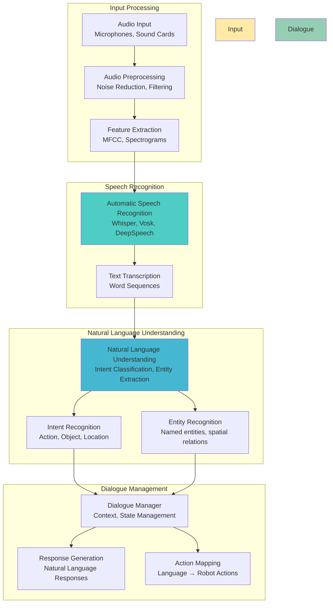

# Voice Control: Natural Language Processing for Robots

Now that you understand VLA architectures, let's implement the voice control system that enables your humanoid robot to understand and respond to natural language commands. This chapter covers speech recognition, natural language processing, and conversational interfaces.

## The Voice Interface Challenge

### The $50,000 Question

Imagine a humanoid robot that can:
- **Listen actively** to natural voice commands ("Hey robot, can you bring me my coffee?")
- **Understand context** ("The blue mug from the kitchen counter")
- **Respond appropriately** ("Sure, I'll get your blue mug from the kitchen")
- **Handle ambiguity** ("Could you clean up the table?" → "Which table?")

This is the difference between a **button-press robot** and a **natural companion**. Voice control transforms robots from tools into assistants.

### Voice Control Architecture



## Speech Recognition Systems

### 1. Whisper-Based Recognition

OpenAI's Whisper provides state-of-the-art speech recognition:

```python
# Whisper-based speech recognition
import whisper
import torch
import librosa
import numpy as np

class WhisperSpeechRecognizer:
    def __init__(self, model_size="base"):
        """
        Initialize Whisper speech recognizer

        Args:
            model_size: "tiny", "base", "small", "medium", "large"
        """
        self.model = whisper.load_model(model_size)
        self.options = whisper.DecodingOptions(
            language="en",
            without_timestamps=True,
            fp16=torch.cuda.is_available()
        )

    def transcribe_audio(self, audio_path):
        """Transcribe audio file to text"""
        # Load audio
        audio = whisper.load_audio(audio_path)
        audio = whisper.pad_or_trim(audio)

        # Convert to log mel spectrogram
        mel = whisper.log_mel_spectrogram(audio).to(self.model.device)

        # Decode
        with torch.no_grad():
            result = self.model.decode(mel, self.options)

        return result.text

    def transcribe_microphone(self, duration=5.0):
        """Real-time transcription from microphone"""
        import pyaudio
        import wave

        # Record audio
        chunk = 1024
        format = pyaudio.paInt16
        channels = 1
        rate = 16000

        p = pyaudio.PyAudio()

        stream = p.open(format=format,
                        channels=channels,
                        rate=rate,
                        input=True,
                        frames_per_buffer=chunk)

        print(f"Recording for {duration} seconds...")
        frames = []

        for i in range(0, int(rate / chunk * duration)):
            data = stream.read(chunk)
            frames.append(data)

        print("Recording finished.")

        stream.stop_stream()
        stream.close()
        p.terminate()

        # Save to temporary file
        temp_file = "temp_recording.wav"
        wf = wave.open(temp_file, 'wb')
        wf.setnchannels(channels)
        wf.setsampwidth(p.get_sample_size(format))
        wf.setframerate(rate)
        wf.writeframes(b''.join(frames))
        wf.close()

        # Transcribe
        text = self.transcribe_audio(temp_file)

        # Clean up
        import os
        os.remove(temp_file)

        return text

    def transcribe_streaming(self, callback_func):
        """Streaming transcription with callback"""
        import pyaudio

        chunk = 1024
        format = pyaudio.paInt16
        channels = 1
        rate = 16000

        p = pyaudio.PyAudio()

        stream = p.open(format=format,
                        channels=channels,
                        rate=rate,
                        input=True,
                        frames_per_buffer=chunk)

        buffer = []
        buffer_size = int(rate * 2)  # 2 seconds worth of audio

        try:
            while True:
                data = stream.read(chunk)
                buffer.extend(np.frombuffer(data, dtype=np.int16))

                if len(buffer) >= buffer_size:
                    # Process audio chunk
                    audio_chunk = np.array(buffer[:buffer_size]).astype(np.float32) / 32768.0
                    audio_chunk = whisper.pad_or_trim(audio_chunk)

                    mel = whisper.log_mel_spectrogram(audio_chunk).to(self.model.device)

                    with torch.no_grad():
                        result = self.model.decode(mel, self.options)

                    if result.text.strip():
                        callback_func(result.text)

                    # Keep some overlap for continuity
                    buffer = buffer[buffer_size//2:]
        except KeyboardInterrupt:
            pass
        finally:
            stream.stop_stream()
            stream.close()
            p.terminate()
```

### 2. Vosk-Based Recognition

Lightweight alternative for edge deployment:

```python
# Vosk-based speech recognition (lightweight)
import vosk
import pyaudio
import json
import wave

class VoskSpeechRecognizer:
    def __init__(self, model_path="vosk-model-small-en-us-0.15"):
        """
        Initialize Vosk speech recognizer

        Args:
            model_path: Path to Vosk model directory
        """
        self.model = vosk.Model(model_path)
        self.recognizer = vosk.KaldiRecognizer(self.model, 16000)

    def transcribe_audio_file(self, audio_path):
        """Transcribe audio file using Vosk"""
        wf = wave.open(audio_path, "rb")

        if wf.getnchannels() != 1 or wf.getsampwidth() != 2 or wf.getframerate() != 16000:
            raise ValueError("Audio file must be mono, 16kHz, 16-bit")

        result = ""
        while True:
            data = wf.readframes(4000)
            if len(data) == 0:
                break
            if self.recognizer.AcceptWaveform(data):
                result_dict = json.loads(self.recognizer.Result())
                result += result_dict.get("text", "") + " "

        # Get final result
        final_result = json.loads(self.recognizer.FinalResult())
        result += final_result.get("text", "")

        return result.strip()

    def transcribe_microphone(self, duration=5.0):
        """Real-time transcription from microphone using Vosk"""
        chunk = 1024
        format = pyaudio.paInt16
        channels = 1
        rate = 16000

        p = pyaudio.PyAudio()

        stream = p.open(format=format,
                        channels=channels,
                        rate=rate,
                        input=True,
                        frames_per_buffer=chunk)

        print(f"Recording for {duration} seconds...")
        result = ""
        frames_recorded = 0
        total_frames = int(rate / chunk * duration)

        try:
            while frames_recorded < total_frames:
                data = stream.read(chunk)

                if self.recognizer.AcceptWaveform(data):
                    result_dict = json.loads(self.recognizer.Result())
                    text = result_dict.get("text", "")
                    if text:
                        result += text + " "

                frames_recorded += 1
        except KeyboardInterrupt:
            pass

        # Final result
        final_result = json.loads(self.recognizer.FinalResult())
        final_text = final_result.get("text", "")
        if final_text:
            result += final_text

        stream.stop_stream()
        stream.close()
        p.terminate()

        return result.strip()

    def streaming_transcription(self, callback_func):
        """Streaming transcription with real-time callbacks"""
        chunk = 1024
        format = pyaudio.paInt16
        channels = 1
        rate = 16000

        p = pyaudio.PyAudio()

        stream = p.open(format=format,
                        channels=channels,
                        rate=rate,
                        input=True,
                        frames_per_buffer=chunk)

        try:
            while True:
                data = stream.read(chunk)

                # Partial results (interim)
                if self.recognizer.PartialResult():
                    partial = json.loads(self.recognizer.PartialResult())
                    partial_text = partial.get("partial", "")
                    if partial_text:
                        callback_func("partial", partial_text)

                # Final results
                if self.recognizer.AcceptWaveform(data):
                    final = json.loads(self.recognizer.Result())
                    final_text = final.get("text", "")
                    if final_text:
                        callback_func("final", final_text)

        except KeyboardInterrupt:
            pass
        finally:
            stream.stop_stream()
            stream.close()
            p.terminate()
```

### 3. Audio Preprocessing Pipeline

Proper audio preprocessing improves recognition accuracy:

```python
# Audio preprocessing pipeline
import numpy as np
import scipy.signal as signal
import librosa
from scipy.io import wavfile

class AudioPreprocessor:
    def __init__(self):
        self.sample_rate = 16000  # Standard for speech recognition
        self.frame_length = 2048
        self.hop_length = 512

    def preprocess_audio(self, audio_data, sample_rate):
        """Complete audio preprocessing pipeline"""
        # Resample to target rate
        if sample_rate != self.sample_rate:
            audio_data = librosa.resample(audio_data, orig_sr=sample_rate, target_sr=self.sample_rate)

        # Noise reduction
        audio_data = self.reduce_noise(audio_data)

        # Normalization
        audio_data = self.normalize_audio(audio_data)

        # Voice activity detection (optional)
        audio_data = self.remove_silence(audio_data)

        return audio_data

    def reduce_noise(self, audio_data):
        """Apply noise reduction using spectral subtraction"""
        # Estimate noise from beginning of audio (assumed to be silence)
        noise_samples = int(0.1 * self.sample_rate)  # First 0.1 seconds
        if len(audio_data) > noise_samples:
            noise_profile = np.mean(np.abs(audio_data[:noise_samples]))
        else:
            noise_profile = np.mean(np.abs(audio_data))

        # Apply spectral subtraction
        stft = librosa.stft(audio_data)
        magnitude = np.abs(stft)
        phase = np.angle(stft)

        # Subtract noise profile
        magnitude_clean = np.maximum(magnitude - noise_profile, 0)

        # Reconstruct audio
        stft_clean = magnitude_clean * np.exp(1j * phase)
        audio_clean = librosa.istft(stft_clean)

        return audio_clean.astype(audio_data.dtype)

    def normalize_audio(self, audio_data):
        """Normalize audio to standard loudness"""
        # Peak normalization
        max_amplitude = np.max(np.abs(audio_data))
        if max_amplitude > 0:
            normalized = audio_data / max_amplitude
            # Scale to reasonable range (-1, 1) * 0.8
            normalized = normalized * 0.8
        else:
            normalized = audio_data

        return normalized

    def remove_silence(self, audio_data, threshold_db=-40):
        """Remove silence from beginning and end of audio"""
        # Convert dB threshold to amplitude
        threshold = 10 ** (threshold_db / 20.0)

        # Find non-silent regions
        non_silent = np.where(np.abs(audio_data) > threshold)[0]

        if len(non_silent) == 0:
            return audio_data  # All silence

        start = non_silent[0]
        end = non_silent[-1] + 1

        # Add small margin to avoid cutting words
        margin = int(0.1 * self.sample_rate)  # 0.1 seconds
        start = max(0, start - margin)
        end = min(len(audio_data), end + margin)

        return audio_data[start:end]

    def enhance_audio(self, audio_data):
        """Apply audio enhancement techniques"""
        # Apply pre-emphasis filter
        enhanced = signal.lfilter([1.0, -0.97], 1, audio_data)

        # Apply spectral enhancement
        stft = librosa.stft(enhanced)
        magnitude = np.abs(stft)
        phase = np.angle(stft)

        # Enhance speech frequencies (300-3400 Hz range)
        freq_bins = librosa.fft_frequencies(sr=self.sample_rate, n_fft=self.frame_length)
        speech_mask = (freq_bins >= 300) & (freq_bins <= 3400)

        # Boost speech frequencies slightly
        magnitude_enhanced = magnitude.copy()
        magnitude_enhanced[speech_mask, :] *= 1.2

        # Reconstruct audio
        stft_enhanced = magnitude_enhanced * np.exp(1j * phase)
        enhanced_audio = librosa.istft(stft_enhanced)

        return enhanced_audio.astype(audio_data.dtype)
```

## Natural Language Understanding (NLU)

### 1. Intent Classification

Classify user intents from transcribed text:

```python
# Intent classification for robot commands
import torch
import torch.nn as nn
from transformers import AutoTokenizer, AutoModel
from sklearn.feature_extraction.text import TfidfVectorizer
from sklearn.naive_bayes import MultinomialNB
import numpy as np

class IntentClassifier:
    def __init__(self):
        # Predefined intents for humanoid robots
        self.intents = {
            'navigation': [
                'go to', 'move to', 'navigate to', 'walk to', 'go to the',
                'move towards', 'navigate towards', 'head to', 'proceed to'
            ],
            'object_interaction': [
                'bring me', 'get me', 'give me', 'hand me', 'fetch',
                'pick up', 'take', 'grab', 'lift', 'carry'
            ],
            'manipulation': [
                'open', 'close', 'turn on', 'turn off', 'switch on', 'switch off',
                'push', 'pull', 'press', 'release', 'activate', 'deactivate'
            ],
            'information': [
                'what is', 'tell me about', 'describe', 'explain', 'show me',
                'where is', 'locate', 'find', 'search for'
            ],
            'social_interaction': [
                'hello', 'hi', 'good morning', 'good afternoon', 'good evening',
                'how are you', 'what are you doing', 'nice to meet you'
            ],
            'maintenance': [
                'clean', 'tidy', 'organize', 'arrange', 'put away', 'store'
            ]
        }

        # Create keyword-based classifier
        self.intent_keywords = {}
        for intent, keywords in self.intents.items():
            self.intent_keywords[intent] = set(keywords)

    def classify_intent(self, text):
        """Classify intent using keyword matching"""
        text_lower = text.lower()
        scores = {}

        for intent, keywords in self.intent_keywords.items():
            score = 0
            for keyword in keywords:
                if keyword in text_lower:
                    score += 1
            scores[intent] = score

        # Return intent with highest score, or 'unknown' if no matches
        if max(scores.values()) > 0:
            return max(scores, key=scores.get)
        else:
            return 'unknown'

    def classify_with_context(self, text, context=None):
        """Classify intent considering context"""
        intent = self.classify_intent(text)

        # Refine based on context
        if context and 'previous_intent' in context:
            # Handle follow-up questions
            if any(word in text.lower() for word in ['that', 'it', 'the same']):
                return context['previous_intent']

        return intent

# Advanced neural intent classifier
class NeuralIntentClassifier(nn.Module):
    def __init__(self, vocab_size, hidden_dim=256, num_intents=6):
        super().__init__()

        self.embedding = nn.Embedding(vocab_size, hidden_dim)
        self.lstm = nn.LSTM(hidden_dim, hidden_dim, batch_first=True, bidirectional=True)
        self.dropout = nn.Dropout(0.3)
        self.classifier = nn.Linear(hidden_dim * 2, num_intents)  # *2 for bidirectional

    def forward(self, input_ids):
        # Embedding
        embedded = self.embedding(input_ids)  # [batch, seq_len, embed_dim]

        # LSTM
        lstm_out, (hidden, _) = self.lstm(embedded)

        # Use final hidden state (concatenate forward and backward)
        final_hidden = torch.cat([hidden[-2], hidden[-1]], dim=1)  # [batch, hidden_dim*2]

        # Dropout and classification
        dropped = self.dropout(final_hidden)
        logits = self.classifier(dropped)

        return logits
```

### 2. Entity Recognition

Extract important entities from user commands:

```python
# Entity recognition for robot commands
import re
from typing import Dict, List, Tuple

class EntityExtractor:
    def __init__(self):
        # Define entity patterns
        self.entity_patterns = {
            'object': [
                r'\b(red|blue|green|yellow|black|white)\s+(\w+)\b',  # "red cup"
                r'\b(big|small|large|tiny)\s+(\w+)\b',               # "big box"
                r'\b(\w+)\s+(cup|mug|bottle|glass|plate|book|pen|phone)\b',  # "coffee cup"
            ],
            'location': [
                r'\b(kitchen|bedroom|living room|office|bathroom|hallway|garage|garden)\b',
                r'\b(table|counter|desk|shelf|cabinet|fridge|sofa|chair)\b',
                r'\b(left|right|front|back|center|middle|top|bottom)\b',
            ],
            'person': [
                r'\b(me|myself|you|him|her|them|someone|anyone)\b',
                r'\b(mom|dad|brother|sister|friend|colleague)\b',
            ],
            'action': [
                r'\b(bring|get|fetch|take|carry|move|lift|pick|put|place)\b',
                r'\b(clean|tidy|organize|arrange|sort|store)\b',
            ]
        }

        # Spatial relation patterns
        self.spatial_patterns = {
            'near': [r'\bnear\b', r'\bclose to\b', r'\bby\b', r'\balongside\b'],
            'on': [r'\bon\b', r'\batop\b', r'\bover\b'],
            'in': [r'\bin\b', r'\binside\b', r'\bwithin\b'],
            'under': [r'\bunder\b', r'\bbelow\b', r'\bunderneath\b'],
            'behind': [r'\bbehind\b', r'\bafter\b'],
            'in_front_of': [r'\bin front of\b', r'\bfacing\b', r'\btoward\b'],
        }

    def extract_entities(self, text: str) -> Dict[str, List[str]]:
        """Extract entities from text"""
        entities = {entity_type: [] for entity_type in self.entity_patterns.keys()}

        text_lower = text.lower()

        for entity_type, patterns in self.entity_patterns.items():
            for pattern in patterns:
                matches = re.findall(pattern, text_lower)
                for match in matches:
                    if isinstance(match, tuple):
                        # Multiple groups captured
                        entity = ' '.join(match).strip()
                    else:
                        entity = match.strip()

                    if entity and entity not in entities[entity_type]:
                        entities[entity_type].append(entity)

        return entities

    def extract_spatial_relations(self, text: str) -> List[Dict]:
        """Extract spatial relationships between entities"""
        relations = []
        text_lower = text.lower()

        for relation_type, patterns in self.spatial_patterns.items():
            for pattern in patterns:
                matches = re.finditer(pattern, text_lower)
                for match in matches:
                    relations.append({
                        'type': relation_type,
                        'position': match.start(),
                        'text': match.group()
                    })

        return relations

    def resolve_references(self, text: str, context: Dict = None) -> Dict:
        """Resolve pronouns and references in context"""
        resolved = {
            'resolved_text': text,
            'coreferences': {},
            'spatial_context': {}
        }

        # Resolve pronouns
        pronoun_resolution = {
            'it': context.get('last_mentioned_object') if context else None,
            'that': context.get('last_mentioned_object') if context else None,
            'there': context.get('last_mentioned_location') if context else None,
        }

        for pronoun, referent in pronoun_resolution.items():
            if referent and pronoun in text.lower():
                resolved['resolved_text'] = text.replace(pronoun, referent)
                resolved['coreferences'][pronoun] = referent

        # Extract spatial context
        entities = self.extract_entities(text)
        spatial_relations = self.extract_spatial_relations(text)

        resolved['entities'] = entities
        resolved['spatial_relations'] = spatial_relations

        return resolved

# Combined NLU system
class NaturalLanguageUnderstanding:
    def __init__(self):
        self.intent_classifier = IntentClassifier()
        self.entity_extractor = EntityExtractor()

    def parse_command(self, text: str, context: Dict = None) -> Dict:
        """Parse natural language command into structured format"""
        # Classify intent
        intent = self.intent_classifier.classify_with_context(text, context)

        # Extract entities
        entities = self.entity_extractor.extract_entities(text)
        resolved = self.entity_extractor.resolve_references(text, context)

        # Structure the result
        parsed_command = {
            'raw_text': text,
            'intent': intent,
            'entities': resolved['entities'],
            'resolved_text': resolved['resolved_text'],
            'coreferences': resolved['coreferences'],
            'spatial_relations': resolved['spatial_relations'],
            'confidence': 0.8  # Placeholder - in practice, use model confidence
        }

        return parsed_command
```

### 3. Context Management

Maintain conversation context for coherent interactions:

```python
# Context manager for dialogue system
from datetime import datetime, timedelta
from collections import deque
import json

class DialogueContextManager:
    def __init__(self, max_history=10):
        self.max_history = max_history
        self.conversation_history = deque(maxlen=max_history)
        self.current_context = {}
        self.user_preferences = {}
        self.entity_memory = {}  # Remember objects, locations, etc.
        self.session_start_time = datetime.now()

    def update_context(self, user_input: str, system_response: str, parsed_command: Dict):
        """Update dialogue context with new interaction"""
        interaction = {
            'timestamp': datetime.now(),
            'user_input': user_input,
            'system_response': system_response,
            'parsed_command': parsed_command,
            'context_snapshot': self.current_context.copy()
        }

        self.conversation_history.append(interaction)

        # Update current context
        self._update_current_context(parsed_command)

        # Update entity memory
        self._update_entity_memory(parsed_command)

    def _update_current_context(self, parsed_command: Dict):
        """Update current context based on parsed command"""
        entities = parsed_command.get('entities', {})

        # Update last mentioned entities
        if 'object' in entities and entities['object']:
            self.current_context['last_mentioned_object'] = entities['object'][0]

        if 'location' in entities and entities['location']:
            self.current_context['last_mentioned_location'] = entities['location'][0]

        # Update last intent
        self.current_context['previous_intent'] = parsed_command.get('intent')

        # Update spatial context
        if 'spatial_relations' in parsed_command:
            self.current_context['spatial_context'] = parsed_command['spatial_relations']

    def _update_entity_memory(self, parsed_command: Dict):
        """Update entity memory for long-term reference"""
        entities = parsed_command.get('entities', {})

        for entity_type, entity_list in entities.items():
            if entity_type not in self.entity_memory:
                self.entity_memory[entity_type] = []

            for entity in entity_list:
                if entity not in self.entity_memory[entity_type]:
                    self.entity_memory[entity_type].append(entity)

    def get_context_for_nlu(self) -> Dict:
        """Get context information for NLU processing"""
        return {
            'last_mentioned_object': self.current_context.get('last_mentioned_object'),
            'last_mentioned_location': self.current_context.get('last_mentioned_location'),
            'previous_intent': self.current_context.get('previous_intent'),
            'conversation_turn': len(self.conversation_history),
            'session_duration': (datetime.now() - self.session_start_time).seconds
        }

    def get_recent_interactions(self, num_interactions=3) -> List[Dict]:
        """Get recent conversation interactions"""
        return list(self.conversation_history)[-num_interactions:]

    def reset_context(self):
        """Reset conversation context"""
        self.conversation_history.clear()
        self.current_context.clear()
        self.session_start_time = datetime.now()

    def serialize_context(self) -> str:
        """Serialize context for storage"""
        context_data = {
            'conversation_history': [
                {
                    'timestamp': interaction['timestamp'].isoformat(),
                    'user_input': interaction['user_input'],
                    'system_response': interaction['system_response'],
                    'parsed_command': interaction['parsed_command']
                }
                for interaction in self.conversation_history
            ],
            'current_context': self.current_context,
            'user_preferences': self.user_preferences,
            'entity_memory': self.entity_memory,
            'session_start_time': self.session_start_time.isoformat()
        }

        return json.dumps(context_data, indent=2)

    def deserialize_context(self, context_str: str):
        """Deserialize context from storage"""
        context_data = json.loads(context_str)

        # Restore conversation history
        self.conversation_history.clear()
        for interaction in context_data['conversation_history']:
            restored_interaction = {
                'timestamp': datetime.fromisoformat(interaction['timestamp']),
                'user_input': interaction['user_input'],
                'system_response': interaction['system_response'],
                'parsed_command': interaction['parsed_command'],
                'context_snapshot': {}  # Will be recreated
            }
            self.conversation_history.append(restored_interaction)

        self.current_context = context_data['current_context']
        self.user_preferences = context_data['user_preferences']
        self.entity_memory = context_data['entity_memory']
        self.session_start_time = datetime.fromisoformat(context_data['session_start_time'])
```

## Dialogue Management

### 1. State-Based Dialogue Manager

Manage conversation flow and robot responses:

```python
# State-based dialogue manager
from enum import Enum
from typing import Optional, Any
import asyncio

class RobotState(Enum):
    IDLE = "idle"
    LISTENING = "listening"
    PROCESSING = "processing"
    EXECUTING = "executing"
    WAITING_FOR_CONFIRMATION = "waiting_for_confirmation"
    ERROR = "error"

class DialogueManager:
    def __init__(self):
        self.state = RobotState.IDLE
        self.context_manager = DialogueContextManager()
        self.response_generator = ResponseGenerator()
        self.action_mapper = ActionMapper()

    def handle_user_input(self, audio_input: str) -> str:
        """Main entry point for handling user input"""
        try:
            # Update state to listening
            self.state = RobotState.PROCESSING

            # Transcribe audio to text
            text_input = self.transcribe_audio(audio_input)

            # Parse the command
            context = self.context_manager.get_context_for_nlu()
            parsed_command = self.parse_command(text_input, context)

            # Generate response
            response = self.response_generator.generate_response(parsed_command)

            # Map to robot action
            robot_action = self.action_mapper.map_to_action(parsed_command)

            # Update context
            self.context_manager.update_context(text_input, response, parsed_command)

            # Execute action if needed
            if robot_action:
                self.execute_action(robot_action)

            # Update state back to idle
            self.state = RobotState.IDLE

            return response

        except Exception as e:
            self.state = RobotState.ERROR
            error_response = self.response_generator.generate_error_response(str(e))
            return error_response

    def transcribe_audio(self, audio_input: str) -> str:
        """Transcribe audio input to text"""
        # Use the speech recognizer
        recognizer = WhisperSpeechRecognizer(model_size="base")
        return recognizer.transcribe_audio(audio_input)

    def parse_command(self, text: str, context: Dict) -> Dict:
        """Parse natural language command"""
        nlu = NaturalLanguageUnderstanding()
        return nlu.parse_command(text, context)

    def execute_action(self, action: Dict):
        """Execute robot action"""
        # This would interface with the robot's action system
        # For now, just simulate execution
        print(f"Executing action: {action}")

    def generate_response(self, parsed_command: Dict) -> str:
        """Generate natural language response"""
        return self.response_generator.generate_response(parsed_command)

# Response generation system
class ResponseGenerator:
    def __init__(self):
        self.response_templates = {
            'navigation': [
                "Okay, I'll navigate to the {location}.",
                "Sure, heading to {location} now.",
                "I'm going to {location} for you."
            ],
            'object_interaction': [
                "I'll get the {object} for you.",
                "Sure, bringing the {object} now.",
                "I'll fetch the {object} from {location}."
            ],
            'manipulation': [
                "I'll {action} the {object}.",
                "Okay, {action}ing the {object} now.",
                "Performing the {action} operation."
            ],
            'information': [
                "I can {action} that for you.",
                "Let me {action} that.",
                "I'll help you with that."
            ],
            'social_interaction': [
                "Hello! How can I help you?",
                "Nice to meet you!",
                "I'm doing well, thank you for asking!"
            ],
            'maintenance': [
                "I'll clean that up for you.",
                "Organizing the {location} now.",
                "I'll tidy things up."
            ],
            'unknown': [
                "I'm sorry, I didn't understand that.",
                "Could you please repeat that?",
                "I'm not sure what you mean."
            ]
        }

    def generate_response(self, parsed_command: Dict) -> str:
        """Generate appropriate response based on parsed command"""
        intent = parsed_command.get('intent', 'unknown')
        entities = parsed_command.get('entities', {})

        # Get template for intent
        templates = self.response_templates.get(intent, self.response_templates['unknown'])

        if templates:
            template = templates[0]  # Use first template for simplicity

            # Fill in entities
            response = template.format(
                object=entities.get('object', [])[0] if entities.get('object') else 'it',
                location=entities.get('location', [])[0] if entities.get('location') else 'there',
                action=entities.get('action', [])[0] if entities.get('action') else 'do something',
                person=entities.get('person', [])[0] if entities.get('person') else 'someone'
            )

            return response
        else:
            return "I'm sorry, I didn't understand that."

    def generate_error_response(self, error_msg: str) -> str:
        """Generate response for error conditions"""
        return f"I encountered an error: {error_msg}. Could you try again?"

# Action mapping system
class ActionMapper:
    def __init__(self):
        self.action_mapping = {
            'navigation': self.map_navigation_action,
            'object_interaction': self.map_object_interaction_action,
            'manipulation': self.map_manipulation_action,
            'information': self.map_information_action,
            'maintenance': self.map_maintenance_action
        }

    def map_to_action(self, parsed_command: Dict) -> Optional[Dict]:
        """Map parsed command to robot action"""
        intent = parsed_command.get('intent')

        if intent in self.action_mapping:
            return self.action_mapping[intent](parsed_command)
        else:
            return None

    def map_navigation_action(self, parsed_command: Dict) -> Dict:
        """Map navigation intent to navigation action"""
        entities = parsed_command.get('entities', {})
        location = entities.get('location', [None])[0] if entities.get('location') else None

        return {
            'action_type': 'navigation',
            'target_location': location,
            'parameters': {}
        }

    def map_object_interaction_action(self, parsed_command: Dict) -> Dict:
        """Map object interaction intent to manipulation action"""
        entities = parsed_command.get('entities', {})
        obj = entities.get('object', [None])[0] if entities.get('object') else None
        location = entities.get('location', [None])[0] if entities.get('location') else None

        return {
            'action_type': 'manipulation',
            'operation': 'fetch',
            'target_object': obj,
            'target_location': location,
            'parameters': {}
        }

    def map_manipulation_action(self, parsed_command: Dict) -> Dict:
        """Map manipulation intent to specific action"""
        entities = parsed_command.get('entities', {})
        obj = entities.get('object', [None])[0] if entities.get('object') else None
        action = entities.get('action', [None])[0] if entities.get('action') else None

        return {
            'action_type': 'manipulation',
            'operation': action,
            'target_object': obj,
            'parameters': {}
        }

    def map_information_action(self, parsed_command: Dict) -> Dict:
        """Map information intent to sensing action"""
        entities = parsed_command.get('entities', {})

        return {
            'action_type': 'sensing',
            'operation': 'search',
            'target_object': entities.get('object', [None])[0] if entities.get('object') else None,
            'target_location': entities.get('location', [None])[0] if entities.get('location') else None,
            'parameters': {}
        }

    def map_maintenance_action(self, parsed_command: Dict) -> Dict:
        """Map maintenance intent to cleaning/organizing action"""
        entities = parsed_command.get('entities', {})

        return {
            'action_type': 'maintenance',
            'operation': parsed_command.get('intent'),
            'target_location': entities.get('location', [None])[0] if entities.get('location') else None,
            'parameters': {}
        }
```

### 2. Conversational Flow Management

Handle multi-turn conversations and follow-ups:

```python
# Conversational flow manager
class ConversationalFlowManager:
    def __init__(self):
        self.active_dialogue = None
        self.pending_questions = []
        self.follow_up_context = {}

    def start_dialogue(self, initial_command: Dict):
        """Start a new dialogue based on initial command"""
        intent = initial_command.get('intent')

        if intent == 'information':
            # Information-seeking might require follow-up questions
            return self.handle_information_request(initial_command)
        elif intent == 'clarification_needed':
            # Need more information
            return self.request_clarification(initial_command)
        else:
            # Direct command, no follow-up needed
            return None

    def handle_information_request(self, command: Dict) -> Optional[str]:
        """Handle information requests that might need clarification"""
        entities = command.get('entities', {})

        # Check if we have enough information
        if self.is_ambiguous_request(command):
            return self.generate_clarification_question(command)

        return None

    def is_ambiguous_request(self, command: Dict) -> bool:
        """Check if request is ambiguous and needs clarification"""
        entities = command.get('entities', {})

        # Example: asking for "the cup" without specifying which one
        if 'object' in entities and len(entities['object']) > 0:
            obj = entities['object'][0]
            if obj == 'cup' or obj == 'mug':  # Generic terms
                # Check if we know about multiple cups
                known_cups = self.get_known_objects_by_type('cup')
                if len(known_cups) > 1:
                    return True

        return False

    def get_known_objects_by_type(self, obj_type: str) -> List[str]:
        """Get known objects of specific type from memory"""
        # This would query the context manager's entity memory
        # For now, return mock data
        if obj_type == 'cup':
            return ['red cup', 'blue mug', 'white coffee cup']
        return []

    def generate_clarification_question(self, command: Dict) -> str:
        """Generate clarification question for ambiguous request"""
        entities = command.get('entities', {})

        if 'object' in entities:
            obj = entities['object'][0]
            known_objects = self.get_known_objects_by_type(obj)

            if len(known_objects) > 1:
                return f"Which {obj} do you mean? I see {', '.join(known_objects[:-1])} and {known_objects[-1]}."

        return "Could you please be more specific about what you need?"

    def handle_follow_up(self, follow_up_command: Dict, context: Dict) -> Optional[Dict]:
        """Handle follow-up commands in ongoing dialogue"""
        # Check if this is a follow-up to a previous clarification
        if context.get('awaiting_clarification'):
            return self.process_clarification_response(follow_up_command, context)

        return None

    def process_clarification_response(self, command: Dict, context: Dict) -> Optional[Dict]:
        """Process response to clarification question"""
        # Extract the clarified information
        entities = command.get('entities', {})

        # Update the original request with clarification
        clarified_request = context.get('original_request', {}).copy()

        # Apply the clarification
        if 'object' in entities:
            clarified_request['entities']['specific_object'] = entities['object'][0]

        return clarified_request

# Enhanced dialogue manager with flow control
class EnhancedDialogueManager(DialogueManager):
    def __init__(self):
        super().__init__()
        self.flow_manager = ConversationalFlowManager()
        self.awaiting_response = False
        self.pending_request = None

    def handle_user_input(self, audio_input: str) -> str:
        """Enhanced input handler with conversation flow"""
        try:
            # Transcribe audio to text
            text_input = self.transcribe_audio(audio_input)

            # Check if we're awaiting a response to a clarification
            if self.awaiting_response:
                return self.handle_clarification_response(text_input)

            # Parse the command
            context = self.context_manager.get_context_for_nlu()
            parsed_command = self.parse_command(text_input, context)

            # Check for follow-up handling
            if self.flow_manager.is_ambiguous_request(parsed_command):
                clarification = self.flow_manager.generate_clarification_question(parsed_command)
                self.awaiting_response = True
                self.pending_request = parsed_command
                return clarification

            # Generate response and execute action
            response = self.response_generator.generate_response(parsed_command)
            robot_action = self.action_mapper.map_to_action(parsed_command)

            # Update context
            self.context_manager.update_context(text_input, response, parsed_command)

            # Execute action if needed
            if robot_action:
                self.execute_action(robot_action)

            return response

        except Exception as e:
            self.state = RobotState.ERROR
            self.awaiting_response = False
            error_response = self.response_generator.generate_error_response(str(e))
            return error_response

    def handle_clarification_response(self, text_input: str) -> str:
        """Handle response to clarification question"""
        context = self.context_manager.get_context_for_nlu()
        context['awaiting_clarification'] = True
        context['original_request'] = self.pending_request

        parsed_command = self.parse_command(text_input, context)
        resolved_command = self.flow_manager.process_clarification_response(parsed_command, context)

        if resolved_command:
            # Generate response for resolved command
            response = self.response_generator.generate_response(resolved_command)
            robot_action = self.action_mapper.map_to_action(resolved_command)

            # Update context
            self.context_manager.update_context(text_input, response, resolved_command)

            # Execute action if needed
            if robot_action:
                self.execute_action(robot_action)

            # Reset state
            self.awaiting_response = False
            self.pending_request = None

            return response
        else:
            self.awaiting_response = False
            self.pending_request = None
            return "I'm sorry, I still didn't understand. Could you please rephrase?"
```

## Voice Command Processing Pipeline

### Complete Voice Processing System

```python
# Complete voice processing pipeline
import asyncio
import threading
from queue import Queue
import time

class VoiceCommandProcessor:
    def __init__(self):
        self.speech_recognizer = WhisperSpeechRecognizer(model_size="base")
        self.nlu_system = NaturalLanguageUnderstanding()
        self.dialogue_manager = EnhancedDialogueManager()
        self.audio_preprocessor = AudioPreprocessor()

        # Processing queues
        self.audio_queue = Queue()
        self.text_queue = Queue()
        self.response_queue = Queue()

        # Processing threads
        self.recognition_thread = None
        self.nlu_thread = None
        self.response_thread = None

        self.is_running = False
        self.hotword_detector = HotwordDetector()

    def start_processing(self):
        """Start the voice processing pipeline"""
        self.is_running = True

        # Start processing threads
        self.recognition_thread = threading.Thread(target=self._recognition_worker)
        self.nlu_thread = threading.Thread(target=self._nlu_worker)
        self.response_thread = threading.Thread(target=self._response_worker)

        self.recognition_thread.start()
        self.nlu_thread.start()
        self.response_thread.start()

    def stop_processing(self):
        """Stop the voice processing pipeline"""
        self.is_running = False

        if self.recognition_thread:
            self.recognition_thread.join()
        if self.nlu_thread:
            self.nlu_thread.join()
        if self.response_thread:
            self.response_thread.join()

    def _recognition_worker(self):
        """Worker thread for speech recognition"""
        while self.is_running:
            if not self.audio_queue.empty():
                audio_data = self.audio_queue.get()

                try:
                    # Preprocess audio
                    processed_audio = self.audio_preprocessor.preprocess_audio(
                        audio_data['data'], audio_data['sample_rate']
                    )

                    # Recognize speech
                    text = self.speech_recognizer.transcribe_audio(processed_audio)

                    if text.strip():
                        self.text_queue.put({
                            'text': text,
                            'timestamp': time.time(),
                            'original_audio': audio_data
                        })
                except Exception as e:
                    print(f"Recognition error: {e}")

    def _nlu_worker(self):
        """Worker thread for natural language understanding"""
        while self.is_running:
            if not self.text_queue.empty():
                text_data = self.text_queue.get()

                try:
                    # Get context for NLU
                    context = self.dialogue_manager.context_manager.get_context_for_nlu()

                    # Parse command
                    parsed_command = self.nlu_system.parse_command(
                        text_data['text'], context
                    )

                    # Put parsed command in response queue
                    self.response_queue.put({
                        'parsed_command': parsed_command,
                        'original_text': text_data['text'],
                        'timestamp': text_data['timestamp']
                    })
                except Exception as e:
                    print(f"NLU error: {e}")

    def _response_worker(self):
        """Worker thread for generating responses"""
        while self.is_running:
            if not self.response_queue.empty():
                command_data = self.response_queue.get()

                try:
                    # Generate response using dialogue manager
                    response = self.dialogue_manager.handle_user_input(
                        command_data['original_text']
                    )

                    # Output response (could be speech synthesis, ROS message, etc.)
                    self._output_response(response)

                except Exception as e:
                    print(f"Response generation error: {e}")

    def _output_response(self, response: str):
        """Output the generated response"""
        # This could be:
        # - Text-to-speech synthesis
        # - ROS message publishing
        # - Display on screen
        # - Logging
        print(f"Robot says: {response}")

        # Example: publish to ROS topic
        # self.publisher.publish(String(data=response))

    def process_audio_input(self, audio_data):
        """Process incoming audio data"""
        if self.is_running:
            self.audio_queue.put(audio_data)

    def listen_for_hotword(self, callback_func):
        """Listen for hotword to activate processing"""
        import pyaudio
        import numpy as np

        chunk = 1024
        format = pyaudio.paInt16
        channels = 1
        rate = 16000

        p = pyaudio.PyAudio()

        stream = p.open(format=format,
                        channels=channels,
                        rate=rate,
                        input=True,
                        frames_per_buffer=chunk)

        print("Listening for hotword...")

        try:
            while self.is_running:
                data = stream.read(chunk)
                audio_array = np.frombuffer(data, dtype=np.int16)

                # Check for hotword (simplified - in practice use wake word detection model)
                if self.hotword_detector.detect_hotword(audio_array):
                    callback_func()
                    break
        except KeyboardInterrupt:
            pass
        finally:
            stream.stop_stream()
            stream.close()
            p.terminate()

# Hotword detection (simplified)
class HotwordDetector:
    def __init__(self, hotwords=None):
        if hotwords is None:
            hotwords = ["hey robot", "robot", "hello robot", "wake up"]
        self.hotwords = [hw.lower() for hw in hotwords]

    def detect_hotword(self, audio_data):
        """Simple hotword detection (in practice, use specialized wake word models)"""
        # This is a simplified version
        # In practice, use models like Porcupine, Snowboy, or custom wake word models
        return False  # Placeholder - implement actual detection
```

## Integration with ROS 2

### ROS 2 Voice Control Node

```python
# ROS 2 node for voice control
import rclpy
from rclpy.node import Node
from std_msgs.msg import String, Bool
from sensor_msgs.msg import AudioData
from geometry_msgs.msg import PoseStamped
from builtin_interfaces.msg import Duration

class VoiceControlNode(Node):
    def __init__(self):
        super().__init__('voice_control_node')

        # Initialize voice processing system
        self.voice_processor = VoiceCommandProcessor()

        # Publishers
        self.response_pub = self.create_publisher(String, 'robot_response', 10)
        self.navigation_pub = self.create_publisher(PoseStamped, 'navigation_goal', 10)
        self.action_pub = self.create_publisher(String, 'robot_action', 10)
        self.listening_pub = self.create_publisher(Bool, 'is_listening', 10)

        # Subscribers
        self.audio_sub = self.create_subscription(
            AudioData, 'microphone/audio', self.audio_callback, 10
        )

        # Parameters
        self.declare_parameter('hotword_activation', True)
        self.declare_parameter('response_volume', 0.8)

        # Timer for periodic processing
        self.processing_timer = self.create_timer(0.1, self.process_audio_queue)

        # Start voice processing
        self.voice_processor.start_processing()

        self.get_logger().info('Voice control node initialized')

    def audio_callback(self, msg):
        """Callback for audio data from microphone"""
        # Convert AudioData message to format expected by processor
        audio_data = {
            'data': msg.data,
            'sample_rate': msg.info.rate if hasattr(msg, 'info') else 16000,
            'channels': msg.info.channels if hasattr(msg, 'info') else 1
        }

        # Process the audio
        self.voice_processor.process_audio_input(audio_data)

    def process_audio_queue(self):
        """Periodically process audio queue"""
        # This method can be used to handle any periodic processing needs
        pass

    def publish_response(self, response_text):
        """Publish robot response"""
        response_msg = String()
        response_msg.data = response_text
        self.response_pub.publish(response_msg)

    def publish_navigation_goal(self, pose):
        """Publish navigation goal"""
        goal_msg = PoseStamped()
        goal_msg.header.stamp = self.get_clock().now().to_msg()
        goal_msg.header.frame_id = 'map'
        goal_msg.pose = pose
        self.navigation_pub.publish(goal_msg)

    def publish_action(self, action_type):
        """Publish robot action"""
        action_msg = String()
        action_msg.data = action_type
        self.action_pub.publish(action_msg)

    def publish_listening_status(self, is_listening):
        """Publish listening status"""
        status_msg = Bool()
        status_msg.data = is_listening
        self.listening_pub.publish(status_msg)

def main(args=None):
    rclpy.init(args=args)

    voice_control_node = VoiceControlNode()

    try:
        rclpy.spin(voice_control_node)
    except KeyboardInterrupt:
        pass
    finally:
        # Cleanup
        voice_control_node.voice_processor.stop_processing()
        voice_control_node.destroy_node()
        rclpy.shutdown()

if __name__ == '__main__':
    main()
```

## Performance Optimization

### Efficient Voice Processing

```python
# Optimized voice processing for real-time applications
import numpy as np
import threading
from collections import deque
import time

class OptimizedVoiceProcessor:
    def __init__(self):
        self.audio_buffer = deque(maxlen=48000)  # 3 seconds at 16kHz
        self.processing_lock = threading.Lock()
        self.last_process_time = time.time()
        self.processing_interval = 0.5  # Process every 500ms

        # Lightweight recognizer for initial detection
        self.lightweight_detector = self._setup_lightweight_detector()

        # Full recognizer (loaded on demand)
        self.full_recognizer = None
        self.recognizer_loaded = False

    def _setup_lightweight_detector(self):
        """Setup lightweight speech detection"""
        # Use simple energy-based voice activity detection
        return EnergyBasedVADDetector()

    def process_audio_chunk(self, audio_chunk):
        """Process audio chunk efficiently"""
        with self.processing_lock:
            # Add to buffer
            self.audio_buffer.extend(audio_chunk)

            # Check if enough audio for processing
            if len(self.audio_buffer) >= 8000:  # 500ms at 16kHz
                current_time = time.time()

                # Process only if interval has passed
                if current_time - self.last_process_time >= self.processing_interval:
                    return self._process_buffer()

        return None

    def _process_buffer(self):
        """Process the accumulated audio buffer"""
        # Convert to numpy array
        audio_array = np.array(list(self.audio_buffer))

        # First, use lightweight detector to check if speech is present
        if not self.lightweight_detector.is_speech_present(audio_array):
            # Clear buffer and return early
            self.audio_buffer.clear()
            self.last_process_time = time.time()
            return None

        # If speech detected, use full recognizer
        if not self.recognizer_loaded:
            self._load_full_recognizer()

        # Extract current segment for recognition
        segment = np.array(list(self.audio_buffer)[:16000])  # 1 second segment
        self.audio_buffer.clear()  # Clear processed audio

        # Perform recognition
        text = self.full_recognizer.transcribe_audio(segment)

        self.last_process_time = time.time()
        return text

    def _load_full_recognizer(self):
        """Load full recognizer on demand"""
        if not self.recognizer_loaded:
            # Use smaller model for efficiency
            self.full_recognizer = VoskSpeechRecognizer()
            self.recognizer_loaded = True

    def get_processing_status(self):
        """Get current processing status"""
        return {
            'buffer_size': len(self.audio_buffer),
            'last_process_time': self.last_process_time,
            'recognizer_loaded': self.recognizer_loaded,
            'ready_for_processing': len(self.audio_buffer) >= 8000
        }

class EnergyBasedVADDetector:
    """Lightweight voice activity detection based on audio energy"""

    def __init__(self, threshold_ratio=0.3, frame_size=1024):
        self.threshold_ratio = threshold_ratio
        self.frame_size = frame_size
        self.energy_history = deque(maxlen=10)  # Last 10 frames

    def is_speech_present(self, audio_data):
        """Detect if speech is present in audio data"""
        # Calculate energy in frames
        num_frames = len(audio_data) // self.frame_size
        energies = []

        for i in range(num_frames):
            start_idx = i * self.frame_size
            end_idx = start_idx + self.frame_size
            frame = audio_data[start_idx:end_idx]

            # Calculate frame energy
            energy = np.mean(frame ** 2)
            energies.append(energy)

        if not energies:
            return False

        # Calculate adaptive threshold
        if len(self.energy_history) > 0:
            avg_energy = np.mean(list(self.energy_history))
            threshold = avg_energy * self.threshold_ratio
        else:
            threshold = np.mean(energies) * self.threshold_ratio

        # Update history
        for energy in energies:
            self.energy_history.append(energy)

        # Check if any frame exceeds threshold
        return any(energy > threshold for energy in energies)
```

## Best Practices for Voice Control

### 1. Robustness Considerations

- **Noise Handling**: Implement noise reduction and acoustic adaptation
- **Multiple Microphones**: Use beamforming for better audio capture
- **Hotword Detection**: Implement reliable wake word detection
- **Context Awareness**: Maintain conversation context for disambiguation

### 2. Privacy and Security

- **Local Processing**: Process sensitive audio locally when possible
- **Encryption**: Encrypt audio data in transit
- **Consent**: Obtain user consent for audio processing
- **Data Retention**: Implement data retention policies

### 3. User Experience

- **Response Time**: Aim for &lt;2 second response time
- **Confirmation**: Provide audio/visual confirmation of commands
- **Error Handling**: Gracefully handle misunderstandings
- **Customization**: Allow users to customize wake words and preferences

## Next Steps

Ready to integrate large language models for advanced task planning? Continue to [LLM Integration](/docs/module-04-vla/llm-integration) to learn how to use GPT, Claude, and other LLMs for sophisticated task planning and reasoning in your humanoid robot.

---

**Key Takeaway**: Voice control enables natural human-robot interaction through speech recognition, natural language understanding, and conversational management. Proper implementation requires attention to audio quality, context management, and real-time processing for responsive interactions.