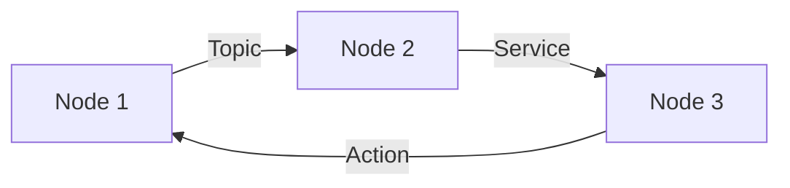
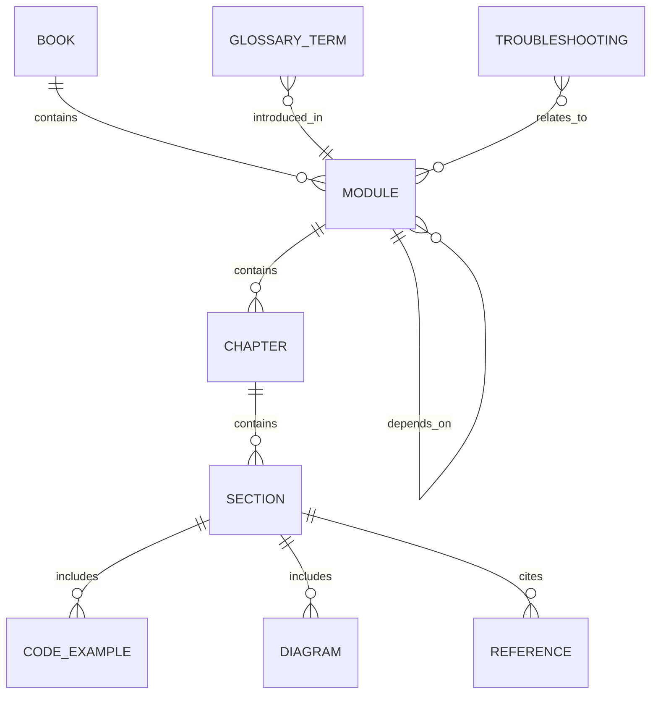

# Data Model: Content Entities

**Feature**: Physical AI & Humanoid Robotics Book
**Date**: 2025-12-22
**Phase**: 1 (Design & Contracts)

## Purpose

This document defines the data model for all content entities in the educational book. These entities represent the structure of content, not runtime application data. The model ensures consistency, enables validation, and optimizes for RAG ingestion.

---

## Entity Overview

```
Book
├── Module (4 instances)
│   ├── Chapter (5-6 per module)
│   │   ├── Section (3-8 per chapter)
│   │   │   ├── CodeExample (0-3 per section)
│   │   │   ├── Diagram (0-2 per section)
│   │   │   └── Reference (0-5 per section)
│   │   └── Frontmatter (metadata)
│   └── CategoryConfig (_category_.json)
└── Appendix
    ├── Glossary (terms and definitions)
    ├── Resources (external links)
    └── Troubleshooting (common issues)
```

---

## Core Entities

### 1. Book Entity

**Description**: Root entity representing the entire educational resource.

**Attributes**:
- `title`: String - "Physical AI & Humanoid Robotics"
- `version`: String - Semantic version (e.g., "1.0.0")
- `baseUrl`: String - GitHub Pages URL
- `modules`: Array<Module> - Collection of 4 modules
- `appendices`: Appendix - Supporting content
- `metadata`: BookMetadata

**BookMetadata**:
- `targetAudience`: String - "CS-background AI/robotics students"
- `prerequisites`: Array<String> - ["Programming", "Basic AI/ML", "Data structures"]
- `estimatedTime`: String - "40-60 hours"
- `license`: String - "MIT" or "CC BY-SA 4.0"

**Docusaurus Mapping**:
- Configured in `docusaurus.config.js`
- Title, URL, tagline

**Validation Rules**:
- Must have exactly 4 modules
- Version must follow semver
- Base URL must be valid HTTPS URL

---

### 2. Module Entity

**Description**: Self-contained learning unit covering one aspect of the humanoid robotics stack.

**Attributes**:
- `id`: String - Unique identifier (e.g., "module-01-ros2")
- `number`: Integer - Module number (1-4)
- `title`: String - Module title (e.g., "ROS 2: Robotic Nervous System")
- `description`: String - Brief summary (1-2 sentences)
- `learningObjectives`: Array<String> - What students will learn
- `outcomes`: Array<String> - Capabilities students gain
- `chapters`: Array<Chapter> - 5-6 chapters
- `integrationDependencies`: Array<String> - Prior module IDs needed
- `frameworks`: Array<String> - Technologies covered (e.g., ["ROS 2 Humble", "rclpy"])
- `estimatedTime`: String - "8-12 hours"

**Docusaurus Mapping**:
- Directory: `docs/module-{number}-{slug}/`
- Category config: `_category_.json`

**_category_.json Structure**:
```json
{
  "label": "Module 1: ROS 2",
  "position": 1,
  "link": {
    "type": "generated-index",
    "description": "Learn robot software communication and control with ROS 2."
  }
}
```

**Validation Rules**:
- ID must match directory name
- Number must be 1-4
- Must have 5-6 chapters
- Integration dependencies must reference valid module IDs
- Estimated time must be parseable duration

**Example Instances**:
1. Module 1: ROS 2 (Robotic Nervous System)
2. Module 2: Digital Twin (Gazebo & Unity)
3. Module 3: AI-Robot Brain (NVIDIA Isaac)
4. Module 4: Vision-Language-Action (VLA)

---

### 3. Chapter Entity

**Description**: Major topic within a module, corresponding to one MDX file.

**Attributes**:
- `id`: String - Unique identifier (e.g., "module-01-ros2/01-overview")
- `title`: String - Chapter title
- `sidebarLabel`: String - Short label for sidebar
- `position`: Integer - Order within module (1-6)
- `description`: String - SEO and RAG-friendly summary
- `keywords`: Array<String> - Search keywords
- `content`: String - MDX content
- `sections`: Array<Section> - Logical content sections
- `prerequisites`: Array<String> - Required prior knowledge
- `estimatedTime`: String - "60-90 minutes"

**Frontmatter Schema**:
```yaml
---
id: unique-chapter-id
title: Chapter Title
sidebar_label: Short Label
sidebar_position: 1
description: SEO and RAG-friendly description (120-160 chars)
keywords:
  - keyword1
  - keyword2
  - keyword3
---
```

**Docusaurus Mapping**:
- File: `docs/module-{number}-{slug}/{position}-{chapter-slug}.md`
- Frontmatter extracted to metadata

**Validation Rules**:
- ID must match file path (without .md extension)
- Position must be unique within module
- Description must be 120-160 characters
- Keywords must have 3-7 items
- Content must be valid MDX
- Must have at least 2 sections

**Standard Chapter Types**:

1. **Overview Chapter** (position 1):
   - Concept introduction
   - Why this module matters
   - What students will learn

2. **Architecture Chapter** (position 2):
   - System architecture diagrams
   - Data flow explanations
   - Component interactions

3. **Tooling Chapter** (position 3):
   - Framework/tool deep dive
   - Practical examples
   - Common patterns

4. **Integration Chapter** (position 4):
   - Connection to previous modules
   - Integration patterns
   - Working examples

5. **Summary Chapter** (position 5):
   - Key takeaways
   - Limitations and tradeoffs
   - Next steps

6. **Capstone Chapter** (position 6, Module 4 only):
   - End-to-end project
   - Full stack integration
   - Voice-to-action demonstration

---

### 4. Section Entity

**Description**: Logical subdivision within a chapter (corresponds to H2 headings in MDX).

**Attributes**:
- `heading`: String - Section heading (H2)
- `content`: String - Markdown/MDX content
- `level`: Integer - Heading level (2 for H2, 3 for H3)
- `codeExamples`: Array<CodeExample> - Code snippets
- `diagrams`: Array<Diagram> - Visual aids
- `references`: Array<Reference> - External citations

**Validation Rules**:
- Heading must be unique within chapter
- Level must be 2 or 3 (H2 or H3)
- Content must be non-empty
- Code examples must be syntactically valid
- References must have valid URLs

**Example Section Structure**:
```markdown
## Understanding ROS 2 Nodes

A node is the fundamental building block of ROS 2 systems. Each node is a process that performs computation and communicates with other nodes via topics, services, or actions.

### Node Lifecycle

[Content explaining lifecycle...]

<CodeExample language="python" title="Simple ROS 2 Node">
...
</CodeExample>

<Diagram src="/img/module-01/node-communication.svg" alt="Node communication pattern" />

### Best Practices

[Content with best practices...]
```

---

### 5. CodeExample Entity

**Description**: Executable code snippet with explanation and citation.

**Attributes**:
- `language`: String - Programming language (python, cpp, yaml, xml, bash)
- `title`: String - Code example title
- `code`: String - Full code content
- `explanation`: String - What the code does and why
- `framework`: String - Which framework (ROS 2, Gazebo, Isaac, etc.)
- `officialDocsLink`: URL - Link to official API documentation
- `tested`: Boolean - Whether code has been syntax-validated
- `downloadable`: Boolean - Whether full example is in `/static/code-examples/`

**Rendering**:
```markdown
<CodeExample
  language="python"
  title="Simple ROS 2 Publisher"
  framework="ROS 2 Humble"
  docsLink="https://docs.ros.org/en/humble/Tutorials/Beginner-Client-Libraries/Writing-A-Simple-Py-Publisher-And-Subscriber.html"
>
```python
import rclpy
from rclpy.node import Node
from std_msgs.msg import String

class MinimalPublisher(Node):
    def __init__(self):
        super().__init__('minimal_publisher')
        self.publisher_ = self.create_publisher(String, 'topic', 10)
        self.timer = self.create_timer(0.5, self.timer_callback)

    def timer_callback(self):
        msg = String()
        msg.data = f'Hello World'
        self.publisher_.publish(msg)

def main(args=None):
    rclpy.init(args=args)
    node = MinimalPublisher()
    rclpy.spin(node)
    rclpy.shutdown()
```
</CodeExample>

**Explanation**: This example creates a minimal ROS 2 publisher node that sends "Hello World" messages every 0.5 seconds. The `create_publisher()` method establishes the topic, and the timer callback publishes messages at regular intervals.

**Official Docs**: [ROS 2 Humble Publisher Tutorial](https://docs.ros.org/en/humble/Tutorials/Beginner-Client-Libraries/Writing-A-Simple-Py-Publisher-And-Subscriber.html)
```

**Validation Rules**:
- Language must be one of: python, cpp, yaml, xml, bash, javascript
- Code must be syntactically valid for the language
- Official docs link must be valid HTTPS URL
- Explanation must be non-empty
- Framework must match module (e.g., ROS 2 for Module 1)

---

### 6. Diagram Entity

**Description**: Visual representation of architecture, data flow, or system design.

**Attributes**:
- `type`: String - "mermaid", "svg", "png", "interactive"
- `title`: String - Diagram title
- `altText`: String - Accessibility description
- `source`: String - For mermaid: code; for images: file path
- `caption`: String - Optional explanatory text

**Mermaid Diagram**:
```markdown

**Caption**: Communication patterns between ROS 2 nodes showing topics, services, and actions.
```

**Image Diagram**:
```markdown


**Caption**: High-level architecture of ROS 2 showing client libraries, middleware (DDS), and application layer.
```

**Interactive Diagram (React Component)**:
```markdown
<RobotDiagram
  title="Humanoid Robot URDF Structure"
  modelPath="/models/humanoid-urdf.json"
  interactive={true}
/>
```

**Validation Rules**:
- Type must be one of: mermaid, svg, png, interactive
- Alt text required for accessibility (50-150 characters)
- For images: File must exist in `/static/img/`
- For mermaid: Code must be valid Mermaid syntax
- Caption should explain what diagram shows (1-2 sentences)

**Storage**:
- Mermaid: Inline in MDX
- SVG/PNG: `/static/img/module-{number}/diagram-name.{svg,png}`
- Interactive: React component in `/src/components/`

---

### 7. Reference Entity

**Description**: Citation to external documentation, research paper, or resource.

**Attributes**:
- `type`: String - "official-docs", "research-paper", "tutorial", "video"
- `title`: String - Reference title
- `url`: URL - Link to resource
- `description`: String - What this reference provides
- `accessed`: Date - When link was verified

**Inline Citation**:
```markdown
ROS 2 uses DDS (Data Distribution Service) as its middleware layer, enabling real-time communication between distributed nodes [[1]](#ref-1).

---

### References

<a id="ref-1"></a>[1] [ROS 2 Design - DDS and ROS Middleware](https://design.ros2.org/articles/ros_on_dds.html) - Official ROS 2 design documentation. Accessed: 2025-12-22.
```

**Validation Rules**:
- Type must be one of: official-docs, research-paper, tutorial, video
- URL must be valid and accessible (link checker validates)
- Description should explain relevance (1 sentence)
- Accessed date must be recent (within 6 months for validation)

---

### 8. Appendix Entities

#### 8.1 GlossaryTerm Entity

**Attributes**:
- `term`: String - Technical term
- `definition`: String - Clear explanation
- `aliases`: Array<String> - Alternative names
- `relatedTerms`: Array<String> - Connected concepts
- `module`: String - Where term is introduced

**Example**:
```yaml
term: "Node"
definition: "A process that performs computation in ROS 2. Nodes communicate with each other using topics, services, and actions."
aliases: ["ROS Node", "ROS 2 Node"]
relatedTerms: ["Topic", "Service", "Action"]
module: "module-01-ros2"
```

#### 8.2 Resource Entity

**Attributes**:
- `category`: String - "official-docs", "tutorials", "tools", "communities"
- `title`: String
- `url`: URL
- `description`: String
- `relevantModules`: Array<String>

#### 8.3 TroubleshootingEntry Entity

**Attributes**:
- `issue`: String - Problem description
- `symptoms`: Array<String>
- `solution`: String - Step-by-step fix
- `relatedModules`: Array<String>
- `commonality`: String - "common", "occasional", "rare"

---

## Data Relationships



**Key Relationships**:
- **Book ↔ Module**: 1-to-4 (fixed)
- **Module ↔ Chapter**: 1-to-many (5-6 chapters per module)
- **Chapter ↔ Section**: 1-to-many (3-8 sections per chapter)
- **Section ↔ CodeExample**: 1-to-many (0-3 per section)
- **Section ↔ Diagram**: 1-to-many (0-2 per section)
- **Module ↔ Module**: Many-to-many (integration dependencies)

---

## RAG Optimization

**Chunking Strategy**:
1. **Primary Chunks**: Sections (H2 level)
   - Rationale: Self-contained units of information
   - Size: Typically 300-800 words
   - Metadata: Module, chapter, section heading, keywords

2. **Secondary Chunks**: Code Examples
   - Rationale: Specific queries about code
   - Metadata: Language, framework, purpose

3. **Tertiary Chunks**: Diagrams (via alt text and captions)
   - Rationale: Visual information retrieval
   - Metadata: Diagram type, concepts visualized

**Embedding Metadata**:
Each chunk includes:
- `module_id`: Which module
- `chapter_id`: Which chapter
- `section_heading`: H2 heading
- `keywords`: From frontmatter
- `content_type`: "text", "code", "diagram"
- `frameworks`: Relevant technologies

**Retrieval Enhancement**:
- Glossary terms indexed separately for definition lookups
- Code examples tagged by language and framework
- Integration patterns marked with dependency relationships

---

## Validation Schema Summary

All entities will have JSON Schema definitions in `contracts/`:
- `module-schema.yaml`: Module and Chapter frontmatter validation
- `code-example-schema.yaml`: CodeExample structure validation
- `diagram-schema.yaml`: Diagram metadata validation
- `reference-schema.yaml`: Citation format validation

Next file (`contracts/`) will contain these schemas.

---

## Next: Generate Contracts

Phase 1 continues with:
- `contracts/module-schema.yaml`
- `contracts/sidebar-structure.js`
- `contracts/content-checklist.yaml`
