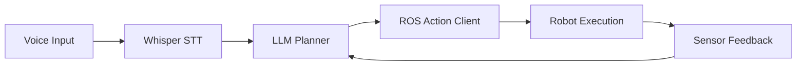

# Writer's Quickstart Guide

**Feature**: Physical AI & Humanoid Robotics Book
**Date**: 2025-12-22
**Audience**: Content authors, contributors, AI agents

## Purpose

This guide provides everything a writer needs to create new content for the Physical AI & Humanoid Robotics book. Follow these instructions to ensure consistency, quality, and compliance with project standards.

---

## Table of Contents

1. [Prerequisites](#prerequisites)
2. [Project Structure Overview](#project-structure-overview)
3. [Creating a New Chapter](#creating-a-new-chapter)
4. [Writing Guidelines](#writing-guidelines)
5. [Code Examples](#code-examples)
6. [Diagrams](#diagrams)
7. [References & Citations](#references--citations)
8. [Validation & Testing](#validation--testing)
9. [Common Patterns](#common-patterns)
10. [Troubleshooting](#troubleshooting)

---

## Prerequisites

**Required Knowledge**:
- Markdown/MDX syntax
- Basic understanding of Docusaurus
- Familiarity with the robotics framework you're writing about (ROS 2, Gazebo, Isaac, etc.)
- Access to official documentation for cited frameworks

**Required Files**:
- Read `spec.md` (feature specification)
- Read `plan.md` (implementation plan)
- Read `data-model.md` (content entity definitions)
- Refer to `contracts/module-schema.yaml` (frontmatter validation)
- Use `contracts/content-checklist.yaml` (quality validation)

**Tools**:
- Text editor with MDX support (VS Code recommended)
- Node.js 18+ installed (for local Docusaurus preview)
- Git for version control

---

## Project Structure Overview

```
docs/
├── intro.md                     # Landing page
├── module-01-ros2/              # Module 1
│   ├── _category_.json          # Module metadata
│   ├── 01-overview.md
│   ├── 02-architecture.md
│   ├── 03-tooling.md
│   ├── 04-integration.md
│   └── 05-summary.md
├── module-02-digital-twin/      # Module 2
├── module-03-ai-brain/          # Module 3
├── module-04-vla/               # Module 4 (has 6 chapters)
└── appendix/                    # Supporting content

static/
├── img/                         # Images and diagrams
│   ├── module-01/
│   ├── module-02/
│   ├── module-03/
│   └── module-04/
└── code-examples/               # Downloadable code
    ├── ros2-examples/
    ├── simulation-examples/
    ├── isaac-examples/
    └── vla-examples/
```

**Key Conventions**:
- Chapters numbered with zero-padded 2-digit prefix: `01-overview.md`, `02-architecture.md`
- Module directories: `module-{number}-{slug}`
- Image directories match module structure
- Code examples stored separately for download

---

## Creating a New Chapter

### Step 1: Determine Chapter Type

Standard chapter types:
1. **Overview** (position 1): Concept introduction, motivation
2. **Architecture** (position 2): System design, data flow
3. **Tooling** (position 3): Framework deep dive, APIs
4. **Integration** (position 4): Connection to previous modules
5. **Summary** (position 5): Key takeaways, limitations
6. **Capstone** (position 6, Module 4 only): End-to-end project

### Step 2: Create Chapter File

**File naming**:
```
docs/module-{number}-{slug}/{position}-{chapter-slug}.md
```

Example:
```
docs/module-01-ros2/03-tooling.md
```

### Step 3: Add Frontmatter

```yaml
---
id: module-01-ros2/03-tooling
title: ROS 2 Tooling and Ecosystem
sidebar_label: Tooling & Ecosystem
sidebar_position: 3
description: Explore the ROS 2 ecosystem including nodes, topics, services, rclpy Python library, and URDF for robot modeling. Learn best practices for building robust robotic systems.
keywords:
  - ros2
  - rclpy
  - nodes
  - topics
  - urdf
  - robotics-ecosystem
prerequisites:
  - Understanding of ROS 2 architecture
  - Basic Python programming
estimatedTime: 75-90 minutes
---
```

**Frontmatter Requirements** (see `contracts/module-schema.yaml`):
- ✅ `id`: Must match file path (without .md)
- ✅ `title`: 5-80 characters
- ✅ `sidebar_label`: 3-30 characters
- ✅ `sidebar_position`: 1-6
- ✅ `description`: 120-160 characters (SEO optimized)
- ✅ `keywords`: 3-7 items
- ⭕ `prerequisites`: Optional, recommended
- ⭕ `estimatedTime`: Optional, recommended

### Step 4: Write Content Following Structure

**Standard Chapter Outline**:

```markdown
# {Chapter Title}

[1-2 paragraph introduction explaining what this chapter covers and why it matters]

## Section 1: {Topic}

[Content explaining the topic...]

### Subsection 1.1

[Detailed content...]

<CodeExample language="python" title="Example Title">
[Code here]
</CodeExample>

## Section 2: {Topic}

[More content...]


**Caption**: Explanation of diagram

## Section 3: {Topic}

[Content with citations...]

According to the ROS 2 documentation, nodes communicate via DDS middleware [[1]](#ref-1).

---

### References

<a id="ref-1"></a>[1] [ROS 2 Design - DDS](https://design.ros2.org/articles/ros_on_dds.html) - Official ROS 2 design docs. Accessed: 2025-12-22.
```

---

## Writing Guidelines

### Content Principles

1. **Clarity for Developers**:
   - Use precise technical terminology
   - Explain "why" decisions are made, not just "what" to do
   - Focus on system understanding, not just steps

2. **Technical Accuracy**:
   - Verify all claims against official documentation
   - Link to official docs for every API reference
   - Test all code examples
   - Mark synthesis clearly: "Based on the architecture, we can infer..."

3. **Consistency**:
   - Use terms from `appendix/glossary.md`
   - Follow module structure (overview → architecture → tooling → integration → summary)
   - Maintain consistent voice (third person, instructional)

### Writing Style

**✅ Good Example**:
```markdown
ROS 2 uses the Data Distribution Service (DDS) as its middleware layer, enabling real-time communication between distributed nodes [[1]]. This publish-subscribe pattern decouples publishers from subscribers, allowing flexible system architectures where components can be added or removed without modifying existing code.
```

**❌ Bad Example**:
```markdown
ROS 2 is awesome! It uses DDS which is super fast. You should definitely use it for your robot project.
```

**Key Differences**:
- ✅ Technical precision vs ❌ subjective claims
- ✅ Cited sources vs ❌ unverified statements
- ✅ Explains "why" (decoupling benefits) vs ❌ just says "use it"
- ✅ Professional tone vs ❌ informal/marketing language

### Section Length

- **Optimal**: 300-800 words per section (H2)
- **Rationale**: Ideal for comprehension and RAG chunking
- **Minimum**: 150 words
- **Maximum**: 1200 words (if longer, split into subsections)

---

## Code Examples

### Structure

Every code example must include:
1. **Language specification**: `python`, `cpp`, `yaml`, `xml`, `bash`
2. **Title**: Descriptive name
3. **Complete, executable code**: Not pseudocode
4. **Explanation**: What it does and why (1-3 sentences)
5. **Official docs link**: Citation to API documentation

### Format

````markdown
<CodeExample language="python" title="Simple ROS 2 Publisher">

```python
import rclpy
from rclpy.node import Node
from std_msgs.msg import String

class MinimalPublisher(Node):
    def __init__(self):
        super().__init__('minimal_publisher')
        self.publisher_ = self.create_publisher(String, 'topic', 10)
        self.timer = self.create_timer(0.5, self.timer_callback)
        self.i = 0

    def timer_callback(self):
        msg = String()
        msg.data = f'Hello World: {self.i}'
        self.publisher_.publish(msg)
        self.i += 1

def main(args=None):
    rclpy.init(args=args)
    minimal_publisher = MinimalPublisher()
    rclpy.spin(minimal_publisher)
    minimal_publisher.destroy_node()
    rclpy.shutdown()

if __name__ == '__main__':
    main()
```

</CodeExample>

**Explanation**: This publisher node sends "Hello World" messages to a topic every 0.5 seconds. The `create_publisher()` method initializes the topic with a queue size of 10, and the timer callback publishes incrementing messages. This demonstrates the basic publish pattern in ROS 2.

**Official Documentation**: [ROS 2 Writing a Publisher](https://docs.ros.org/en/humble/Tutorials/Beginner-Client-Libraries/Writing-A-Simple-Py-Publisher-And-Subscriber.html)
````

### Downloadable Code

For complete, runnable examples:

1. Save full code in: `static/code-examples/{module-slug}/{example-name}/`
2. Include README.md with setup instructions
3. Link from chapter: `[Download full example](/code-examples/ros2-examples/minimal-publisher.zip)`

---

## Diagrams

### Types

1. **Mermaid** (inline, text-based):
   - Flow charts
   - Sequence diagrams
   - Simple component diagrams

2. **SVG/PNG** (external files):
   - Complex architecture diagrams
   - Robot illustrations
   - System integration flows

3. **Interactive React Components**:
   - When user interaction needed
   - Dynamic visualizations

### Mermaid Example

````markdown


**Caption**: Voice-to-action pipeline showing the flow from speech recognition through LLM planning to robot execution with sensor feedback loop.
````

### Image Diagram

```markdown


**Caption**: High-level architecture of ROS 2 showing client libraries (rclpy, rclcpp), DDS middleware layer, and communication patterns between nodes.
```

**Requirements**:
- Alt text: 50-150 characters (accessibility)
- Caption: Explains what diagram shows (1-2 sentences)
- Consistent style: Use project color scheme, clear labels
- File location: `static/img/module-{number}/diagram-name.{svg,png}`

---

## References & Citations

### Inline Citation

```markdown
ROS 2 Humble is a Long-Term Support (LTS) release with support until May 2027 [[1]](#ref-1). This makes it ideal for educational content that needs to remain accurate for several years.
```

### Reference Section (at end of chapter)

```markdown
---

### References

<a id="ref-1"></a>[1] [ROS 2 Releases](https://docs.ros.org/en/rolling/Releases.html) - Official ROS 2 release schedule. Accessed: 2025-12-22.

<a id="ref-2"></a>[2] [DDS Specification](https://www.omg.org/spec/DDS/) - OMG Data Distribution Service specification. Accessed: 2025-12-22.
```

### Citation Types

- **official-docs**: Framework documentation (ROS 2, Gazebo, Isaac)
- **research-paper**: Academic papers (RT-1, RT-2, SayCan)
- **tutorial**: Third-party tutorials (cite only if verifiable)
- **video**: Educational videos (YouTube, official channels)

**Rules**:
- ✅ Always include access date
- ✅ Use official documentation when available
- ✅ Verify links are accessible before publishing
- ❌ No Wikipedia citations
- ❌ No unverified blog posts

---

## Validation & Testing

### Pre-Submission Checklist

Use `contracts/content-checklist.yaml` to validate your chapter:

**Frontmatter**:
- [ ] Valid schema (run: `ajv validate -s contracts/module-schema.yaml -d your-chapter.md`)
- [ ] Unique chapter ID
- [ ] Description is 120-160 characters
- [ ] 3-7 keywords

**Content**:
- [ ] Follows standard chapter type structure
- [ ] At least 2 sections (H2 headings)
- [ ] Sections are 300-800 words (recommended)

**Technical Accuracy**:
- [ ] All code examples syntactically valid
- [ ] Every API reference links to official docs
- [ ] Framework features verified in current stable release

**Visual Aids**:
- [ ] Diagrams have alt text
- [ ] Consistent diagram style
- [ ] Mermaid diagrams render correctly

### Local Testing

```bash
# Install dependencies
npm install

# Start local dev server
npm run start

# Build static site (validates syntax)
npm run build

# Run link checker (if available)
npm run check-links
```

### Automated Validation

When you create a pull request, automated checks will run:
1. **Docusaurus build**: Ensures MDX syntax is valid
2. **Link checker**: Verifies all URLs are accessible
3. **Frontmatter validation**: Checks against schema
4. **Code syntax**: Lints code examples (Python, C++, YAML)

---

## Common Patterns

### Pattern 1: Explaining a Framework Concept

```markdown
## {Concept Name}

[1 paragraph: What is this concept?]

### Why It Matters

[1-2 paragraphs: Use cases, benefits, context in robotics]

### How It Works

[2-3 paragraphs: Technical explanation, architecture, data flow]

<CodeExample language="python" title="Basic Example">
[Minimal working code demonstrating concept]
</CodeExample>

### Best Practices

- **Practice 1**: [Explanation and rationale]
- **Practice 2**: [Explanation and rationale]

### Common Pitfalls

- **Pitfall 1**: [What to avoid and why]
- **Pitfall 2**: [What to avoid and why]

### Further Reading

[[1]](#ref-1) Official documentation link with specific section
```

### Pattern 2: Integration with Previous Module

```markdown
## Integration with Module {N}

### Prerequisites

Before integrating, ensure you understand:
- [Concept from Module N]
- [Concept from Module N]

[Link to specific chapters in previous module]

### Integration Architecture

```mermaid
[Diagram showing data flow between modules]
```

### Step-by-Step Integration

1. **Step 1**: [Action and code example]
2. **Step 2**: [Action and code example]
3. **Step 3**: [Action and code example]

<CodeExample language="python" title="Integration Example">
[Code showing Module N concept + this module's concept]
</CodeExample>

### Troubleshooting Integration

**Issue**: [Common problem]
**Solution**: [How to fix it]
```

### Pattern 3: Capstone Project Walkthrough

```markdown
## Capstone: {Project Name}

### Project Overview

[What we're building, why it matters, what concepts it integrates]

### Architecture


**Caption**: [Explanation of components and data flow]

### Prerequisites

- Module 1: [Specific concepts needed]
- Module 2: [Specific concepts needed]
- Module 3: [Specific concepts needed]
- Module 4: [Specific concepts needed]

### Implementation

#### Part 1: {Component}
[Code and explanation]

#### Part 2: {Component}
[Code and explanation]

#### Part 3: {Component}
[Code and explanation]

### Running the Capstone

[Step-by-step instructions to run the complete system]

### Expected Output

[What success looks like, example outputs, demo video link]

### Limitations and Future Directions

- **Limitation 1**: [What this example doesn't cover]
- **Limitation 2**: [What production systems would need]
- **Future Direction**: [Research areas, improvements]
```

---

## Troubleshooting

### Build Fails with MDX Syntax Error

**Problem**: `npm run build` fails with "Unexpected token" or "Invalid MDX"

**Solutions**:
1. Check for unclosed code blocks (\`\`\` must have closing \`\`\`)
2. Verify JSX components are properly closed (`<CodeExample>...</CodeExample>`)
3. Escape special characters in code blocks
4. Use MDX playground to test: https://mdxjs.com/playground/

### Frontmatter Validation Fails

**Problem**: Chapter doesn't appear in sidebar or build fails

**Solutions**:
1. Validate against schema: `ajv validate -s contracts/module-schema.yaml -d your-chapter.md`
2. Check for missing required fields (id, title, sidebar_label, sidebar_position, description, keywords)
3. Ensure description is 120-160 characters
4. Verify sidebar_position is unique within module (1-6)

### Links Not Working

**Problem**: Internal links broken or external links 404

**Solutions**:
1. **Internal links**: Use relative paths from current file
   - Correct: `[Previous Chapter](./02-architecture.md)`
   - Incorrect: `[Previous Chapter](/module-01-ros2/02-architecture.md)`
2. **External links**: Verify URL is accessible and uses HTTPS
3. Run link checker: `npm run check-links` (if configured)

### Code Example Not Rendering

**Problem**: Code block appears as plain text or doesn't highlight

**Solutions**:
1. Ensure language is specified: \`\`\`python (not just \`\`\`)
2. Use supported languages: python, cpp, yaml, xml, bash, javascript
3. Check for syntax errors in code (will break highlighting)
4. For JSX, use `<CodeExample>` component instead of triple backticks

---

## Quick Reference Card

**File Naming**: `{position}-{slug}.md` (e.g., `03-tooling.md`)

**Frontmatter** (required): id, title, sidebar_label, sidebar_position, description, keywords

**Section Length**: 300-800 words (optimal for RAG)

**Code Examples**: Language + Title + Code + Explanation + Official Link

**Diagrams**: Alt text (50-150 chars) + Caption (1-2 sentences)

**Citations**: Inline `[[1]](#ref-1)` + Reference section at end

**Validation**: Run `npm run build` before PR

**Help**: See `contracts/content-checklist.yaml` for full validation criteria

---

## Next Steps

1. **Read**: Review an existing chapter (e.g., `docs/module-01-ros2/01-overview.md`) to see patterns in practice
2. **Plan**: Outline your chapter sections before writing
3. **Write**: Create content following guidelines
4. **Validate**: Use checklist and run local tests
5. **Submit**: Create PR with clear description of what you added

For questions or guidance, consult:
- `spec.md` - Feature requirements
- `plan.md` - Architecture and decisions
- `data-model.md` - Entity definitions
- `research.md` - Technical research findings
